1. Arsitektur Makro & Aliran Folder src/ (React TS + Ollama)

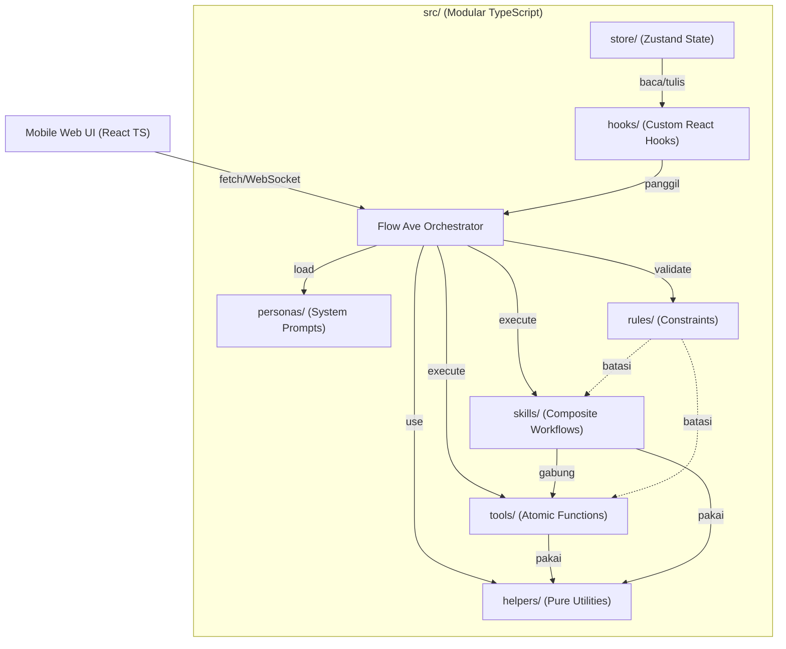

Semua komponen ditulis ketat TypeScript. store/ menyimpan SessionState, hooks/ menjembatani UI, personas/ ekspor objek Persona, rules/ ekspor RuleSet, helpers/ pure functions, tools/ dan skills/ implementasi Tool/Skill lengkap dengan Zod schema. Ollama diatur via environment (NUM_CTX=65536, FLASH_ATTENTION=1, KV_CACHE_TYPE=q4_0).

---

1. Loop Eksekusi Utama dengan Validasi Rules

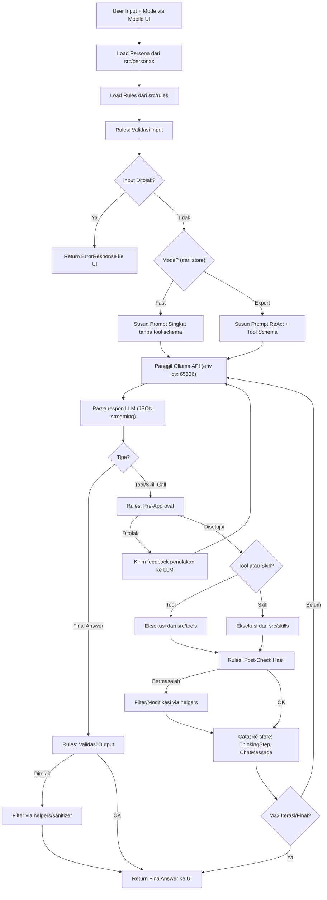

Semua langkah ter-typing dengan async/await. Ollama dipanggil streaming, diparse per chunk. Rules engine mengembalikan ApprovalResult (allowed/denied/modified). Executor mengembalikan Promise<ToolExecutionResult> dengan timeout/retry.

---

1. Sequence: Thinking Mode Expert

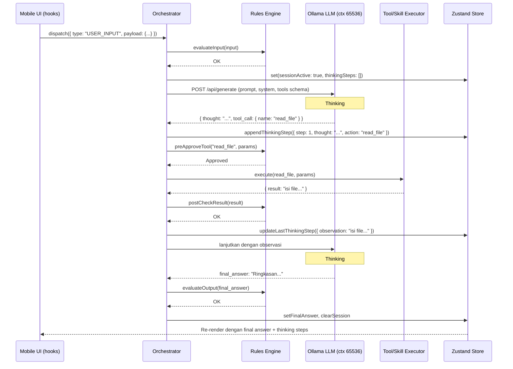

Thinking step direkam dengan tipe { step, thought, action, action_input, observation, timestamp }.

---

1. State Machine: Fast vs Expert

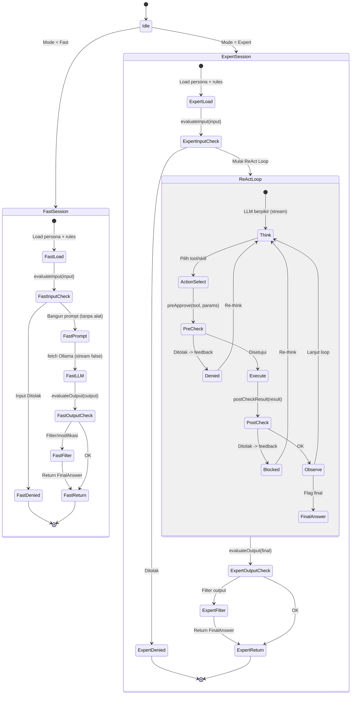

State diimplementasikan dengan useReducer atau XState, transisi dijaga type guard.

---

1. Rules Engine: Alur Evaluasi

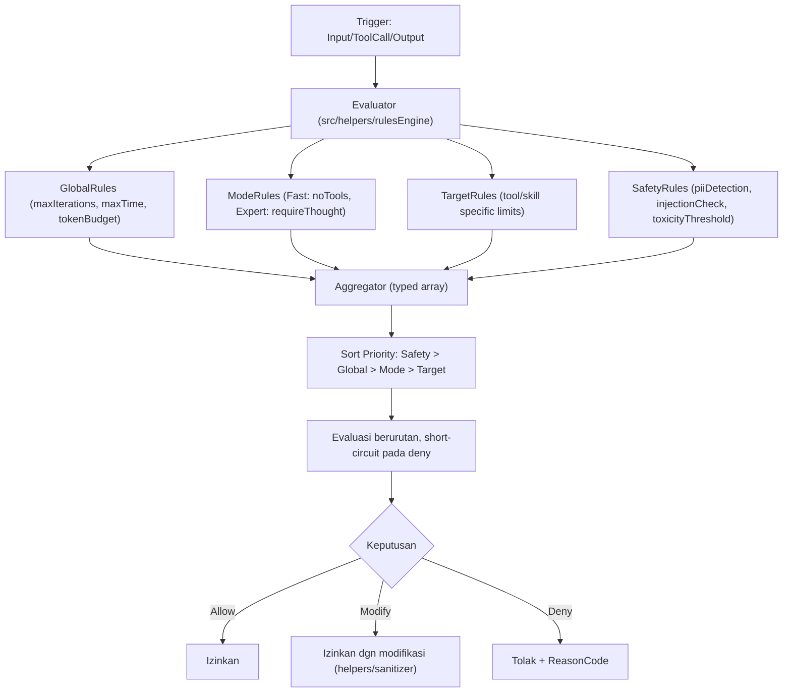

Setiap rule adalah fungsi (input: T) => RuleResult. Prioritas dienkapsulasi dalam array terurut.

---

1. Hierarki Kendali & Thinking Box Rendering

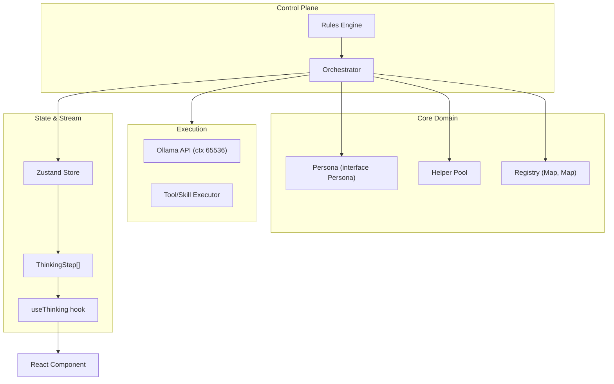

Control Plane murni TS, tidak bergantung UI. Registry dibangun saat startup via dynamic import.

---

1. Komponen Folder rules/

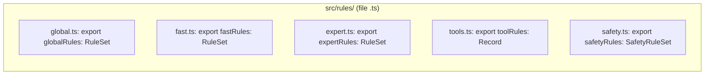

global: maxIterations:15, maxTimeMs:120000, tokenBudget:65536. fast: allowTools:false, maxResponseLength:500. expert: allowTools:true, requireThoughtTag:true, maxIterations:20. toolSpecific: per tool allowedParams, rateLimit, fallback. safety: input/output PII detection, injection check, toxicity threshold 0.8.

---

1. Alur Lengkap Satu Sesi (Mobile-First)

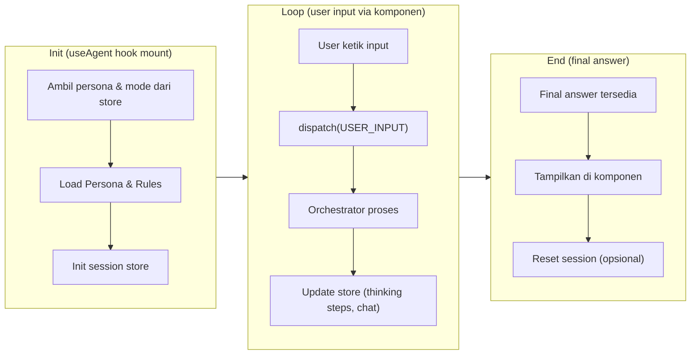

Seluruh siklus hidup dikelola useAgent hook: init, process, cleanup.

---

1. Data Flow Antar Folder

```mermaid
graph LR
    UI["Mobile UI (React TS)"] -->|dispatch action| hooks["hooks/useAgent"]
    hooks -->|baca state| store["store/sessionStore"]
    store -->|trigger| orchestrator["Orchestrator"]
    orchestrator -->|Baca| personas["personas/"]
    orchestrator -->|Validasi| rules["rules/"]
    orchestrator -->|Panggil| tools["tools/"]
    orchestrator -->|Panggil| skills["skills/"]
    tools -->|Gunakan| helpers["helpers/"]
    skills -->|Gunakan| helpers
    orchestrator -->|Update| store
    store -->|Stream (subscribe)| hooks["hooks/useThinking"]
    hooks -->|Render| UI
```

Komunikasi antar modul hanya lewat interface di types/. Tidak ada direct import melanggar Dependency Inversion.

---

1. Retry & Fallback Tool/Skill

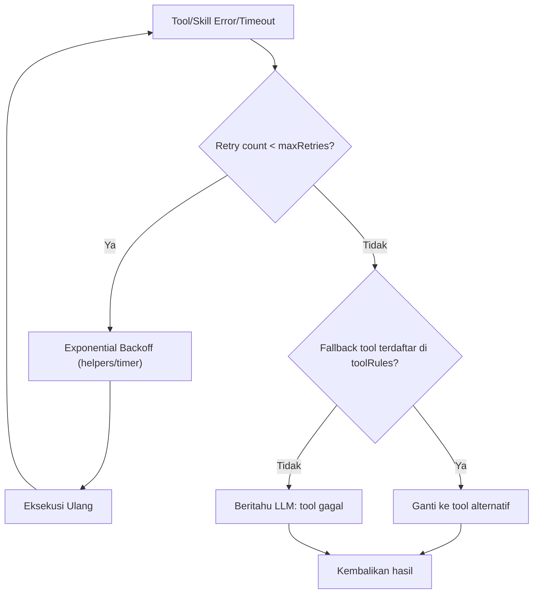

Retry maksimal 3x dengan exponential backoff, fallback didefinisikan di rules/tools.ts.

---

1. Error Handling & Recovery

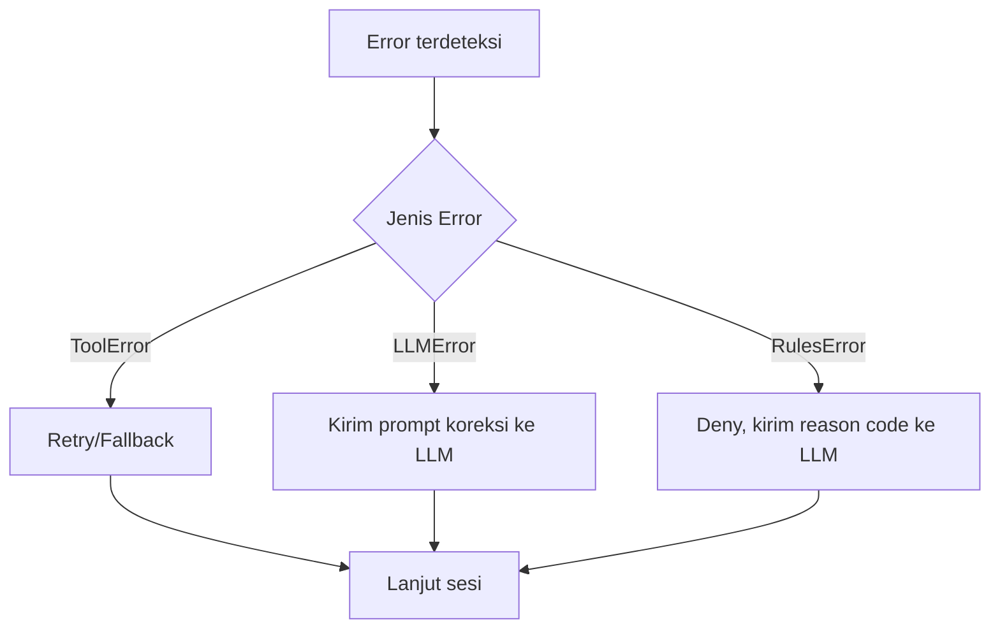

Semua error extends BaseError. Recovery tidak memutus sesi.

---

1. Persona Switching & Context Reset

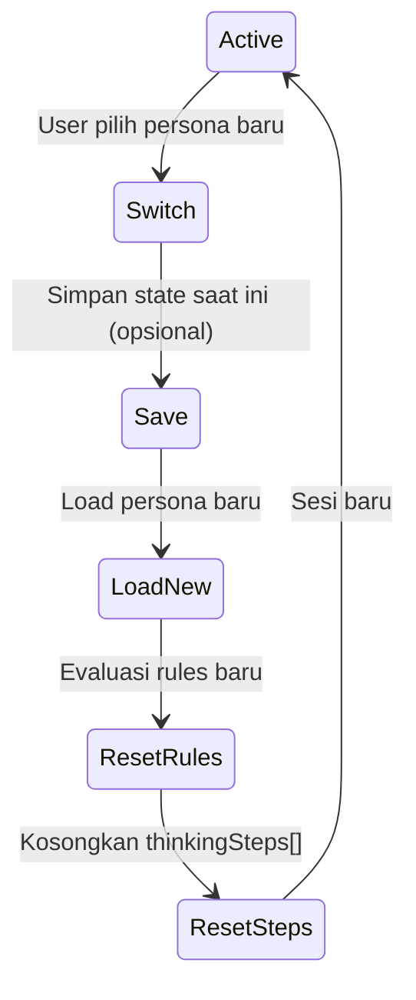

---

1. Skill Chaining & Dependencies

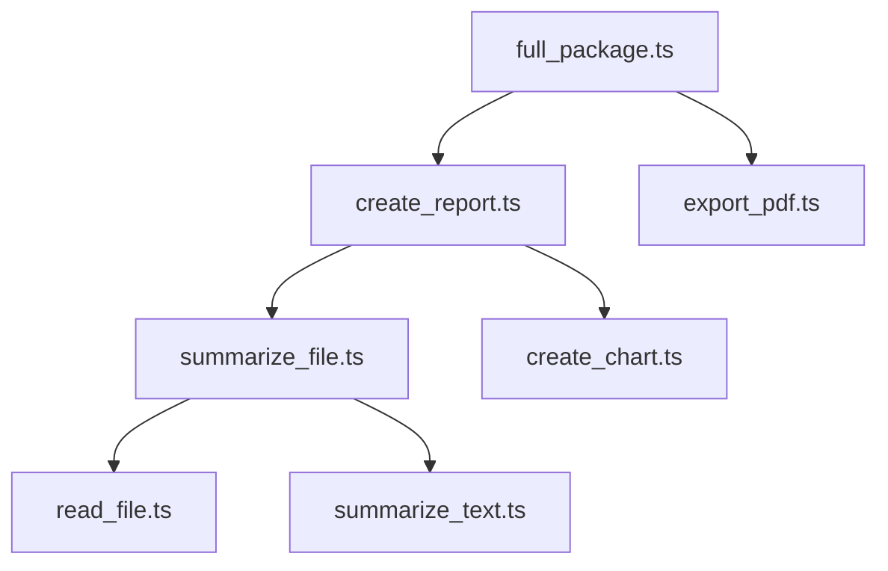

Dependensi di-inject saat inisialisasi Registry, bukan diimpor langsung.

---

1. Tool Lifecycle

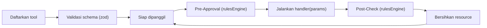

---

1. Session Lifecycle & Memory Management (termasuk Optimized Agent Memory)

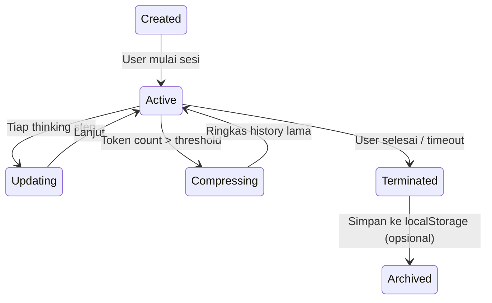

Optimized Agent Memory: sliding window 20 langkah, summarization langkah lama, file relevance scoring, token budgeting (system 15%, context 35%, history 25%, output 25%), pruning fakta confidence rendah.

---

1. Thinking Box Streaming Protocol

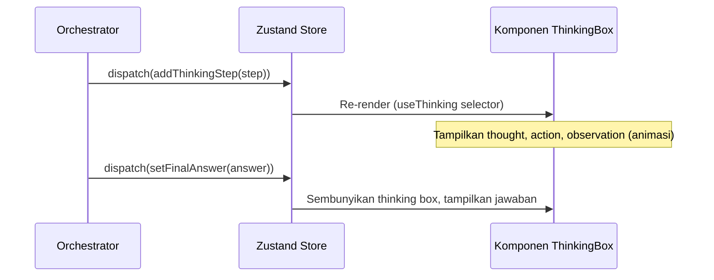

---

1. Validasi Parameter Tool

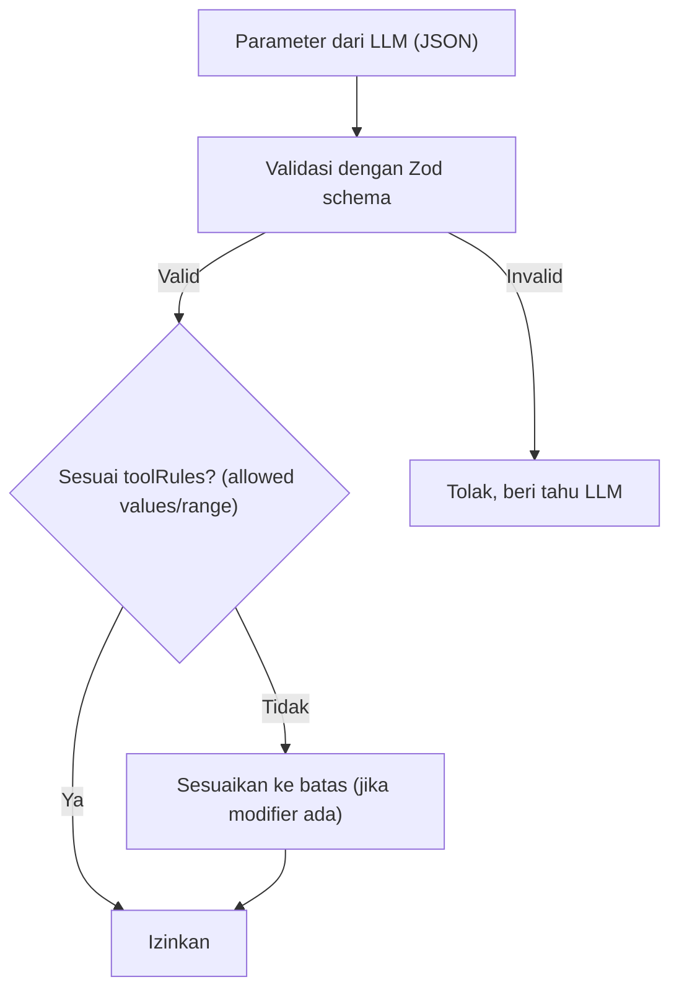

---

1. Safety Filter Cascade

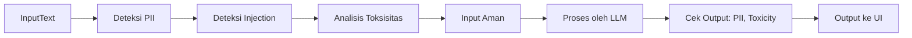

---

1. Mode Transition dalam Satu Sesi

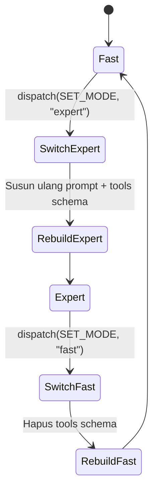

---

1. Deployment & Komunikasi (React TS + Ollama)

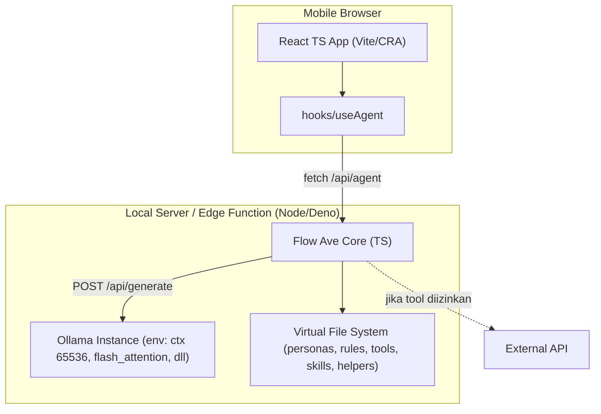

---

1. Inisialisasi Aplikasi dan Autoload Registry

```mermaid
flowchart TD
    AppStart["App Mount (React)"] --> InitStore["Init Zustand Store (session default)"]
    InitStore --> ImportModules["Dynamic import semua file di src/personas, rules, tools, skills, helpers"]
    ImportModules --> BuildRegistry["Bangun Registry: Map nama ke Tool/Skill"]
    BuildRegistry --> ValidasiDependensi["Validasi Dependensi Skill"]
    ValidasiDependensi --> InitHooks["Inisialisasi useAgent, useThinking"]
    InitHooks --> Ready["UI Siap menerima input"]
```

---

1. Optimized Agent Memory (Struktur & Alur Detail)

```mermaid
graph TB
    subgraph MemoryComponents["Komponen Memori"]
        SystemPrompt["System Prompt (statis)"]
        TaskState["Task State (tujuan saat ini)"]
        FileContext["File Context (file relevan)"]
        ActionHistory["Action History (ringkasan langkah)"]
        WorkingMemory["Working Memory (variabel)"]
        LongTermMemory["Long-term Memory (fakta penting)"]
    end

    Input["User Input"] --> TaskParser["Task Parser"]
    TaskParser --> ContextGatherer["Context Gatherer"]
    ContextGatherer --> FileContext
    ContextGatherer --> ActionHistory
    ContextGatherer --> LongTermMemory
    ContextGatherer --> Assembler["Prompt Assembler"]
    Assembler --> PrioritySort["Urut relevansi"]
    PrioritySort --> Truncate["Truncate jika > token budget"]
    Truncate --> FinalPrompt["Final Prompt ke LLM"]
    LLM["LLM Response"] --> MemoryUpdater["Memory Updater"]
    MemoryUpdater -->|Simpan fakta baru| LongTermMemory
    MemoryUpdater -->|Catat langkah| ActionHistory
    MemoryUpdater -->|Update file| FileContext
```

Budget token: system 15% (~9800), file context 35% (~22900), history 25% (~16300), output 25% (~16300). History >20 langkah diringkas, fakta confidence <0.5 dipangkas.

---

1. Prompt Template Structure (Mode Expert)

```mermaid
graph TB
    subgraph PromptStructure["Struktur Prompt"]
        System["System: {persona.systemPrompt}"]
        Rules["Rules: {modeRules + globalRules + safetyRules}"]
        Tools["Tools: {JSON schema tools/ skills}"]
        Format["Format: ReAct (Thought/Action/Observation)"]
        Examples["Few-shot examples (2-3)"]
    end
    System --> Assembly["Prompt Assembly"]
    Rules --> Assembly
    Tools --> Assembly
    Format --> Assembly
    Examples --> Assembly
    Assembly --> FinalPrompt["Final Prompt"]
```

Prompt disusun dengan urutan System → Rules → Tools → Format → Examples. Few-shot memandu LLM menggunakan ReAct.

---

1. TypeScript Core Type Definitions (Kontrak Antar Modul)

```mermaid
graph LR
    subgraph Types["src/types/"]
        Persona["Persona { name, systemPrompt, expertPrompt, safetyRules }"]
        Tool["Tool { name, description, parameters: ZodSchema, handler: (params) => Promise<ToolResult> }"]
        Skill["Skill { name, description, steps: (Tool|Skill)[] }"]
        RuleSet["RuleSet { global, mode, tools, safety }"]
        ThinkingStep["ThinkingStep { stepNumber, thought, action?, observation?, timestamp }"]
        SessionState["SessionState { mode, persona, thinkingSteps, chatHistory, status }"]
    end
```

Semua modul mengimpor dari types/ untuk memastikan konsistensi.

---

1. Concurrency & Abort Controller

```mermaid
flowchart TD
    UserInput["User kirim input"] --> AbortPrev{"Ada sesi berjalan?"}
    AbortPrev -->|Ya| PrevAbort["Abort sinyal via AbortController"]
    AbortPrev -->|Tidak| StartNew["Mulai sesi baru"]
    PrevAbort --> StartNew
    StartNew --> CreateController["Buat AbortController baru"]
    CreateController --> ExecuteLoop["Jalankan loop eksekusi"]
    ExecuteLoop --> CheckAbort{"Aborted?"}
    CheckAbort -->|Ya| Cleanup["Hentikan, kirim status cancelled"]
    CheckAbort -->|Tidak| Continue["Lanjut"]
```

AbortController disimpan di store session. User input baru otomatis batalkan sesi sebelumnya.

---

1. Tool Result Cache

```mermaid
flowchart TD
    Call["Tool dipanggil"] --> CacheCheck{"Cached? (toolName + hash params)"}
    CacheCheck -->|Ya & belum expired| ReturnCache["Kembalikan hasil cache"]
    CacheCheck -->|Tidak| Execute["Eksekusi tool"]
    Execute --> SaveCache["Simpan ke cache (TTL dari toolRules)"]
    SaveCache --> ReturnResult["Kembalikan hasil"]
```

Cache diimplementasikan dengan Map di helpers/cache.ts, TTL default 60 detik.

---

1. Rate Limiting untuk Tool Eksternal

```mermaid
flowchart TD
    PreCall["Tool eksternal akan dipanggil"] --> RateCheck{"Rate limit tercapai? (toolRules.rateLimit)"}
    RateCheck -->|Ya| Queue["Masukkan ke queue (OLLAMA_MAX_QUEUE=512)"]
    RateCheck -->|Tidak| Execute["Panggil tool"]
    Queue --> Wait["Tunggu slot"]
    Wait --> Execute
    Execute --> Log["Catat timestamp pemakaian"]
```

Rate limiter menggunakan sliding window, parameter dari rules/tools.ts.

---

1. Security Hardening (CSP & XSS Prevention)

```mermaid
flowchart TD
    Response["Output dari LLM"] --> Sanitize["Sanitize HTML (DOMPurify)"]
    Sanitize --> CSP["Terapkan Content-Security-Policy header"]
    CSP --> Render["Render di React (auto-escape)"]
    Input["Input User"] --> CSRF["Validasi CSRF token"]
    CSRF --> API["Kirim ke API"]
```

Headers: Content-Security-Policy: default-src 'self'; script-src 'none'. React auto-escape mencegah XSS.

---

1. Offline Detection & Queue (PWA)

```mermaid
flowchart TD
    OnlineCheck{"navigator.onLine?"} -->|Online| Direct["Langsung kirim ke server"]
    OnlineCheck -->|Offline| Queue["Simpan di queue (localStorage/IndexedDB)"]
    Queue --> Listen["Listen event 'online'"]
    Listen --> Flush["Kirim semua antrian"]
    Flush --> Direct
```

Service worker menangani caching aset untuk UI tetap responsif offline.

---

1. Inisialisasi Service Worker & PWA Manifest

```mermaid
graph TB
    IndexHTML["index.html"] --> Manifest["manifest.json (PWA)"]
    IndexHTML --> SW_Register["Registrasi Service Worker"]
    SW_Register --> SW_File["sw.js"]
    SW_File --> CacheStrategy["Cache-First untuk static, Network-First untuk API"]
```

PWA memungkinkan instal di homescreen mobile, loading offline.