1. Macro Architecture & Folder Flow src/ (React TS + Ollama + Settings)

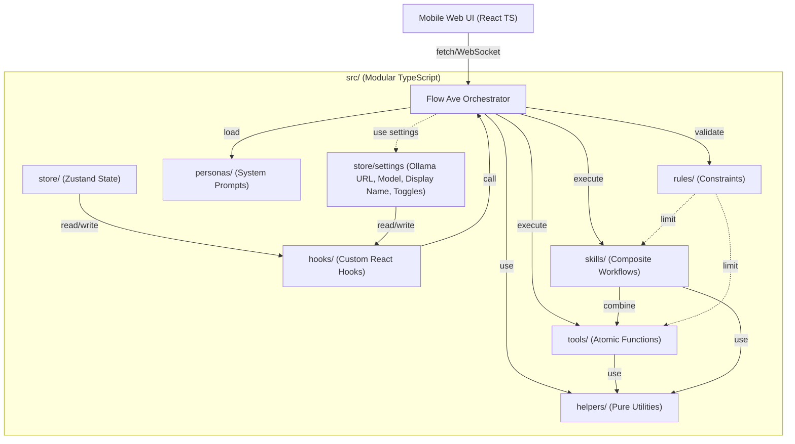
```mermaid
graph TB
    MobileUI["Mobile Web UI (React TS)"] -->|fetch/WebSocket| Orchestrator["Flow Ave Orchestrator"]

    subgraph src["src/ (Modular TypeScript)"]
        direction TB
        Store["store/ (Zustand State)"]
        Store -->|read/write| Hooks["hooks/ (Custom React Hooks)"]
        Hooks -->|call| Orchestrator
        
        Personas["personas/ (System Prompts)"]
        Rules["rules/ (Constraints)"]
        Helpers["helpers/ (Pure Utilities)"]
        Tools["tools/ (Atomic Functions)"]
        Skills["skills/ (Composite Workflows)"]
        SettingsStore["store/settings (Ollama URL, Model, Display Name, Toggles)"]
    end

    Orchestrator -->|load| Personas
    Orchestrator -->|validate| Rules
    Orchestrator -->|use| Helpers
    Orchestrator -->|execute| Tools
    Orchestrator -->|execute| Skills
    Tools -->|use| Helpers
    Skills -->|combine| Tools
    Skills -->|use| Helpers
    Rules -.->|limit| Tools
    Rules -.->|limit| Skills
    SettingsStore -->|read/write| Hooks
    Orchestrator -.->|use settings| SettingsStore
```

Explanation:

· The entire application follows a strict modular architecture where each folder has a single responsibility.
· MobileUI is the React TypeScript frontend that runs in a mobile browser. It never directly accesses core logic; instead, it communicates exclusively through custom hooks.
· store/ contains two Zustand stores: sessionStore manages conversation state (current conversation ID, messages, thinking steps, loading status, errors), while settingsStore manages user preferences (Ollama base URL, selected model name, display name, and four boolean toggles: showProcessLog, showThinking, enableThinking, enableTools).
· hooks/ acts as the bridge layer. useAgent dispatches user input to the Orchestrator. useThinking subscribes to the thinking steps array for the active conversation and triggers UI re-renders. useConversations manages the conversation list in the sidebar. useSettings reads and writes settings to the store and localStorage.
· personas/ exports persona objects containing systemPrompt, displayName, toneInstruction, and safetyRules. Each persona file defines one personality variation.
· rules/ exports rule sets used by the Rules Engine. There are five files: global, fast mode, expert mode, tool-specific, and safety.
· helpers/ contains pure functions with zero side effects: sanitizer.ts (DOMPurify wrapper), tokenizer.ts (counts tokens using the model's tokenizer), timer.ts (exponential backoff delay calculator), cache.ts (in-memory Map with TTL support), piiDetector.ts, injectionDetector.ts, toxicityAnalyzer.ts.
· tools/ contains atomic functions callable by the LLM. Each tool file exports a Tool object with name, description, parameters (Zod schema), and handler (async function returning ToolResult). Tools are stateless and side-effect-free where possible. Examples: read_file.ts, calculator.ts, web_search.ts, write_file.ts.
· skills/ contains composite workflows that orchestrate multiple tools and/or other skills. Each skill file exports a Skill object with name, description, and steps (array of tool names or sub-skill names). Skills can chain dependencies. Examples: summarize_file.ts (calls read_file then summarize_text), create_report.ts (calls summarize_file then create_chart).
· The Orchestrator sits at the center. It loads personas and rules at startup, builds the Registry (a Map<string, Tool> and Map<string, Skill>), and processes every user input through the execution loop. It reads settings to determine whether to include tool schemas in prompts and whether to enforce thinking format.
· The dotted lines from Rules to Tools/Skills indicate that rules constrain execution but do not control it directly; the Rules Engine evaluates every action before and after execution.
· The settings flow is bidirectional with hooks but unidirectional (read-only) to the Orchestrator, ensuring UI preferences propagate without tightly coupling layers.

---

2. Main Execution Loop with Rules Validation

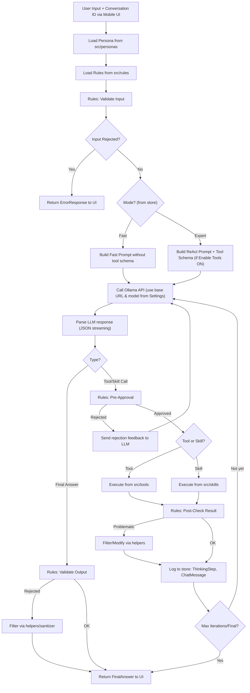
```mermaid
flowchart TD
    Start["User Input + Conversation ID via Mobile UI"] --> LoadPersona["Load Persona from src/personas"]
    LoadPersona --> LoadRules["Load Rules from src/rules"]
    LoadRules --> InputCheck["Rules: Validate Input"]
    InputCheck --> InputDecision{"Input Rejected?"}
    InputDecision -->|Yes| ReturnDenied["Return ErrorResponse to UI"]
    InputDecision -->|No| ModeDecision{"Mode? (from store)"}
    ModeDecision -->|Fast| FastPrompt["Build Fast Prompt without tool schema"]
    ModeDecision -->|Expert| ExpertPrompt["Build ReAct Prompt + Tool Schema (if Enable Tools ON)"]
    FastPrompt --> CallLLM["Call Ollama API (use base URL & model from Settings)"]
    ExpertPrompt --> CallLLM
    CallLLM --> ParseResponse["Parse LLM response (JSON streaming)"]
    ParseResponse --> TypeDecision{"Type?"}
    TypeDecision -->|Final Answer| OutputCheck["Rules: Validate Output"]
    OutputCheck -->|Rejected| FilterOutput["Filter via helpers/sanitizer"]
    FilterOutput --> ReturnOutput["Return FinalAnswer to UI"]
    OutputCheck -->|OK| ReturnOutput
    TypeDecision -->|Tool/Skill Call| PreApproval["Rules: Pre-Approval"]
    PreApproval -->|Rejected| FeedbackLLM["Send rejection feedback to LLM"]
    FeedbackLLM --> CallLLM
    PreApproval -->|Approved| ExecDecision{"Tool or Skill?"}
    ExecDecision -->|Tool| ExecTool["Execute from src/tools"]
    ExecDecision -->|Skill| ExecSkill["Execute from src/skills"]
    ExecTool --> PostCheck["Rules: Post-Check Result"]
    ExecSkill --> PostCheck
    PostCheck -->|Problematic| FilterResult["Filter/Modify via helpers"]
    PostCheck -->|OK| LogResult["Log to store: ThinkingStep, ChatMessage"]
    FilterResult --> LogResult
    LogResult --> StoppingCheck{"Max Iterations/Final?"}
    StoppingCheck -->|Not yet| CallLLM
    StoppingCheck -->|Yes| ReturnOutput
```

Explanation:

· Every user input arrives with a conversationId that isolates it to a specific conversation. This guarantees that history, thinking steps, and state are never mixed between conversations.
· The loop begins by loading the active persona (chosen by the user or defaulted) and all applicable rule sets. These remain constant throughout the loop for that input.
· First validation point — Input Check: Before the LLM ever sees the input, the Rules Engine evaluates it against safety rules (PII detection, prompt injection check, toxicity analysis). If any safety rule triggers with a Deny decision, the input is rejected immediately and an ErrorResponse (containing a reason code like SAFETY_BLOCK or INJECTION_DETECTED) is returned to the UI. The LLM is never called.
· Mode Decision: After passing input validation, the system checks the current mode from the Zustand store. Mode can be toggled per conversation. Fast mode skips the tool schema entirely and sends a concise prompt expecting a direct answer. Expert mode assembles a full ReAct prompt with tool schemas, format instructions, and few-shot examples.
· LLM Call: The Orchestrator constructs the final prompt by combining the system prompt (from the persona), active rules (formatted as constraints), tool schemas (if in Expert mode and enableTools is ON), format instructions (if enableThinking is ON), and few-shot examples. The call is made to Ollama at the configured base URL with the selected model. Streaming is enabled, and the response is parsed chunk by chunk.
· Response Parsing: The LLM's streaming JSON response is parsed incrementally. The Orchestrator looks for a tool_call object (indicating the LLM wants to execute a tool or skill) or a final_answer string (indicating the LLM is done). Each chunk updates the thinking step in the store so the UI can render it in real time.
· Second validation point — Pre-Approval: If the LLM requests a tool or skill call, the Rules Engine evaluates the proposed action before execution. This checks: (a) is the tool allowed in the current mode? (b) are the parameters valid according to the tool's Zod schema? (c) does the tool-specific rule set allow this call (e.g., rate limits, allowed paths for read_file)? (d) do safety rules flag the parameters? If rejected, the Orchestrator does NOT abort; instead, it sends a structured feedback message back to the LLM explaining why the action was denied and asks the LLM to try a different approach. This enables self-correction without user intervention.
· Execution: If pre-approved, the action is executed. Tools run their handler directly. Skills execute their step sequence, which may involve calling multiple tools and sub-skills. Each internal step of a skill also goes through pre-approval and post-check.
· Third validation point — Post-Check: After execution, the result is evaluated again. Safety rules check for PII in the output, toxicity in generated text, or sensitive data in file contents. If the result is problematic, it is either filtered (e.g., email addresses redacted) or blocked entirely. The filtered/blocked result is still logged for transparency.
· Logging: Every step — whether successful, filtered, or blocked — is logged to the Zustand store. A ThinkingStep object is created with stepNumber, thought (the LLM's reasoning), action (tool/skill name and parameters), and observation (the result). Simultaneously, ChatMessage objects are added to the conversation's message array.
· Stopping Condition: The loop checks if the LLM has emitted a final_answer flag or if the maximum iteration count (from global.ts) has been reached. If neither, it loops back to call the LLM again with the observation appended to the prompt. If the loop exceeds max iterations, the Orchestrator forces a final answer by sending a termination prompt to the LLM. The final answer then passes through the output validation before being returned to the UI.

---

3. Sequence: Thinking Expert Mode

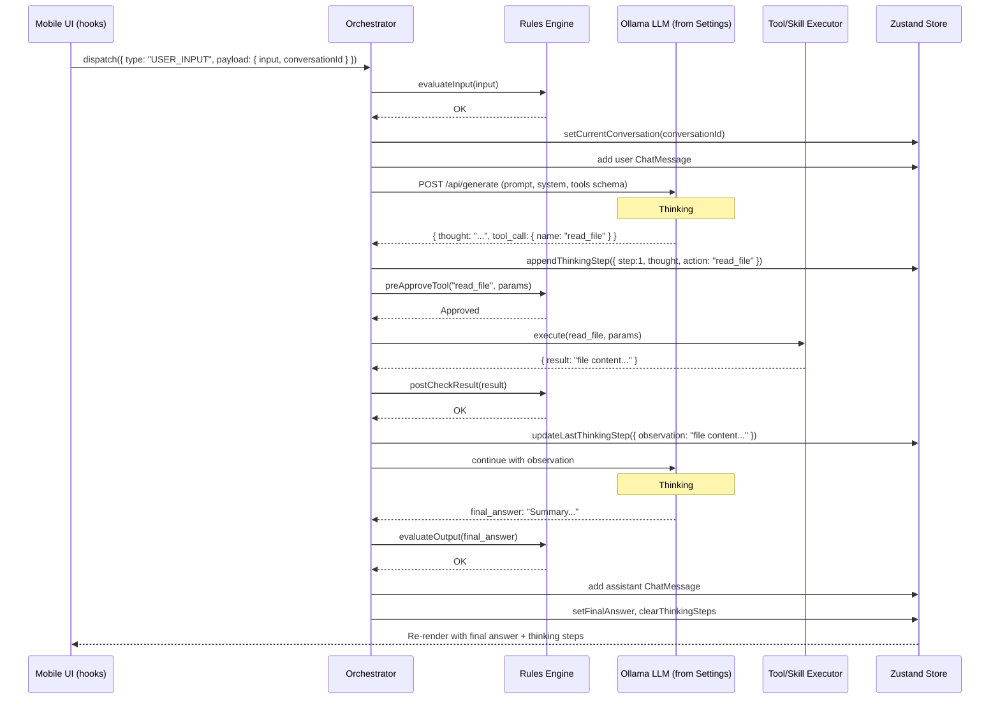
```mermaid
sequenceDiagram
    participant UI as Mobile UI (hooks)
    participant O as Orchestrator
    participant R as Rules Engine
    participant L as Ollama LLM (from Settings)
    participant T as Tool/Skill Executor
    participant S as Zustand Store

    UI->>O: dispatch({ type: "USER_INPUT", payload: { input, conversationId } })
    O->>R: evaluateInput(input)
    R-->>O: OK
    O->>S: setCurrentConversation(conversationId)
    O->>S: add user ChatMessage
    O->>L: POST /api/generate (prompt, system, tools schema)
    Note over L: Thinking #1 (stream)
    L-->>O: { thought: "...", tool_call: { name: "read_file" } }
    O->>S: appendThinkingStep({ step:1, thought, action: "read_file" })
    O->>R: preApproveTool("read_file", params)
    R-->>O: Approved
    O->>T: execute(read_file, params)
    T-->>O: { result: "file content..." }
    O->>R: postCheckResult(result)
    R-->>O: OK
    O->>S: updateLastThinkingStep({ observation: "file content..." })
    O->>L: continue with observation
    Note over L: Thinking #2.. etc
    L-->>O: final_answer: "Summary..."
    O->>R: evaluateOutput(final_answer)
    R-->>O: OK
    O->>S: add assistant ChatMessage
    O->>S: setFinalAnswer, clearThinkingSteps
    S-->>UI: Re-render with final answer + thinking steps
```

Explanation:

· This sequence diagram captures the exact temporal ordering of a single Expert mode interaction across six participants.
· User dispatch: The UI component calls dispatch on the Zustand store (or a hook that wraps it) with an action object containing the user's input text and the conversationId. This action is synchronous and triggers the Orchestrator logic.
· Input evaluation: The Orchestrator immediately passes the input through the Rules Engine's evaluateInput method. This runs the safety filter cascade (PII, injection, toxicity). Since the input is a simple request, it passes and returns OK.
· Session setup: The Orchestrator sets the currentConversation in the store to the provided ID, ensuring all subsequent operations target this conversation. It then appends the user's message as a ChatMessage object with role: "user" to the conversation's messages array.
· LLM call: The Orchestrator assembles the full prompt (system, rules, tools schema, format instructions, few-shot examples, conversation history, and the new user message) and sends it as a POST request to the Ollama API endpoint /api/generate. The request includes stream: true and the model name from settings. The Ollama instance processes this with the configured context window of 65536 tokens.
· Streaming response — Thinking #1: Ollama streams back chunks of JSON. The Orchestrator parses these incrementally. The first meaningful response contains a thought (the LLM's internal reasoning, e.g., "I need to read the file first") and a tool_call object with name: "read_file" and parameters like path: "data.csv".
· Logging Thinking Step #1: The Orchestrator dispatches appendThinkingStep to the store with a partial ThinkingStep object: stepNumber: 1, thought: "I need to read the file first", action: "read_file", actionInput: { path: "data.csv" }. The observation field is left empty for now. The UI, subscribed via useThinking, immediately re-renders and shows this step in the Thinking Box with a spinner indicating the action is in progress.
· Pre-approval: Before executing, the Orchestrator calls preApproveTool on the Rules Engine with the tool name and parameters. The Rules Engine checks global rules (is the iteration count exceeded?), mode rules (are tools allowed in Expert mode? yes), tool-specific rules (is data.csv in an allowed path? yes), and safety rules (no PII in the path). All pass, returning Approved.
· Execution: The Tool Executor looks up "read_file" in the Registry's tool map, validates parameters against the Zod schema, and runs the handler. The handler reads the file and returns its content as a string.
· Post-check: The result is passed to postCheckResult. Safety rules scan the file content for PII (emails, phone numbers). If found, they would be redacted. In this case, the content is clean, and OK is returned.
· Logging Observation: The Orchestrator dispatches updateLastThinkingStep to fill in the observation field of step 1 with the file content (or a truncated version if too long). The UI updates the Thinking Box to show the observation, and the spinner stops.
· Continuing the loop: The Orchestrator appends the observation to the conversation history and sends it back to the LLM as part of the next prompt. The LLM now has the file content and can plan its next step.
· Thinking #2 and beyond: The cycle repeats. The LLM might request a calculation, a web search, or a skill execution. Each iteration follows the same pattern: log partial step, pre-approve, execute, post-check, log observation, continue.
· Final answer: Eventually, the LLM determines it has enough information and emits a final_answer with a summary or direct response. The Orchestrator runs evaluateOutput on this final answer (safety check), then dispatches setFinalAnswer to the store. This adds the answer as an assistant ChatMessage, clears the thinkingSteps array for this conversation, and triggers the UI to hide the Thinking Box and display the answer in the chat history.
· The user sees the complete interaction: their message, the step-by-step reasoning in the Thinking Box, and the final answer. They can expand the Thinking Box to review each step.

---

4. State Machine: Fast vs Expert

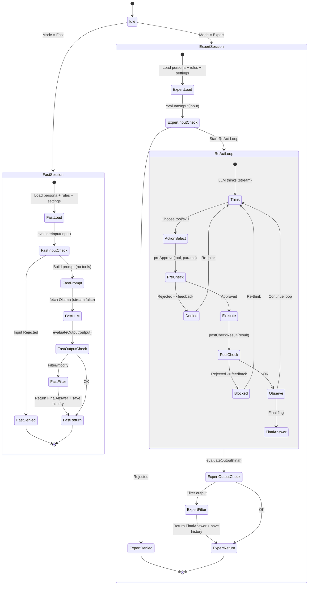
```mermaid
stateDiagram-v2
    [*] --> Idle
    Idle --> FastSession: Mode = Fast
    Idle --> ExpertSession: Mode = Expert

    state FastSession {
        [*] --> FastLoad: Load persona + rules + settings
        FastLoad --> FastInputCheck: evaluateInput(input)
        FastInputCheck --> FastDenied: Input Rejected
        FastDenied --> [*]
        FastInputCheck --> FastPrompt: Build prompt (no tools)
        FastPrompt --> FastLLM: fetch Ollama (stream false)
        FastLLM --> FastOutputCheck: evaluateOutput(output)
        FastOutputCheck --> FastFilter: Filter/modify
        FastFilter --> FastReturn: Return FinalAnswer + save history
        FastOutputCheck --> FastReturn: OK
        FastReturn --> [*]
    }

    state ExpertSession {
        [*] --> ExpertLoad: Load persona + rules + settings
        ExpertLoad --> ExpertInputCheck: evaluateInput(input)
        ExpertInputCheck --> ExpertDenied: Rejected
        ExpertDenied --> [*]
        ExpertInputCheck --> ReActLoop: Start ReAct Loop
        state ReActLoop {
            [*] --> Think: LLM thinks (stream)
            Think --> ActionSelect: Choose tool/skill
            ActionSelect --> PreCheck: preApprove(tool, params)
            PreCheck --> Denied: Rejected -> feedback
            Denied --> Think: Re-think
            PreCheck --> Execute: Approved
            Execute --> PostCheck: postCheckResult(result)
            PostCheck --> Blocked: Rejected -> feedback
            Blocked --> Think: Re-think
            PostCheck --> Observe: OK
            Observe --> Think: Continue loop
            Observe --> FinalAnswer: Final flag
        }
        ReActLoop --> ExpertOutputCheck: evaluateOutput(final)
        ExpertOutputCheck --> ExpertFilter: Filter output
        ExpertFilter --> ExpertReturn: Return FinalAnswer + save history
        ExpertOutputCheck --> ExpertReturn: OK
        ExpertReturn --> [*]
    }
```

Explanation:

· This state machine models the two distinct processing paths for every user input. The mode (Fast or Expert) is stored per conversation in the Zustand store and can be toggled by the user at any time.
· Idle: The default state when no processing is happening. The system waits for user input.
· FastSession: Designed for quick, straightforward queries that do not require tools or multi-step reasoning. The state transitions are linear with no loops. After loading the persona and rules, the input is validated. If rejected, the session terminates immediately with an error message. If accepted, a prompt is built that includes the system prompt, rules (as constraints), and the user's input — but NO tool schemas and NO ReAct format instructions. The LLM is called with stream: false to get a single, complete response as fast as possible. The output is validated, filtered if necessary, and returned to the UI along with being saved as an assistant ChatMessage. The session then terminates.
· ExpertSession: Designed for complex, multi-step tasks that benefit from reasoning and tool use. After loading and input validation, the system enters the ReActLoop substate.
· ReActLoop internal states:
  · Think: The LLM receives the full prompt with tool schemas and ReAct instructions. It streams back a thought (its reasoning) and optionally a tool_call.
  · ActionSelect: If the LLM emitted a tool_call, the system identifies which tool or skill is being requested.
  · PreCheck: The Rules Engine evaluates the proposed action. If denied, the system sends feedback to the LLM and returns to the Think state so it can try an alternative approach.
  · Execute: If approved, the tool or skill is executed.
  · PostCheck: The result is evaluated. If blocked, feedback is sent and the LLM re-thinks. If OK, the observation is recorded.
  · Observe: The observation is added to the context, and the system decides: if the LLM has emitted a final_answer flag, transition to FinalAnswer; otherwise, loop back to Think with the enriched context.
· Both sessions end with an output check and filtering before returning the final answer.
· Crucially, safety rules are active in BOTH modes. Even a Fast mode response is filtered for PII and toxicity before reaching the user.

---

5. Rules Engine: Evaluation Flow

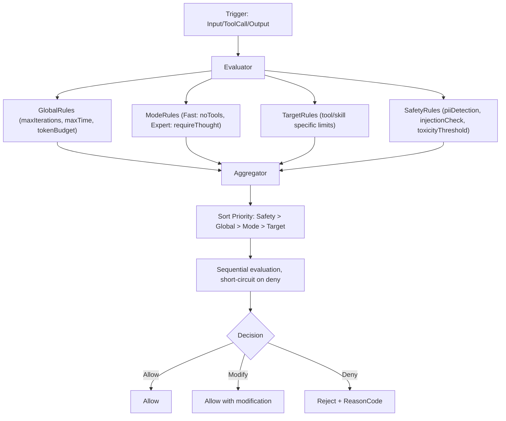
```mermaid
flowchart TD
    Trigger["Trigger: Input/ToolCall/Output"] --> Evaluator["Evaluator"]
    Evaluator --> GlobalRules["GlobalRules (maxIterations, maxTime, tokenBudget)"]
    Evaluator --> ModeRules["ModeRules (Fast: noTools, Expert: requireThought)"]
    Evaluator --> TargetRules["TargetRules (tool/skill specific limits)"]
    Evaluator --> SafetyRules["SafetyRules (piiDetection, injectionCheck, toxicityThreshold)"]
    GlobalRules --> Aggregator["Aggregator"]
    ModeRules --> Aggregator
    TargetRules --> Aggregator
    SafetyRules --> Aggregator
    Aggregator --> PrioritySort["Sort Priority: Safety > Global > Mode > Target"]
    PrioritySort --> SequentialCheck["Sequential evaluation, short-circuit on deny"]
    SequentialCheck --> Decision{"Decision"}
    Decision -->|Allow| AllowAction["Allow"]
    Decision -->|Modify| ModifyAction["Allow with modification"]
    Decision -->|Deny| DenyAction["Reject + ReasonCode"]
```

Explanation:

· The Rules Engine is the gatekeeper for every action in the system. It evaluates three types of triggers: Input (user messages before LLM processing), ToolCall (proposed tool or skill executions), and Output (LLM responses before returning to UI).
· Evaluator: This is a function evaluate(trigger: Trigger, context: RuleContext): RuleResult. It takes the trigger type and the data to evaluate (e.g., the input text, or a tool call with parameters), plus context about the current conversation (iteration count, elapsed time, mode).
· GlobalRules: These apply always, regardless of mode or persona. They include: maxIterations (default 15, maximum number of ReAct loop cycles before forcing a final answer), maxTimeMs (default 120000, maximum time in milliseconds for a single input processing), tokenBudget (default 65536, the total token budget matching OLLAMA_NUM_CTX), requireCitation (whether the LLM should cite sources), and requireGreeting (whether a greeting message is auto-generated for new conversations).
· ModeRules: These vary by mode. In Fast mode, allowTools: false and singlePass: true prevent any tool calls and enforce a single response. In Expert mode, allowTools: true, requireThoughtTag: true (the LLM must include reasoning in its response), allowSkillChaining: true (skills can call other skills), and maxIterations: 20 (a higher limit for complex tasks).
· TargetRules: These are tool-specific and skill-specific constraints. Examples: read_file has allowedPaths: ["./data", "./public"] to prevent reading outside designated folders; calculator has allowedOperations: ["+", "-", "*", "/"] and maxOperand: 1000000; web_search has rateLimit: 10 (calls per minute) and fallbackTool: "cache_search". Each tool's rule set is defined in rules/tools.ts.
· SafetyRules: These protect against harmful content. piiDetection (with regex patterns for emails, phone numbers, credit card numbers, KTP/NIK), injectionCheck (patterns like "ignore previous instructions", "pretend you are", "system prompt:"), toxicityThreshold (default 0.8, any content above this is blocked). Safety rules apply to both input and output.
· Aggregator: All relevant rules are collected into a single array. The rules are functions that take the trigger data and return Allow, Modify, or Deny with an optional reason.
· PrioritySort: The aggregator sorts rules by priority: Safety > Global > Mode > Target. This ensures that a safety violation immediately blocks an action, regardless of what other rules might allow.
· SequentialCheck: Rules are evaluated in priority order. If a rule returns Deny, evaluation stops immediately (short-circuit). No further rules are checked, and the denial is final.
· Decision: The final outcome is one of three:
  · Allow: The action proceeds without modification.
  · Modify: The action is allowed but the data is modified (e.g., email addresses redacted to [redacted], or a calculator operand clamped to the maximum allowed value). The modified data is passed forward.
  · Deny: The action is blocked entirely, and a ReasonCode (e.g., SAFETY_PII_DETECTED, TOOL_RATE_LIMIT_EXCEEDED, MODE_TOOLS_DISABLED) is returned so the Orchestrator can inform the LLM or the user appropriately.

---

6. Control Hierarchy & Thinking Box Rendering

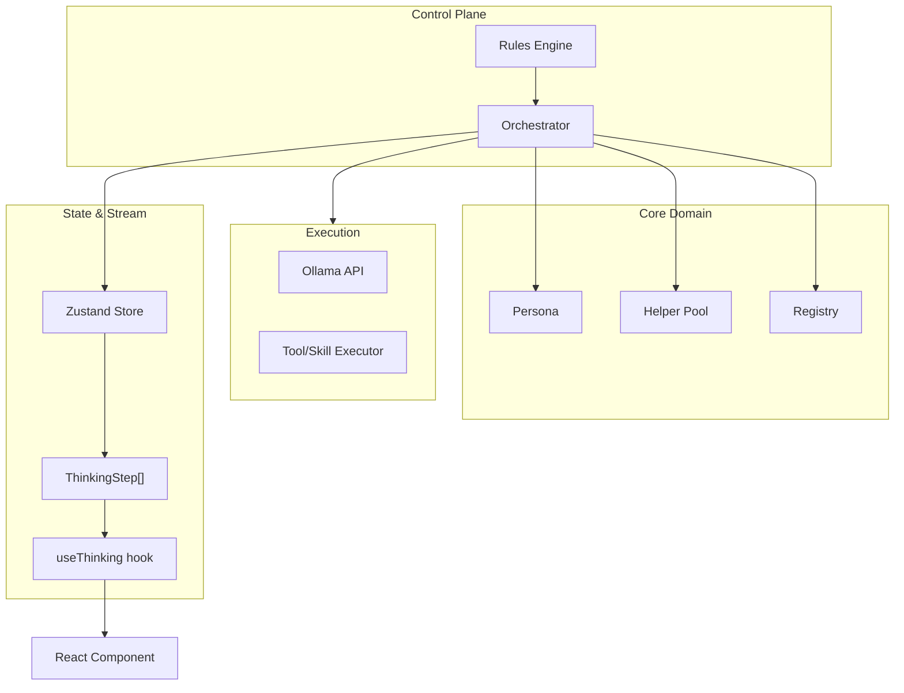
```mermaid
graph TB
    subgraph ControlPlane["Control Plane"]
        RulesEngine["Rules Engine"] --> Orchestrator["Orchestrator"]
    end
    subgraph CoreComponents["Core Domain"]
        Persona["Persona"]
        HelperPool["Helper Pool"]
        Registry["Registry"]
    end
    subgraph ExecutionPlane["Execution"]
        LLM["Ollama API"]
        Executor["Tool/Skill Executor"]
    end
    subgraph StatePlane["State & Stream"]
        Store["Zustand Store"]
        ThinkingSteps["ThinkingStep[]"]
        Stream["useThinking hook"]
    end
    Orchestrator --> Persona
    Orchestrator --> HelperPool
    Orchestrator --> Registry
    Orchestrator --> ExecutionPlane
    Orchestrator --> Store
    Store --> ThinkingSteps
    ThinkingSteps --> Stream
    Stream --> MobileUI["React Component"]
```

Explanation:

· This diagram illustrates the four-plane architecture that separates concerns within the Flow Ave system.
· Control Plane: The highest layer. The Rules Engine has ultimate authority — it can veto any decision the Orchestrator makes. The Orchestrator cannot bypass rules. This layer has no UI dependencies.
· Core Domain: Contains the domain logic components. Persona provides the active system prompt and tone instructions. HelperPool is a collection of stateless utility functions (sanitizer, tokenizer, timer, cache, detectors). Registry holds the Map<string, Tool> and Map<string, Skill> built at startup by dynamically importing all files from the tools/ and skills/ folders.
· Execution Plane: Handles external interactions. LLM communicates with the Ollama API using the configured base URL and model. Executor runs tools and skills, managing retries, fallbacks, and cache lookups.
· State Plane: The Zustand Store is the single source of truth for all reactive state. It contains conversations (a Record<string, Conversation>), currentConversationId, settings, and UI state flags. The ThinkingSteps array is derived from the active conversation. The useThinking hook subscribes to this array and triggers re-renders in the ThinkingBox component whenever a step is added or updated.
· Stream to UI: The useThinking hook returns { steps: ThinkingStep[], isStreaming: boolean }. The ThinkingBox component maps over steps and renders each one with animations (fade-in, typewriter effect). If settings.showThinking is false, the hook returns an empty array, and the Thinking Box is hidden.
· The separation ensures that changing the UI framework (e.g., from React to Vue) would only affect the State Plane and the UI component, leaving the Control Plane and Core Domain untouched.

---

7. rules/ Folder Components

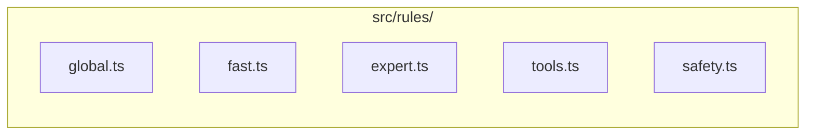
```mermaid
graph LR
    subgraph RulesDir["src/rules/"]
        Global["global.ts"]
        Fast["fast.ts"]
        Expert["expert.ts"]
        ToolSpecific["tools.ts"]
        Safety["safety.ts"]
    end
```

Explanation:

· The rules/ folder contains five TypeScript files, each exporting a typed rule set object.
· global.ts: Defines rules that apply in all contexts. Fields: maxIterations: 15, maxTimeMs: 120000, tokenBudget: 65536, requireCitation: false, requireGreeting: true, greetingPrompt: "You are starting a new conversation. Introduce yourself as Ave AI in 2-3 sentences.", language: "en". These rules govern session limits and mandatory behaviors.
· fast.ts: Mode-specific rules for Fast mode. Fields: allowTools: false, allowSkills: false, singlePass: true, maxResponseLength: 500, requireThinking: false, streamResponse: false. These ensure Fast mode is truly fast — no tools, no streaming, short response.
· expert.ts: Mode-specific rules for Expert mode. Fields: allowTools: true, allowSkills: true, singlePass: false, requireThoughtTag: true, allowSkillChaining: true, maxIterations: 20, requireThinking: true, streamResponse: true. These enable the full ReAct loop with streaming.
· tools.ts: A Record<string, ToolRule> mapping tool names to their specific constraints. Example entries: "read_file": { allowedPaths: ["./data", "./public", "./uploads"], maxFileSizeBytes: 10485760, cacheTTL: 30000, rateLimit: null }, "calculator": { allowedOperations: ["+", "-", "*", "/"], maxOperand: 1000000, cacheTTL: 10000 }, "web_search": { rateLimit: 10, rateWindowMs: 60000, fallbackTool: "offline_search", cacheTTL: 300000 }.
· safety.ts: Defines content safety thresholds. Fields: input: { piiDetection: true, piiPatterns: ["email", "phone", "creditCard", "nik"], injectionCheck: true, injectionPatterns: ["ignore previous", "pretend you are", "system prompt:"], toxicityCheck: true, toxicityThreshold: 0.8 }, output: { piiRedaction: true, toxicityCheck: true, toxicityThreshold: 0.7, maxResponseTokens: 4096 }.
· The Orchestrator imports all five at startup and passes them to the Rules Engine, which combines them into the evaluation pipeline.

---

8. Complete Session Flow (with Conversation Management)

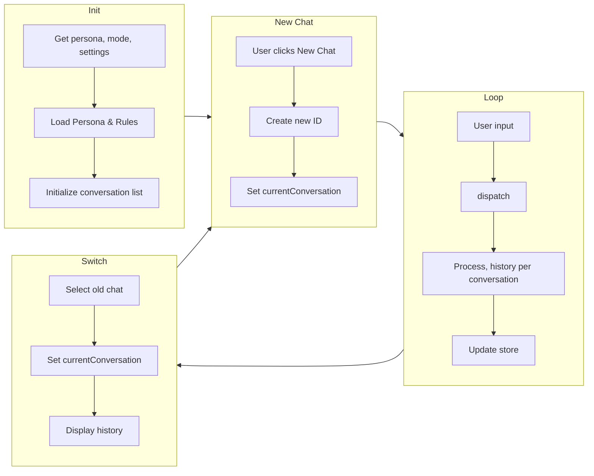
```mermaid
flowchart LR
    subgraph P1["Init"]
        A1["Get persona, mode, settings"] --> A2["Load Persona & Rules"]
        A2 --> A3["Initialize conversation list"]
    end
    subgraph P2["New Chat"]
        C1["User clicks New Chat"] --> C2["Create new ID"]
        C2 --> C3["Set currentConversation"]
    end
    subgraph P3["Loop"]
        B1["User input"] --> B2["dispatch"]
        B2 --> B3["Process, history per conversation"]
        B3 --> B4["Update store"]
    end
    subgraph P4["Switch"]
        D1["Select old chat"] --> D2["Set currentConversation"]
        D2 --> D3["Display history"]
    end
    P1 --> P2 --> P3 --> P4 --> P2
```

Explanation:

· This flowchart captures the entire user journey from app launch through multiple conversations.
· Phase 1 — Init: When the React app mounts, the useAgent hook initializes. It reads the active persona ID, mode, and settings from the Zustand store (which may have restored them from localStorage). It loads the persona object and rule sets. It initializes the conversation list from localStorage if any archived conversations exist. If no conversations exist, it creates a default one with a new UUID.
· Phase 2 — New Chat: When the user clicks "New Chat" in the sidebar, a new conversation object is created with a unique ID (crypto.randomUUID()), a default title ("New Chat"), the current persona ID and mode, and empty messages and thinkingSteps arrays. This conversation is set as currentConversationId in the store. If globalRules.requireGreeting is true, the Orchestrator immediately calls the LLM with the greeting prompt and saves the response as the first assistant message. The UI switches to this new conversation view.
· Phase 3 — Loop: The user types a message and sends it. The useAgent hook dispatches a USER_INPUT action with the text and conversationId. The Orchestrator processes the input following the Main Execution Loop (Diagram 2). All updates — new messages, thinking steps, status changes — are dispatched to the store. The UI reactively updates: messages appear in the chat panel, thinking steps appear in the Thinking Box.
· Phase 4 — Switch: The user can click on any conversation in the sidebar. This dispatches SET_CURRENT_CONVERSATION with the selected ID. The store updates currentConversationId, and the UI immediately renders that conversation's full history (messages and any saved thinking steps) from the store. The user can resume an old conversation seamlessly.
· The flow loops: from any conversation, the user can create a new one or switch to another. Each conversation maintains complete isolation.

---

9. Data Flow Between Folders (with Settings)

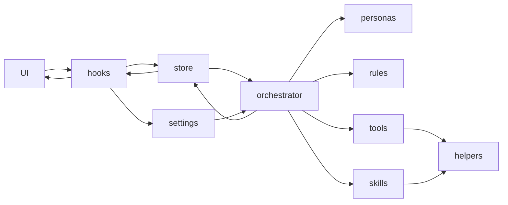
```mermaid
graph LR
    UI --> hooks
    hooks --> store
    store --> orchestrator
    orchestrator --> personas
    orchestrator --> rules
    orchestrator --> tools
    orchestrator --> skills
    tools --> helpers
    skills --> helpers
    orchestrator --> store
    store --> hooks
    hooks --> UI
    hooks --> settings
    settings --> orchestrator
```

Explanation:

· This diagram shows the strict unidirectional data flow that prevents circular dependencies.
· UI → hooks: User interactions (typing, clicking) trigger hook actions.
· hooks → store: Hooks dispatch actions to the Zustand store. They never directly modify state.
· store → orchestrator: The store's state changes (specifically, a new USER_INPUT action) trigger the Orchestrator logic. The Orchestrator is a subscriber to the store, not a direct dependency.
· orchestrator → personas/rules: The Orchestrator reads persona and rule data directly from the imported modules.
· orchestrator → tools/skills: The Orchestrator calls tools and skills through the Executor, which uses the Registry built from the tools/ and skills/ folders.
· tools/skills → helpers: Tools and skills may use helper functions (sanitizer, tokenizer, cache). They never access the store or UI.
· orchestrator → store: Results (messages, thinking steps, errors) are dispatched back to the store.
· store → hooks: Hooks with selectors re-render when their subscribed state slices change.
· hooks → UI: Hooks return data and action dispatchers to UI components.
· hooks → settings: Settings hooks read and write to the settingsStore (a separate Zustand store).
· settings → orchestrator: The Orchestrator reads settings when building prompts and making decisions (e.g., enableTools determines whether tool schemas are included).
· This architecture ensures that the UI layer, state management, and core logic are decoupled and independently testable.

---

10. Retry & Fallback Tool/Skill

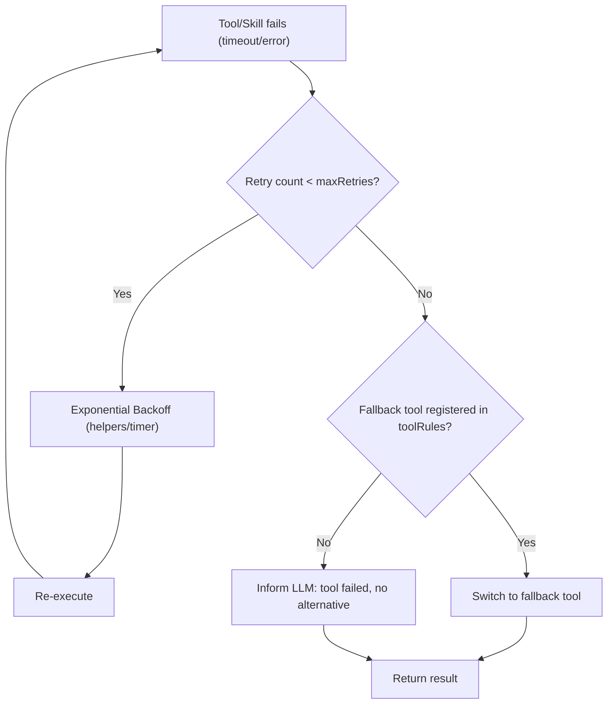
```mermaid
flowchart TD
    Fail["Tool/Skill fails (timeout/error)"] --> Retry{"Retry count < maxRetries?"}
    Retry -->|Yes| Backoff["Exponential Backoff (helpers/timer)"]
    Backoff --> Execute["Re-execute"]
    Execute --> Fail
    Retry -->|No| Fallback{"Fallback tool registered in toolRules?"}
    Fallback -->|Yes| Switch["Switch to fallback tool"]
    Fallback -->|No| InformLLM["Inform LLM: tool failed, no alternative"]
    Switch --> Result["Return result"]
    InformLLM --> Result
```

Explanation:

· When a tool or skill execution fails (due to network timeout, exception, or invalid response), the system does not immediately give up.
· Retry logic: The Executor checks the current retry count against maxRetries (default 3, configurable per tool in toolRules). If under the limit, it waits using an exponential backoff strategy: the delay is baseDelay * 2^(retryCount) milliseconds (e.g., 1s, 2s, 4s). Then it re-executes the tool with the same parameters. If the re-execution succeeds, the result is returned as normal.
· Exhausted retries: If all retries fail, the Executor consults the tool's rule set (toolRules[toolName]) to check for a fallbackTool. A fallback tool is an alternative that can accomplish a similar function. For example, web_search might have fallbackTool: "offline_search" which searches a local cache instead of making an external API call.
· Fallback execution: If a fallback is registered, it is executed with the same parameters (adjusted if necessary). The result is returned, and the fallback usage is logged.
· No fallback — informing the LLM: If no fallback exists, the Executor does NOT crash the session. Instead, it returns a structured error message to the Orchestrator, which passes it to the LLM as an observation: "Tool 'web_search' failed after 3 retries. No fallback available. Please try a different approach." The LLM can then adjust its strategy and try a different tool or answer based on its existing knowledge.

---

11. Error Handling & Recovery

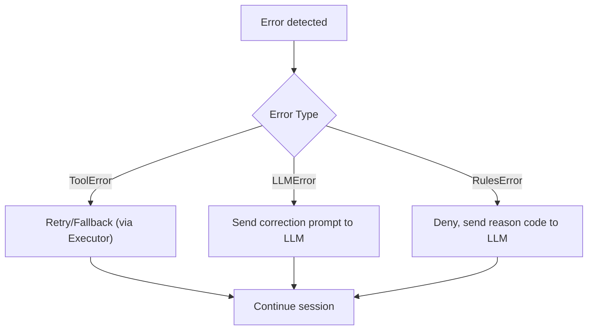
```mermaid
flowchart TD
    Error["Error detected"] --> Type{"Error Type"}
    Type -->|ToolError| ToolRec["Retry/Fallback (via Executor)"]
    Type -->|LLMError| LLMRec["Send correction prompt to LLM"]
    Type -->|RulesError| RuleRec["Deny, send reason code to LLM"]
    ToolRec --> Continue["Continue session"]
    LLMRec --> Continue
    RuleRec --> Continue
```

Explanation:

· Every error that occurs during processing is caught and categorized into one of three types.
· ToolError: Occurs when a tool execution fails (timeout, network error, file not found, invalid return format). Recovery follows the retry/fallback mechanism described in Diagram 10. If retries and fallbacks are exhausted, the tool error is conveyed to the LLM as an observation, and the session continues.
· LLMError: Occurs when the Ollama API call fails (server unreachable, model not found, response malformed). The Orchestrator catches this and sends a "correction prompt" back to the LLM (if the error is transient) or retries the API call with a backoff. If the LLM is permanently unreachable (e.g., wrong base URL), the error is logged to the store and displayed to the user with a message like "Unable to reach Ollama. Check your Settings." The session does not crash; the user can fix the settings and retry.
· RulesError: Occurs when the Rules Engine denies an action (safety violation, mode restriction, tool-specific limit). The denial includes a ReasonCode. The Orchestrator sends this to the LLM as feedback: "Your action was denied: TOOL_RATE_LIMIT_EXCEEDED. Please wait or try a different tool." The LLM can then re-think and adapt.
· In all cases, the session continues. There is no fatal error that kills the entire agent from the user's perspective. The continue path ensures that the conversation state is preserved, and the user (or LLM) can attempt recovery.

---

12. Persona Switching & Context Reset per Conversation

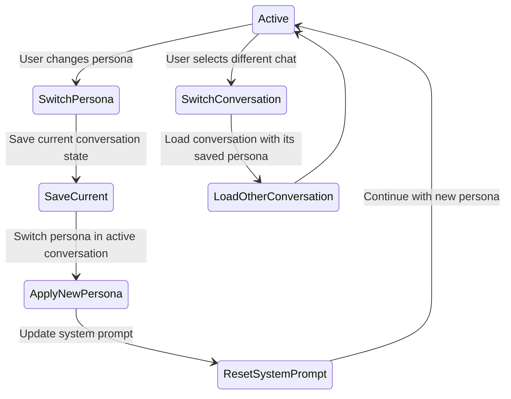
```mermaid
stateDiagram-v2
    Active --> SwitchPersona: User changes persona
    SwitchPersona --> SaveCurrent: Save current conversation state
    SaveCurrent --> ApplyNewPersona: Switch persona in active conversation
    ApplyNewPersona --> ResetSystemPrompt: Update system prompt
    ResetSystemPrompt --> Active: Continue with new persona
    Active --> SwitchConversation: User selects different chat
    SwitchConversation --> LoadOtherConversation: Load conversation with its saved persona
    LoadOtherConversation --> Active
```

Explanation:

· Each conversation stores the personaId that was active when it was created or when the persona was last changed.
· Switching persona within a conversation: When the user changes the persona in the settings or via a selector, the system saves the current conversation state (messages, thinking steps) to the store. It then updates the conversation's personaId to the new one and regenerates the system prompt. The existing conversation history is preserved. The next user message will be processed with the new persona's tone and behavior. Optionally, the thinking steps can be cleared (configurable via a setting resetThinkingOnPersonaSwitch).
· Switching conversations: When the user clicks a different conversation in the sidebar, the system retrieves that conversation's full object from the store, including its personaId. The Orchestrator loads the persona corresponding to that ID. This ensures that each conversation retains the personality it was started with, even if the user has changed the default persona in settings. The system prompt for that conversation matches the persona that was active when it was used.

---

13. Skill Chaining & Dependencies

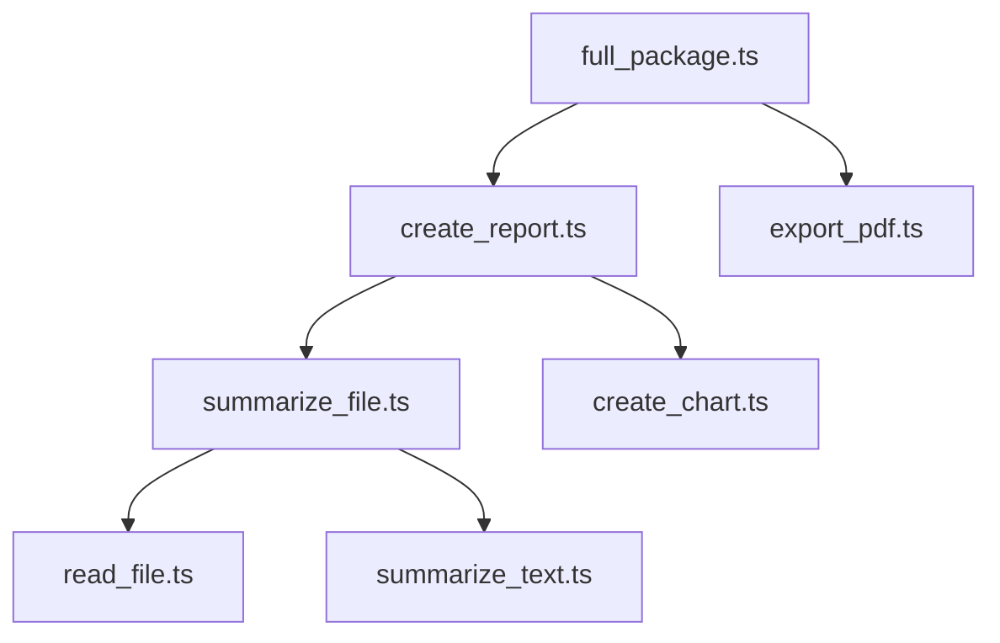
```mermaid
graph TB
    SkillA["summarize_file.ts"] --> Tool1["read_file.ts"]
    SkillA --> Tool2["summarize_text.ts"]
    SkillB["create_report.ts"] --> SkillA
    SkillB --> Tool3["create_chart.ts"]
    SkillC["full_package.ts"] --> SkillB
    SkillC --> Tool4["export_pdf.ts"]
```

Explanation:

· Skills are higher-order operations that compose tools and other skills into reusable workflows.
· summarize_file: A skill with two steps. First, it calls the read_file tool to get the file content. Then it calls the summarize_text tool (which may itself use the LLM to generate a summary). The skill returns the summary.
· create_report: Depends on summarize_file (a skill) and create_chart (a tool). It reads and summarizes a file, then generates a chart from the data. The final output is a report with text summary and chart image.
· full_package: The top-level skill that orchestrates create_report and export_pdf. It generates a complete report and exports it as a PDF.
· Dependency validation at startup: When the Registry is built at app initialization, it checks that every dependency referenced in a skill's steps array exists in either the Tools map or the Skills map. If a dependency is missing (e.g., export_pdf tool not found), the app throws an error at startup, preventing runtime failures.
· Circular dependency prevention: The Registry also checks for circular dependencies (Skill A depends on Skill B which depends on Skill A). If detected, the app throws a configuration error.
· Skills are executed sequentially. Each step's output is passed as input to the next step, forming a pipeline.

---

14. Tool Lifecycle

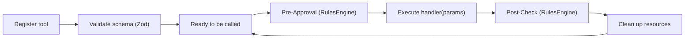
```mermaid
flowchart LR
    Register["Register tool"] --> Validate["Validate schema (Zod)"]
    Validate --> Idle["Ready to be called"]
    Idle --> PreExec["Pre-Approval (RulesEngine)"]
    PreExec --> Run["Execute handler(params)"]
    Run --> PostExec["Post-Check (RulesEngine)"]
    PostExec --> Cleanup["Clean up resources"]
    Cleanup --> Idle
```

Explanation:

· Every tool in the system goes through this lifecycle.
· Register: At app startup, all files in src/tools/ are dynamically imported. Each file exports a Tool object. The object is validated to ensure it has the required fields: name (string), description (string), parameters (Zod schema), handler (async function). If validation fails, the app throws an error.
· Validate: The Zod schema is checked for correctness. The schema defines the expected parameters for the tool. For example, read_file has a schema z.object({ path: z.string().min(1) }). This ensures type safety throughout the system.
· Idle: The tool is registered in the Registry's Map<string, Tool> and waits to be called.
· Pre-Approval: When the LLM requests this tool, the Rules Engine evaluates the call before execution. It checks mode rules (are tools allowed?), tool-specific rules (is the path in allowedPaths?), and safety rules (does the path contain PII?).
· Run: If approved, the handler function is called with the parameters. The handler is wrapped in a try-catch with timeout support. If the handler takes longer than the timeout (default 30 seconds, configurable in toolRules), it is aborted. The handler runs in a sandboxed environment where it cannot access the file system outside allowed paths, make network calls outside allowed domains, or execute system commands.
· Post-Check: The result is evaluated by the Rules Engine. Safety rules scan for PII or toxic content in the output. Tool-specific rules may validate the result format. If the result is modified (e.g., PII redacted), the modified version is returned.
· Cleanup: The tool's cleanup function (if defined) is called. This closes any open file handles, network connections, or temporary resources. The tool returns to the Idle state, ready for the next call.

---

15. Session Lifecycle & Memory Management

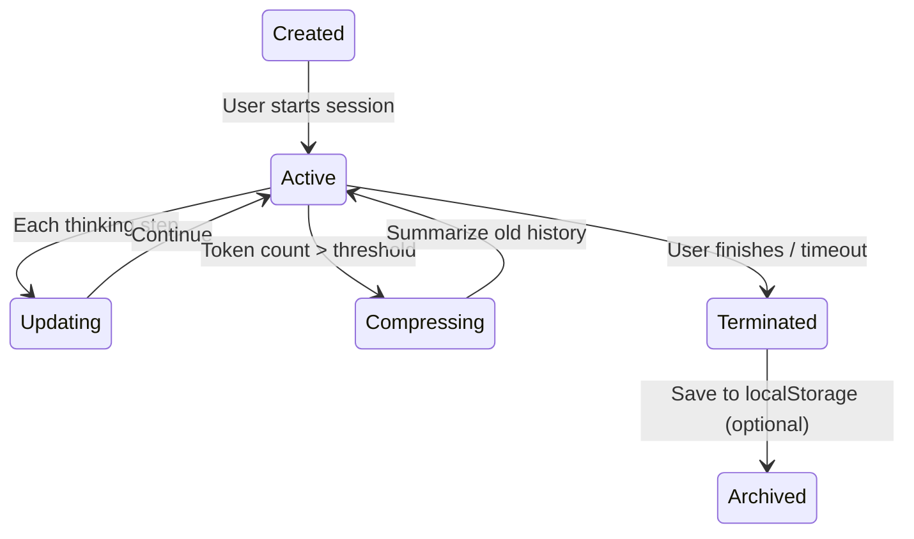
```mermaid
stateDiagram-v2
    Created --> Active: User starts session
    Active --> Updating: Each thinking step
    Updating --> Active: Continue
    Active --> Compressing: Token count > threshold
    Compressing --> Active: Summarize old history
    Active --> Terminated: User finishes / timeout
    Terminated --> Archived: Save to localStorage (optional)
```

Explanation:

· Each conversation follows this lifecycle, which governs memory optimization.
· Created: The conversation object is instantiated with a unique ID, default title, selected persona and mode, empty messages array, and empty thinkingSteps array. If globalRules.requireGreeting is true, a greeting is generated and added as the first message.
· Active: The user is interacting with this conversation. The Orchestrator processes inputs and generates responses.
· Updating: Each thinking step (in Expert mode) appends to the conversation's thinkingSteps array and to its messages array. The Zustand store is updated, and the UI re-renders.
· Compressing: The Orchestrator continuously monitors the total token count of the conversation's history using the tokenizer helper. When the token count exceeds a threshold (default 70% of tokenBudget, i.e., ~45875 tokens for a 65536 budget), the compression mechanism triggers. The oldest messages in the history (the first ~30% of the conversation) are sent to the LLM with a summarization prompt: "Summarize the following conversation history into 3-5 key points." The summary replaces the old messages, reducing the token count while preserving context. The compression is logged, and the conversation continues.
· Terminated: The conversation ends when the user navigates away, closes the tab, or a timeout (default 30 minutes of inactivity) triggers. At termination, the conversation's state is finalized.
· Archived: The conversation is saved to localStorage with a key like flowave_conversation_{id}. This enables session persistence — when the user reopens the app, all archived conversations are loaded back into the store, and the user can continue from where they left off.

---

16. Thinking Box Streaming Protocol

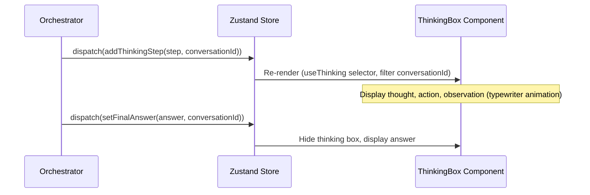
```mermaid
sequenceDiagram
    participant O as Orchestrator
    participant S as Zustand Store
    participant UI as ThinkingBox Component

    O->>S: dispatch(addThinkingStep(step, conversationId))
    S->>UI: Re-render (useThinking selector, filter conversationId)
    Note over UI: Display thought, action, observation (typewriter animation)
    O->>S: dispatch(setFinalAnswer(answer, conversationId))
    S->>UI: Hide thinking box, display answer
```

Explanation:

· This protocol defines how the Thinking Box UI receives and displays real-time reasoning from the LLM.
· Step dispatch: When the Orchestrator parses a new thinking step from the LLM's streaming response, it dispatches an addThinkingStep action to the Zustand store. The action payload includes the ThinkingStep object and the conversationId.
· Store update: The store appends the step to the thinkingSteps array of the specified conversation. If the step is an update to an existing step (e.g., adding an observation), the store finds the step by stepNumber and merges the new data.
· UI subscription: The useThinking hook uses a Zustand selector to subscribe to the thinkingSteps array of the currently active conversation. When the array changes (new step or updated step), the hook triggers a re-render of the ThinkingBox component.
· Rendering: The ThinkingBox component maps over the steps array and renders each one. Each step shows:
  · Step number badge (e.g., "Step 1")
  · Thought (with a brain icon, rendered with a typewriter effect — characters appear one by one with a 30ms delay)
  · Action (with a lightning bolt icon, showing the tool/skill name and parameters in a code block)
  · Observation (with an eye icon, showing the truncated result; expandable if too long)
· Animations: New steps fade in from the top. The typewriter effect is achieved by incrementally setting the text content character by character using setInterval or requestAnimationFrame. A blinking cursor is shown at the end of the text while it's being typed.
· Spinner: While a step is incomplete (thought and action present but no observation yet), a pulsing spinner is shown next to the action, indicating that the tool is executing.
· Final answer: When the Orchestrator dispatches setFinalAnswer, the store adds the answer as an assistant ChatMessage, clears the thinkingSteps array for that conversation, and sets isStreaming to false. The useThinking hook detects the empty array, and the ThinkingBox component hides itself with a slide-up animation. The final answer appears in the main chat panel.

---

17. Tool Parameter Validation

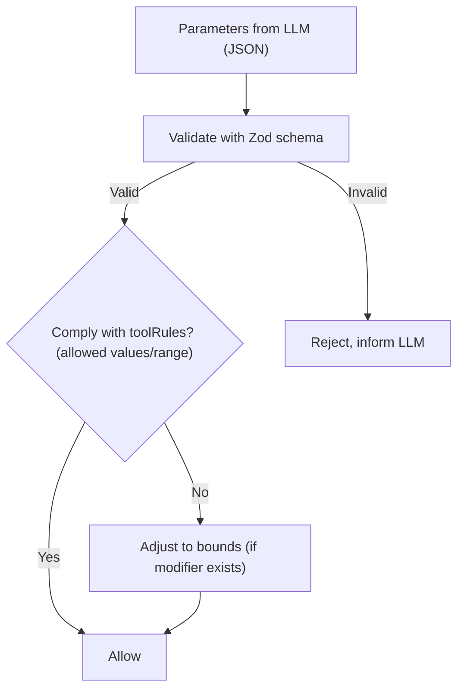
```mermaid
flowchart TD
    Param["Parameters from LLM (JSON)"] --> Validate["Validate with Zod schema"]
    Validate -->|Valid| CheckRule{"Comply with toolRules? (allowed values/range)"}
    CheckRule -->|No| Adjust["Adjust to bounds (if modifier exists)"]
    CheckRule -->|Yes| Allow["Allow"]
    Adjust --> Allow
    Validate -->|Invalid| Reject["Reject, inform LLM"]
```

Explanation:

· Parameter validation happens in two stages to ensure both structural correctness and business rule compliance.
· Stage 1 — Zod validation: The parameters received from the LLM (as a JSON object) are validated against the tool's Zod schema. The schema defines the expected shape, types, and basic constraints (e.g., path must be a non-empty string, operand must be a number). If the validation fails, the parameters are rejected outright. The Orchestrator sends feedback to the LLM: "Invalid parameters for tool 'calculator': expected { a: number, b: number, operation: string }, got { a: 'hello', b: 2 }." The LLM can then correct its call.
· Stage 2 — Tool rule checks: After passing Zod validation, the parameters are checked against the tool-specific rules in rules/tools.ts. These rules include:
  · allowedPaths: For file operations, restricts the paths that can be accessed.
  · allowedOperations: For calculator, restricts the operations to ["+", "-", "*", "/"].
  · maxOperand: Limits the size of numeric operands (e.g., 1,000,000).
  · rateLimit: Checks if the tool has been called too frequently.
· Adjustment: If a parameter is out of bounds but the tool rule defines a modifier (e.g., clamp: true for operands), the parameter is automatically adjusted to the nearest valid value. The adjusted value is logged, and execution proceeds with the modified parameters.
· Rejection: If no modifier exists or the violation is categorical (e.g., an invalid operation), the parameters are rejected, and the LLM is informed with a specific reason code.
· This two-stage validation ensures that tools never receive malformed or dangerous inputs, even if the LLM hallucinates incorrect parameters.

---

18. Safety Filter Cascade

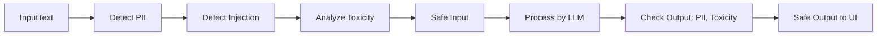
```mermaid
flowchart LR
    InputText --> PII["Detect PII"]
    PII --> Injection["Detect Injection"]
    Injection --> Toxicity["Analyze Toxicity"]
    Toxicity --> Safe["Safe Input"]
    Safe --> LLM_Process["Process by LLM"]
    LLM_Process --> OutputCheck["Check Output: PII, Toxicity"]
    OutputCheck --> SafeOutput["Safe Output to UI"]
```

Explanation:

· Every piece of content entering or leaving the LLM passes through this cascade of three safety filters.
· PII Detection: Uses regex patterns to detect personally identifiable information: email addresses ([a-zA-Z0-9._%+-]+@[a-zA-Z0-9.-]+\.[a-zA-Z]{2,}), phone numbers (Indonesian and international formats), credit card numbers (Luhn algorithm check), and KTP/NIK numbers (16-digit pattern). If PII is detected in input, the input is rejected with SAFETY_PII_DETECTED. If PII is detected in output, the matched text is replaced with [redacted] and the output is allowed through in modified form.
· Injection Detection: Scans for common prompt injection patterns: "ignore previous instructions", "ignore all prior prompts", "pretend you are", "you are now", "system prompt:", "developer note:", "override safety", "jailbreak". This uses a combination of regex and simple keyword matching. If an injection attempt is detected, the input is rejected with INJECTION_DETECTED. The LLM never sees the malicious input.
· Toxicity Analysis: Uses a lightweight toxicity classifier (could be a simple keyword-based model or a call to a local classifier) that returns a score from 0 to 1. The threshold for blocking is configurable in safety.ts (default 0.8 for input, 0.7 for output). If the toxicity score exceeds the threshold, the content is blocked.
· Output check: After the LLM generates a response, the same filters are applied again. PII is redacted, injection patterns in output are rare but checked, and toxicity is re-evaluated. Only content that passes all checks reaches the UI.
· This cascading approach ensures defense in depth: even if one filter misses something, the others provide backup protection.

---

19. Mode Transition Within a Conversation

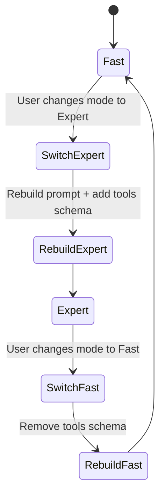
```mermaid
stateDiagram-v2
    [*] --> Fast
    Fast --> SwitchExpert: User changes mode to Expert
    SwitchExpert --> RebuildExpert: Rebuild prompt + add tools schema
    RebuildExpert --> Expert
    Expert --> SwitchFast: User changes mode to Fast
    SwitchFast --> RebuildFast: Remove tools schema
    RebuildFast --> Fast
```

Explanation:

· Users can switch between Fast and Expert mode at any time, even in the middle of a conversation.
· Fast → Expert: When the user toggles the mode to Expert, the Orchestrator marks the conversation's mode field as "expert". On the next user input, the prompt assembly includes the tool schemas and ReAct instructions. The existing conversation history is preserved. The LLM now has access to tools and can reason in multiple steps.
· Expert → Fast: When toggling back to Fast, the mode field is updated to "fast". On the next input, the prompt omits tool schemas and ReAct instructions. The conversation history (which may contain tool call results from previous Expert steps) is retained, but the LLM is instructed to respond directly without calling tools.
· Seamless transition: The user does not lose conversation context when switching modes. The history, including any data gathered by tools in Expert mode, remains available.
· UI feedback: The mode badge in the UI (e.g., "Fast" or "Expert") updates immediately. The input area may show or hide hints about tool availability.

---

20. Deployment & Communication (React TS + Ollama)

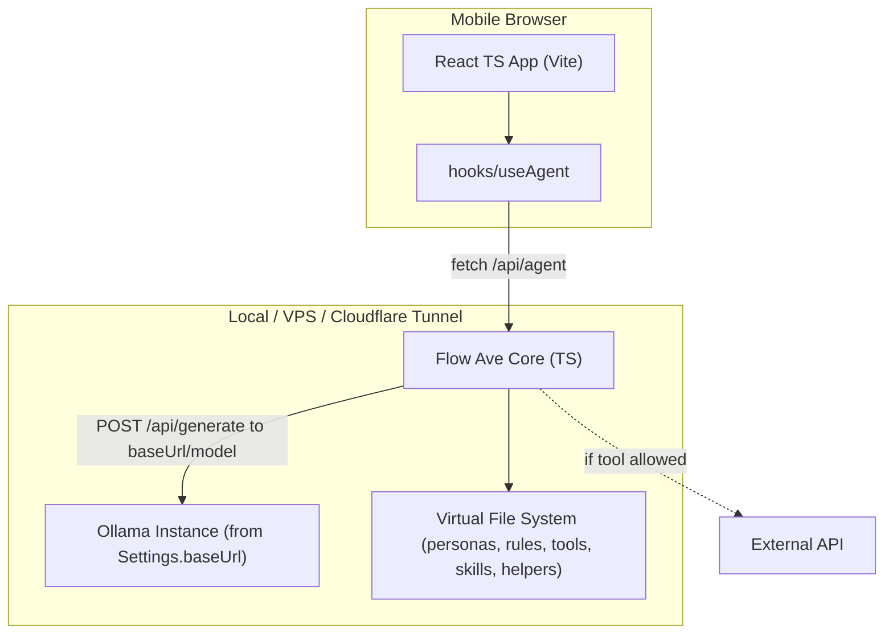
```mermaid
graph TB
    subgraph Browser["Mobile Browser"]
        UI["React TS App (Vite)"]
        Hook["hooks/useAgent"]
        UI --> Hook
    end
    subgraph Server["Local / VPS / Cloudflare Tunnel"]
        Core["Flow Ave Core (TS)"]
        Ollama["Ollama Instance (from Settings.baseUrl)"]
        Fs["Virtual File System (personas, rules, tools, skills, helpers)"]
    end
    Hook -->|fetch /api/agent| Core
    Core --> Fs
    Core -->|POST /api/generate to baseUrl/model| Ollama
    Core -.->|if tool allowed| ExtAPI["External API"]
```

Explanation:

· The system is designed to run with the React frontend in a mobile browser and the backend on a server (local machine, VPS, or exposed via Cloudflare Tunnel/ngrok).
· Browser: The React TypeScript app is built with Vite for fast development and optimized production builds. It communicates with the backend exclusively via HTTP fetch requests to the /api/agent endpoint. WebSocket support is optional for lower latency streaming.
· Server — Flow Ave Core: This is a Node.js or Deno server running the Orchestrator and all backend logic. It serves the React app's static files in production and exposes the /api/agent endpoint. The Core has access to the file system for loading personas, rules, tools, skills, and helpers.
· Server — Ollama Instance: Ollama runs separately (on the same machine, a VPS, or a remote server) and is accessed via its HTTP API. The base URL is configured by the user in Settings (e.g., http://localhost:11434 for local, https://vps.example.com for remote). The model name (nexusriot/qwen3.5-opus-distil:9b) is also configurable. The Ollama instance runs with the optimized environment variables: OLLAMA_NUM_CTX=65536, OLLAMA_FLASH_ATTENTION=1, OLLAMA_KV_CACHE_TYPE=q4_0, OLLAMA_KEEP_ALIVE=-1, OLLAMA_MAX_QUEUE=512.
· External APIs: Tools like web_search may call external APIs (e.g., DuckDuckGo, SerpAPI). These calls are made from the Core server, not from the browser. The Core only makes external calls if the tool is allowed by rules and the tool's rate limits are not exceeded.

---

21. App Initialization & Autoload Registry

```mermaid
flowchart TD
    AppStart["App Mount (React)"] --> InitStore["Init Zustand Store (conversations, settings default)"]
    InitStore --> LoadSettings["Load settings from localStorage (if any)"]
    LoadSettings --> ImportModules["Dynamic import all files in src/personas, rules, tools, skills, helpers"]
    ImportModules --> BuildRegistry["Build Registry: Map name to Tool/Skill"]
    BuildRegistry --> ValidateDependencies["Validate Skill Dependencies"]
    ValidateDependencies --> InitHooks["Initialize useAgent, useThinking, useConversations, useSettings"]
    InitHooks --> Ready["UI ready to receive input"]
```

Explanation:

· The initialization sequence ensures that all modules are loaded, validated, and ready before the user can interact with the app.
· App Mount: When the React application mounts (the root component renders), the initialization begins.
· Init Store: Zustand stores are created with default values. The sessionStore starts with an empty conversations map and no current conversation. The settingsStore starts with hardcoded defaults (e.g., ollamaBaseUrl: "http://localhost:11434", model: "nexusriot/qwen3.5-opus-distil:9b", all toggles true).
· Load Settings: The settings store checks localStorage for a previously saved settings object. If found, it overrides the defaults. This restores the user's preferences across sessions.
· Import Modules: Using Vite's import.meta.glob, all files in the personas/, rules/, tools/, skills/, and helpers/ folders are dynamically imported. This allows adding new personas, tools, skills, etc. by simply placing files in the respective folders — no code changes needed.
· Build Registry: The imported tools and skills are registered into Map<string, Tool> and Map<string, Skill>. Each entry is validated (Zod schema for tools, dependencies for skills). The personas are loaded into an array. The rules are loaded and passed to the Rules Engine.
· Validate Dependencies: Every skill's steps array is checked. For each step, the Registry looks up the name in both the Tools map and the Skills map. If a dependency is missing, an error is thrown with a clear message: "Skill 'create_report' depends on 'summarize_file', which is not registered."
· Init Hooks: The custom hooks (useAgent, useThinking, useConversations, useSettings) are initialized. They connect to the stores and expose their APIs to UI components.
· Ready: The UI transitions from a loading state to the main interface. If globalRules.requireGreeting is true and a default conversation was created, a greeting is generated and displayed. The user can now type and send messages.

---

22. Optimized Agent Memory (Detailed Structure & Flow)

```mermaid
graph TB
    subgraph MemoryComponents["Memory Components (per conversation)"]
        SystemPrompt["System Prompt (static)"]
        TaskState["Task State (current objective)"]
        FileContext["File Context (relevant files)"]
        ActionHistory["Action History (step summaries)"]
        WorkingMemory["Working Memory (variables)"]
        LongTermMemory["Long-term Memory (key facts)"]
    end

    Input["User Input (in conversation)"] --> TaskParser["Task Parser"]
    TaskParser --> ContextGatherer["Context Gatherer"]
    ContextGatherer --> FileContext
    ContextGatherer --> ActionHistory
    ContextGatherer --> LongTermMemory
    ContextGatherer --> Assembler["Prompt Assembler"]
    Assembler --> PrioritySort["Sort by relevance"]
    PrioritySort --> Truncate["Truncate if > token budget"]
    Truncate --> FinalPrompt["Final Prompt to LLM"]
    LLM["LLM Response"] --> MemoryUpdater["Memory Updater"]
    MemoryUpdater -->|Save new facts| LongTermMemory
    MemoryUpdater -->|Log step| ActionHistory
    MemoryUpdater -->|Update files| FileContext
```

Explanation:

· The Optimized Agent Memory system ensures the LLM always receives the most relevant context within the 65536-token budget.
· Six memory components:
  · SystemPrompt: Static, loaded from the active persona. Never truncated.
  · TaskState: A short string describing the current objective. Updated by the Task Parser when the user sends a new input.
  · FileContext: A list of files relevant to the current task. Files are scored by cosine similarity between the task embedding and file content embeddings (or file names). Only the top 5-10 files are included.
  · ActionHistory: Summaries of previous steps, not raw history. Each step is summarized into 1-2 sentences. The ActionHistory keeps the last 20 steps; older steps are compressed.
  · WorkingMemory: Temporary variables from tool outputs (e.g., "file content of data.csv is 100 rows with columns A, B, C"). This is ephemeral and cleared when the task completes.
  · LongTermMemory: Key facts extracted from the conversation that may be relevant later (e.g., "This project uses React 18", "User prefers Indonesian language"). Facts have a confidence score and are pruned if confidence drops below 0.5.
· Token budget allocation: System Prompt gets 15% (~9800 tokens), File Context gets 35% (~22900 tokens), ActionHistory gets 25% (~16300 tokens), and the output (LLM response) gets 25% (~16300 tokens).
· Compression trigger: When the total tokens exceed 70% of the budget (~45875 tokens), the oldest ActionHistory entries are sent to the LLM with a summarization prompt, reducing them to 3-5 bullet points.
· Memory updater: After each LLM response, the Memory Updater extracts new facts (via a small LLM call or heuristic), logs the action to ActionHistory, and updates FileContext if files were read or modified.

---

23. Prompt Template Structure (Model Settings Aware)

```mermaid
graph TB
    subgraph PromptStructure["Prompt Structure"]
        System["System: {persona.systemPrompt}"]
        RulesBlock["Rules: {modeRules + globalRules + safetyRules}"]
        ToolsBlock["Tools: JSON schema (only if Enable Tools ON)"]
        FormatBlock["Format: ReAct (if Enable Thinking ON, instructions added)"]
        Examples["Few-shot examples (2-3)"]
        ModelSpecific["Model-specific (Qwen3: thinking tag)"]
    end
    System --> Assembly["Prompt Assembly"]
    RulesBlock --> Assembly
    ToolsBlock --> Assembly
    FormatBlock --> Assembly
    Examples --> Assembly
    ModelSpecific --> Assembly
    Assembly --> FinalPrompt["Final Prompt"]
```

Explanation:

· The prompt sent to the LLM is assembled from six blocks, arranged in a specific order for maximum effectiveness.
· System: The system prompt from the active persona. For all personas, this includes: "You are Ave AI, a helpful and knowledgeable assistant. Your current persona is {persona.displayName}. {persona.toneInstruction}". This sets the identity and tone.
· RulesBlock: The active rules formatted as natural language constraints. Example: "You must follow these rules: (1) Do not disclose personal information. (2) Maximum 20 steps for complex tasks. (3) Always cite sources if using web search." This block is generated by the Rules Engine's formatRulesForPrompt() method.
· ToolsBlock: Only included if settings.enableTools is true and the mode is Expert. It contains the JSON schema for all registered tools in OpenAI function-calling format. Example: "You have access to the following tools: [ { name: 'read_file', description: 'Read a file from the filesystem', parameters: { path: string } }, ... ]". If enableTools is false, this block is omitted.
· FormatBlock: Included if settings.enableThinking is true. For Expert mode, it adds ReAct instructions: "Use the following format: Thought: your reasoning here. Action: tool_name({ parameters }). Observation: result of the action. Repeat until you have the final answer. Final Answer: your response." For Qwen3 models, a special instruction is added: "Before your final answer, include a reasoning section."
· Examples: 2-3 few-shot examples showing the LLM how to use the ReAct format correctly. These are static examples embedded in the Orchestrator, demonstrating a simple task (e.g., "Read a file and summarize it").
· ModelSpecific: Adjusts based on the detected model. For Qwen3 models (nexusriot/qwen3.5-opus-distil:9b), this block inserts the instruction: "You are a thinking model. Use 思考 and 回答 tags to separate reasoning from the final response, or use the ReAct Thought/Action/Observation format as instructed." This ensures the model's native thinking capabilities align with the expected format.
· The Assembly step concatenates all blocks with clear separators, resulting in the final prompt that is sent to Ollama.

---

24. TypeScript Core Type Definitions

```mermaid
graph LR
    subgraph Types["src/types/"]
        Persona["Persona { name, systemPrompt, displayName, toneInstruction, safetyRules }"]
        Tool["Tool { name, description, parameters: ZodSchema, handler: (params) => Promise<ToolResult> }"]
        Skill["Skill { name, description, steps: string[] }"]
        RuleSet["RuleSet { global, mode, tools, safety }"]
        ThinkingStep["ThinkingStep { stepNumber, thought, action?, actionInput?, observation?, timestamp, conversationId }"]
        ChatMessage["ChatMessage { id, role, content, timestamp, conversationId }"]
        Conversation["Conversation { id, title, personaId, mode, messages: ChatMessage[], thinkingSteps: ThinkingStep[], createdAt, updatedAt }"]
        Settings["Settings { ollamaBaseUrl, model, displayName, showProcessLog, showThinking, enableThinking, enableTools }"]
        RuleResult["RuleResult = { decision: 'Allow' | 'Modify' | 'Deny', reason?: string, modifiedData?: any }"]
        ToolResult["ToolResult = { success: boolean, data?: any, error?: string }"]
        AgentState["AgentState = { conversations: Record<string, Conversation>, currentConversationId: string | null, settings: Settings, isStreaming: boolean, error: string | null }"]
    end
```

Explanation:

· These TypeScript interfaces and types form the contract that all modules adhere to.
· Persona: Defines the personality configuration. name: internal identifier (e.g., "ave-prime"). systemPrompt: the core instruction that defines the AI's identity and behavior. displayName: the name shown in the UI (e.g., "Ave Prime"). toneInstruction: a short description of the speaking style. safetyRules: optional persona-specific safety overrides.
· Tool: Defines an atomic function. parameters uses Zod for runtime type validation. handler is an async function that returns a ToolResult.
· Skill: Defines a composite workflow. steps is an array of tool names or skill names that will be executed in order.
· RuleSet: The collection of all rule types. Used by the Rules Engine.
· ThinkingStep: Represents one step in the ReAct loop. thought is the LLM's reasoning, action is the tool/skill name, actionInput is the parameters object, observation is the result. timestamp allows sorting.
· ChatMessage: A single message in the conversation history. role is either "user" or "assistant".
· Conversation: Represents an entire conversation thread. Contains all messages and thinking steps, plus metadata.
· Settings: User preferences persisted to localStorage.
· RuleResult: Standardized return type from the Rules Engine.
· ToolResult: Standardized return type from tool handlers.
· AgentState: The full Zustand store shape, containing all conversations, settings, and UI state.

---

25. Concurrency & Abort Controller

```mermaid
flowchart TD
    UserInput["User sends input (with conversationId)"] --> AbortPrev{"Is thinking running in this conversation?"}
    AbortPrev -->|Yes| PrevAbort["Abort via AbortController"]
    AbortPrev -->|No| StartNew["Start new process"]
    PrevAbort --> StartNew
    StartNew --> CreateController["Create new AbortController"]
    CreateController --> ExecuteLoop["Run execution loop"]
    ExecuteLoop --> CheckAbort{"Aborted?"}
    CheckAbort -->|Yes| Cleanup["Stop, save cancelled status"]
    CheckAbort -->|No| Continue["Continue"]
```

Explanation:

· This mechanism prevents race conditions when the user rapidly sends multiple messages or clicks Stop.
· Per-conversation AbortController: The Zustand store maintains a Map<conversationId, AbortController>. When a new input is processed for a conversation, the Orchestrator checks this map.
· Abort previous: If an AbortController already exists for that conversation, it means a previous request is still being processed. The controller's abort() method is called, which triggers the abort signal on the fetch request to Ollama. This cancels the streaming response.
· Start new: A new AbortController is created and stored in the map. It is passed to the fetch call (fetch(url, { signal: controller.signal })).
· During execution: The Orchestrator periodically checks controller.signal.aborted. If true, it stops processing, saves a cancelled status to the store, and cleans up partial data (any incomplete thinking steps are removed, but completed messages are kept).
· User presses Stop: The Stop button in the UI dispatches a STOP_RESPONSE action, which calls abort() on the active controller for the conversation.
· UI feedback: When a response is cancelled, the UI shows a message: "Response cancelled." The conversation history up to the cancellation point is preserved.

---

26. Tool Result Cache

```mermaid
flowchart TD
    Call["Tool called"] --> CacheCheck{"Cached? (toolName + hash(params))"}
    CacheCheck -->|Yes & not expired| ReturnCache["Return cached result"]
    CacheCheck -->|No| Execute["Execute tool"]
    Execute --> SaveCache["Save to cache (TTL from toolRules)"]
    SaveCache --> ReturnResult["Return result"]
```

Explanation:

· To avoid redundant external API calls or file reads, the system caches tool results.
· Cache key: A string composed of toolName + ":" + hash(JSON.stringify(params)). The hash is a fast, deterministic hash function (e.g., SHA-256 truncated to 16 characters).
· Cache storage: An in-memory Map<string, { result: ToolResult, timestamp: number }> in helpers/cache.ts. The cache is per-session and is cleared when the conversation ends or a new conversation starts.
· TTL: Each tool can define a cacheTTL in milliseconds in its ToolRule. For example, read_file might have a TTL of 30 seconds (the file might change, but 30 seconds is safe for most cases), while web_search might have a TTL of 5 minutes.
· Cache hit: If the key exists and the current time minus timestamp is less than the TTL, the cached result is returned immediately. No tool execution occurs.
· Cache miss: The tool is executed normally. If the execution is successful, the result is saved to the cache along with the current timestamp.
· Opt-out: Tools can set cacheTTL: 0 in their rule set to disable caching entirely.

---

27. Rate Limiting for External Tools

```mermaid
flowchart TD
    PreCall["External tool called"] --> RateCheck{"Rate limit reached? (toolRules.rateLimit)"}
    RateCheck -->|Yes| Queue["Queue (OLLAMA_MAX_QUEUE=512)"]
    RateCheck -->|No| Execute["Call tool"]
    Queue --> Wait["Wait for slot"]
    Wait --> Execute
    Execute --> Log["Log timestamp"]
```

Explanation:

· External tools (especially those calling third-party APIs) are rate-limited to prevent abuse and stay within API limits.
· Rate limit configuration: Each tool can define rateLimit (max calls) and rateWindowMs (time window in milliseconds) in its ToolRule. For example, web_search might have rateLimit: 10, rateWindowMs: 60000 (10 calls per minute).
· Sliding window: The Rate Limiter maintains a queue of timestamps for each tool. When a call is requested, it checks how many timestamps in the queue fall within the current time window. If the count exceeds the rate limit, the call is queued.
· Queue: Calls that exceed the rate limit are placed in a queue. The maximum queue size is defined by the environment variable OLLAMA_MAX_QUEUE=512. When a slot opens (a previous call's timestamp falls outside the window), the next call in the queue is dequeued and executed.
· Logging: Each successful call logs its timestamp to the sliding window queue.
· User awareness: If a tool is rate-limited, this information is fed back to the LLM so it can adjust its strategy (e.g., "Tool 'web_search' will be available in 15 seconds. You can wait or try an alternative.").

---

28. Security Hardening (CSP & XSS Prevention)

```mermaid
flowchart TD
    Response["LLM Output"] --> Sanitize["Sanitize HTML (DOMPurify)"]
    Sanitize --> CSP["Apply Content-Security-Policy header"]
    CSP --> Render["Render in React (auto-escape)"]
    Input["User Input"] --> CSRF["Validate CSRF token"]
    CSRF --> API["Send to API"]
```

Explanation:

· Multiple layers of security protect against common web vulnerabilities.
· DOMPurify: All output from the LLM (which could theoretically contain malicious HTML or scripts) is passed through DOMPurify. This library removes any HTML tags, attributes, or JavaScript that could execute in the browser. Only safe, plain text remains.
· Content-Security-Policy: The server sends a CSP header with every response: Content-Security-Policy: default-src 'self'; script-src 'self'; style-src 'self' 'unsafe-inline'; connect-src 'self' {settings.ollamaBaseUrl}. This prevents the browser from loading scripts from untrusted sources, mitigating XSS attacks even if DOMPurify fails.
· React auto-escaping: React by default escapes all string interpolations in JSX. Even if unsanitized content accidentally reaches a component, React renders it as plain text, not HTML.
· CSRF protection: For state-changing requests (e.g., updating settings), the server requires a CSRF token. The token is generated server-side, stored in a secure, HttpOnly cookie, and must be included as a custom header (X-CSRF-Token) in every request. The token is validated on the server before processing.
· Input validation: All user input is validated on both client and server sides. Input length is limited (max 10000 characters). Special characters are allowed but handled safely by the sanitizer.

---

29. Offline Detection & Queue (PWA)

```mermaid
flowchart TD
    OnlineCheck{"navigator.onLine?"} -->|Online| Direct["Send directly to server"]
    OnlineCheck -->|Offline| Queue["Save to queue (localStorage/IndexedDB)"]
    Queue --> Listen["Listen for 'online' event"]
    Listen --> Flush["Send all queued requests"]
    Flush --> Direct
```

Explanation:

· The PWA gracefully handles offline scenarios on mobile devices.
· Online detection: The app monitors navigator.onLine and listens for online/offline events on the window object. The current status is displayed in the UI (a small indicator in the header).
· Offline queue: When the user is offline and sends a message, the input is saved to a queue in IndexedDB (a persistent, structured storage that works offline). The queue entry includes the input text, conversation ID, timestamp, and any metadata.
· UI feedback: The UI shows a "Message queued" indicator. The message appears in the chat with a small clock icon and greyed-out styling to indicate it hasn't been sent yet.
· Reconnection: When the online event fires, the service worker triggers the queue flush. All queued messages are sent to the server in order. As each message is successfully sent and receives a response, the greyed-out message is replaced with the normal sent message and the AI's response appears.
· Failures during flush: If a queued message fails to send after reconnection, it remains in the queue and is retried on the next online event.

---

30. Service Worker & PWA Manifest Initialization

```mermaid
graph TB
    IndexHTML["index.html"] --> Manifest["manifest.json (PWA)"]
    IndexHTML --> SW_Register["Register Service Worker"]
    SW_Register --> SW_File["sw.js"]
    SW_File --> CacheStrategy["Cache-First for static, Network-First for API"]
```

Explanation:

· The app is a fully installable Progressive Web App (PWA) for mobile.
· manifest.json: Defines the app's name ("Flow Ave AI"), short name, icons (multiple sizes for different devices), start URL, display mode ("standalone" — looks like a native app), theme color, and background color. This allows the app to be added to the home screen.
· Service Worker registration: In index.html, a script registers the service worker (sw.js). The registration is checked for success and updates.
· sw.js: The service worker implements two caching strategies:
  · Cache-First for static assets: HTML, CSS, JS, fonts, and icons are cached on the first visit. Subsequent visits load these instantly from the cache. The cache is updated in the background when a new version is detected.
  · Network-First for API calls: API requests (to /api/agent and Ollama) try the network first. If the network is unavailable, the request is handled by the offline queue mechanism (Diagram 29).
· Install prompt: The browser's "Add to Home Screen" prompt is shown when the user meets engagement criteria. The PWA provides a native-like experience with offline support.

---

31. Settings Flow: Load, Edit, Save, Test Connection

```mermaid
flowchart TD
    S1["Settings component opened"] --> S2["Get settings from store (default or localStorage)"]
    S2 --> S3["Display form: Base URL, Model, Display Name, Toggles"]
    S3 --> S4{"User clicks Test Connection?"}
    S4 -->|Yes| S5["POST /api/test to base URL + model (Ollama /api/tags)"]
    S5 --> S6{"Response OK?"}
    S6 -->|Yes| S7["Show 'Connected' and available models"]
    S6 -->|No| S8["Show error message"]
    S3 --> S9{"User edits values?"}
    S9 -->|Yes| S10["Update local state"]
    S9 -->|No| S11{"User clicks Save?"}
    S11 -->|Yes| S12["Validate input"]
    S12 -->|Valid| S13["Save to store and localStorage"]
    S13 --> S14["Close Settings"]
    S12 -->|Invalid| S15["Show validation error"]
    S15 --> S3
```

Explanation:

· The Settings panel provides full configuration of the Ollama connection and UI preferences.
· Load: When the Settings modal/page is opened, it reads the current settings from the Zustand settingsStore. This store may have been initialized from localStorage if settings were previously saved.
· Form display: The form shows five fields:
  1. Ollama Base URL (text input, e.g., https://compaq-palace-dave-mary.trycloud.com)
  2. Model (dropdown populated by fetching /api/tags, with an option to manually type a model name and click "+" to add)
  3. Display Name (text input, default "you")
  4. Toggle switches for Show process log, Show thinking, Enable thinking, Enable tools
· Test Connection: When clicked, the app sends a GET request to {baseURL}/api/tags. If the response is a JSON array of model objects, the connection is successful. A green "Connected" message appears, and the model dropdown is populated with the available models. If the request fails (network error, invalid URL), a red error message is shown with details.
· Edit: Changes to the form update a local state copy, not the global store directly. This prevents accidental changes from taking effect before Save.
· Save: Validates the form: URL must be a valid HTTP/HTTPS URL, model must not be empty, display name must not be empty. If valid, the settings are saved to the Zustand store (which updates the Orchestrator's behavior immediately) and persisted to localStorage. The modal closes.
· Invalid: If validation fails, inline error messages appear under the offending fields.

---

32. Conversation Management: New, Switch, Delete

```mermaid
stateDiagram-v2
    [*] --> ConversationList
    ConversationList --> NewConversation: User clicks "New Chat"
    NewConversation --> CreateID: Create unique ID, default title
    CreateID --> SetActive: Set as currentConversation
    SetActive --> ConversationActive
    ConversationActive --> SwitchConversation: User clicks another chat
    SwitchConversation --> SetActive: Change currentConversation
    ConversationActive --> DeleteConversation: User deletes chat
    DeleteConversation --> Remove: Remove from store, switch to nearest chat
    Remove --> ConversationActive
    ConversationActive --> ConversationList: Return to list
```

Explanation:

· The sidebar manages the full lifecycle of conversations.
· ConversationList: The default view showing all conversations sorted by updatedAt descending. Each item shows the title, a snippet of the last message, and the time. A "New Chat" button is at the top.
· NewConversation: On click, a new Conversation object is created with id: crypto.randomUUID(), title: "New Chat", personaId: currentPersona, mode: currentMode, empty messages and thinkingSteps, and createdAt/updatedAt: Date.now(). The conversation is added to the store's conversations map, and currentConversationId is set to the new ID.
· SetActive: The UI switches to show this conversation. If globalRules.requireGreeting is true, a greeting is generated.
· SwitchConversation: Clicking an existing conversation sets currentConversationId to that conversation's ID. The UI renders that conversation's full history.
· DeleteConversation: A delete button (with confirmation dialog) removes the conversation from the conversations map in the store. If the deleted conversation was the active one, currentConversationId is set to the most recent remaining conversation (or null if none). The deleted conversation is also removed from localStorage.
· Title updates: When the first user message is sent, the conversation title is updated from "New Chat" to the first 30 characters of the user's message, providing a meaningful title automatically.

---

33. Chat History: Storage and Retrieval per Conversation

```mermaid
flowchart LR
    Send["User sends message"] --> AddUserMsg["Add ChatMessage role:user to conversation"]
    AddUserMsg --> Process["Orchestrator processes (see Execution Loop)"]
    Process --> AddAssistantMsg["Add ChatMessage role:assistant to conversation"]
    AddAssistantMsg --> RenderHistory["Re-render chat list in UI"]
    LoadOld["User opens old chat"] --> Retrieve["Get conversation by ID from store"]
    Retrieve --> RenderHistory
```

Explanation:

· Chat history is the core user-visible data, and its management is crucial.
· Sending: When the user sends a message, a ChatMessage object is immediately created with role: "user", content: inputText, timestamp: Date.now(), and conversationId. This is added to the conversation's messages array in the store. The UI shows the message instantly (optimistic update).
· Processing: The Orchestrator picks up the input and processes it. During processing, thinking steps are added to the conversation's thinkingSteps array.
· Adding response: When the Orchestrator finishes, it creates a ChatMessage with role: "assistant", content: finalAnswer, and adds it to the messages array. The UI re-renders to show the new message.
· Rendering: The ChatPanel component subscribes to the active conversation's messages array via a Zustand selector. Each message is rendered in a chat bubble (user messages on the right, assistant on the left) with timestamps and optional action buttons (Copy, Retry, Edit).
· Loading old chats: When switching conversations, the selector retrieves that conversation's messages array from the store. The entire history is rendered without any API calls — it's all client-side.
· Persistence: Conversations (including all messages) are saved to localStorage on every update (debounced to avoid excessive writes). On app reload, all conversations are restored from localStorage.

---

34. Effect of Settings "Show Process Log" and "Show Thinking" on UI

```mermaid
flowchart TD
    ThinkingGenerated["New thinking step"] --> CheckShowThinking{"Settings.showThinking?"}
    CheckShowThinking -->|Yes| RenderThinking["Display in Thinking Box"]
    CheckShowThinking -->|No| HiddenThinking["Save to store, don't render"]
    ProcessLogGenerated["Process log (tool calls, errors)"] --> CheckShowLog{"Settings.showProcessLog?"}
    CheckShowLog -->|Yes| RenderLog["Add to log panel in UI"]
    CheckShowLog -->|No| HiddenLog["Skip rendering"]
```

Explanation:

· These two settings give users granular control over what debug/process information is visible.
· Show Thinking:
  · When true: Every time a ThinkingStep is added or updated in the store, the ThinkingBox component renders it. The user sees the AI's reasoning, tool calls, and observations in real time. This transparency helps users understand how the AI arrived at its answer, and it looks impressive.
  · When false: The useThinking hook returns an empty array (or the ThinkingBox component is not rendered at all). The thinking steps are still saved in the store for potential review (e.g., an expandable "View reasoning" link after the answer), but they do not appear during the conversation. This provides a cleaner, faster-feeling experience for users who don't want the details.
· Show Process Log:
  · When true: A collapsible panel (often at the bottom or side of the screen) shows a running log of all tool executions, rule evaluations, errors, and other system events. Each log entry is timestamped and color-coded (green for success, red for errors, yellow for warnings/denials). This is valuable for debugging and for users who want full transparency.
  · When false: The log is not rendered, saving screen space. The log data is still stored in the Zustand store (in conversation.processLog) and can be viewed by toggling the setting back on.
· Both settings default to true for power users but can be turned off for a simpler experience.

---

35. Model Selection: Refresh Model List from Ollama

```mermaid
flowchart TD
    FetchModels["User clicks Refresh or opens Settings"] --> CallOllama["GET /api/tags to base URL"]
    CallOllama --> ParseModels["Parse JSON, get model list"]
    ParseModels --> UpdateStore["Save model list to store/settings"]
    UpdateStore --> RenderDropdown["Display model dropdown in Settings"]
    UserSelect["User selects model from dropdown"] --> SetModel["Update settings.model"]
    SetModel --> SaveSettings["Save to store and localStorage"]
```

Explanation:

· The app dynamically fetches available models from the configured Ollama instance.
· Fetch triggered by: Opening the Settings panel, or clicking a "Refresh" button next to the model dropdown.
· API call: A GET request is sent to {settings.ollamaBaseUrl}/api/tags. This returns a JSON object with a models array, each entry having name, modified_at, size, and details fields.
· Parsing: The response is validated to ensure it's the expected format. The model names are extracted (e.g., nexusriot/qwen3.5-opus-distil:9b, llama3.2:latest).
· Store update: The list is saved to settingsStore.availableModels. If the current settings.model is not in this list, it's kept but marked as "not found" (with a warning icon).
· Dropdown: The model dropdown displays all fetched models with their sizes and modification dates. The currently selected model is highlighted.
· Manual add: The user can type a model name not in the list into a text box and click "+". This adds the name to a custom models list in settingsStore.customModels and selects it. The next time the conversation runs, Ollama will attempt to pull the model if it's not already downloaded.
· Save: Selecting a model updates settings.model and saves to localStorage. The Orchestrator uses this model for all subsequent calls.

---

36. Cancel / Stop Response

```mermaid
flowchart TD
    UserPressStop["User presses Stop button in UI"] --> DispatchStop["dispatch(STOP_RESPONSE, conversationId)"]
    DispatchStop --> CheckRunning{"Is thinking running in this conversation?"}
    CheckRunning -->|Yes| AbortController["Call AbortController for this conversation"]
    AbortController --> MarkCancelled["Set thinking status to 'cancelled' in store"]
    MarkCancelled --> RemovePartial["Remove incomplete thinking steps"]
    RemovePartial --> NotifyUI["UI: show 'Cancelled', keep completed history"]
    CheckRunning -->|No| Ignore["Ignore"]
```

Explanation:

· The Stop button gives the user full control to abort an in-progress AI response at any time.
· Trigger: A Stop button (square icon) appears in the input area only when isStreaming is true for the active conversation.
· Dispatch: Clicking it dispatches a STOP_RESPONSE action with the conversationId.
· AbortController: The Orchestrator retrieves the AbortController for that conversation (stored during execution start) and calls controller.abort(). This signals the fetch request to Ollama to cancel. The streaming response stops.
· Mark cancelled: The Zustand store updates the conversation's status field to 'cancelled' and sets isStreaming to false.
· Remove partial: Any ThinkingStep objects that were added but not yet completed (i.e., have no observation) are removed from the thinkingSteps array. Completed steps remain.
· UI notification: The chat shows a system message: "Response cancelled by user." The input area returns to normal (Stop button replaced by Send button). The partial conversation is preserved — any complete messages before cancellation remain visible.
· No action if idle: If the Stop button is somehow triggered when no response is running, the action is ignored.

---

37. Copy Message

```mermaid
flowchart TD
    UserClickCopy["User clicks Copy icon on message bubble"] --> GetMsgContent["Get ChatMessage content"]
    GetMsgContent --> Clipboard["navigator.clipboard.writeText(content)"]
    Clipboard --> SuccessCheck{"Success?"}
    SuccessCheck -->|Yes| VisualFeedback["Show toast 'Copied!'"]
    SuccessCheck -->|No| ErrorFeedback["Show toast 'Failed to copy'"]
```

Explanation:

· A simple but essential feature for copying AI responses or user messages.
· Trigger: Each chat bubble has a small Copy icon (overlapping squares) that appears on hover or is always visible on mobile (via a context menu or long-press).
· Get content: The click handler extracts the message's content string. Plain text is copied, not Markdown formatting.
· Clipboard API: Uses the modern asynchronous Clipboard API (navigator.clipboard.writeText()). This returns a Promise.
· Success feedback: If the Promise resolves, a small toast notification appears near the message: "✓ Copied!" The toast auto-dismisses after 2 seconds.
· Error feedback: If the Promise rejects (e.g., user denied clipboard permission on a non-HTTPS context, or the API is unavailable), a toast shows "Failed to copy. Try selecting the text manually."
· Fallback: On browsers that don't support the Clipboard API, a fallback uses a hidden textarea element to select and copy the text.

---

38. Retry Message

```mermaid
flowchart TD
    UserClickRetry["User clicks Retry icon on assistant message"] --> ExtractMsg["Get the last user message content"]
    ExtractMsg --> ReDispatch["dispatch(USER_INPUT, { content, conversationId })"]
    ReDispatch --> StartProcessing["Orchestrator reprocesses the input"]
```

Explanation:

· Retry allows the user to regenerate the AI's response without retyping their question.
· Trigger: A Retry icon (circular arrow) appears on assistant messages. Optionally, also on user messages if the response was unsatisfactory.
· Extract message: The system finds the last ChatMessage with role: "user" in the current conversation. This is the message that prompted the assistant's response.
· Cleanup before resend: Before resending, the Orchestrator removes the assistant's response message and all thinking steps associated with the current response from the conversation. This prevents duplicate entries and confusion.
· Re-dispatch: A new USER_INPUT action is dispatched with the exact same content and conversationId. The Orchestrator processes it as if it were a new input.
· Processing: The full execution loop runs again. The LLM may give a different response (due to the non-deterministic nature of LLMs or because context has changed).
· UI: The old assistant message is removed from the chat, and the new response appears as it's generated.

---

39. Edit & Resend Message

```mermaid
flowchart TD
    UserClickEdit["User clicks Edit icon on user message"] --> EditMode["Activate edit mode on that message bubble"]
    EditMode --> UserFix["User modifies text"]
    UserFix --> ConfirmEdit["User presses 'Resend'"]
    ConfirmEdit --> UpdateMsg["Update user ChatMessage in store with new text"]
    UpdateMsg --> DeleteHistoryAfter["Delete all messages and thinking steps after edited message"]
    DeleteHistoryAfter --> ReDispatch["dispatch(USER_INPUT, { content: newText, conversationId, edit: true })"]
    ReDispatch --> StartProcessing["Orchestrator processes from edit point"]
```

Explanation:

· Edit & Resend lets the user correct a typo or rephrase their question and get a fresh response, without losing the conversation history before the edit point.
· Trigger: An Edit icon (pencil) appears on user messages.
· Edit mode: Clicking it transforms the message bubble into an editable text area. The original text is pre-filled. The user can modify it freely. The Send button changes to "Resend".
· Confirm: Pressing "Resend" (or Enter, or clicking outside) confirms the edit.
· Update store: The original user ChatMessage's content is updated with the new text in the store.
· Delete subsequent history: All ChatMessage and ThinkingStep objects after the edited message are removed from the conversation. This is because the old response was based on the old message and is no longer valid. Deleting subsequent history ensures the conversation context remains consistent.
· Re-dispatch: A USER_INPUT action is dispatched with the new text and a flag edit: true. The Orchestrator processes it normally, but the edit flag is logged for analytics.
· Result: The conversation appears as if the user had originally sent the corrected message. The AI's new response appears after the edited message.
· Irreversibility: The old response is permanently deleted (not recoverable via Undo in the current version). A future enhancement could add a "soft delete" with undo.

---

40. Qwen3 Thinking & Vision Integration

```mermaid
flowchart TD
    ModelCheck["At Orchestrator initialization"] --> DetectModel["Detect model from Settings.model"]
    DetectModel --> IsQwen{"Is model Qwen3?"}
    IsQwen -->|Yes| SetThinkingFormat["Set thinkingFormat: 'qwen3'"]
    IsQwen -->|No| SetDefault["Use default (no special thinking format)"]
    SetThinkingFormat --> PromptAdjust["Insert special instruction: 'Use reasoning before final answer'"]
    PromptAdjust --> EnableVision{"Does model support vision? (Qwen3.5-opus: yes)"}
    EnableVision -->|Yes| IncludeVision["Include image upload capability in Tools block if needed"]
    IncludeVision --> Finished
    EnableVision -->|No| Finished
    SetDefault --> Finished
```

Explanation:

· This integration ensures the specific capabilities of the nexusriot/qwen3.5-opus-distil:9b model are utilized correctly.
· Model detection: At startup (and whenever settings change), the Orchestrator checks settings.model. If the model name contains "qwen", it flags the model as a Qwen variant.
· Qwen3 thinking: Qwen3 models are trained with a structured reasoning capability. To leverage this, the PromptAdjust step inserts an instruction into the ModelSpecific block of the prompt (see Diagram 23): "You are a thinking-capable model. Before providing your final answer, reason through the problem step by step. You may use the ReAct Thought/Action/Observation format as instructed." This aligns Qwen3's native reasoning with the ReAct loop used by the system.
· Vision capability: Qwen3.5-opus-distil supports vision (image understanding). The IncludeVision step modifies the ToolsBlock (if enableTools is true) to include a virtual tool read_image or to describe that the model can accept image inputs directly. When a user uploads an image in the UI, it is base64-encoded and included in the prompt as per Ollama's multimodal API format. The model can then describe or analyze the image.
· Default fallback: For non-Qwen models (e.g., Llama, Mistral), the thinking format defaults to the standard ReAct instructions without Qwen-specific tags. Vision support is not included unless detected.
· seamless: The user does not need to manually configure model capabilities. The system detects and adapts automatically.

---

41. Global Rules: Greeting at Conversation Start

```mermaid
flowchart TD
    NewConversationCreated["New conversation created"] --> GreetingRule{"requireGreeting? (global.ts)"}
    GreetingRule -->|Yes| AutoGreet["Orchestrator generates greeting via LLM"]
    AutoGreet --> SaveAsMessage["Save as assistant ChatMessage"]
    SaveAsMessage --> UserPrompt["User can reply immediately"]
    GreetingRule -->|No| NoGreeting["Straight to user input"]
```

Explanation:

· This rule ensures that every new conversation starts with a friendly, consistent introduction from Ave AI.
· Rule definition: In rules/global.ts, requireGreeting: true and greetingPrompt: "You are starting a new conversation. Introduce yourself as Ave AI in 2-3 sentences. Mention your name, that you're here to help, and list 3-5 things you can assist with. Keep it warm and concise." The greetingPrompt is configurable but defaults to something friendly.
· Trigger: When a new conversation is created (either automatically on first launch, or when the user clicks "New Chat"), and after the conversation is set as active, the Orchestrator checks requireGreeting.
· Auto-generate: If true, the Orchestrator sends the greetingPrompt to the LLM as a standalone request. This is a simplified call: no tool schemas, no conversation history, no rules beyond safety. It's essentially a Fast mode call with a specific system prompt.
· Save: The LLM's response is saved as the first ChatMessage in the conversation, with role: "assistant". It has a special flag isGreeting: true so the UI can optionally style it differently (e.g., a slightly different background color or a "Welcome" header).
· Not counted: The greeting call does not increment the iteration count and does not trigger pre- or post-checks beyond safety. It's a one-time, fire-and-forget operation.
· User interaction: After the greeting appears, the input field is enabled, and the user can immediately type their first question. The greeting is part of the conversation history, so the LLM's subsequent responses are aware that it has already introduced itself.
· If false: If the setting is turned off, no greeting is generated. The conversation starts with an empty chat panel, and the input field is ready.

---

42. Persona System Prompt: Ave AI Identity

```mermaid
graph TB
    subgraph PersonaFile["personas/*.ts"]
        SystemPrompt["systemPrompt: 'You are Ave AI...'"]
        DisplayName["displayName: 'Ave Prime'"]
        Tone["toneInstruction: 'Balanced conversational style...'"]
    end
    SystemPrompt --> Identity["Determines name 'Ave AI'"]
    DisplayName --> UILabel["Displayed in UI"]
    Tone --> Behavior["Influences language style"]
```

Explanation:

· This diagram clarifies the separation between the AI's core identity ("Ave AI") and the persona's display characteristics.
· systemPrompt: This is the most critical field in any persona file. It ALWAYS contains the sentence: "You are Ave AI" as the opening. This hardcodes the AI's name into its identity, regardless of which persona is active. The rest of the system prompt describes the persona's behavior. Example for "Ave Prime": "You are Ave AI. You are balanced, naturally helpful, and adaptable. You communicate clearly and warmly." Example for "Architect": "You are Ave AI. You are systematic, precise, and technically detailed. You structure your responses with clear logic."
· displayName: This is purely for the UI. It's shown in the persona selector dropdown and in the current persona indicator. Examples: "Ave Prime", "Muse", "Architect", "Diplomat", "Sage", "Maverick". This field does NOT affect the AI's name or how it refers to itself; it only labels the persona for the user.
· toneInstruction: A short, structured description of the speaking style. This is included in the system prompt to guide the AI's language. Examples: "Balanced and naturally helpful", "Creative, vivid, and full of unexpected connections", "Systematic, precise, and technical".
· Why the AI is always "Ave AI": By hardcoding "You are Ave AI" in every system prompt, the AI consistently identifies as Ave AI. When asked "What is your name?", it will always answer "I'm Ave AI" (possibly followed by "in Ave Prime mode" or similar). The persona changes the how of communication, not the who.
· Adding new personas: To add a new persona, create a new file in personas/ that exports a Persona object with systemPrompt starting with "You are Ave AI", a unique displayName, and a toneInstruction. The system will auto-load it at startup. No other code changes needed.

---

43. Model Loading & Warm-up

```mermaid
flowchart TD
    Start["Conversation starts (first input)"] --> Check{"Model already loaded? (store)"}
    Check -->|Yes| Ready["Send request to Ollama immediately"]
    Check -->|No| ShowLoading["Show UI: 'Loading model...'"]
    ShowLoading --> WarmUp["POST /api/generate with minimal prompt"]
    WarmUp --> Response{"Ollama responds?"}
    Response -->|Yes| SetReady["Hide loading, store: modelReady = true"]
    SetReady --> Ready
    Response -->|Timeout / model missing| Error["Show error: 'Model not available. Pull?'"]
    Error --> Choice{"User chooses Pull?"}
    Choice -->|Yes| Pull["Run pull via Ollama API (stream progress)"]
    Pull --> WarmUp
    Choice -->|No| Idle["Return UI to idle"]
```

Explanation:

· Before the first inference, the app checks if the selected model is already loaded in Ollama's memory (flag modelReady in settings store).
· If not loaded, a warm-up request (a minimal prompt) is sent to force Ollama to load the model. A loading spinner with "Loading model..." is displayed to the user.
· If the model is missing entirely (not pulled), an error message offers to pull it. Pull progress is streamed in real time.
· Once loaded, the flag is set, and subsequent requests skip warm-up.

---

44. Graceful Shutdown & Cleanup

```mermaid
flowchart TD
    Event["Tab close / Page unload"] --> SaveState["Persist current conversation to localStorage"]
    SaveState --> AbortAll["Abort all active AbortControllers"]
    AbortAll --> ClearTimers["Clear any pending timeouts/intervals"]
    ClearTimers --> Log["Optional: send final telemetry ping"]
    Log --> Exit["Browser tab closes"]
```

Explanation:

· When the user closes the tab, the beforeunload event triggers a cleanup sequence.
· The active conversation (messages, thinking steps) is persisted to localStorage so it can be restored next session.
· All active AbortController instances for ongoing LLM requests are aborted to prevent dangling connections.
· Pending timers (e.g., debounced saves, retry backoffs) are cleared.
· An optional telemetry ping is sent (if enabled) before the tab fully closes.

---

45. Voice & Image Input

```mermaid
flowchart TD
    UserAction["User taps mic or image icon"] --> Type{"Input type?"}
    Type -->|Voice| StartRec["Start recording via MediaRecorder API"]
    StartRec --> StopRec["User stops recording"]
    StopRec --> Transcribe["Send audio to Whisper/STT endpoint or use browser SpeechRecognition"]
    Transcribe --> InsertText["Insert transcribed text into input field"]
    Type -->|Image| Pick["Open file picker (camera/gallery)"]
    Pick --> Preview["Show image preview in chat compose"]
    Preview --> Encode["Convert to base64"]
    Encode --> Attach["Attach to prompt as multimodal content (Ollama format)"]
    Attach --> Send["User sends message with image"]
```

Explanation:

· Voice input: Uses the browser's MediaRecorder API (or built-in SpeechRecognition) to capture audio, transcribe it via a Speech-to-Text endpoint or browser API, and insert the text into the message input.
· Image input: For vision-capable models (Qwen3.5-opus), user can pick an image from camera or gallery. The image is converted to base64 and included in the Ollama images field of the request payload.

---

46. Token Usage Display

```mermaid
flowchart TD
    Response["LLM response received"] --> ExtractTokens["Extract token count from Ollama response (eval_count)"]
    ExtractTokens --> Update["Update conversation: totalTokens += eval_count"]
    Update --> CalcPercent["Calculate percent used: totalTokens / tokenBudget * 100"]
    CalcPercent --> Display["Show token bar in UI (e.g., '12,340 / 65,536 tokens used')"]
    Display --> Warn{"Usage > 80%?"}
    Warn -->|Yes| ShowWarn["Highlight bar in yellow: 'Context nearly full'"]
    Warn -->|No| Normal["Normal display"]
```

Explanation:

· After each LLM response, the eval_count (and prompt_eval_count) from Ollama is used to update the conversation's token usage.
· A progress bar in the UI shows current token consumption relative to the budget (65536). When usage exceeds 80%, it turns yellow with a warning that summarization may trigger soon.

---

47. Search in Chat History

```mermaid
flowchart TD
    UserSearch["User types search query in chat list"] --> Filter["Filter conversations by title or message content"]
    Filter --> Highlight["Highlight matching text in conversation list"]
    UserOpen["User clicks a result"] --> ScrollTo["Open conversation and scroll to matching message"]
    ScrollTo --> HighlightMsg["Highlight the matched message in the chat view"]
```

Explanation:

· A search bar at the top of the conversation sidebar allows filtering by conversation title or message content.
· Results are shown instantly via case-insensitive substring matching (for larger histories, an inverted index can be built).
· Clicking a result opens the conversation and scrolls to the specific message, with a brief yellow highlight animation.

---

48. Export Conversation

```mermaid
flowchart TD
    UserClick["User clicks Export button"] --> Format{"Select format: JSON, Markdown, PDF"}
    Format -->|JSON| ExportJSON["Serialize conversation to JSON, trigger download"]
    Format -->|Markdown| ExportMD["Convert messages to Markdown, download as .md"]
    Format -->|PDF| ExportPDF["Generate PDF via jsPDF or similar, download"]
    ExportJSON --> Done["Download file"]
    ExportMD --> Done
    ExportPDF --> Done
```

Explanation:

· Export allows saving a conversation for offline reference.
· JSON preserves the full structured data including thinking steps.
· Markdown converts messages to a readable text format with role labels.
· PDF generates a printable document (via a library like jspdf or html2canvas).

---

49. Keyboard Shortcuts

```mermaid
flowchart TD
    Shortcut["Keyboard event detected"] --> Which{"Which key?"}
    Which -->|Enter| Mode{"Shift pressed?"}
    Mode -->|No| Send["Send message"]
    Mode -->|Yes| Newline["Insert newline"]
    Which -->|Escape| Cancel["Cancel ongoing response (if streaming)"]
    Which -->|Ctrl+K| Search["Focus search bar"]
    Which -->|Ctrl+N| NewChat["Start new conversation"]
```

Explanation:

· Even on mobile web (with Bluetooth keyboards), keyboard shortcuts improve usability.
· Enter sends the message; Shift+Enter inserts a newline.
· Escape cancels an ongoing LLM response.
· Ctrl+K focuses the chat history search, Ctrl+N creates a new conversation.

---

50. Dark Mode / Theme Switch

```mermaid
flowchart TD
    Detect["On app load, check stored theme preference (localStorage)"] --> Prefer{"Preference?"}
    Prefer -->|'dark'| ApplyDark["Apply dark theme CSS class"]
    Prefer -->|'light'| ApplyLight["Apply light theme"]
    Prefer -->|not set| System{"System prefers dark?"}
    System -->|Yes| ApplyDark
    System -->|No| ApplyLight
    UserToggle["User toggles theme switch"] --> Toggle["Flip theme, store preference"]
    Toggle --> ApplyDark
    Toggle --> ApplyLight
```

Explanation:

· Theme is set on first load based on localStorage or the system preference (prefers-color-scheme).
· A toggle switch in the UI allows manual override and persists the choice.

---

51. Notifications (Sound/Vibrate)

```mermaid
flowchart TD
    ResponseDone["LLM response finished"] --> TabCheck{"Tab focused?"}
    TabCheck -->|No| Notify["Trigger browser notification: 'Ave AI replied'"]
    TabCheck -->|Yes| Vibe["Optional: short vibration pattern (mobile)"]
    Notify --> Vibrate["Vibrate device if supported"]
    Vibe --> Done["Done"]
```

Explanation:

· When a response completes and the browser tab is not in focus, a Web Notification API alert is fired with the message "Ave AI replied."
· If the device supports the Vibration API, a short vibration pattern provides haptic feedback for mobile users.

---

52. System Prompt Customization

```mermaid
flowchart TD
    Settings["User opens Settings > Persona"] --> Edit["Edit default system prompt for persona"]
    Edit --> Save["Save custom prompt to persona overrides in localStorage"]
    Save --> Apply["On next conversation start, use overridden prompt instead of default"]
```

Explanation:

· Each persona's system prompt can be overridden by the user in advanced settings.
· The custom prompt is stored in localStorage under a key like personaOverride_ave-prime.
· The Orchestrator checks for an override before loading the default prompt, allowing fine-tuning of AI behavior.

---

53. Ollama Health Check & Reconnect

```mermaid
flowchart TD
    BeforeRequest["Before any Ollama API call"] --> Ping["Quick health check: GET /api/tags or HEAD request"]
    Ping --> OK{"Response OK?"}
    OK -->|Yes| Proceed["Proceed with request"]
    OK -->|No| Retry{"Retry count < max?"}
    Retry -->|Yes| Wait["Wait with backoff"]
    Wait --> Ping
    Retry -->|No| Alert["Show UI error: 'Ollama unreachable. Check server or URL.'"]
    Alert --> Manual["User can manually retry from error message"]
```

Explanation:

· Before each series of requests, a lightweight health check verifies the Ollama server is reachable.
· If it fails, exponential backoff retries are attempted. After exhaustion, the UI shows a persistent error with a "Retry" button.
· This prevents silent failures and informs the user to check their connection or server.

---

54. Max Output Token Control

```mermaid
flowchart TD
    BuildRequest["Building Ollama request payload"] --> SetOptions["Set options: num_predict = maxOutputTokens"]
    SetOptions --> Default{"Max output tokens configured?"}
    Default -->|Yes| UseConfig["Use value from globalRules (e.g., 4096)"]
    Default -->|No| UseDefault["Use default (e.g., 4096)"]
    UseConfig --> Send["Send request"]
    UseDefault --> Send
```

Explanation:

· To prevent the LLM from generating excessively long responses (which can slow rendering and exhaust context), the Ollama num_predict (or max_tokens) parameter is set to a reasonable limit (e.g., 4096 tokens) from global.ts.
· This value can be adjusted per persona or per conversation if needed.