flow-1.md — Core Architecture & Folder Overview

1. Project Root Structure

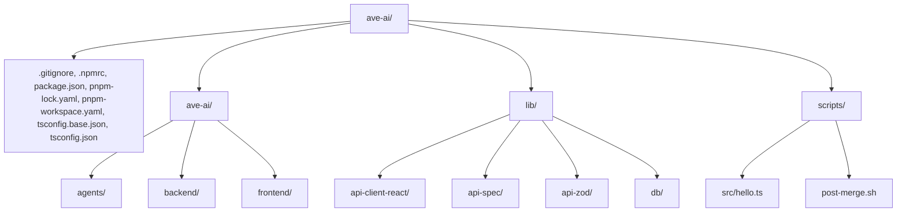

Explanation: Root monorepo with pnpm workspaces. ave-ai/ contains agents, backend, frontend. lib/ holds shared libraries for API client generation, Zod schemas, database schema. scripts/ contains Git hooks and utility scripts.

2. ave-ai/agents/ Top-Level Structure

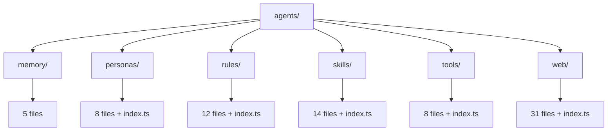

Explanation: The agents directory is the brain of the system. Each subfolder defines a distinct capability: memory/ for long-term user facts, personas/ for AI personalities, rules/ for constraint definitions, skills/ for composite workflows, tools/ for atomic functions, and web/ for web automation tools.

3. frontend/src/ Structure

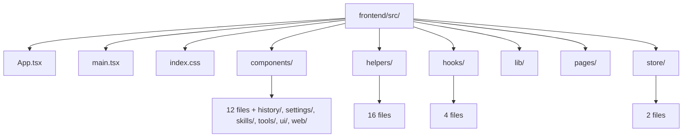

Explanation: The frontend source tree includes the root app component, entry point, global styles, and folders for components, helpers, hooks, library utilities, pages, and Zustand stores. Components are organized by feature: chat UI, thinking box, modals, and subdirectories for history, settings, skills, tools, UI primitives, and web tools.

4. Macro Architecture & Data Flow

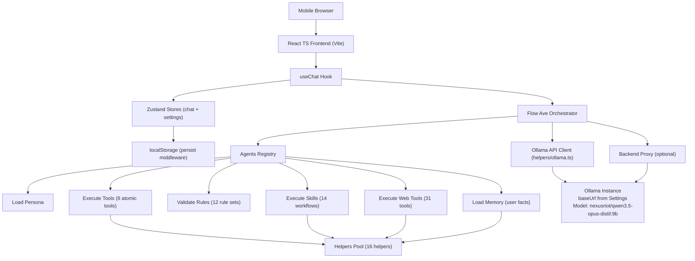

Explanation: The user interacts with the React UI which invokes the useChat hook. This hook acts as the central orchestrator, loading personas, rules, tools, skills, memory, and communicating with Ollama (directly or via an optional backend proxy). All tool/skill/web executions consume a shared pool of helper utilities. State is persisted to localStorage via Zustand's persist middleware.

5. Main Execution Loop with Three Validation Gates

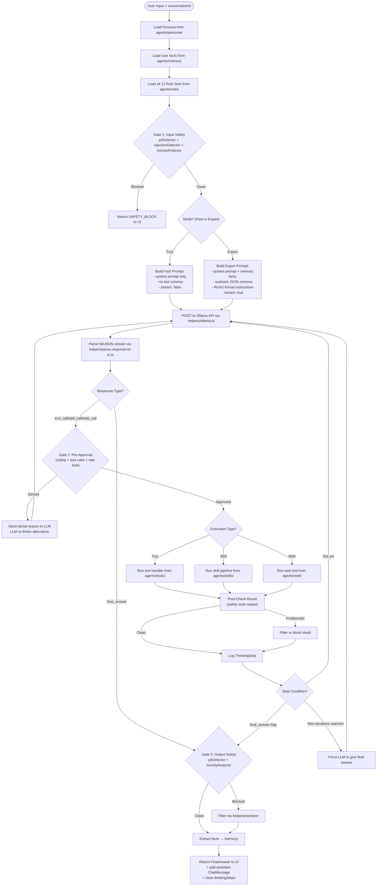

Explanation: The execution loop applies three safety gates: input validation, pre-approval of actions, and output filtering. Fast mode skips tools and streaming; Expert mode enables full ReAct loop with tools/skills/web capabilities. Denied actions are fed back to the LLM for self-correction. Every step is logged to the Zustand store for the ThinkingBox UI. Memory extraction runs after a successful final answer.

6. State Machine: Fast vs Expert Mode

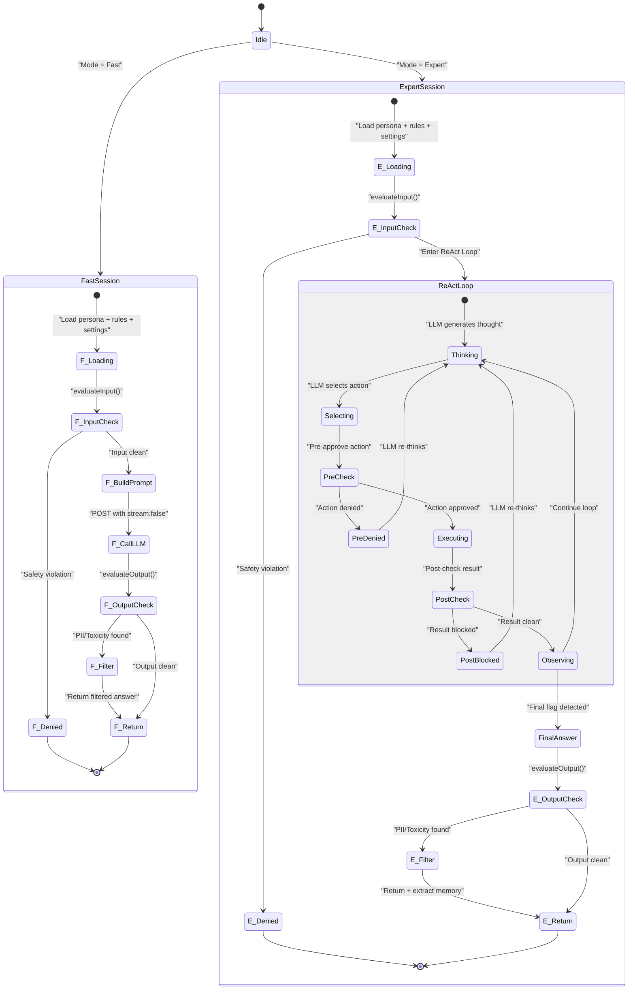

Explanation: Fast mode is a linear, single-pass interaction with no tools or streaming. Expert mode includes a nested ReAct loop with sub-states for thinking, action selection, pre-approval, execution, post-check, and observation. Denials at any stage cause the LLM to re-think. Both modes end with output validation and optional filtering.

7. Rules Engine: Evaluation Flow

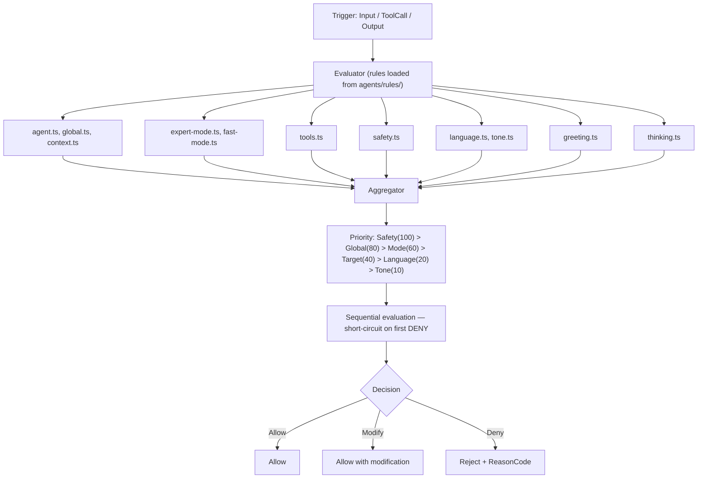

Explanation: The Rules Engine collects all 12 rule sets, sorts them by priority, and evaluates sequentially. Safety rules are evaluated first; a denial stops further checks. Results can be Allow, Modify (e.g., redact PII), or Deny (with a reason code fed back to the LLM).

8. Control Hierarchy & ThinkingBox Rendering

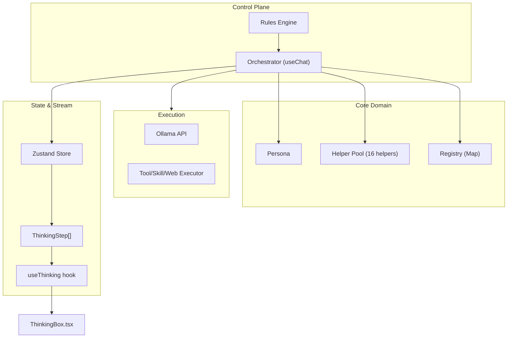

Explanation: The system is divided into four planes. The Control Plane enforces rules. The Core Domain holds personas, helpers, and the tool/skill registry. The Execution Plane communicates with Ollama and runs actions. The State Plane manages reactive data and streams thinking steps to the ThinkingBox UI component via the useThinking hook.

9. agents/personas/ Folder Overview

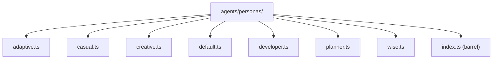

Explanation: Eight persona files plus a barrel export. Each exports a Persona object containing systemPrompt, displayName, and toneInstruction.

10. agents/rules/ Folder Overview

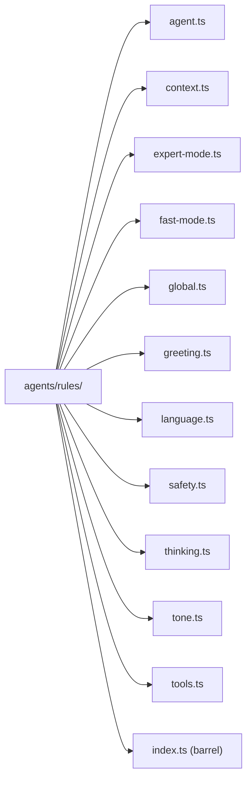

Explanation: Twelve rule files plus barrel. Each file exports a RuleSet object consumed by the Rules Engine.

11. agents/skills/ Folder Overview

```mermaid
graph TB
    SkillsDir["agents/skills/"] --> Auto["auto-skills.ts"]
    SkillsDir --> Codex["codex.ts"]
    SkillsDir --> Mermaid["mermaid-diagram.ts"]
    SkillsDir --> PRD["prd.ts"]
    SkillsDir --> Python["python-code-style.ts"]
    SkillsDir --> SEO["seo.ts"]
    SkillsDir --> Summarize["summarize.ts"]
    SkillsDir --> TDD["tdd.ts"]
    SkillsDir --> Telegram["telegram-bot-builder.ts"]
    SkillsDir --> UIUX["ui-ux-designer.ts"]
    SkillsDir --> WebTest["web-app-testing.ts"]
    SkillsDir --> WebPerf["web-performance.ts"]
    SkillsDir --> WebQual["web-quality.ts"]
    SkillsDir --> Index["index.ts (barrel)"]
```

Explanation: Fourteen skill files plus barrel. Each exports a Skill object with an ordered array of tool names or sub-skill names to execute.

12. agents/tools/ Folder Overview

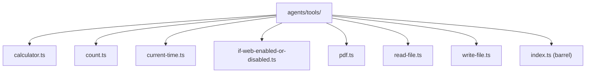

Explanation: Eight atomic tool files plus barrel. Each exports a Tool object with Zod schema and handler function.

13. agents/web/ Folder Overview

```mermaid
graph TB
    WebDir["agents/web/"] --> W1["web-api-caller.ts"]
    WebDir --> W2["web-authenticator.ts"]
    WebDir --> W3["web-browser.ts"]
    WebDir --> W4["web-cache-reader.ts"]
    WebDir --> W5["web-crawling.ts"]
    WebDir --> W6["web-diff.ts"]
    WebDir --> W7["web-downloader.ts"]
    WebDir --> W8["web-feed-parser.ts"]
    WebDir --> W9["web-fetcher.ts"]
    WebDir --> W10["web-form-submitter.ts"]
    WebDir --> W11["web-harvester.ts"]
    WebDir --> W12["web-headless-scraper.ts"]
    WebDir --> W13["web-link-extractor.ts"]
    WebDir --> W14["web-metadata-extractor.ts"]
    WebDir --> W15["web-monitor.ts"]
    WebDir --> W16["web-navigator.ts"]
    WebDir --> W17["web-paginator.ts"]
    WebDir --> W18["web-parser.ts"]
    WebDir --> W19["web-qrcode-reader.ts"]
    WebDir --> W20["web-reader.ts"]
    WebDir --> W21["web-robots-txt.ts"]
    WebDir --> W22["web-scraping.ts"]
    WebDir --> W23["web-screenshot.ts"]
    WebDir --> W24["web-search.ts"]
    WebDir --> W25["web-sitemap-parser.ts"]
    WebDir --> W26["web-socket-listener.ts"]
    WebDir --> W27["web-spider.ts"]
    WebDir --> W28["web-summarizer.ts"]
    WebDir --> W29["web-validator.ts"]
    WebDir --> W30["web-video-extractor.ts"]
    WebDir --> Index["index.ts (barrel)"]
```

Explanation: Thirty-one web tool files plus barrel. Each exports a WebTool object providing browser automation, scraping, API calling, and content extraction capabilities.

14. frontend/src/helpers/ Folder Overview

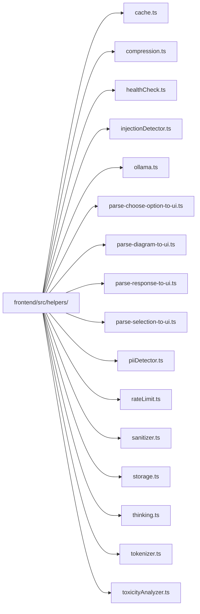

Explanation: Sixteen pure utility modules. They provide caching, compression, health checks, injection/PII/toxicity detection, an Ollama client, NDJSON stream parsing (response, diagram, choose‑option, selection), rate limiting, HTML sanitization, IndexedDB storage, thinking step management, and token counting.

15. Complete System Flow (End-to-End)

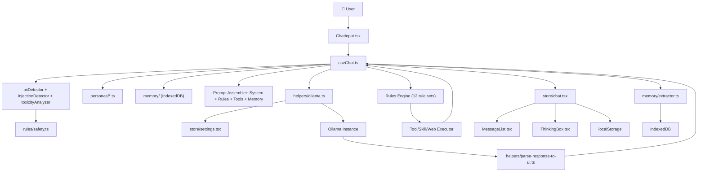

Explanation: End‑to‑end data flow from user input through safety checks, persona/memory loading, prompt building, Ollama communication, response parsing, rule evaluation, tool execution, store updates, UI rendering, and memory persistence. Every component is connected and dependencies flow strictly through defined interfaces.

---

End of flow-1.md. This file covers the core architecture, execution loop, state machine, rules engine, control hierarchy, and folder overviews. Subsequent files will provide per-file diagrams and detailed explanations for personas, rules, skills, tools, web tools, and helpers.