flow-10.md — Testing, Build, Dependencies, Internationalization, Telemetry & Roadmap

This file provides detailed diagrams and explanations for testing strategy, environment variables, build pipeline, monorepo layout, package dependencies, CSS architecture, internationalization preparation, telemetry, roadmap, and the complete file tree.

---

1. Testing Strategy (Optional)

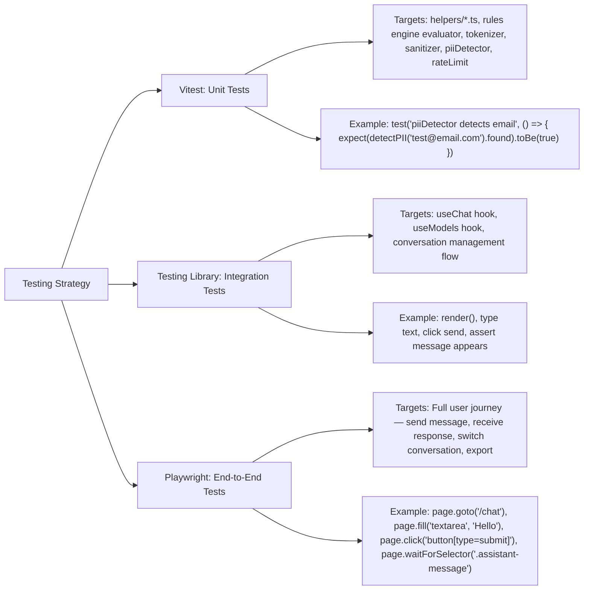

Explanation: Three testing layers are recommended but optional for a personal project. Unit tests cover pure functions in helpers/ and the Rules Engine evaluator. Integration tests verify hook behavior and component interactions using Testing Library. E2E tests simulate real user flows with Playwright. Tests can be run via pnpm test (Vitest) and pnpm test:e2e (Playwright).

---

2. Environment Variables

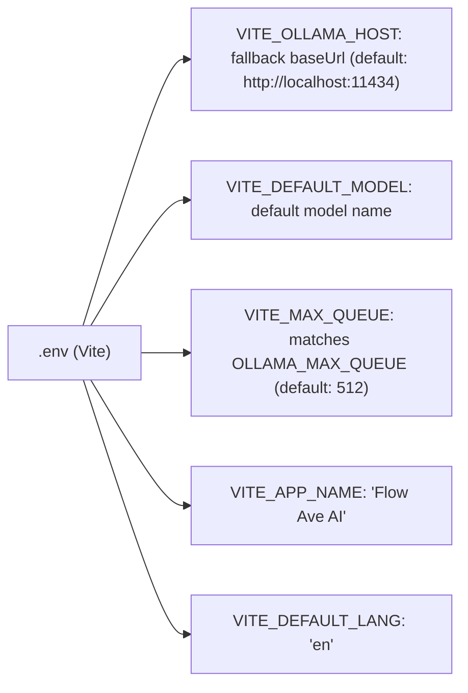

Explanation: All environment variables are prefixed with VITE_ to be exposed to the frontend via Vite. They provide default values that can be overridden in the Settings UI. VITE_OLLAMA_HOST sets the default Ollama server URL. VITE_DEFAULT_MODEL specifies the default model. VITE_MAX_QUEUE caps the rate limiter queue size.

---

3. Scripts & Build Pipeline

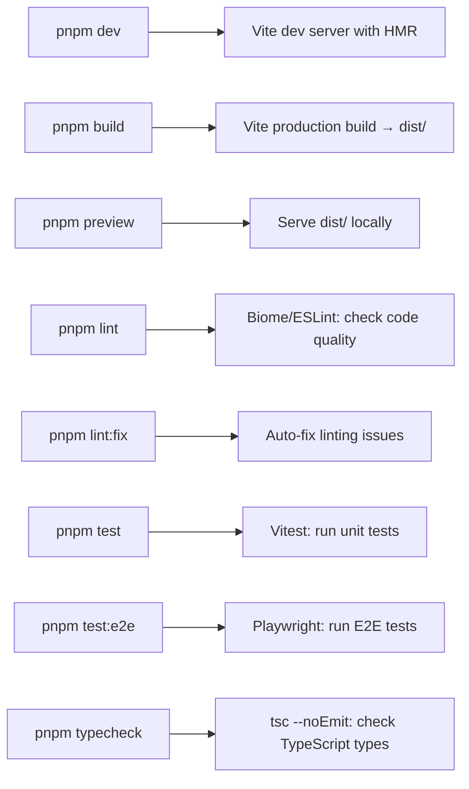

Explanation: Build scripts are defined in package.json. pnpm dev starts the Vite development server with hot module replacement. pnpm build produces an optimized production bundle. pnpm lint checks code quality with Biome or ESLint. pnpm typecheck validates TypeScript without emitting files. Optional test scripts use Vitest and Playwright.

---

4. Monorepo Layout

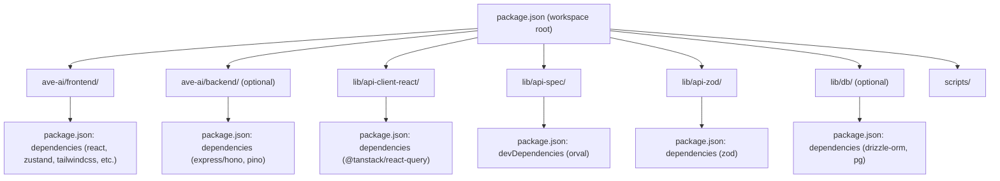

Explanation: The project uses pnpm workspaces for monorepo management. The main frontend application is ave-ai/frontend/. Support packages include auto‑generated API client, OpenAPI specification, Zod schemas, and optional database layer. Each package has its own package.json with scoped dependencies. Scripts directory holds Git hooks and utilities.

---

5. package.json Dependencies

```mermaid
graph TB
    Deps["Frontend Dependencies"] --> React["react, react-dom: UI library"]
    Deps --> Zustand["zustand: state management"]
    Deps --> Tailwind["tailwindcss: utility‑first CSS"]
    Deps --> Radix["@radix-ui/*: accessible UI primitives (shadcn/ui)"]
    Deps --> Markdown["react-markdown: render Markdown content"]
    Deps --> RemarkGfm["remark-gfm: GitHub Flavored Markdown support"]
    Deps --> RehypeHighlight["rehype-highlight: syntax highlighting"]
    Deps --> Tokenizer["llama-tokenizer-js: token counting"]
    Deps --> DOMPurify["dompurify: HTML sanitization"]
    Deps --> IndexedDB["idb: IndexedDB wrapper"]
    Deps --> MermaidJS["mermaid: diagram rendering"]
    Deps --> JsPDF["jspdf: PDF generation"]
    Deps --> Immer["immer: immutable state updates (with Zustand)"]
    DevDeps["Dev Dependencies"] --> ViteDev["vite: build tool"]
    DevDeps --> TypeScriptDev["typescript: type checking"]
    DevDeps --> VitestDev["vitest: unit testing"]
    DevDeps --> TestingLibraryDev["@testing-library/react: component testing"]
    DevDeps --> PlaywrightDev["@playwright/test: E2E testing"]
    DevDeps --> BiomeDev["@biomejs/biome: linting & formatting"]
```

Explanation: A carefully selected set of dependencies, all client‑side compatible for the PWA. react-markdown with plugins handles rich text rendering. llama-tokenizer-js provides accurate token counting for Qwen3‑compatible models. dompurify prevents XSS. idb simplifies IndexedDB operations. Dev dependencies support testing, linting, and type checking.

---

6. CSS / Styling Architecture

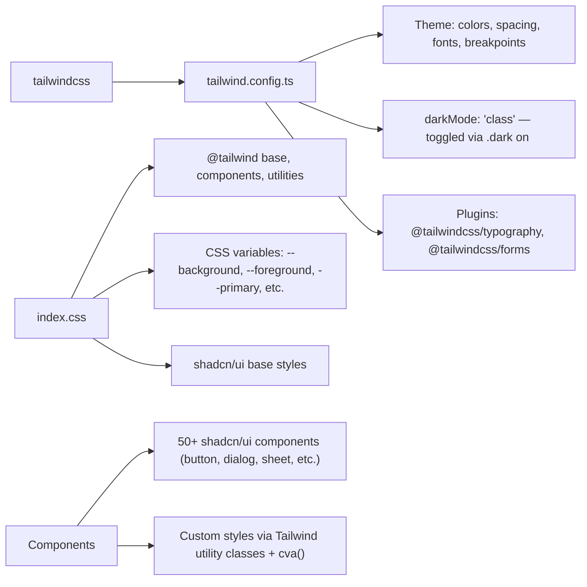

Explanation: Styling uses Tailwind CSS with the darkMode: 'class' strategy. CSS variables define theme colors for both light and dark modes. shadcn/ui provides a comprehensive set of accessible, customizable UI primitives. Custom styles are composed using Tailwind utility classes and the cva() (class variance authority) function for variant management.

---

7. Internationalization (i18n) Preparation

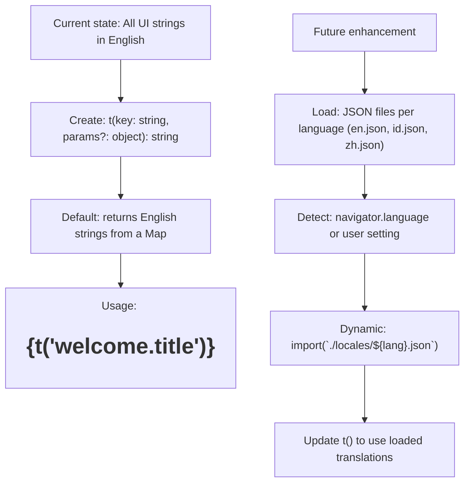

Explanation: While the current UI is in English, a t() function placeholder wraps all user‑facing strings, making future translation straightforward. In the future, JSON locale files can be dynamically loaded based on the user's language preference or browser setting.

---

8. Telemetry (Optional, Off by Default)

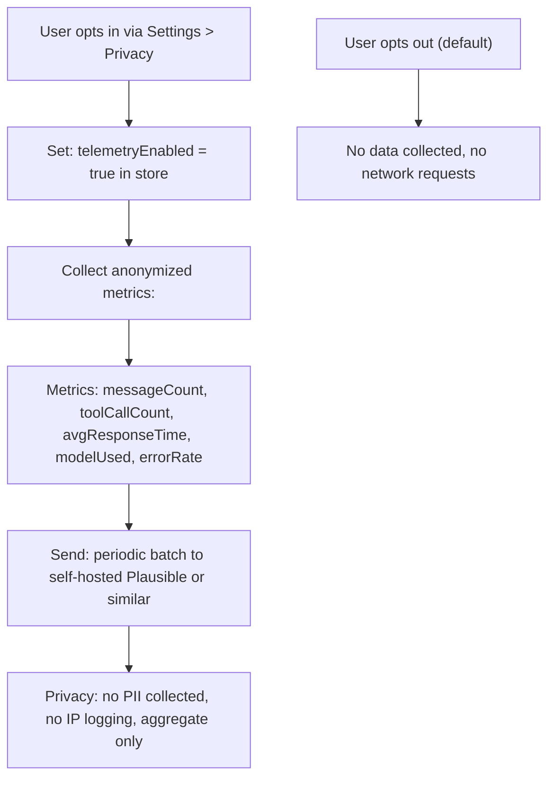

Explanation: Disabled by default. When enabled via Settings, anonymized usage statistics are collected (message counts, tool usage, average response times, model used, error rates). Data is batched and sent to a self‑hosted analytics endpoint. No personally identifiable information is collected. Users can disable at any time.

---

9. Roadmap & Extensibility

```mermaid
graph TB
    Current["Phase 1 — Current ✅"] --> Features1["100% local, PWA, 8 personas, 12 rule sets, 14 skills, 8 tools, 31 web tools"]
    Current --> Features1b["ReAct loop, 3‑gate safety, ThinkingBox streaming, memory system, dark mode"]
    
    Next["Phase 2 — Planned"] --> Features2["Skills.sh auto‑update, voice input (Whisper), multi‑language i18n"]
    Next --> Features2b["Plugin system for community skills, advanced Markdown editor, conversation branching"]
    
    Future["Phase 3 — Future"] --> Features3["Optional cloud sync (encrypted), collaboration, plugins marketplace"]
    Future --> Features3b["Multi‑modal: video understanding, audio generation, diagram editing"]
    
    Extensibility["Extensibility Points"] --> AddPersona["Add persona: create new file in agents/personas/"]
    Extensibility --> AddRule["Add rule: create new file in agents/rules/ + register in index.ts"]
    Extensibility --> AddTool["Add tool: create new file in agents/tools/ + Zod schema + handler"]
    Extensibility --> AddSkill["Add skill: create new file in agents/skills/ + define steps array"]
    Extensibility --> AddWebTool["Add web tool: create new file in agents/web/ + Zod + handler"]
    Extensibility --> AddHelper["Add helper: create new file in frontend/src/helpers/"]
```

Explanation: The architecture is designed to be extended without major refactors. New personas, rules, tools, skills, web tools, and helpers are added as files in their respective folders and auto‑loaded at startup via dynamic imports. Phase 2 plans include Skills.sh auto‑updates, voice input, and internationalization. Phase 3 includes optional cloud sync and collaboration features.

---

10. Complete File Tree (Detailed)

```mermaid
graph TB
    Root["ave-ai/"] --> ConfigFiles[".gitignore, .npmrc, package.json, pnpm-lock.yaml, pnpm-workspace.yaml, tsconfig.base.json, tsconfig.json"]
    
    Root --> AveAI["ave-ai/"]
    AveAI --> Agents["agents/"]
    Agents --> Memory["memory/ (5 files: index.ts, types.ts, store.ts, extractor.ts, retriever.ts)"]
    Agents --> Personas["personas/ (8 files: adaptive.ts, casual.ts, creative.ts, default.ts, developer.ts, planner.ts, wise.ts, index.ts)"]
    Agents --> Rules["rules/ (12 files: agent.ts, context.ts, expert-mode.ts, fast-mode.ts, global.ts, greeting.ts, language.ts, safety.ts, thinking.ts, tone.ts, tools.ts, index.ts)"]
    Agents --> Skills["skills/ (14 files: auto-skills.ts, codex.ts, mermaid-diagram.ts, prd.ts, python-code-style.ts, seo.ts, summarize.ts, tdd.ts, telegram-bot-builder.ts, ui-ux-designer.ts, web-app-testing.ts, web-performance.ts, web-quality.ts, index.ts)"]
    Agents --> Tools["tools/ (8 files: calculator.ts, count.ts, current-time.ts, if-web-enabled-or-disabled.ts, pdf.ts, read-file.ts, write-file.ts, index.ts)"]
    Agents --> Web["web/ (31 files: web-api-caller.ts, web-authenticator.ts, web-browser.ts, web-cache-reader.ts, web-crawling.ts, web-diff.ts, web-downloader.ts, web-feed-parser.ts, web-fetcher.ts, web-form-submitter.ts, web-harvester.ts, web-headless-scraper.ts, web-link-extractor.ts, web-metadata-extractor.ts, web-monitor.ts, web-navigator.ts, web-paginator.ts, web-parser.ts, web-qrcode-reader.ts, web-reader.ts, web-robots-txt.ts, web-scraping.ts, web-screenshot.ts, web-search.ts, web-sitemap-parser.ts, web-socket-listener.ts, web-spider.ts, web-summarizer.ts, web-validator.ts, web-video-extractor.ts, index.ts)"]
    
    AveAI --> Frontend["frontend/"]
    Frontend --> FrontendConfig["components.json, index.html, package.json, tsconfig.json, vite.config.ts"]
    Frontend --> Public["public/ (favicon.svg, manifest.json, opengraph.jpg, robots.txt, sw.js)"]
    Frontend --> FrontendSrc["src/"]
    FrontendSrc --> AppTsx["App.tsx"]
    FrontendSrc --> MainTsx["main.tsx"]
    FrontendSrc --> IndexCSS["index.css"]
    FrontendSrc --> Components["components/"]
    Components --> BaseComps["ActivityLog.tsx, ChatInput.tsx, ChoiceCards.tsx, Header.tsx, MessageBubble.tsx, MessageList.tsx, ModelSelector.tsx, PersonaSelector.tsx, QuestionForm.tsx, Sidebar.tsx, ThinkingBox.tsx"]
    Components --> SubDirs["history/ (HistoryModal.tsx), settings/ (Capabilities.tsx, Connection.tsx, Personas.tsx, SettingsModal.tsx, Skills.tsx), skills/ (SkillsModal.tsx), tools/ (ToolsModal.tsx), ui/ (50+ shadcn components), web/ (WebModal.tsx)"]
    FrontendSrc --> Helpers["helpers/ (16 files: cache.ts, compression.ts, healthCheck.ts, injectionDetector.ts, ollama.ts, parse-choose-option-to-ui.ts, parse-diagram-to-ui.ts, parse-response-to-ui.ts, parse-selection-to-ui.ts, piiDetector.ts, rateLimit.ts, sanitizer.ts, storage.ts, thinking.ts, tokenizer.ts, toxicityAnalyzer.ts)"]
    FrontendSrc --> Hooks["hooks/ (4 files: use-mobile.tsx, use-toast.ts, useChat.ts, useModels.ts)"]
    FrontendSrc --> Lib["lib/ (2 files: personas.ts, utils.ts)"]
    FrontendSrc --> Pages["pages/ (3 files: Chat.tsx, Home.tsx, not-found.tsx)"]
    FrontendSrc --> Store["store/ (2 files: chat.tsx, settings.tsx)"]
    
    AveAI --> Backend["backend/ (optional)"]
    Backend --> BuildMjs["build.mjs"]
    Backend --> BackendPkg["package.json, tsconfig.json"]
    Backend --> BackendSrc["src/ (app.ts, index.ts, lib/logger.ts, middlewares/, routes/health.ts, routes/ollama.ts, routes/index.ts)"]
    Backend --> BackendDist["dist/ (compiled output)"]
    
    Root --> Lib["lib/"]
    Lib --> ApiClientReact["api-client-react/ (package.json, tsconfig.json, src/custom-fetch.ts, src/index.ts, src/generated/api.ts, src/generated/api.schemas.ts)"]
    Lib --> ApiSpec["api-spec/ (openapi.yaml, orval.config.ts, package.json)"]
    Lib --> ApiZod["api-zod/ (package.json, tsconfig.json, src/generated/api.ts, src/generated/types/healthStatus.ts, src/generated/types/index.ts)"]
    Lib --> DB["db/ (drizzle.config.ts, package.json, tsconfig.json, src/schema/index.ts)"]
    
    Root --> Scripts["scripts/"]
    Scripts --> PostMerge["post-merge.sh"]
    Scripts --> ScriptsPkg["package.json, tsconfig.json"]
    Scripts --> ScriptsSrc["src/hello.ts"]
```

Explanation: The complete project file tree reflects all modules described across flow-1 through flow-10. Each folder maps to a specific architectural concern. The system is modular: adding new capabilities requires only creating new files in the appropriate folders — they are auto‑loaded via Vite's import.meta.glob at startup.

---

11. Complete System Flow (End‑to‑End Reprise)

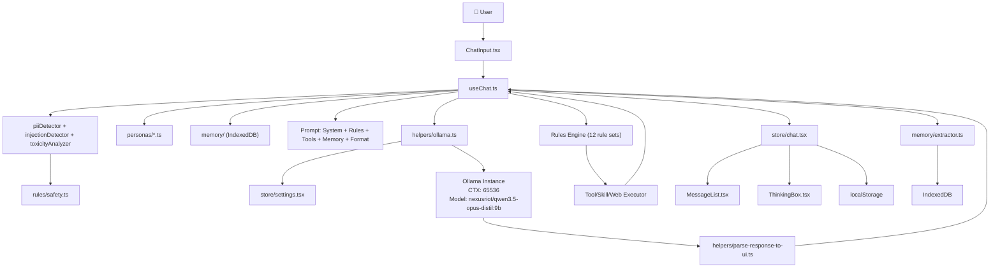

Explanation: End‑to‑end data flow from user input through safety checks, persona/memory loading, prompt building, Ollama communication, response parsing, rule evaluation, tool execution, store updates, UI rendering, and memory persistence. Every component is connected, and dependencies flow strictly through defined interfaces.

---
