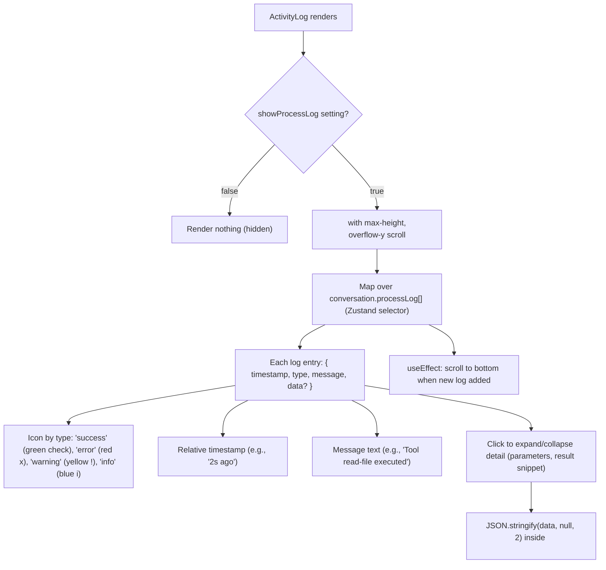
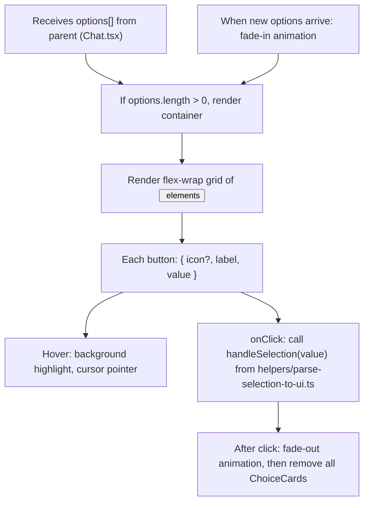
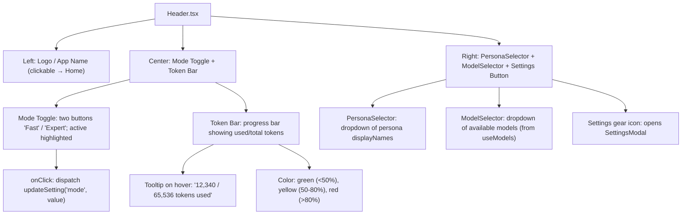
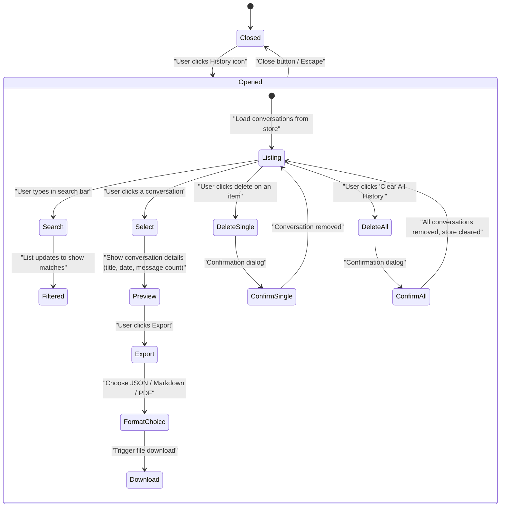
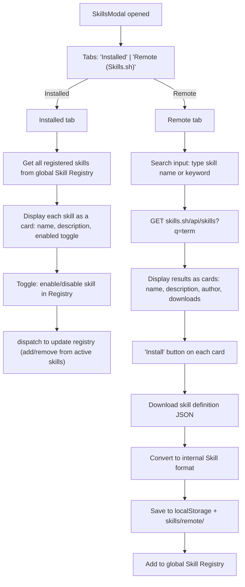
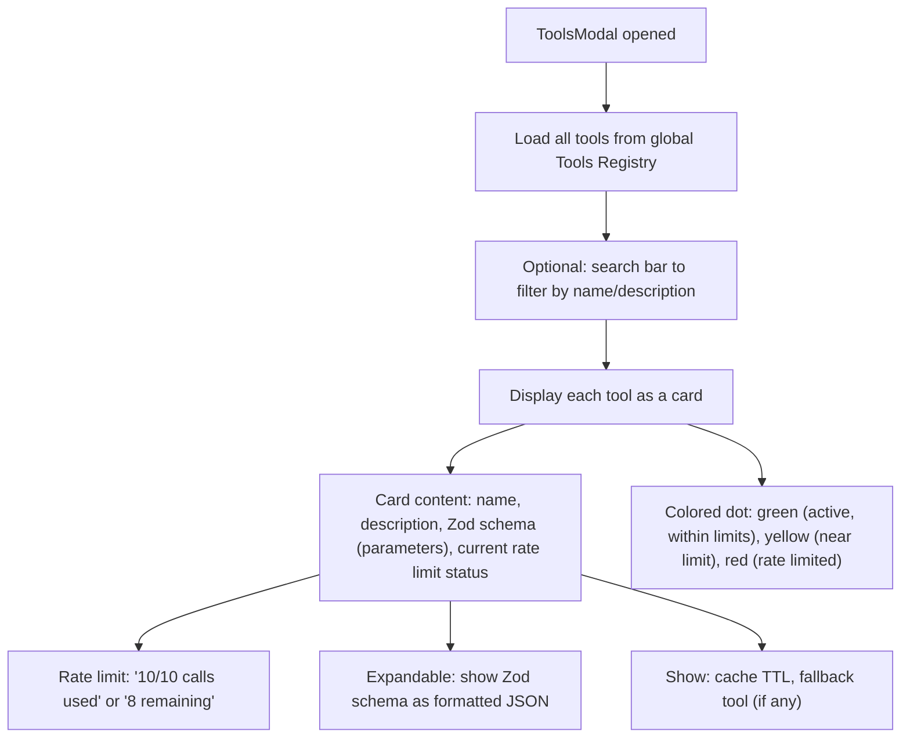
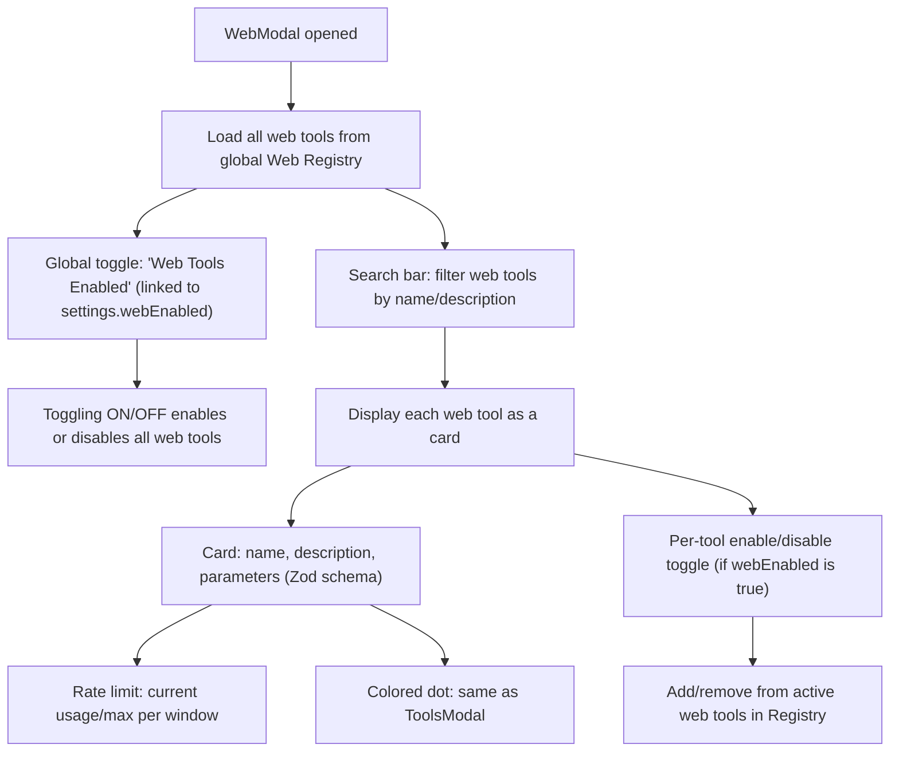

flow-11.md — UI Components Detail

This file provides detailed diagrams and explanations for key UI components not yet individually diagrammed: ActivityLog, ChoiceCards, Header, QuestionForm, HistoryModal, SkillsModal, ToolsModal, and WebModal. These components are part of the frontend; their overall placement is shown in flow‑9 diagram 7 (Component Tree).

---

1. ActivityLog.tsx

Explanation: The ActivityLog panel shows a real‑time feed of all process events (tool calls, rule evaluations, errors). Its visibility is gated by the showProcessLog setting. Each entry displays an icon, timestamp, message, and expandable detail view. Auto‑scroll keeps the latest entry visible. Data is sourced from conversation.processLog[] via a Zustand selector.

---

2. ChoiceCards.tsx

Explanation: ChoiceCards presents clickable option buttons generated from the LLM's structured responses. Options are passed as a prop from the parent Chat component. Clicking a card calls the selection handler which dispatches a new user message with the selected value. The cards animate in when options appear and fade out after a selection is made.

---

3. Header.tsx

Explanation: The header provides global navigation and status. The left shows the app name (link to home). The center contains the Fast/Expert mode toggle and a token usage progress bar with color thresholds. The right side includes dropdowns for persona and model selection, plus a button to open the Settings modal. State is managed via Zustand selectors and actions.

---

4. QuestionForm.tsx

```mermaid
flowchart TD
    Render["QuestionForm renders"] --> Structure["Container: flex-col, gap"]
    Structure --> TextArea["Textarea for main question input (auto‑resize)"]
    Structure --> AttachmentsRow["Attachments row: thumbnail previews"]
    Structure --> ActionRow["Action row: Attach button + Submit button"]

    AttachButton["Attach button: paperclip icon"] --> Menu["Dropdown: 'Camera', 'Gallery', 'Record Voice'"]
    Menu --> Camera["Camera: <input type='file' capture='environment'> → base64"]
    Menu --> Gallery["Gallery: <input type='file' accept='image/*'> → base64"]
    Menu --> Voice["Voice: start MediaRecorder → stop → blob → Whisper STT"]
    Camera --> Preview["Add to attachments[] state, show thumbnail"]
    Gallery --> Preview
    Voice --> InsertText["Insert transcript into textarea (do not attach)"]

    SubmitButton["Submit button: arrow icon"] --> Validate["Check: textarea not empty OR attachments.length > 0"]
    Validate -->|"Valid"| BuildMessage["Build message object: { content: textarea.value, images?: base64[] }"]
    BuildMessage --> Dispatch["dispatch(sendMessage({ input: message, conversationId }))"]
    Dispatch --> Clear["Clear textarea and attachments, reset form"]
```

Explanation: QuestionForm is the primary input component that supports text, image, and voice input. It maintains local state for attachments and text. The submit button builds a message object with optional base64-encoded images and dispatches it via useChat.sendMessage. Voice input is transcribed and inserted into the textarea rather than attached.

---

5. HistoryModal.tsx

Explanation: The History modal provides a comprehensive view of all saved conversations. It supports searching, previewing individual conversations, exporting single conversations in multiple formats, and bulk or individual deletion. State is derived from the Zustand chat store (conversations map).

---

6. SkillsModal.tsx

Explanation: The Skills modal manages both locally installed skills and remote skill discovery from Skills.sh. The Installed tab shows all currently registered skills with enable/disable toggles. The Remote tab allows searching Skills.sh, viewing results, and installing new skills. Installed remote skills are cached for offline use and added to the global Registry.

---

7. ToolsModal.tsx

Explanation: The Tools modal is a read‑only inspector for all registered tools. It displays each tool's metadata, Zod parameter schema, current rate limit consumption, cache settings, and fallback tool. A colored status dot gives at‑a‑glance information about the tool's availability.

---

8. WebModal.tsx

Explanation: The Web modal provides an overview of all 31 web automation tools. A global toggle controls whether any web tools are available. Each web tool can be individually enabled/disabled. Rate limit status and Zod schema details are displayed, similar to the Tools modal.

---

9. Integration Note

All eight components described above subscribe to Zustand store slices (useChat, useSettings, useModels, useThinking) and dispatch actions through the useChat hook. They communicate with backend services (Skills.sh API, Ollama endpoints) via the helpers described in flow‑6. Their parent‑child relationships are shown in the Component Tree diagram (flow‑9, diagram 7).

---

End of flow-11.md. Continued in flow-12.md (Memory Folder Per‑File).