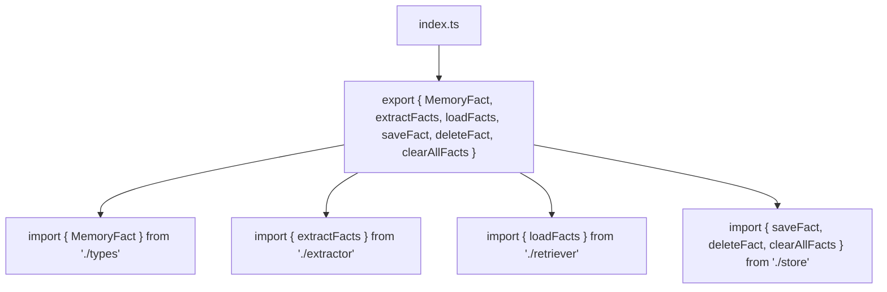
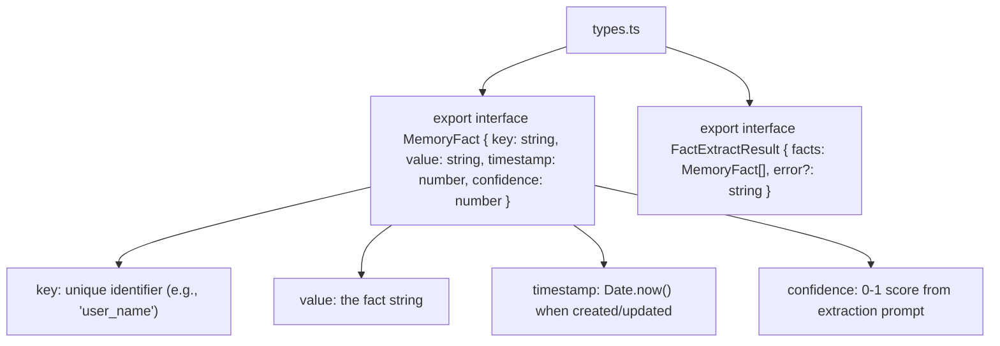
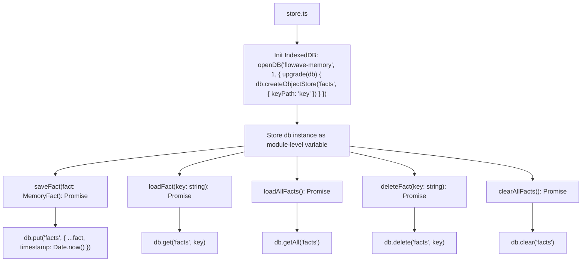
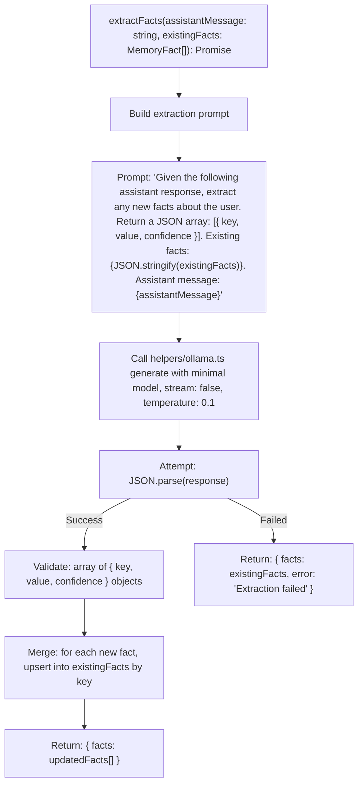
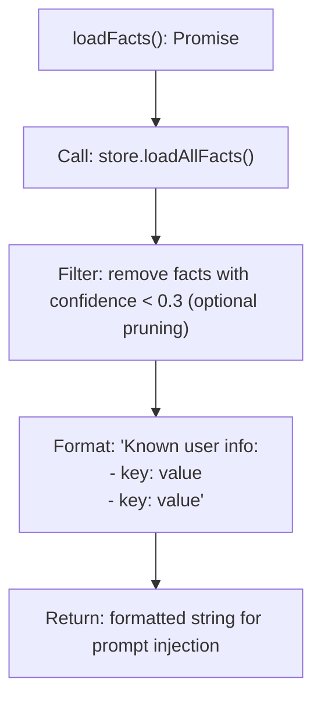

flow-12.md — Memory Folder Per-File

This file provides detailed per‑file diagrams for the agents/memory/ folder. The overall memory system architecture is described in flow‑7 diagram 3 and flow‑8 diagrams 15‑17. These details complement those diagrams with file‑level specifics.

---

1. memory/index.ts (barrel)

Explanation: The barrel file aggregates all public APIs of the memory subsystem. It re‑exports the MemoryFact type, the extraction function, the retrieval function, and the CRUD operations from the IndexedDB store. The Orchestrator imports from this barrel.

---

2. memory/types.ts

Explanation: Defines the MemoryFact interface used throughout the system. The confidence field indicates how certain the extraction LLM was about the fact. FactExtractResult is the return type from the extraction helper.

---

3. memory/store.ts

Explanation: IndexedDB wrapper using the idb library (loaded via dynamic import). The database is initialised lazily on first use. All CRUD operations are simple key‑based stores on the facts object store with key as keyPath.

---

4. memory/extractor.ts

Explanation: Uses the LLM with a small, cheap prompt to extract structured facts from the assistant's message. It receives existing facts to avoid duplicates and to provide context. The result is merged with existing facts (upserting by key) before being returned.

---

5. memory/retriever.ts

Explanation: Loads all stored facts from IndexedDB, optionally prunes those with very low confidence, and formats them as a bullet list to be prepended to the system prompt. This is called by the Orchestrator before every LLM request.

---

End of flow-12.md. This covers the five files inside agents/memory/. Continued in flow-13.md (Comprehensive Diagram Index & Cross‑Reference).