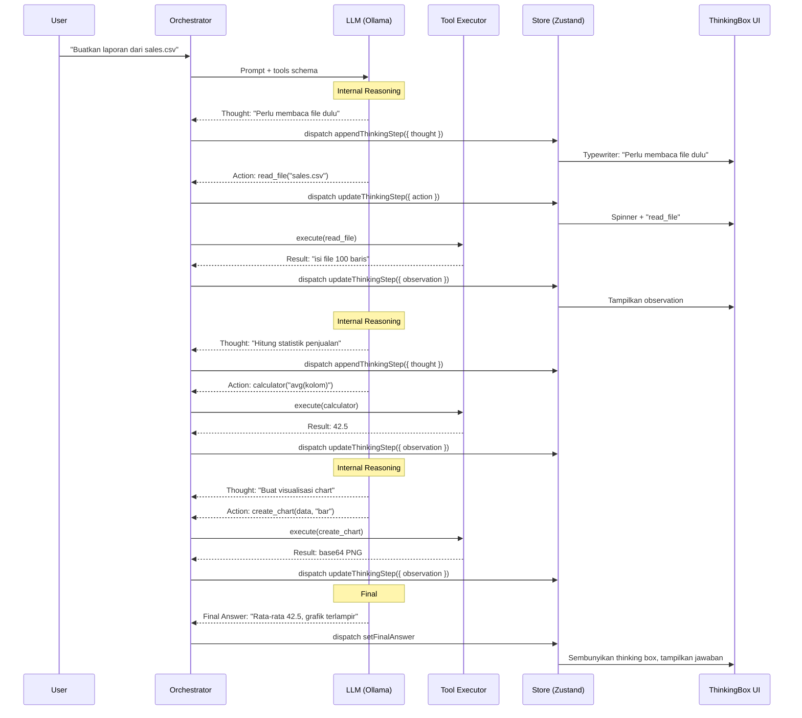
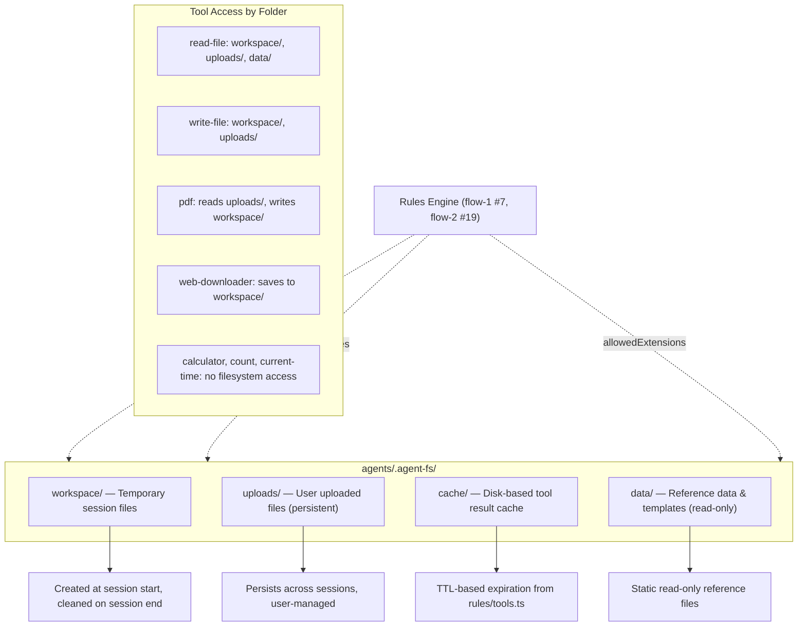
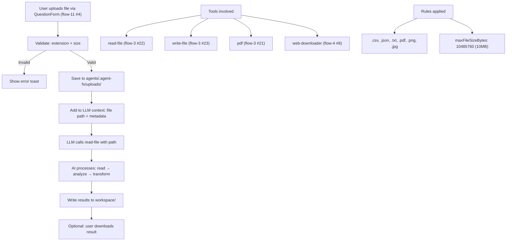
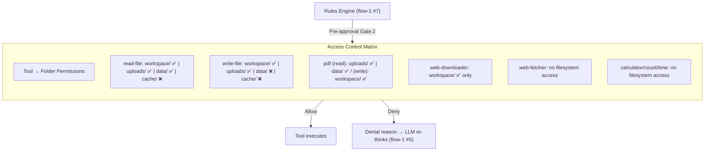

flow-13.md — Replit-Style Thinking Flow & AI Storage Architecture

---

1. Replit-Style Thinking Flow (Step-by-Step Reasoning)

Explanation:

· Complete step-by-step reasoning flow matching Replit Agent behavior.
· Each Thought is streamed character-by-character via typewriter effect (see flow-9 #10 for animation internals).
· Tool calls display a pulsing spinner until observation arrives (see flow-1 #5 for execution loop, flow-1 #6 for ReActLoop state machine).
· Loop continues until LLM emits final_answer flag (see flow-1 #5 for stopping conditions).
· All steps logged to Zustand store via appendThinkingStep and updateThinkingStep actions (see flow-9 #1 for chat store actions, flow-6 #15 for thinking helper).

---

2. AI Agent Storage Architecture

Explanation:

· AI agent requires dedicated filesystem access scoped by folder purpose.
· workspace/: Ephemeral — created on first tool use, archived/cleaned after conversation ends (see flow-8 #2 for session cleanup).
· uploads/: Persistent — user files remain across sessions, accessible via read-file tool (see flow-3 #22 for read-file handler).
· cache/: Disk-based complement to in-memory cache (see flow-6 #2 for cache helper); TTL from rules/tools.ts (see flow-2 #19).
· data/: Read-only templates and reference files.
· All paths validated against allowedPaths in Rules Engine before any tool execution (see flow-1 #5 Gate 2 Pre-Approval).

---

3. File Upload & AI Processing Flow

Explanation:

· File upload starts from QuestionForm component (see flow-11 #4 for image/voice upload UI).
· Validation checks extension against allowedExtensions and size against maxFileSizeBytes from rules/tools.ts (see flow-2 #19).
· Uploaded file path is injected into LLM context so it can reference the file in tool calls.
· AI processes files using standard tools (read-file, write-file, pdf, web-downloader) — all documented in flow-3 and flow-4.
· Results are written to workspace/ and optionally offered for download by the user.

---

4. Storage Folder Lifecycle

```mermaid
stateDiagram-v2
    [*] --> AppStart: App initializes

    state AppStart {
        [*] --> CheckWorkspace: Check if workspace/ exists
        CheckWorkspace --> CreateWorkspace: If not, create empty folder
        CreateWorkspace --> CheckUploads: Check if uploads/ exists
        CheckUploads --> CreateUploads: If not, create empty folder
        CreateUploads --> CheckCache: Check if cache/ exists
        CheckCache --> CreateCache: If not, create empty folder
        CreateCache --> CheckData: Check if data/ exists
        CheckData --> CreateData: If not, create with defaults
        CreateData --> Ready: All folders ready
    }

    Ready --> SessionActive: User starts conversation

    state SessionActive {
        [*] --> CleanWorkspace: Clean expired cache entries
        CleanWorkspace --> Working: AI uses workspace/ for temp files
        Working --> EndSession: Conversation ends
        EndSession --> Archive: Archive workspace/ contents (optional)
        Archive --> CleanWorkspace2: Clear workspace/ for next session
    }

    SessionActive --> AppShutdown: User closes app
    AppShutdown --> PersistState: Save to localStorage + IndexedDB
```

Explanation:

· Folders are created at application startup if they don't exist (see flow-7 #2 for app initialization).
· workspace/ is cleaned at the start of each new conversation.
· cache/ entries are pruned based on TTL from rules/tools.ts (see flow-2 #19).
· uploads/ and data/ persist across sessions without automatic cleanup.
· On app shutdown, state is persisted to localStorage and IndexedDB (see flow-7 #8 for offline detection, flow-9 #1-2 for store persistence).

---

5. Tool Access Control Matrix

Explanation:

· Each tool has a defined access matrix specifying which folders it can read from and write to.
· The Rules Engine enforces these permissions at Gate 2 (Pre-Approval) — see flow-1 #5 and flow-1 #7.
· Denied access results in feedback to the LLM, which can then re-plan (self-correction, see flow-2 #9 agent.ts selfCorrection).
· This matrix is configured in rules/tools.ts (flow-2 #19) and enforced by the tool executor.

---

End of flow-13.md. This covers the Replit-style step-by-step thinking flow and the AI agent storage architecture with folder permissions. Continued in flow-14.md (System Hardening & Edge Cases).