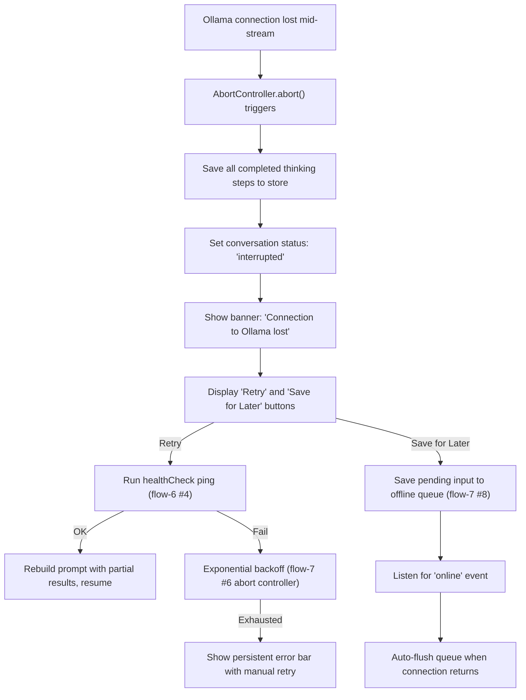
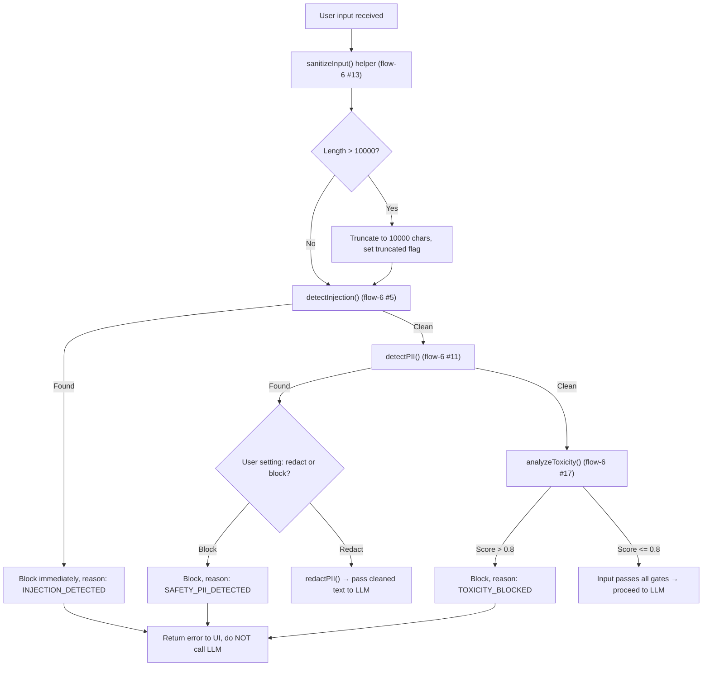
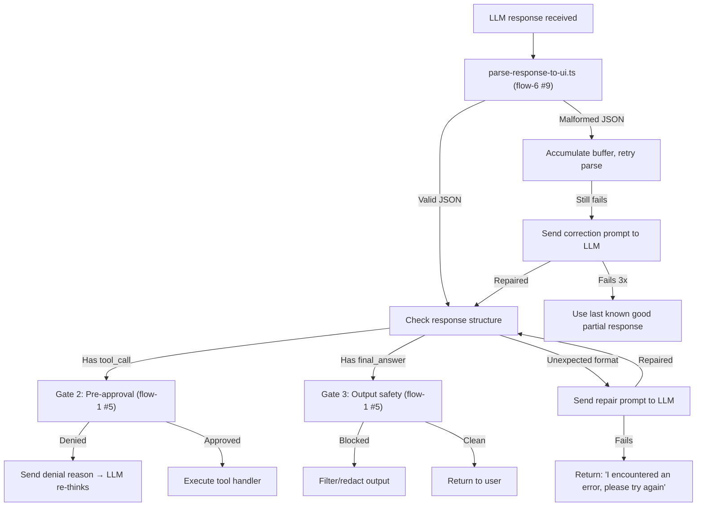
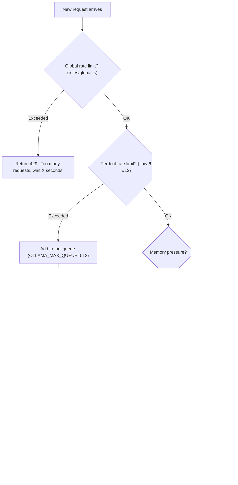
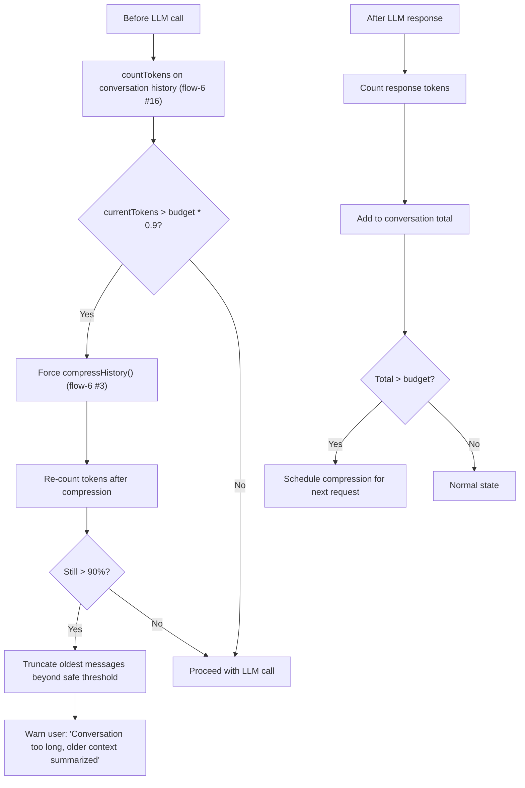
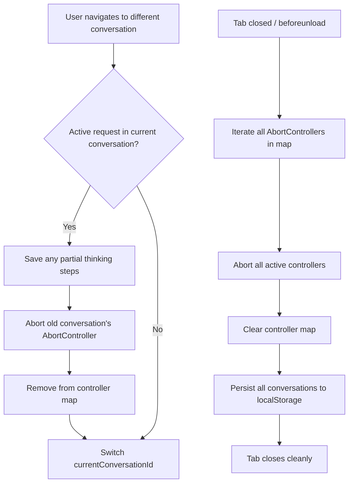
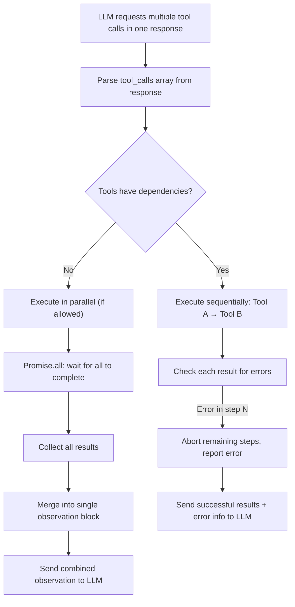
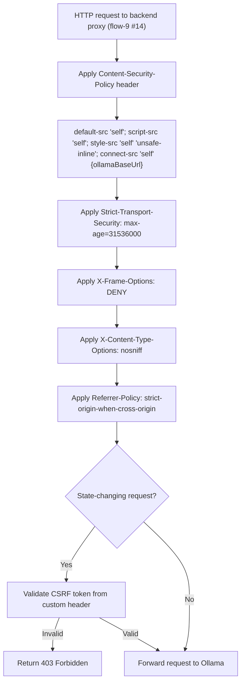
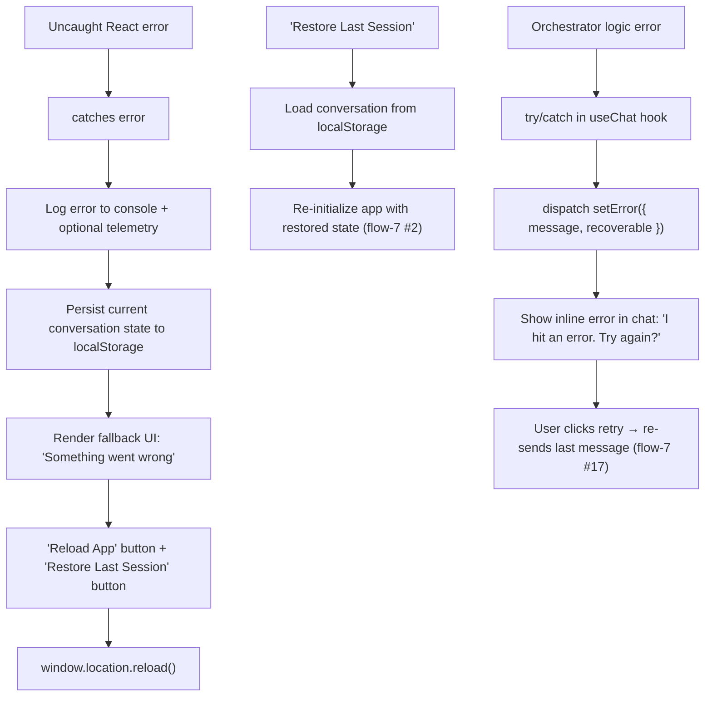
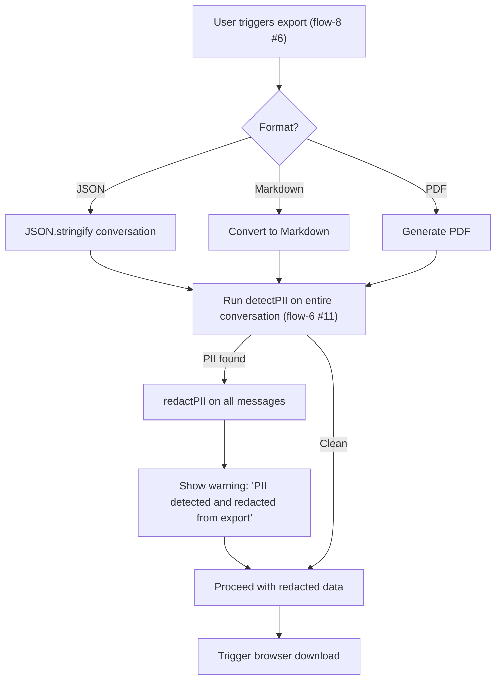

flow-14.md — System Hardening & Edge Cases

---

1. Graceful Degradation on Connection Loss

Explanation:

· Connection loss mid-stream gracefully saves partial state, marks the conversation as interrupted, and offers retry or offline queue.
· Retry uses the health check ping from healthCheck.ts (flow-6 #4).
· Exponential backoff matches the abort controller pattern (flow-7 #6).
· Offline queuing leverages the PWA offline detection system (flow-7 #8).

---

2. Malicious Input Handling

Explanation:

· Three-layer input defense: sanitization → injection detection → PII detection → toxicity analysis.
· Each layer can independently block or redact before the LLM ever sees the input (Gate 1 from flow-1 #5).
· All detection helpers documented in flow-6 (#5 injection, #11 PII, #17 toxicity).
· Input sanitization limits, trims, and cleans control characters (flow-6 #13).

---

3. LLM Response Anomaly Handling

Explanation:

· Handles malformed JSON by buffering and retrying parse, then requesting LLM repair.
· Self-correction for denied tool calls uses agent.ts correction prompt (flow-2 #9).
· Output safety (Gate 3) applies sanitization before user sees the response (flow-6 #13).
· Maximum 3 repair attempts before graceful fallback to prevent infinite loops.

---

4. Rate Limiting & Resource Protection

Explanation:

· Global rate limiting protects the Ollama server from overload (from global.ts, flow-2 #13).
· Per-tool rate limiting uses the sliding-window helper (flow-6 #12).
· Memory pressure triggers forced compression (flow-6 #3) when token usage exceeds 70% budget (flow-2 #10 context.ts).
· Iteration limit warnings prevent runaway loops (flow-2 #9 agent.ts maxIterations).

---

5. Token Budget Overflow Protection

Explanation:

· Token budget enforced at 65536 tokens (matching OLLAMA_NUM_CTX, flow-2 #10 context.ts).
· Automatic compression triggers at 90% usage (up from normal 70% threshold).
· If compression alone isn't enough, oldest messages are truncated to stay within budget.
· User is notified when older context is summarized or truncated.

---

6. Abort Controller Cleanup on Navigation

Explanation:

· Switching conversations properly aborts the old conversation's pending request (flow-7 #11 for conversation management).
· Tab close triggers cleanup of all controllers via beforeunload handler (flow-8 #2 for graceful shutdown).
· Partial thinking steps are saved before abort to preserve progress.

---

7. Concurrent Tool Execution Safety

Explanation:

· Handles multiple tool calls in a single LLM response (array of tool_calls).
· Sequential execution for dependent tools; parallel execution for independent tools.
· Error in a sequential chain aborts remaining steps and reports to LLM.
· Results are merged into a single observation before being sent back to LLM.

---

8. Security Headers & CSP for Backend Proxy

Explanation:

· Security headers applied by the optional backend proxy (flow-9 #14) to harden against web attacks.
· CSP restricts script sources and connect-src to only the configured Ollama base URL.
· CSRF protection for state-changing requests when proxy is used.
· Headers complement frontend security (DOMPurify sanitization, flow-7 #7).

---

9. Error Boundary & Crash Recovery

Explanation:

· React error boundary catches rendering crashes, saves state, and offers recovery options.
· Orchestrator errors caught in try/catch within useChat hook (flow-9 #3, flow-9 #17).
· Error state dispatched to Zustand store (flow-9 #1) and shown inline.
· User can recover by retrying the last message (flow-7 #17).

---

10. Sensitive Data Redaction on Export

Explanation:

· All export formats (JSON, Markdown, PDF — flow-8 #6) undergo PII scanning before download.
· PII is automatically redacted using redactPII() helper (flow-6 #11).
· User is warned when PII was found and redacted in the export.
· Prevents accidental leakage of sensitive data through conversation exports.

---

End of flow-14.md. This covers system hardening, edge cases, graceful degradation, security headers, crash recovery, and export safety. Continued in flow-15.md (Multi-Modal & Model Management).