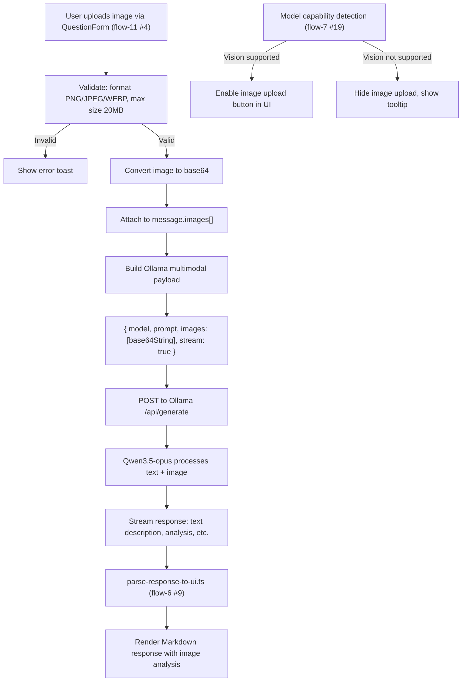
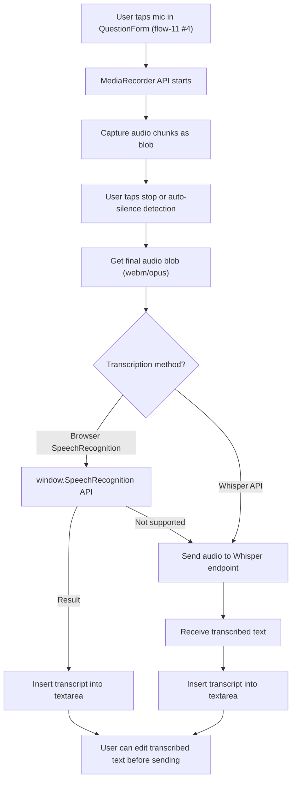
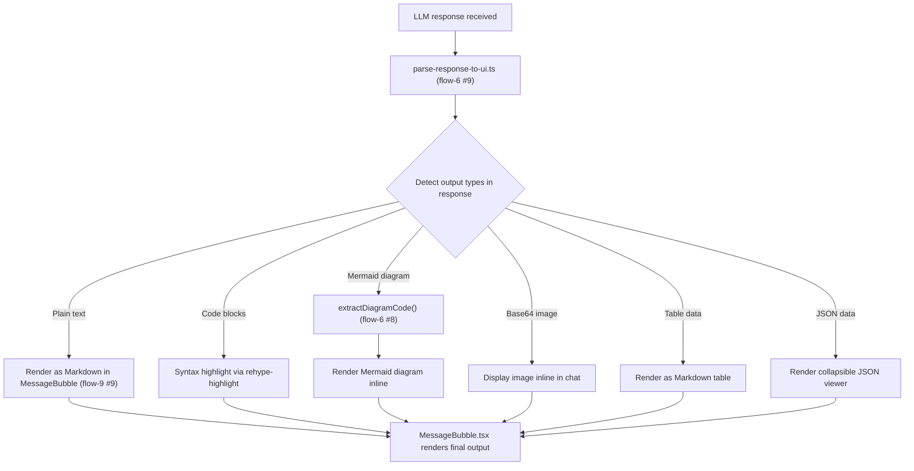
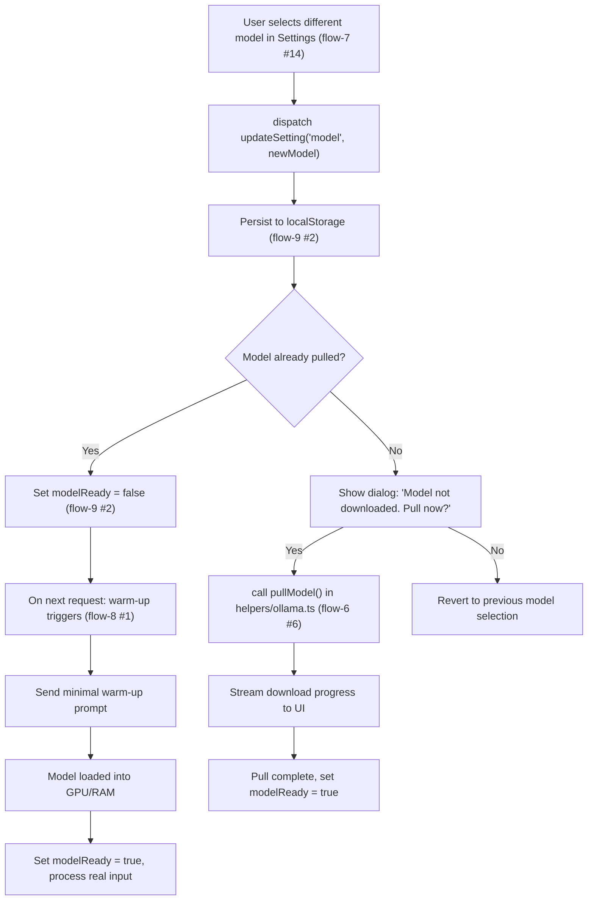
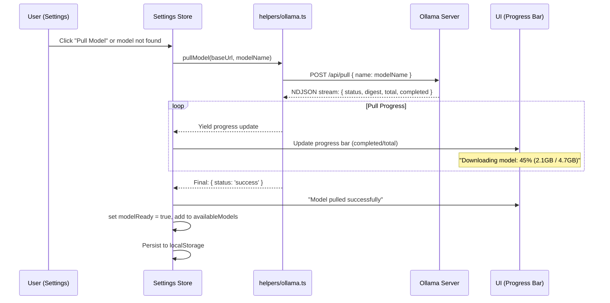
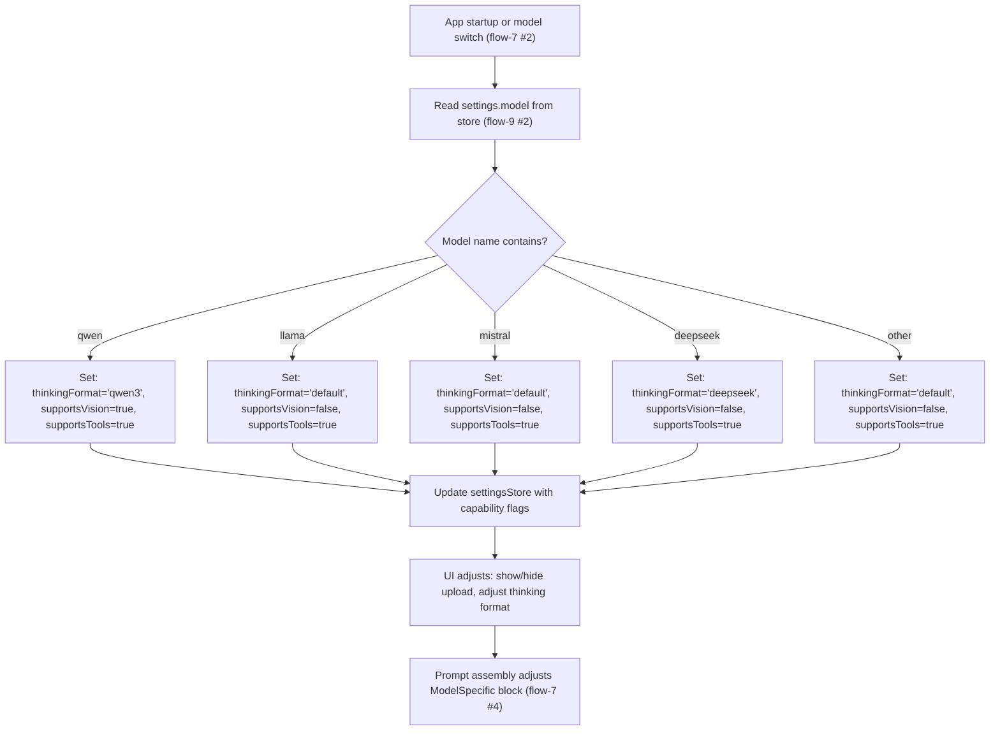

flow-15.md — Multi-Modal & Model Management

---

1. Visual Input Pipeline (Image Understanding)



Explanation:

· Visual input leverages Qwen3.5-opus multimodal capabilities (see flow-7 #19 for model detection).
· Image is base64-encoded and included in Ollama's images field per the multimodal API format.
· The LLM processes both text and image together, streaming the analysis response.
· Model capability detection automatically enables/disables the image upload button in QuestionForm (flow-11 #4).
· Supported formats: PNG, JPEG, WEBP; max 20MB size.

---

2. Voice Input Pipeline (Speech-to-Text)



Explanation:

· Voice input uses browser's MediaRecorder API to capture audio.
· Primary transcription via built-in SpeechRecognition API (no network cost).
· Fallback to Whisper API if browser API is unsupported or user configured a Whisper endpoint.
· Transcribed text is inserted into the textarea for user review/editing before sending.
· Audio is NOT stored after transcription (privacy-preserving).

---

3. Multi-Modal Output Rendering



Explanation:

· Single LLM response can contain multiple output types (text, code, diagrams, tables, JSON).
· parse-response-to-ui.ts (flow-6 #9) detects and routes each content type.
· Mermaid diagrams extracted via extractDiagramCode() (flow-6 #8) and rendered inline.
· Code blocks get syntax highlighting via rehype-highlight.
· JSON data rendered as collapsible viewer for readability.

---

4. Model Switching & Warm-up



Explanation:

· Model switching flows through Settings store (flow-9 #2) with automatic persistence.
· Availability check determines if model needs to be pulled from Ollama registry.
· Pull progress is streamed to UI via pullModel() helper (flow-6 #6).
· After switching, modelReady is reset, triggering warm-up on next request (flow-8 #1).
· Warm-up ensures model is loaded into GPU/RAM before processing real user input.

---

5. Model Download & Pull Progress



Explanation:

· Model pulling uses Ollama's /api/pull endpoint, streaming NDJSON progress updates.
· Progress includes status messages, layer digests, and byte counts (total/completed).
· UI renders a progress bar showing percentage and size downloaded.
· On success, model is added to availableModels and modelReady is set.
· If download fails mid-stream, retry uses exponential backoff (flow-6 #6, flow-7 #6).

---

6. Model Capability Detection



Explanation:

· Model capabilities are detected from the model name at startup and on model switch.
· Detection is name-based (model family matching) since Ollama doesn't have a direct capabilities API.
· Capability flags stored in settings store (flow-9 #2).
· UI adapts: vision-capable models show image upload; thinking models show thinking box by default.
· Prompt assembly injects model-specific instructions (flow-7 #4) based on detected family.

---

7. Multi-Modal Integration Summary

```mermaid
graph TB
    subgraph Input["Input Channels"]
        TextInput["Text (always available)"]
        ImageInput["Image (vision models only)"]
        VoiceInput["Voice (browser-dependent)"]
    end

    subgraph Processing["Processing"]
        PromptAssembly["Prompt Assembler (flow-7 #4)"]
        OllamaClient["helpers/ollama.ts (flow-6 #6)"]
        StreamParser["parse-response-to-ui.ts (flow-6 #9)"]
    end

    subgraph Output["Output Channels"]
        TextOutput["Markdown text with syntax highlighting"]
        DiagramOutput["Mermaid diagram rendering"]
        ImageOutput["Inline base64 image display"]
        TableOutput["Formatted tables"]
    end

    TextInput --> PromptAssembly
    ImageInput -->|base64 in images[]| PromptAssembly
    VoiceInput -->|Transcribed text| PromptAssembly
    PromptAssembly --> OllamaClient
    OllamaClient --> StreamParser
    StreamParser --> TextOutput
    StreamParser --> DiagramOutput
    StreamParser --> ImageOutput
    StreamParser --> TableOutput

    CapabilityDetection["Model Capability Detection (flow-15 #6)"] -.->|Enables/disables| ImageInput
    CapabilityDetection -.->|Enables/disables| ImageOutput
```

Explanation:

· Three input channels (text, image, voice) feed into a unified prompt assembler.
· Image is base64-encoded and passed in Ollama's images field.
· Voice is transcribed to text before entering the prompt pipeline.
· Four output channels render different content types from a single LLM response.
· Model capability detection gates which channels are available based on the active model.

---

End of flow-15.md. This covers multi-modal input/output pipelines, model switching workflow, model pull/download with progress, model capability detection, and the full multi-modal integration architecture.