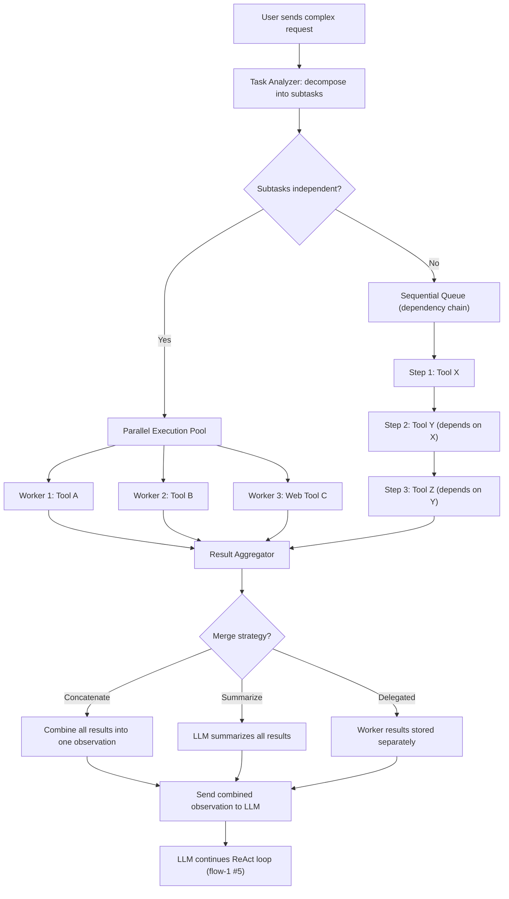
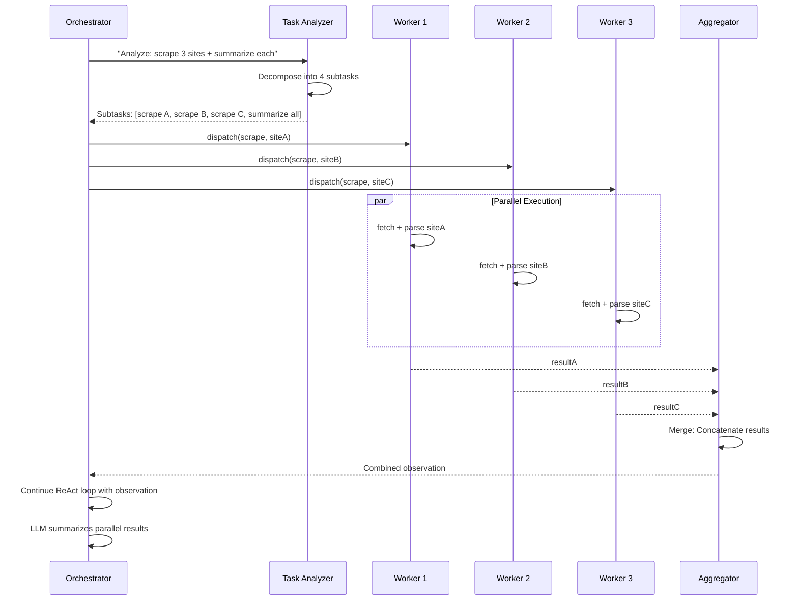
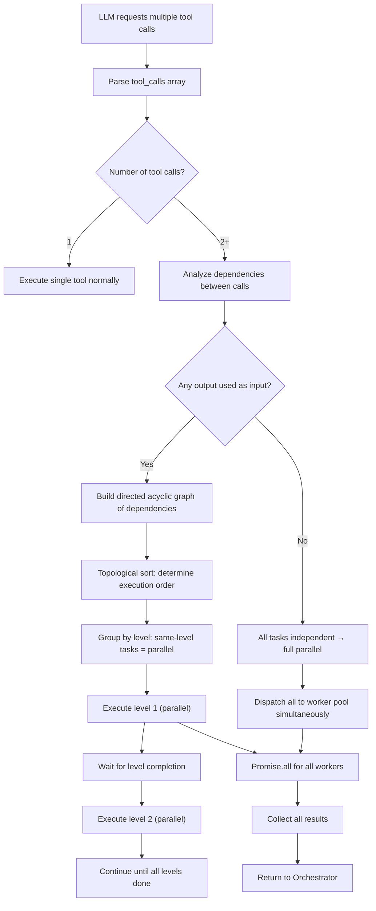
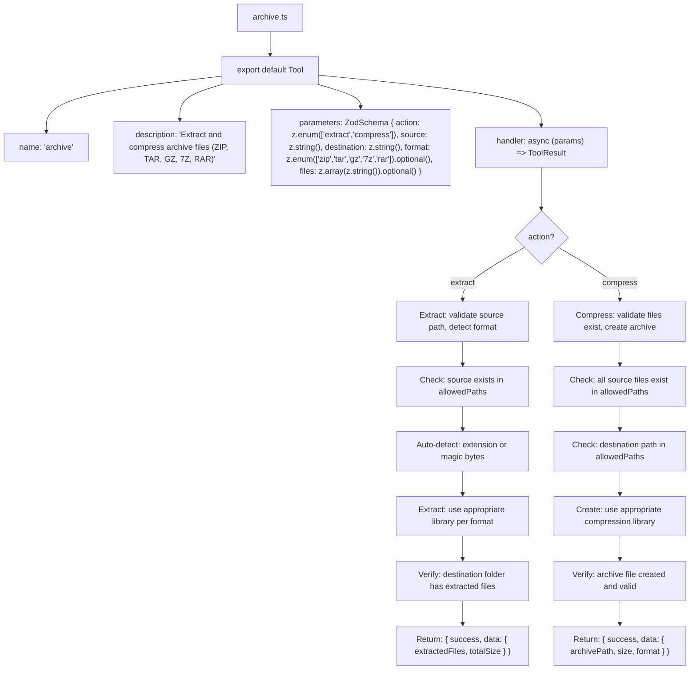
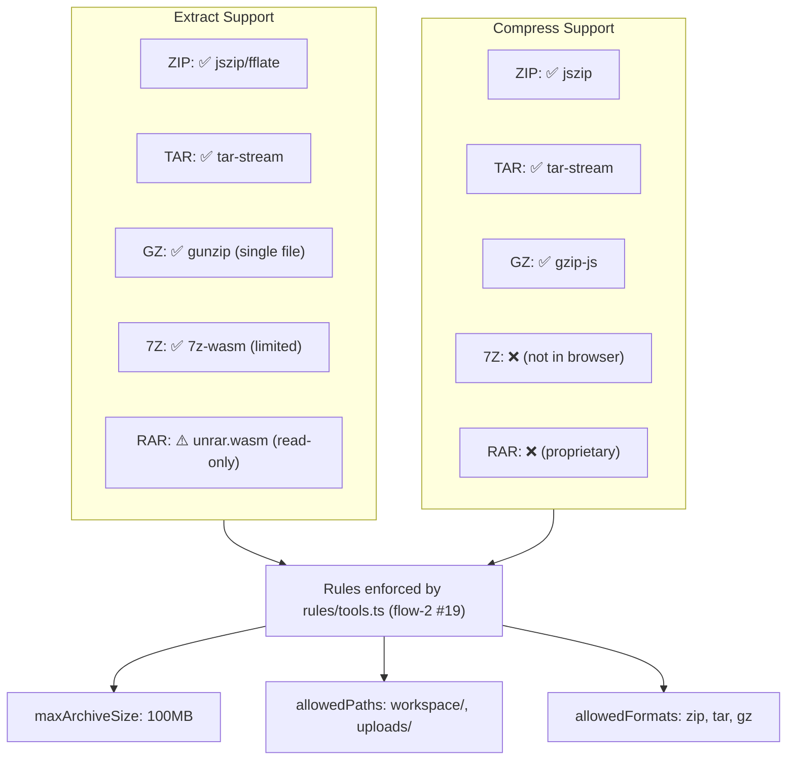
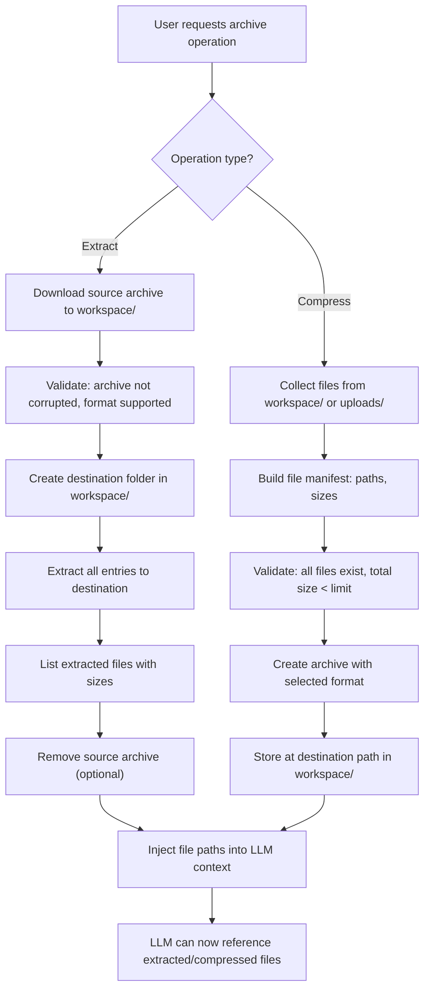
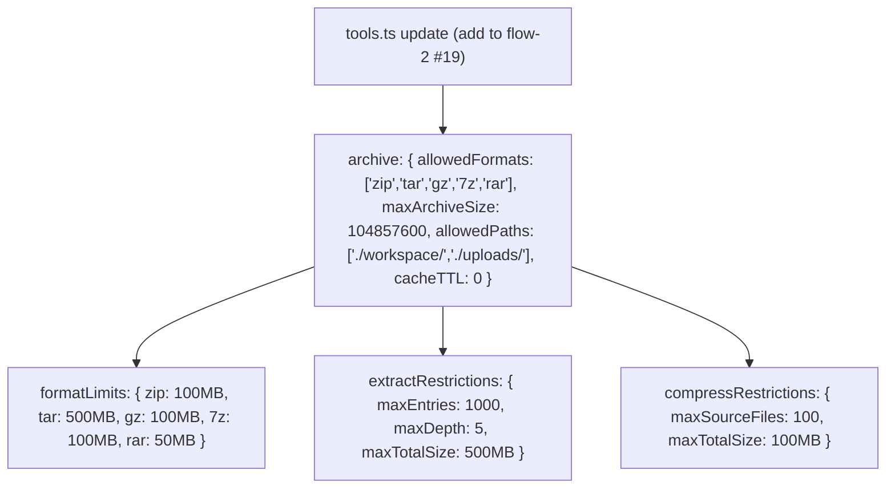

flow-16.md — Parallel Task Execution & Archive Tools

---

1. Parallel Task Execution Architecture

Explanation:

· Complex user requests are decomposed into subtasks by the Task Analyzer (see flow-1 #5 for main execution loop).
· Independent subtasks run in parallel via a worker pool; dependent tasks run sequentially.
· Results are aggregated using configurable merge strategies before being sent back to the LLM.
· Built on top of the ReAct loop architecture (see flow-1 #6 for state machine).
· Concurrent execution safety is enforced (see flow-14 #7 for concurrent tool execution).

---

2. Parallel Task Worker Pool

Explanation:

· Each worker runs independently with its own AbortController (see flow-7 #6).
· Results are collected by the Aggregator once all workers complete.
· Failed workers report errors; successful results are still merged.
· Built on top of the concurrent tool execution safety in flow-14 #7.

---

3. Task Decomposition Logic

Explanation:

· Task decomposition builds a DAG to determine execution order.
· Same-level tasks (no mutual dependencies) are parallelized.
· Topological sort ensures dependent tasks run after prerequisites complete.
· All parallel tasks use Promise.all with individual error handling.

---

4. Archive Tools — agents/tools/archive.ts

Explanation:

· Supports ZIP, TAR, GZ, 7Z, RAR formats for both extraction and compression.
· Auto-detects format from file extension or magic bytes.
· All paths validated against allowedPaths from rules/tools.ts (see flow-2 #19).
· Extraction creates a folder with the archive name; compression creates a single archive file.
· Files are processed within agents/.agent-fs/workspace/ and uploads/ (see flow-13 #2-4).

---

5. Archive Format Support Matrix

Explanation:

· Browser-based libraries provide extraction and compression without server-side dependencies.
· 7Z support is limited (read-only via WASM); RAR is read-only.
· Compression supports ZIP, TAR, GZ natively in the browser.
· All archive operations are constrained by rules/tools.ts (size limits, path restrictions).
· Archive tool is registered in agents/tools/index.ts barrel (see flow-3 #24).

---

6. Archive Processing Flow

Explanation:

· Extracted files are placed in workspace/ with paths logged to LLM context.
· Compression collects multiple files into a single archive at the destination path.
· All operations respect maxArchiveSize and allowedPaths from rules.
· LLM is notified of resulting file paths for subsequent tool calls.

---

7. Rules Update for Archive Tools

Explanation:

· Archive tool rules are added to the existing tools.ts rule set (see flow-2 #19).
· Format-specific size limits protect against decompression bombs.
· Extraction limits prevent malicious archives with excessive nesting.
· Compression limits prevent resource exhaustion from too many files.

---

End of flow-16.md. This covers parallel task execution architecture, worker pool, task decomposition, archive extraction/compression tools, and their integration with the existing rules engine and storage system. Continued in flow-17.md (Statistics Dashboard).