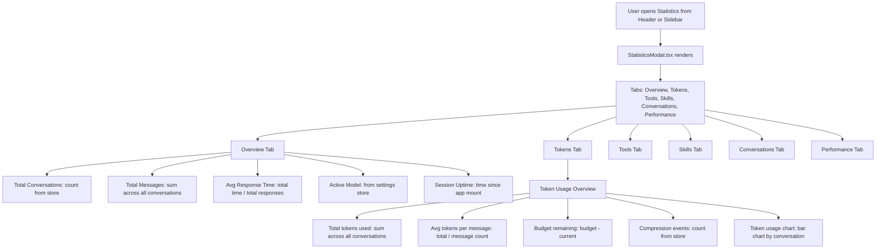
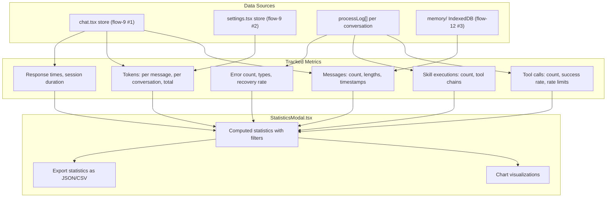
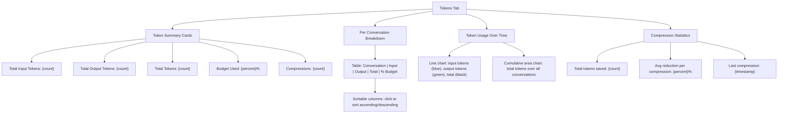
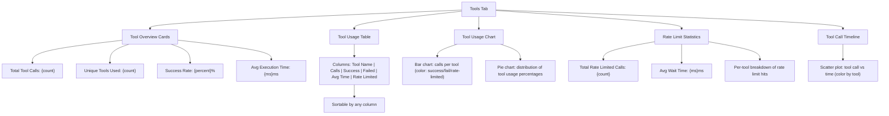
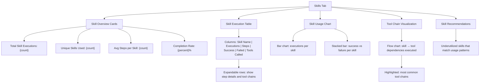
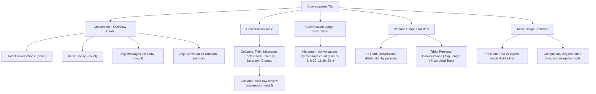
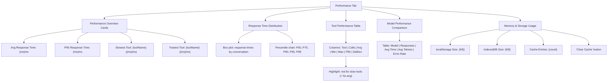
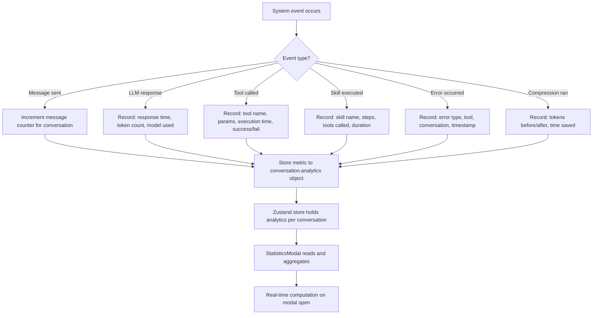
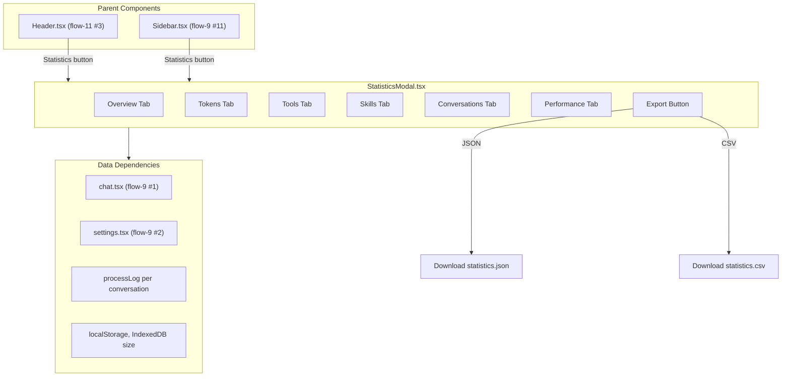

flow-17.md — Statistics Dashboard & Analytics

---

1. StatisticsModal.tsx — Component Architecture

Explanation:

· Statistics modal is accessible from the Header or Sidebar (see flow-11 #3 for Header, flow-9 #11 for Sidebar).
· Six tabs provide comprehensive analytics on AI usage.
· Data is sourced from the Zustand chat store (flow-9 #1), settings store (flow-9 #2), and the process log.
· All statistics are computed client-side from stored data; no server calls needed.

---

2. Data Sources & Tracking Architecture

Explanation:

· Statistics are computed from four data sources: chat store, settings store, process logs, and memory store.
· Metrics are tracked automatically during normal operation (no additional overhead).
· Process logs capture tool calls, skill executions, and errors (see flow-11 #1 ActivityLog).
· Statistics are computed client-side and rendered as charts; export supports JSON and CSV formats.
· Token data is tracked per conversation and aggregated globally (see flow-8 #4 for token display).

---

3. Overview Tab — Key Metrics

```mermaid
graph TB
    Overview["Overview Tab"] --> MetricCards["Metric Cards Grid"]
    MetricCards --> Card1["Total Conversations: {count}"]
    MetricCards --> Card2["Total Messages: {count}"]
    MetricCards --> Card3["Avg Response Time: {ms}s"]
    MetricCards --> Card4["Active Model: {modelName}"]
    MetricCards --> Card5["Session Duration: {hh:mm:ss}"]
    MetricCards --> Card6["Memory Facts: {count}"]

    Overview --> RecentActivity["Recent Activity Timeline"]
    RecentActivity --> Activity1["2 min ago: Tool 'web-search' called"]
    RecentActivity --> Activity2["5 min ago: Skill 'summarize' executed"]
    RecentActivity --> Activity3["10 min ago: Conversation 'Project Planning' created"]
    RecentActivity --> Activity4["15 min ago: Memory fact 'user_name' saved"]

    Overview --> DailyUsage["Daily Usage Chart"]
    DailyUsage --> DailyMessages["Messages per day (bar chart)"]
    DailyUsage --> DailyTokens["Tokens per day (line chart)"]
    DailyUsage --> DailyTools["Tool calls per day (stacked bar)"]
```

Explanation:

· Overview tab shows at-a-glance key metrics in a card grid layout.
· Recent activity timeline shows the last 20 events from the process log.
· Daily usage charts provide trends over time (from conversation timestamps).
· Data refreshes when the modal opens (uses current store state).
· All metrics are computed from data already tracked in the Zustand stores.

---

4. Tokens Tab — Detailed Token Analytics

Explanation:

· Token analytics leverage data from the tokenizer helper (see flow-6 #16) and compression helper (see flow-6 #3).
· Per-conversation breakdown with sortable columns for easy analysis.
· Charts show token consumption trends and compression savings.
· Token budget (65536 from flow-2 #10) is used to calculate percentage utilization.
· Compression events are counted and analyzed for efficiency.

---

5. Tools Tab — Tool Usage Statistics

Explanation:

· Tool statistics are derived from the process log (see flow-11 #1) and rate limiter (see flow-6 #12).
· Success rate tracks tool calls that returned without errors.
· Rate limit statistics show how often external tools hit their configured limits.
· Timeline visualization helps identify patterns in tool usage during conversations.
· All tool rules from flow-2 #19 are referenced for rate limit configuration display.

---

6. Skills Tab — Skill Execution Statistics

Explanation:

· Skill statistics track composite workflow executions (see flow-3 #1-15 for all skills).
· Tool chain visualization shows which tools are most commonly used together.
· Expandable table rows reveal detailed step-by-step execution paths.
· Skill recommendations suggest underutilized skills based on usage patterns.
· Data sourced from process log and skill registry (see flow-3 #15 for skills index).

---

7. Conversations Tab — Conversation Analytics

Explanation:

· Conversation analytics provide insights into usage patterns over time.
· Persona statistics show which AI personalities are used most (see flow-2 #1-8 for personas).
· Mode comparison helps understand Fast vs Expert mode preferences (see flow-1 #6).
· Histogram shows conversation length distribution for capacity planning.
· Clickable table rows open the History modal for detailed conversation review (see flow-11 #5).

---

8. Performance Tab — System Performance

Explanation:

· Performance metrics help identify bottlenecks in tool execution and LLM response times.
· Response time distribution shows overall system responsiveness.
· Tool performance table identifies slow tools that may need optimization.
· Model comparison helps choose the best model for the user's hardware.
· Memory usage monitoring shows local storage consumption and allows cache clearing.
· Data sourced from process log timestamps and browser storage APIs.

---

9. Statistics Data Collection Flow

Explanation:

· Data collection happens automatically during normal operation (zero overhead).
· Each event type increments or records relevant metrics in the conversation's analytics object.
· Metrics are persisted with conversations in the Zustand store and localStorage (see flow-9 #1).
· StatisticsModal reads raw data and computes aggregates on open (real-time calculation).
· No separate telemetry or analytics service needed; all data is client-side.

---

10. Integration with Components

Explanation:

· Statistics modal can be opened from the Header statistics button or from the Sidebar.
· Six tabs provide comprehensive analytics views (diagrams 1-8 above).
· Export functionality allows downloading statistics as JSON or CSV for external analysis.
· All data dependencies are existing stores; no new data collection infrastructure needed.
· Modal is lazy-loaded for performance (only loads when opened).

---

End of flow-17.md. This covers the complete Statistics Dashboard with six analytical tabs, data collection architecture, visualization components, and integration with existing system components. Continued in flow-18.md (Advanced Agent Behaviors & User Preferences).