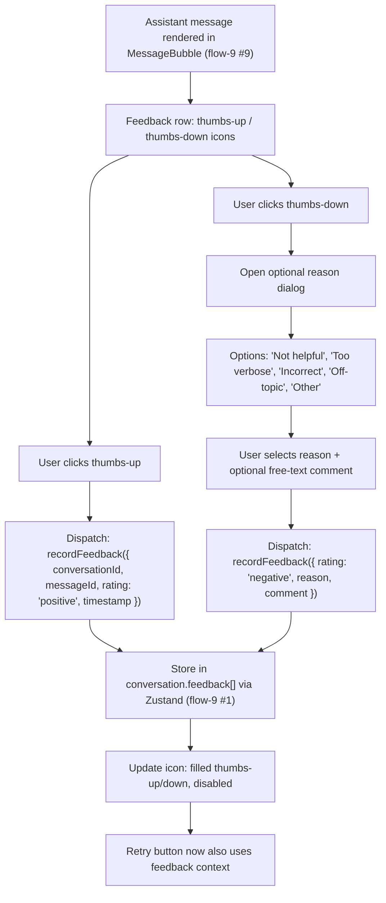
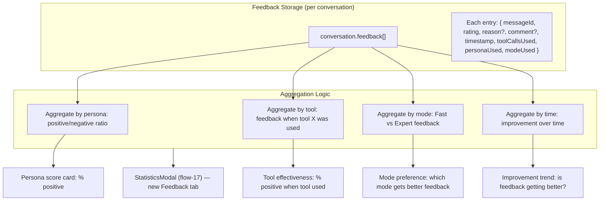
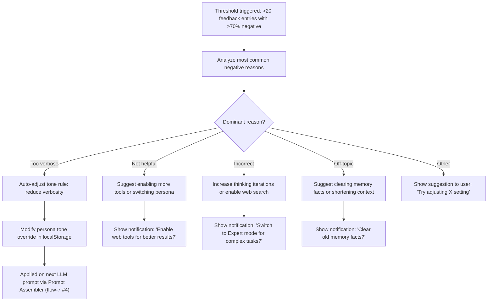
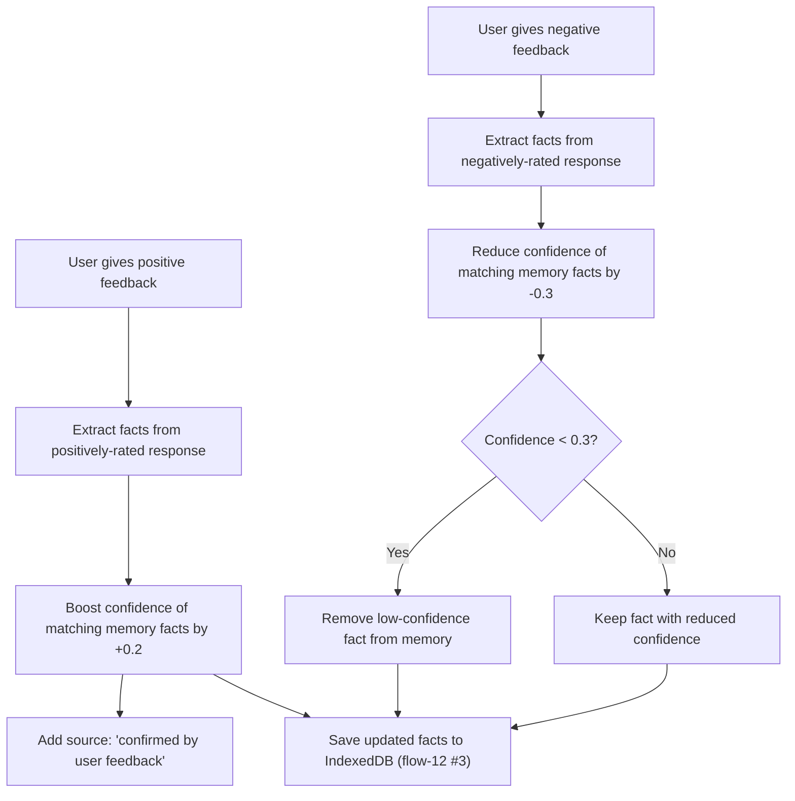
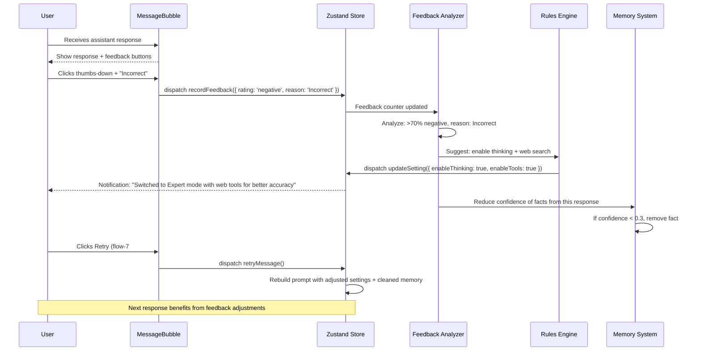
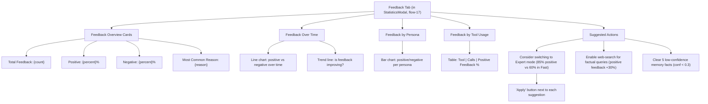
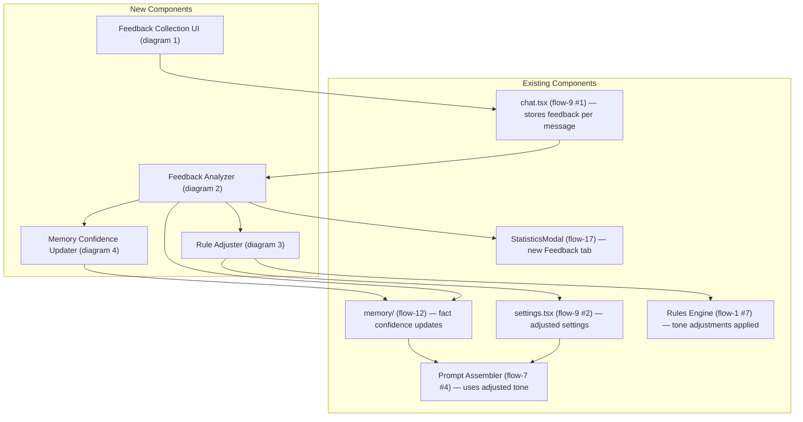

flow-18.md — Agent Feedback & Behavior Adaptation

---

1. Feedback Collection UI (MessageBubble Extension)

Explanation:

· Each assistant message bubble gets a feedback row with thumbs-up/down icons (see flow-9 #9 for MessageBubble rendering).
· Positive feedback is recorded instantly; negative feedback prompts for optional reason selection.
· Feedback is stored per-message in the conversation's feedback[] array in the Zustand chat store (see flow-9 #1).
· Once feedback is given, the icon is filled and disabled to prevent duplicate votes.
· The Retry action (see flow-7 #17) can use feedback context to improve the regeneration.

---

2. Feedback Storage & Aggregation

Explanation:

· Feedback entries store rich context: which tools were called, which persona was active, and which mode was used.
· Aggregation computes scores across four dimensions: persona, tool, mode, and time.
· Aggregated data is displayed in a new Feedback tab within the Statistics modal (see flow-17).
· No backend needed; all aggregation is client-side from Zustand + localStorage data.

---

3. Feedback-Driven Rule Adjustment

Explanation:

· When feedback crosses a configurable threshold (default: 20 entries, >70% negative), the system analyzes common reasons.
· Based on the dominant reason, the system auto-adjusts rules or suggests changes to the user.
· Tone adjustments are automatically applied to the persona override in localStorage (see flow-8 #10 for system prompt customization).
· Other adjustments show actionable notifications to the user.
· All adjustments feed into the Prompt Assembler (see flow-7 #4) on the next LLM call.

---

4. Feedback-Driven Memory Updates

Explanation:

· Feedback directly affects the long-term memory system (see flow-12 for memory architecture).
· Positively-rated responses boost the confidence of related facts, reinforcing correct information.
· Negatively-rated responses reduce confidence, eventually removing incorrect facts when confidence drops below 0.3.
· This creates a self-correcting memory system that learns from user feedback.
· All changes are persisted to IndexedDB via the memory store (see flow-12 #3).

---

5. Feedback Loop — End-to-End Flow

Explanation:

· End-to-end feedback loop shows the full lifecycle from user action to system adaptation.
· Negative feedback triggers immediate suggestions and optional auto-adjustments.
· Memory system is automatically cleaned based on feedback, ensuring accuracy over time.
· Retry actions (see flow-7 #17) benefit from adjusted settings and cleaned memory on the next generation.

---

6. Feedback Tab in StatisticsModal

Explanation:

· A new Feedback tab is added to the Statistics modal (see flow-17 for existing tabs).
· Provides comprehensive visualization of feedback trends over time, by persona, and by tool usage.
· Suggested actions are computed from feedback patterns and presented as actionable cards.
· Each suggestion has an "Apply" button that triggers the recommended action (e.g., switch mode, clear memory).
· All data is client-side, computed from the feedback entries stored in conversations.

---

7. Integration with Existing System

Explanation:

· All new feedback components integrate seamlessly with existing architecture.
· Feedback flows from UI → store → analyzer → rule/memory adjustments → prompt assembler.
· The Statistics modal gains a new tab without modifying existing tabs.
· No backend changes required; all processing is client-side.

---

End of flow-18.md. This covers the complete feedback loop system: collection UI, storage, aggregation, rule adjustment, memory updates, end-to-end flow, statistics integration, and system architecture. The agent now learns and adapts from user feedback, improving over time like a true personal AI agent.