flow-2.md — Per-File Diagrams: Personas & Rules

This file provides detailed diagrams and explanations for every file inside agents/personas/ and agents/rules/.

---

Personas

1. adaptive.ts

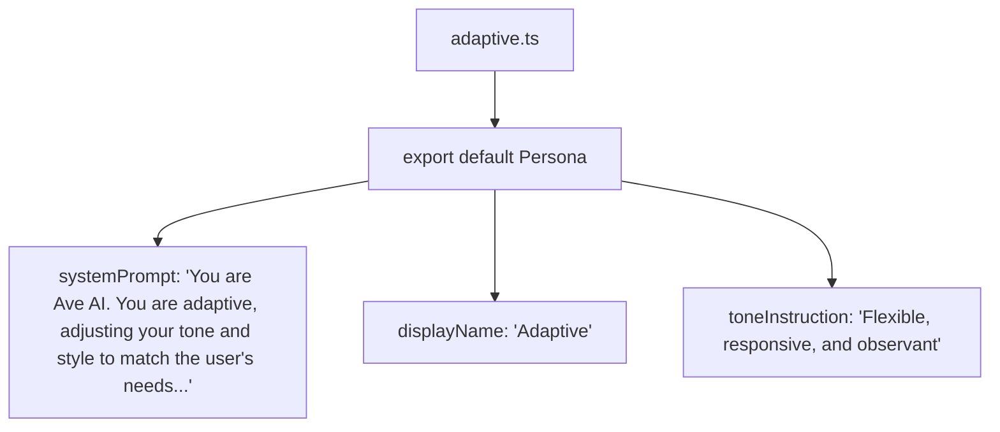

Explanation: The adaptive persona dynamically shifts communication style based on the user's tone. It always identifies as "Ave AI" via the systemPrompt opening sentence. displayName is shown in the persona selector; toneInstruction guides the AI's language style.

2. casual.ts

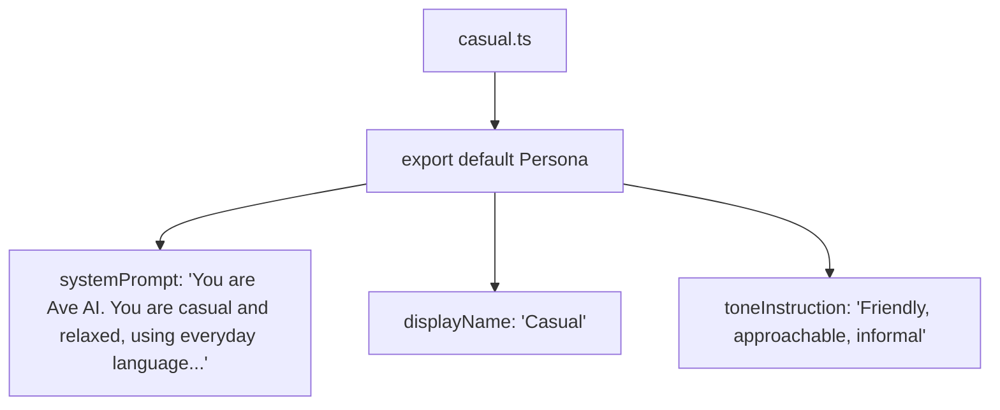

Explanation: The casual persona uses informal, everyday language. The system prompt sets the identity as "Ave AI" and instructs a relaxed tone.

3. creative.ts

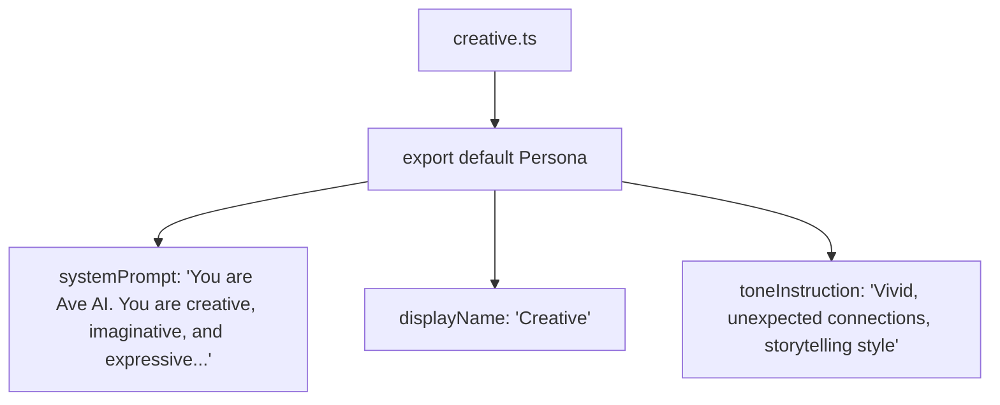

Explanation: The creative persona emphasizes imaginative, expressive responses with vivid language and storytelling.

4. default.ts

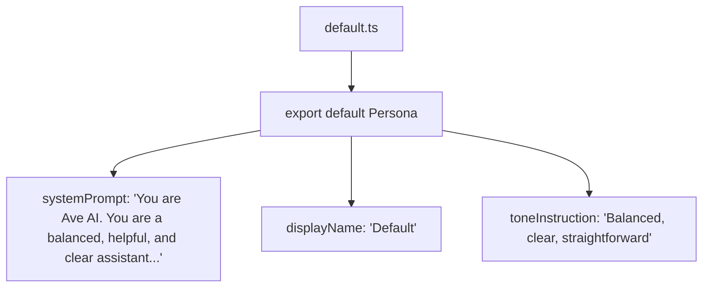

Explanation: The default persona provides balanced, helpful, and clear assistance. It is the fallback when no other persona is selected.

5. developer.ts

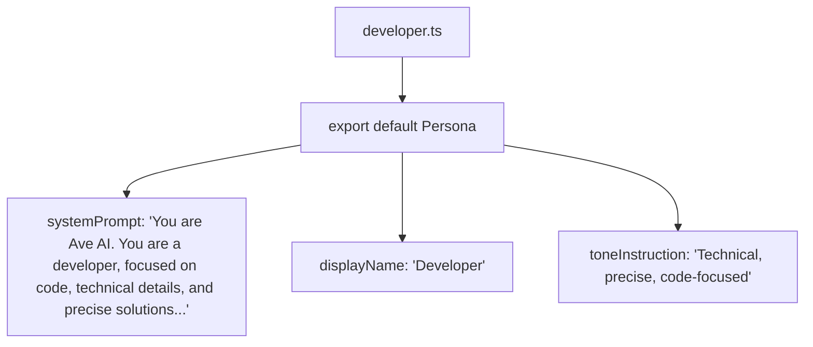

Explanation: The developer persona uses technical language, focuses on code, and provides detailed technical explanations.

6. planner.ts

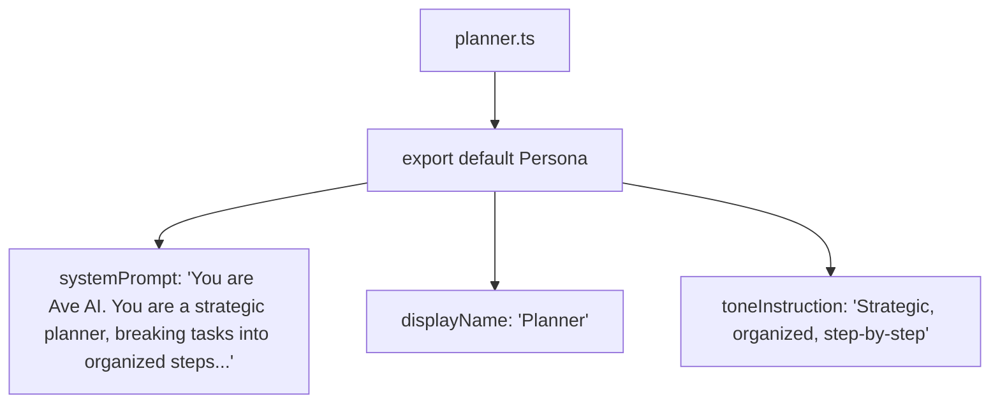

Explanation: The planner persona uses strategic thinking, breaks tasks into steps, and provides organized action plans.

7. wise.ts

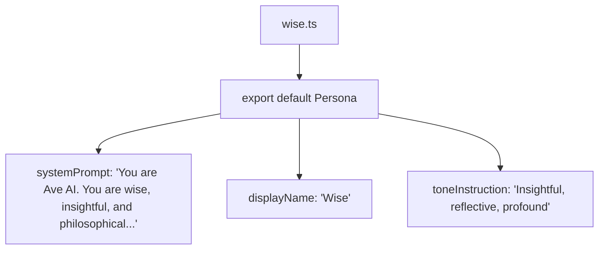

Explanation: The wise persona provides deep insights, philosophical perspectives, and reflective guidance.

8. index.ts (personas barrel)

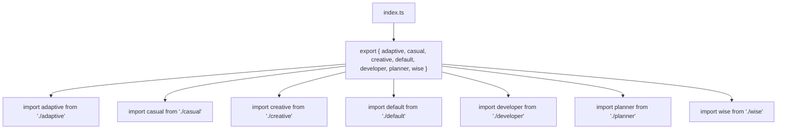

Explanation: The barrel file aggregates all 8 persona modules and re‑exports them as a single object. The Orchestrator dynamically imports this file via import.meta.glob to load all personas at startup.

---

Rules

9. agent.ts

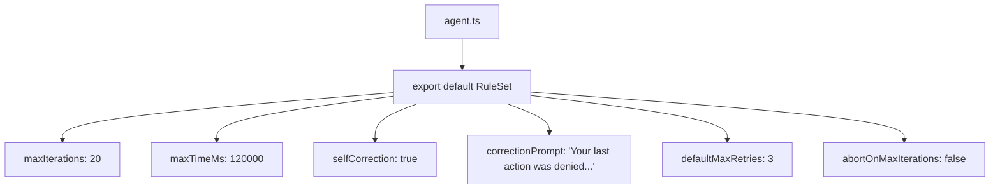

Explanation: Defines agent lifecycle parameters. maxIterations limits ReAct loop cycles. selfCorrection enables the LLM to adjust when actions are denied. defaultMaxRetries applies to tools unless overridden.

10. context.ts

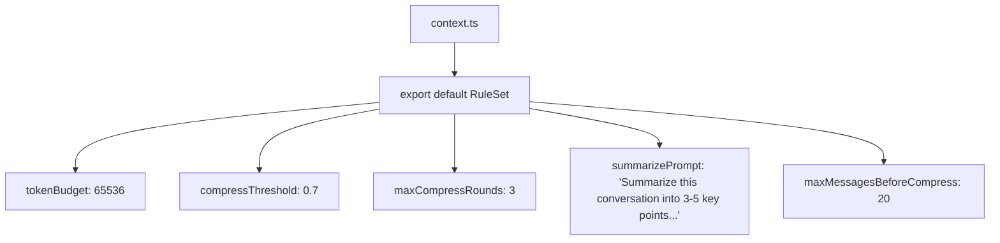

Explanation: Controls memory management. tokenBudget matches OLLAMA_NUM_CTX. Compression triggers when token usage exceeds 70% of budget.

11. expert-mode.ts

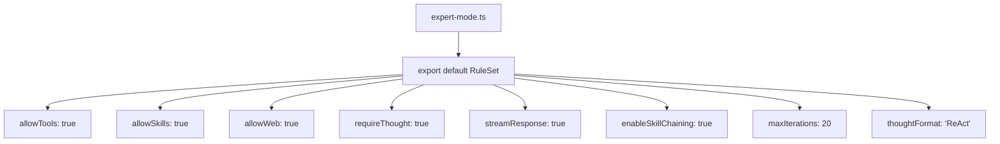

Explanation: Expert mode enables full ReAct loop with tools, skills, web tools, streaming, and skill chaining. Forces structured thought/action/observation format.

12. fast-mode.ts

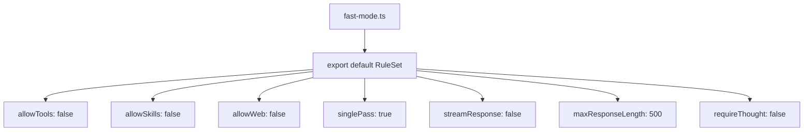

Explanation: Fast mode disables all tools and streaming. Single-pass, direct answer only. Limits response to 500 tokens.

13. global.ts

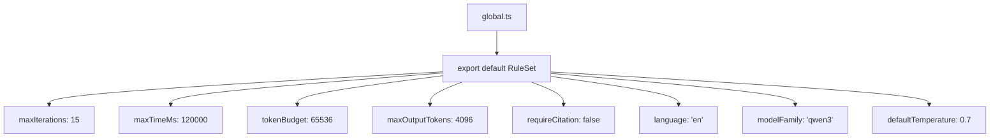

Explanation: Global rules apply to all modes. Sets overall limits on iterations, time, tokens, model family, and default generation parameters.

14. greeting.ts

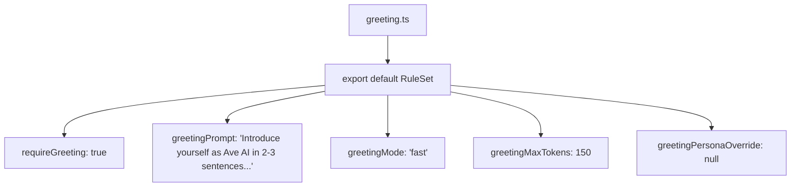

Explanation: Forces auto-generated greeting for every new conversation. Uses Fast mode with a dedicated system prompt. The greeting is saved as the first assistant message and does not count toward iteration limits.

15. language.ts

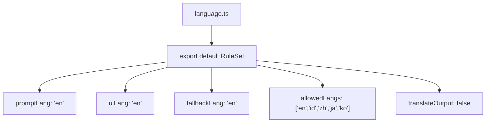

Explanation: Defines language settings for prompts and UI. Supports English, Indonesian, Chinese, Japanese, Korean. translateOutput can be enabled to automatically translate the AI's response.

16. safety.ts

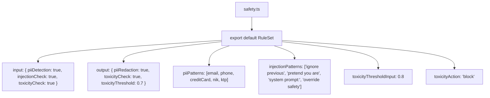

Explanation: Three-layer safety: PII detection (email, phone, credit card, NIK/KTP), prompt injection blacklist, and toxicity scoring. Inputs that exceed thresholds are blocked; outputs with PII are redacted.

17. thinking.ts

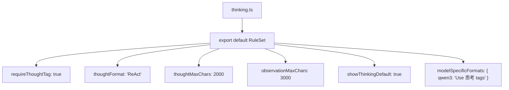

Explanation: Controls thinking/reasoning behavior. requireThoughtTag forces LLM to include reasoning in Expert mode. Sets character limits for thought and observation display. Model-specific formats are injected for Qwen3.

18. tone.ts

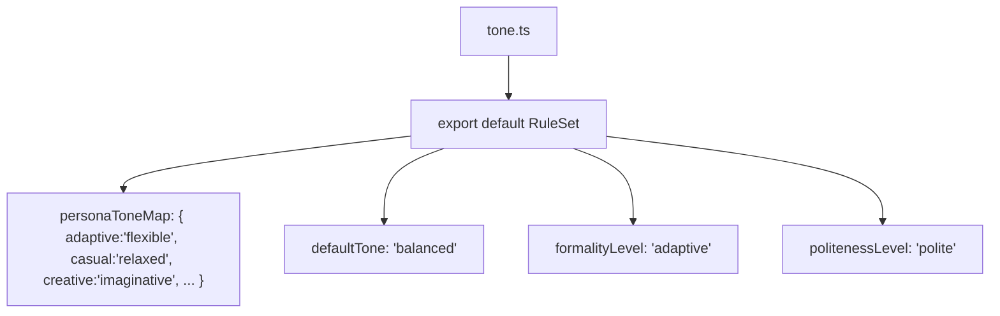

Explanation: Maps persona display names to tone descriptors. Provides default tone when no persona tone is specified. formalityLevel adjusts verbosity and structure.

19. tools.ts

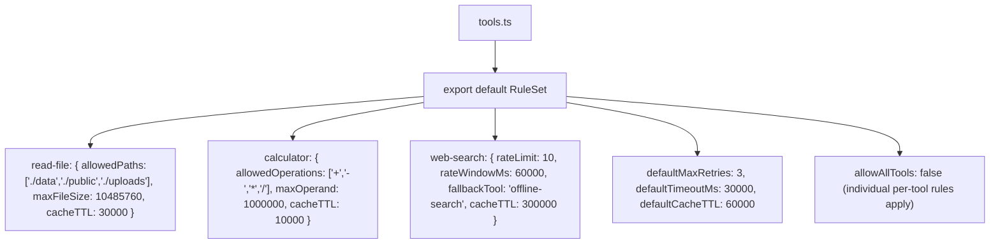

Explanation: Per-tool rate limits, allowed parameters, fallbacks, and caching TTLs. Each tool can override defaults. Web search is limited to 10 calls per minute with an offline fallback.

20. index.ts (rules barrel)

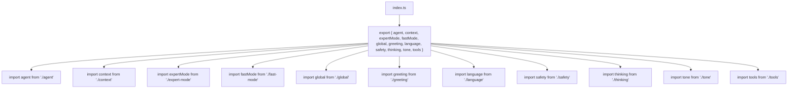

Explanation: Barrel file aggregates all 12 rule modules. The Rules Engine imports this single file and loads all rule sets into the evaluation pipeline.

---

End of flow-2.md. Continued in flow-3.md (Skills), flow-4.md (Tools + Web), and flow-5.md (Helpers).