flow-3.md — Per-File Diagrams: Skills & Tools

This file provides detailed diagrams and explanations for every file inside agents/skills/ and agents/tools/.

---

Skills

1. skills/ Folder Overview

```mermaid
graph TB
    SkillsDir["agents/skills/"] --> AutoSkills["auto-skills.ts"]
    SkillsDir --> Codex["codex.ts"]
    SkillsDir --> Mermaid["mermaid-diagram.ts"]
    SkillsDir --> PRD["prd.ts"]
    SkillsDir --> PythonStyle["python-code-style.ts"]
    SkillsDir --> SEO["seo.ts"]
    SkillsDir --> Summarize["summarize.ts"]
    SkillsDir --> TDD["tdd.ts"]
    SkillsDir --> Telegram["telegram-bot-builder.ts"]
    SkillsDir --> UIUX["ui-ux-designer.ts"]
    SkillsDir --> WebAppTest["web-app-testing.ts"]
    SkillsDir --> WebPerf["web-performance.ts"]
    SkillsDir --> WebQuality["web-quality.ts"]
    SkillsDir --> Index["index.ts (barrel)"]
```

Explanation: 14 skill files plus barrel export. Each skill is a composite workflow that orchestrates multiple tools or sub-skills sequentially. Skills are the building blocks for complex AI agent capabilities.

2. auto-skills.ts

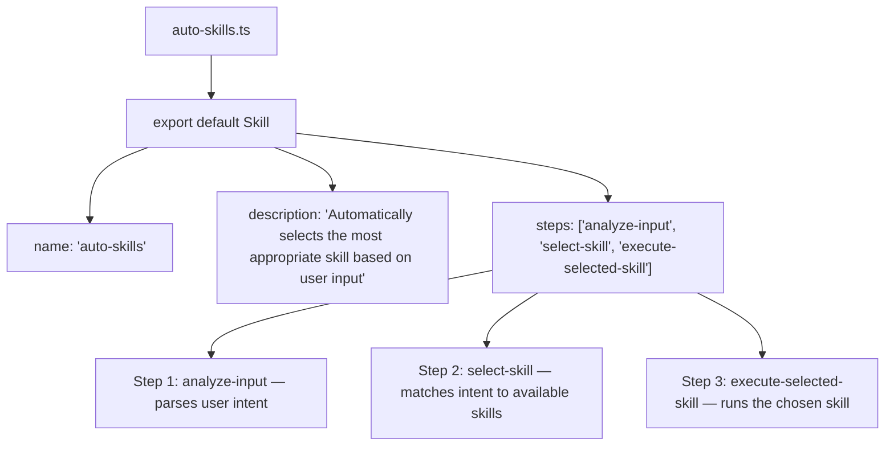

Explanation: Meta-skill that analyzes user input, identifies the most appropriate skill from the registry, and delegates execution. Acts as an intelligent router for skill selection.

3. codex.ts

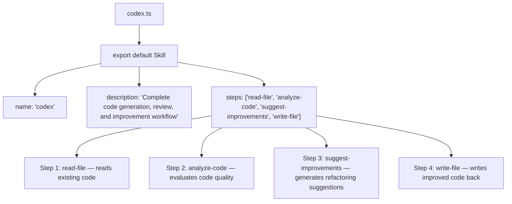

Explanation: Code generation and review pipeline. Reads existing code files, analyzes for improvements, generates suggestions, and writes the optimized code back to disk.

4. mermaid-diagram.ts

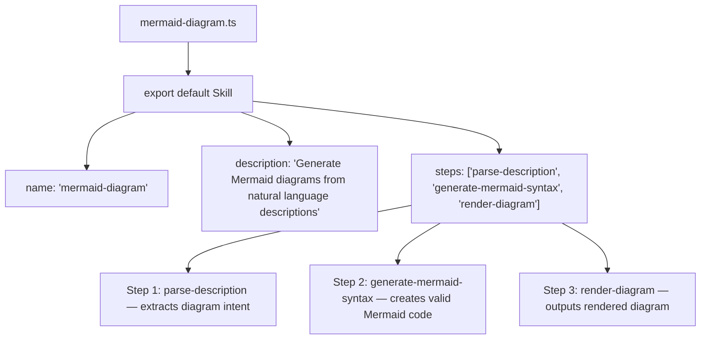

Explanation: Converts natural language descriptions into Mermaid diagram code. Parses user intent, generates valid Mermaid syntax, and renders the output via the diagram parser helper.

5. prd.ts

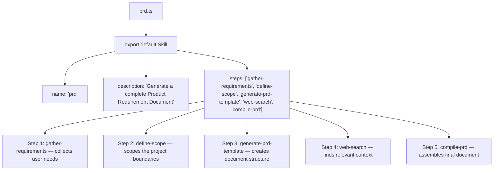

Explanation: Product Requirement Document generator. Gathers requirements from user input, scopes the project, searches the web for market context, and compiles a complete, structured PRD.

6. python-code-style.ts

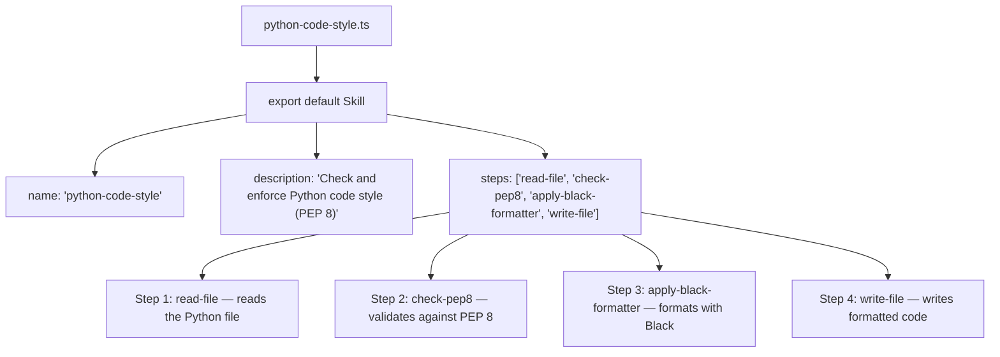

Explanation: Python code style checker and formatter. Reads Python files, checks against PEP 8 style guide, applies Black auto-formatting, and writes the corrected code back to the file.

7. seo.ts

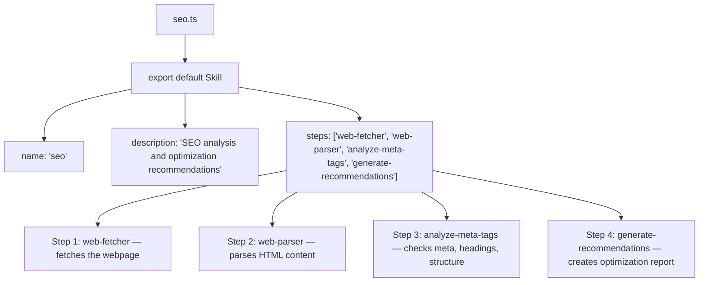

Explanation: SEO analysis workflow. Fetches a webpage, parses its HTML, analyzes meta tags, headings, content structure, and generates actionable optimization recommendations.

8. summarize.ts

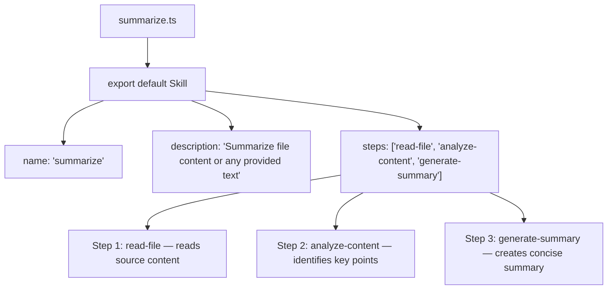

Explanation: Text summarization pipeline. Reads file content or provided text, identifies key points and themes, and generates a concise, well-structured summary.

9. tdd.ts

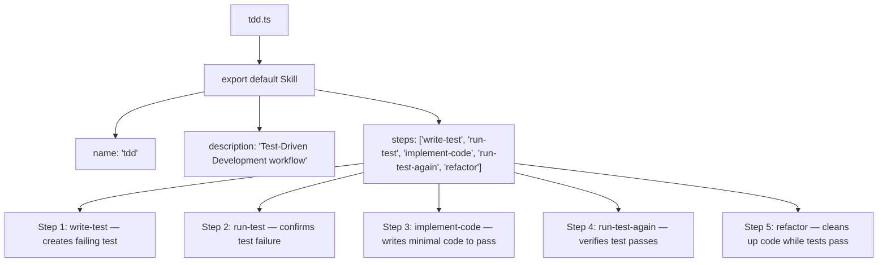

Explanation: Test-Driven Development workflow. Writes failing tests first, implements minimal code to pass them, runs tests again to confirm, and refactors for quality while maintaining passing tests.

10. telegram-bot-builder.ts

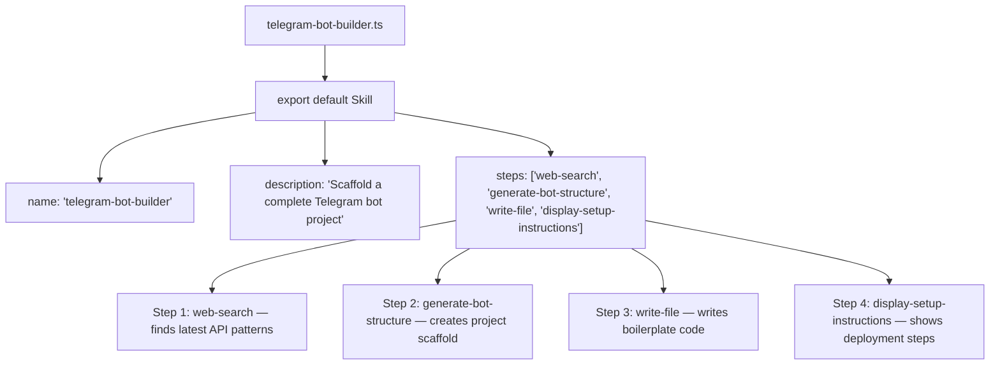

Explanation: Telegram bot project scaffolding. Searches for latest Telegram Bot API patterns, generates project folder structure, writes boilerplate code with handlers, and displays setup instructions for deployment.

11. ui-ux-designer.ts

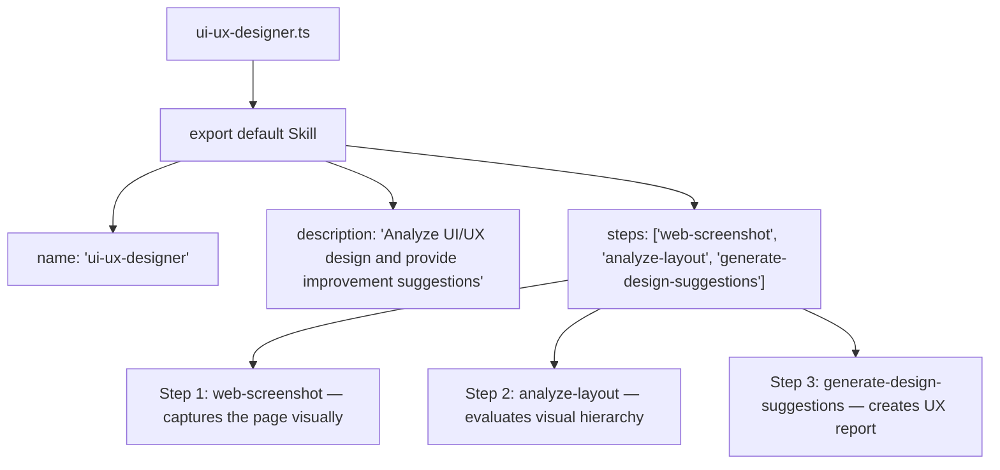

Explanation: UI/UX design analysis. Takes webpage screenshots, analyzes layout patterns, spacing, color usage, typography, and generates actionable design improvement suggestions.

12. web-app-testing.ts

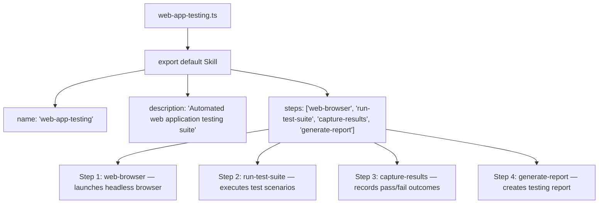

Explanation: Automated web testing. Launches headless browser, executes defined test scenarios against a web application, captures pass/fail results with screenshots, and generates a comprehensive testing report.

13. web-performance.ts

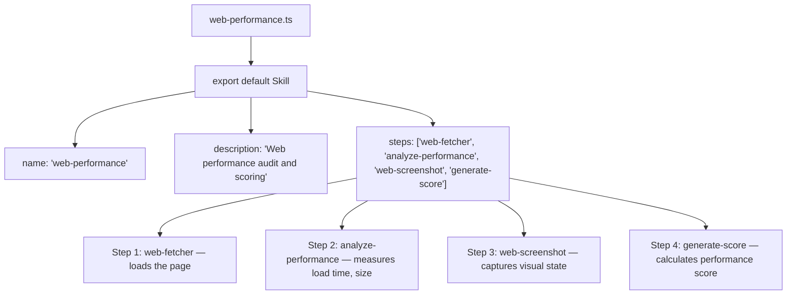

Explanation: Web performance audit. Fetches a page, analyzes load times, resource sizes, render-blocking resources, takes screenshots for visual comparison, and generates a performance score with recommendations.

14. web-quality.ts

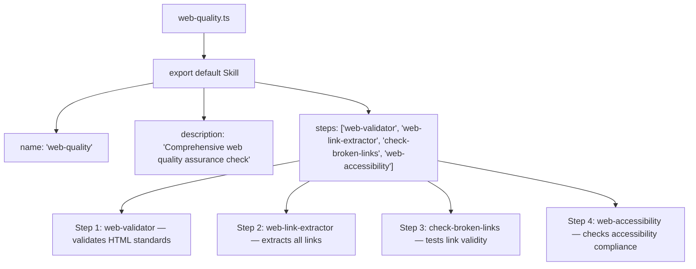

Explanation: Web quality assurance. Validates HTML markup, extracts and tests all links for broken URLs, and runs accessibility compliance checks against WCAG standards.

15. skills/index.ts

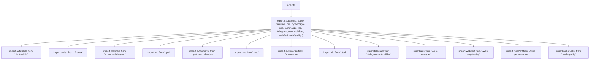

Explanation: Barrel file aggregates all 14 skill modules. The Orchestrator dynamically imports this file at startup and registers all skills in the global Skills Registry.

---

Tools

16. tools/ Folder Overview

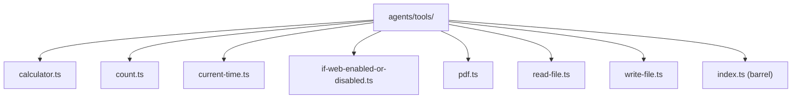

Explanation: 8 atomic tool files plus barrel export. Each tool is a self-contained module with Zod-validated parameters and a handler function that executes in a sandboxed environment.

17. calculator.ts

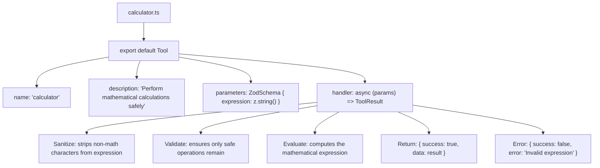

Explanation: Safe math evaluator. Strips non-math characters to prevent code injection, validates that only allowed operations remain, evaluates the expression, and returns the computed result.

18. count.ts

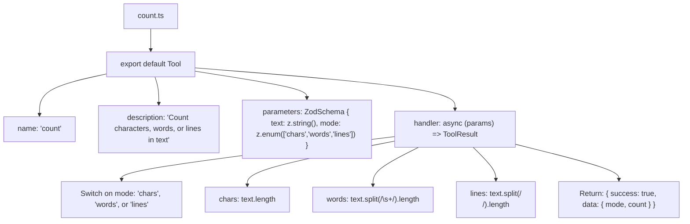

Explanation: Text counting utility. Supports three modes: character count, word count (splitting on whitespace), and line count (splitting on newlines). Returns the mode used and the resulting count.

19. current-time.ts

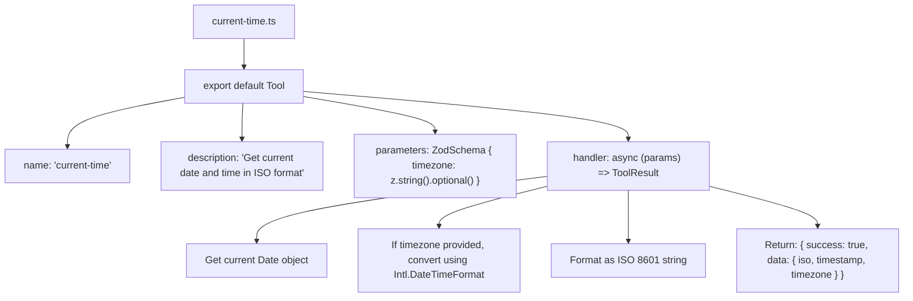

Explanation: Returns current date and time. Accepts an optional timezone string (e.g., 'Asia/Jakarta'). Uses Intl.DateTimeFormat for timezone conversion. Returns ISO 8601 formatted string with Unix timestamp.

20. if-web-enabled-or-disabled.ts

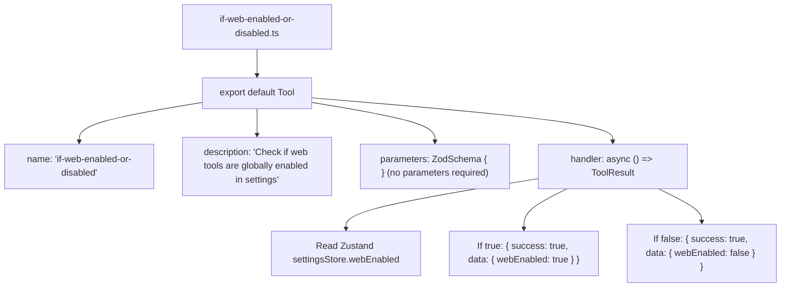

Explanation: Status checker that reads the webEnabled toggle from the Zustand settings store. Used by the LLM to determine if web operations are available before attempting web tool calls. Takes no parameters.

21. pdf.ts

```mermaid
graph TB
    PDF["pdf.ts"] --> Export["export default Tool"]
    Export --> Name["name: 'pdf'"]
    Export --> Desc["description: 'Read text from PDF files or generate new PDFs'"]
    Export --> Params["parameters: ZodSchema { action: z.enum(['read','generate']), content: z.string().optional(), path: z.string().optional() }"]
    Export --> Handler["handler: async (params) => ToolResult"]
    Handler --> ActionSwitch{"action type?"}
    ActionSwitch -->|"read"| ReadPDF["Read PDF: extract text from file at path"]
    ActionSwitch -->|"generate"| GenPDF["Generate PDF: create new PDF from content"]
    ReadPDF --> ValidatePath["Validate path in allowedPaths"]
    ReadPDF --> ExtractText["Use PDF parsing library to extract text"]
    GenPDF --> CreateDoc["Create PDF document with provided content"]
    GenPDF --> SaveFile["Save to specified path"]
```

Explanation: PDF manipulation tool. Can read and extract text from existing PDF files (within allowed paths) or generate new PDF documents from provided text content.

22. read-file.ts

```mermaid
graph TB
    ReadFile["read-file.ts"] --> Export["export default Tool"]
    Export --> Name["name: 'read-file'"]
    Export --> Desc["description: 'Read file contents from the filesystem'"]
    Export --> Params["parameters: ZodSchema { path: z.string().min(1) }"]
    Export --> Handler["handler: async (params) => ToolResult"]
    Handler --> CheckCache["Check cache: cache.get(toolName + hash(path))"]
    CheckCache -->|"Hit"| ReturnCached["Return cached content"]
    CheckCache -->|"Miss"| ValidatePath["Validate: is path in allowedPaths from rules/tools.ts?"]
    ValidatePath -->|"Invalid"| ReturnError["Return: { success: false, error: 'Path not allowed' }"]
    ValidatePath -->|"Valid"| CheckExist["Check: does file exist?"]
    CheckExist -->|"No"| FileNotFound["Return: { success: false, error: 'File not found' }"]
    CheckExist -->|"Yes"| CheckSize["Check: file size < maxFileSizeBytes?"]
    CheckSize -->|"No"| TooLarge["Return: { success: false, error: 'File too large' }"]
    CheckSize -->|"Yes"| ReadContent["Read file: fs.readFile(path, 'utf-8')"]
    ReadContent --> CacheResult["Cache: cache.set(key, content, cacheTTL)"]
    CacheResult --> Return["Return: { success: true, data: content }"]
```

Explanation: File reader with layered security. Checks cache first, then validates the path against allowedPaths in rules/tools.ts, verifies file existence, checks file size limits, reads with UTF-8 encoding, caches the result, and returns the content.

23. write-file.ts

```mermaid
graph TB
    WriteFile["write-file.ts"] --> Export["export default Tool"]
    Export --> Name["name: 'write-file'"]
    Export --> Desc["description: 'Write content to a file on the filesystem'"]
    Export --> Params["parameters: ZodSchema { path: z.string().min(1), content: z.string() }"]
    Export --> Handler["handler: async (params) => ToolResult"]
    Handler --> ValidatePath["Validate: is path in allowedPaths from rules/tools.ts?"]
    ValidatePath -->|"Invalid"| ReturnError["Return: { success: false, error: 'Path not allowed' }"]
    ValidatePath -->|"Valid"| CheckOverwrite["Check: does file already exist?"]
    CheckOverwrite --> Backup["If exists: create .bak backup"]
    CheckOverwrite --> Write["Write: fs.writeFile(path, content, 'utf-8')"]
    Write --> ClearCache["Cache: clear related cache entries"]
    ClearCache --> Verify["Verify: read back file to confirm write"]
    Verify -->|"OK"| ReturnSuccess["Return: { success: true, data: { path, size } }"]
    Verify -->|"Fail"| ReturnFail["Return: { success: false, error: 'Write verification failed' }"]
```

Explanation: File writer with safety measures. Validates the path against allowedPaths, creates a .bak backup if the file exists, writes the new content, clears related cache entries, and verifies the write by reading the file back.

24. tools/index.ts

```mermaid
graph TB
    Index["index.ts"] --> ReExport["export { calculator, count, currentTime, ifWebEnabled, pdf, readFile, writeFile }"]
    ReExport --> Import1["import calculator from './calculator'"]
    ReExport --> Import2["import count from './count'"]
    ReExport --> Import3["import currentTime from './current-time'"]
    ReExport --> Import4["import ifWebEnabled from './if-web-enabled-or-disabled'"]
    ReExport --> Import5["import pdf from './pdf'"]
    ReExport --> Import6["import readFile from './read-file'"]
    ReExport --> Import7["import writeFile from './write-file'"]
```

Explanation: Barrel file aggregates all 8 tool modules. The Orchestrator dynamically imports this file at startup and registers all tools in the global Tools Registry.

---

End of flow-3.md. Continued in flow-4.md (Web Tools) and flow-5.md (Helpers + Stores + Hooks).