flow-4.md — Per-File Diagrams: Web Tools (Part 1)

This file provides detailed diagrams and explanations for the first 16 files inside agents/web/.

---

Web Tools Overview

1. web/ Folder Structure (All 31 Files)

```mermaid
graph TB
    WebDir["agents/web/"] --> W1["web-api-caller.ts"]
    WebDir --> W2["web-authenticator.ts"]
    WebDir --> W3["web-browser.ts"]
    WebDir --> W4["web-cache-reader.ts"]
    WebDir --> W5["web-crawling.ts"]
    WebDir --> W6["web-diff.ts"]
    WebDir --> W7["web-downloader.ts"]
    WebDir --> W8["web-feed-parser.ts"]
    WebDir --> W9["web-fetcher.ts"]
    WebDir --> W10["web-form-submitter.ts"]
    WebDir --> W11["web-harvester.ts"]
    WebDir --> W12["web-headless-scraper.ts"]
    WebDir --> W13["web-link-extractor.ts"]
    WebDir --> W14["web-metadata-extractor.ts"]
    WebDir --> W15["web-monitor.ts"]
    WebDir --> W16["web-navigator.ts"]
    WebDir --> W17["web-paginator.ts"]
    WebDir --> W18["web-parser.ts"]
    WebDir --> W19["web-qrcode-reader.ts"]
    WebDir --> W20["web-reader.ts"]
    WebDir --> W21["web-robots-txt.ts"]
    WebDir --> W22["web-scraping.ts"]
    WebDir --> W23["web-screenshot.ts"]
    WebDir --> W24["web-search.ts"]
    WebDir --> W25["web-sitemap-parser.ts"]
    WebDir --> W26["web-socket-listener.ts"]
    WebDir --> W27["web-spider.ts"]
    WebDir --> W28["web-summarizer.ts"]
    WebDir --> W29["web-validator.ts"]
    WebDir --> W30["web-video-extractor.ts"]
    WebDir --> Index["index.ts (barrel)"]
```

Explanation: Thirty-one web automation tools provide comprehensive browser-based and HTTP-level capabilities. Each file exports a WebTool object with a Zod schema for parameters and an async handler function. Web tools are gated by the webEnabled setting in the Zustand settings store and by per-tool rate limits in rules/tools.ts.

---

2. web-api-caller.ts

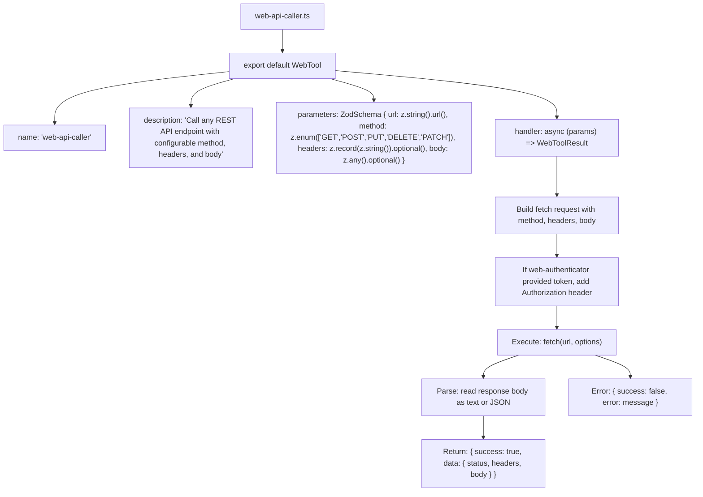
```mermaid
graph TB
    APICaller["web-api-caller.ts"] --> Export["export default WebTool"]
    Export --> Name["name: 'web-api-caller'"]
    Export --> Desc["description: 'Call any REST API endpoint with configurable method, headers, and body'"]
    Export --> Params["parameters: ZodSchema { url: z.string().url(), method: z.enum(['GET','POST','PUT','DELETE','PATCH']), headers: z.record(z.string()).optional(), body: z.any().optional() }"]
    Export --> Handler["handler: async (params) => WebToolResult"]
    Handler --> BuildRequest["Build fetch request with method, headers, body"]
    BuildRequest --> AddAuth["If web-authenticator provided token, add Authorization header"]
    AddAuth --> Execute["Execute: fetch(url, options)"]
    Execute --> ParseResponse["Parse: read response body as text or JSON"]
    ParseResponse --> Return["Return: { success: true, data: { status, headers, body } }"]
    Execute --> ErrorReturn["Error: { success: false, error: message }"]
```

Explanation: Generic REST API caller. Supports all standard HTTP methods. Automatically attaches authentication headers if web-authenticator was previously called. Parses JSON responses when Content-Type matches. Returns status code, response headers, and body. Subject to rate limits defined in rules/tools.ts.

---

3. web-authenticator.ts

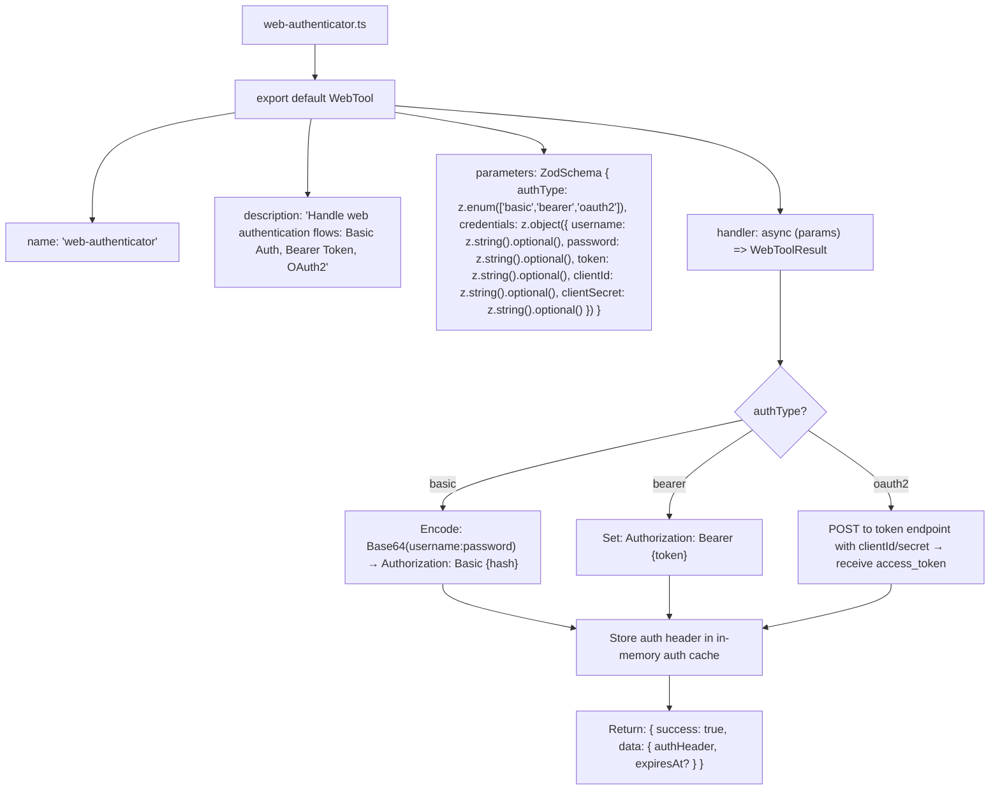
```mermaid
graph TB
    Auth["web-authenticator.ts"] --> Export["export default WebTool"]
    Export --> Name["name: 'web-authenticator'"]
    Export --> Desc["description: 'Handle web authentication flows: Basic Auth, Bearer Token, OAuth2'"]
    Export --> Params["parameters: ZodSchema { authType: z.enum(['basic','bearer','oauth2']), credentials: z.object({ username: z.string().optional(), password: z.string().optional(), token: z.string().optional(), clientId: z.string().optional(), clientSecret: z.string().optional() }) }"]
    Export --> Handler["handler: async (params) => WebToolResult"]
    Handler --> Switch{"authType?"}
    Switch -->|"basic"| BasicAuth["Encode: Base64(username:password) → Authorization: Basic {hash}"]
    Switch -->|"bearer"| BearerAuth["Set: Authorization: Bearer {token}"]
    Switch -->|"oauth2"| OAuthFlow["POST to token endpoint with clientId/secret → receive access_token"]
    BasicAuth --> StoreAuth["Store auth header in in-memory auth cache"]
    BearerAuth --> StoreAuth
    OAuthFlow --> StoreAuth
    StoreAuth --> Return["Return: { success: true, data: { authHeader, expiresAt? } }"]
```

Explanation: Authentication handler that generates authorization headers for subsequent web requests. Supports Basic Auth (Base64-encoded credentials), Bearer Token (pre-existing token), and OAuth2 client credentials flow. The generated auth header is stored in the tool result cache and automatically attached by web-api-caller and other web tools that make authenticated requests.

---

4. web-browser.ts

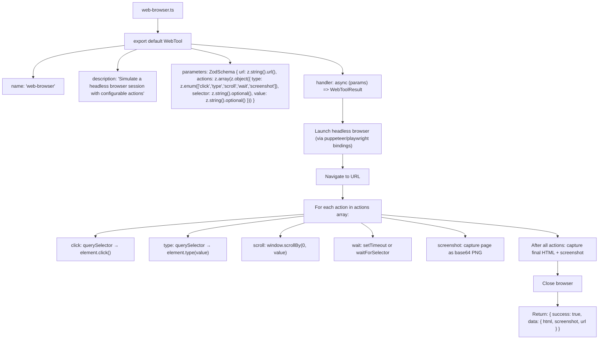
```mermaid
graph TB
    Browser["web-browser.ts"] --> Export["export default WebTool"]
    Export --> Name["name: 'web-browser'"]
    Export --> Desc["description: 'Simulate a headless browser session with configurable actions'"]
    Export --> Params["parameters: ZodSchema { url: z.string().url(), actions: z.array(z.object({ type: z.enum(['click','type','scroll','wait','screenshot']), selector: z.string().optional(), value: z.string().optional() })) }"]
    Export --> Handler["handler: async (params) => WebToolResult"]
    Handler --> Launch["Launch headless browser (via puppeteer/playwright bindings)"]
    Launch --> Navigate["Navigate to URL"]
    Navigate --> Loop["For each action in actions array:"]
    Loop --> ClickAction["click: querySelector → element.click()"]
    Loop --> TypeAction["type: querySelector → element.type(value)"]
    Loop --> ScrollAction["scroll: window.scrollBy(0, value)"]
    Loop --> WaitAction["wait: setTimeout or waitForSelector"]
    Loop --> ScreenshotAction["screenshot: capture page as base64 PNG"]
    Loop --> CaptureState["After all actions: capture final HTML + screenshot"]
    CaptureState --> Close["Close browser"]
    Close --> Return["Return: { success: true, data: { html, screenshot, url } }"]
```

Explanation: Headless browser automation using Puppeteer/Playwright bindings. Takes a starting URL and an ordered array of actions to execute: click elements by CSS selector, type text into inputs, scroll the page, wait for elements to appear, or capture screenshots mid-session. Returns the final page HTML and a screenshot after all actions complete.

---

5. web-cache-reader.ts

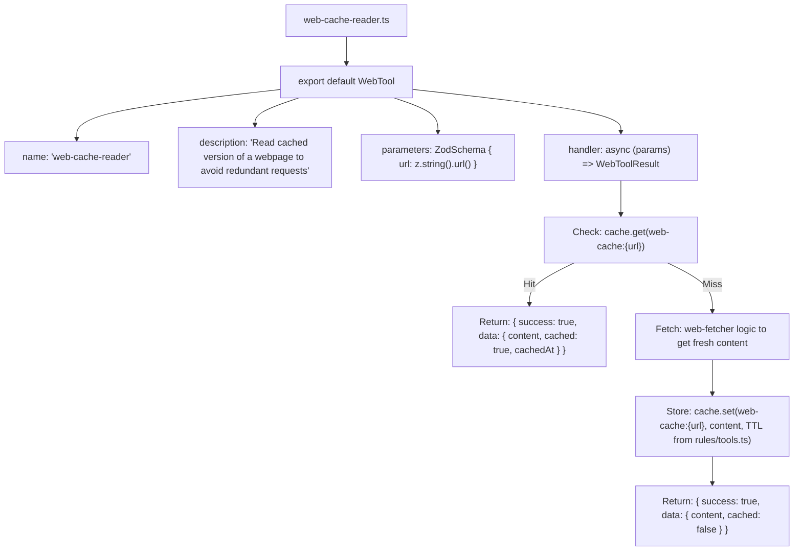
```mermaid
graph TB
    CacheReader["web-cache-reader.ts"] --> Export["export default WebTool"]
    Export --> Name["name: 'web-cache-reader'"]
    Export --> Desc["description: 'Read cached version of a webpage to avoid redundant requests'"]
    Export --> Params["parameters: ZodSchema { url: z.string().url() }"]
    Export --> Handler["handler: async (params) => WebToolResult"]
    Handler --> CheckLocalCache["Check: cache.get(web-cache:{url})"]
    CheckLocalCache -->|"Hit"| ReturnCached["Return: { success: true, data: { content, cached: true, cachedAt } }"]
    CheckLocalCache -->|"Miss"| FetchLive["Fetch: web-fetcher logic to get fresh content"]
    FetchLive --> StoreCache["Store: cache.set(web-cache:{url}, content, TTL from rules/tools.ts)"]
    StoreCache --> ReturnFresh["Return: { success: true, data: { content, cached: false } }"]
```

Explanation: Cache-first webpage reader. Checks the in-memory tool cache (with TTL from rules/tools.ts) before making a live HTTP request. Reduces duplicate network calls for frequently accessed URLs. Returns a cached: true/false flag so the caller knows if the data is fresh.

---

6. web-crawling.ts

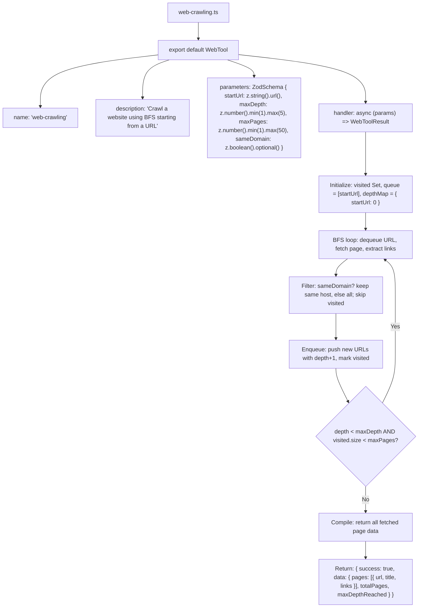
```mermaid
graph TB
    Crawling["web-crawling.ts"] --> Export["export default WebTool"]
    Export --> Name["name: 'web-crawling'"]
    Export --> Desc["description: 'Crawl a website using BFS starting from a URL'"]
    Export --> Params["parameters: ZodSchema { startUrl: z.string().url(), maxDepth: z.number().min(1).max(5), maxPages: z.number().min(1).max(50), sameDomain: z.boolean().optional() }"]
    Export --> Handler["handler: async (params) => WebToolResult"]
    Handler --> Init["Initialize: visited Set, queue = [startUrl], depthMap = { startUrl: 0 }"]
    Init --> BFSLoop["BFS loop: dequeue URL, fetch page, extract links"]
    BFSLoop --> FilterLinks["Filter: sameDomain? keep same host, else all; skip visited"]
    FilterLinks --> Enqueue["Enqueue: push new URLs with depth+1, mark visited"]
    Enqueue --> CheckLimits{"depth < maxDepth AND visited.size < maxPages?"}
    CheckLimits -->|"Yes"| BFSLoop
    CheckLimits -->|"No"| Compile["Compile: return all fetched page data"]
    Compile --> Return["Return: { success: true, data: { pages: [{ url, title, links }], totalPages, maxDepthReached } }"]
```

Explanation: BFS-based web crawler. Starts from a given URL, extracts all links from each page, filters by domain if sameDomain is true, and continues crawling until depth or page count limits are hit. Returns a structured list of crawled pages with their titles and outgoing links. Maximum depth of 5 and 50 pages per crawl.

---

7. web-diff.ts

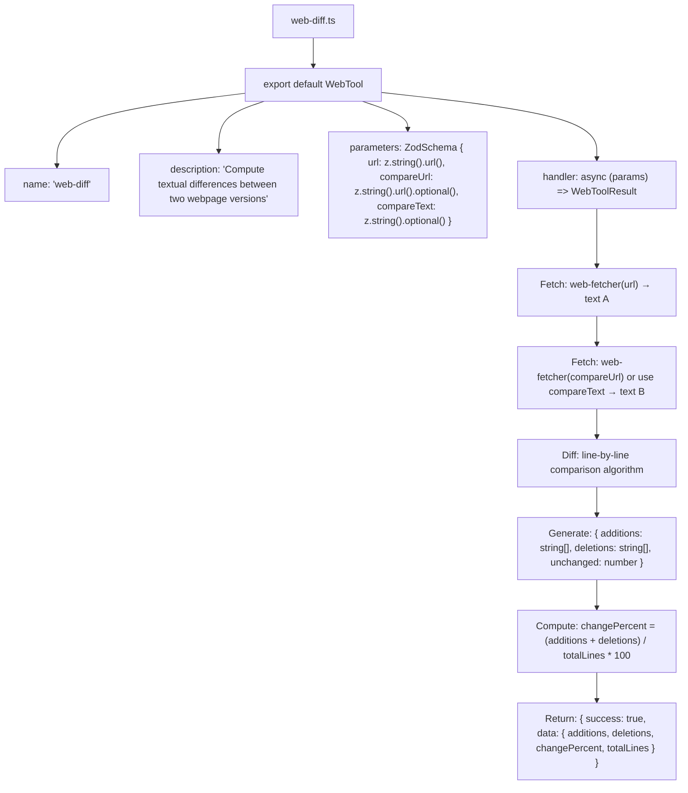
```mermaid
graph TB
    Diff["web-diff.ts"] --> Export["export default WebTool"]
    Export --> Name["name: 'web-diff'"]
    Export --> Desc["description: 'Compute textual differences between two webpage versions'"]
    Export --> Params["parameters: ZodSchema { url: z.string().url(), compareUrl: z.string().url().optional(), compareText: z.string().optional() }"]
    Export --> Handler["handler: async (params) => WebToolResult"]
    Handler --> FetchA["Fetch: web-fetcher(url) → text A"]
    FetchA --> FetchB["Fetch: web-fetcher(compareUrl) or use compareText → text B"]
    FetchB --> DiffAlgo["Diff: line-by-line comparison algorithm"]
    DiffAlgo --> Generate["Generate: { additions: string[], deletions: string[], unchanged: number }"]
    Generate --> ComputePercent["Compute: changePercent = (additions + deletions) / totalLines * 100"]
    ComputePercent --> Return["Return: { success: true, data: { additions, deletions, changePercent, totalLines } }"]
```

Explanation: Webpage diff tool. Compares two URLs (or a URL against provided text) and computes line-by-line differences. Returns arrays of added and removed lines along with a percentage change metric. Useful for monitoring page updates or comparing staging vs. production.

---

8. web-downloader.ts

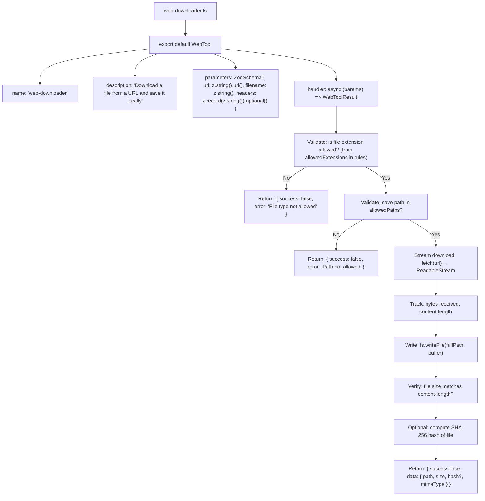
```mermaid
graph TB
    Downloader["web-downloader.ts"] --> Export["export default WebTool"]
    Export --> Name["name: 'web-downloader'"]
    Export --> Desc["description: 'Download a file from a URL and save it locally'"]
    Export --> Params["parameters: ZodSchema { url: z.string().url(), filename: z.string(), headers: z.record(z.string()).optional() }"]
    Export --> Handler["handler: async (params) => WebToolResult"]
    Handler --> ValidateExt["Validate: is file extension allowed? (from allowedExtensions in rules)"]
    ValidateExt -->|"No"| ExtError["Return: { success: false, error: 'File type not allowed' }"]
    ValidateExt -->|"Yes"| ValidatePath["Validate: save path in allowedPaths?"]
    ValidatePath -->|"No"| PathError["Return: { success: false, error: 'Path not allowed' }"]
    ValidatePath -->|"Yes"| StreamDL["Stream download: fetch(url) → ReadableStream"]
    StreamDL --> TrackProgress["Track: bytes received, content-length"]
    TrackProgress --> WriteFile["Write: fs.writeFile(fullPath, buffer)"]
    WriteFile --> VerifySize["Verify: file size matches content-length?"]
    VerifySize --> CheckHash["Optional: compute SHA-256 hash of file"]
    CheckHash --> Return["Return: { success: true, data: { path, size, hash?, mimeType } }"]
```

Explanation: File downloader with security checks. Validates the file extension against an allowlist, checks the save path against allowedPaths, streams the download while tracking progress, verifies the downloaded file size matches the Content-Length header, and optionally computes a SHA-256 hash. Returns file metadata including MIME type.

---

9. web-feed-parser.ts

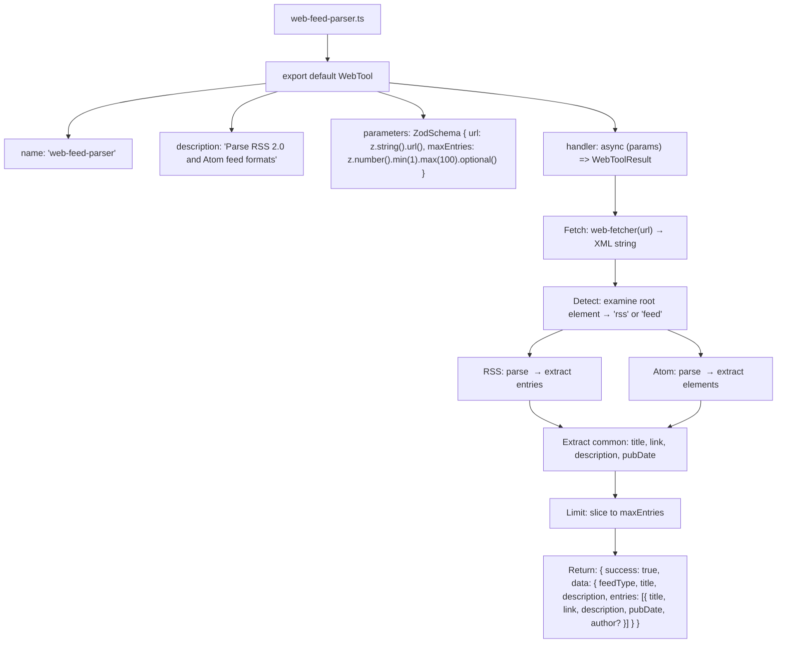
```mermaid
graph TB
    FeedParser["web-feed-parser.ts"] --> Export["export default WebTool"]
    Export --> Name["name: 'web-feed-parser'"]
    Export --> Desc["description: 'Parse RSS 2.0 and Atom feed formats'"]
    Export --> Params["parameters: ZodSchema { url: z.string().url(), maxEntries: z.number().min(1).max(100).optional() }"]
    Export --> Handler["handler: async (params) => WebToolResult"]
    Handler --> Fetch["Fetch: web-fetcher(url) → XML string"]
    Fetch --> DetectType["Detect: examine root element → 'rss' or 'feed'"]
    DetectType --> ParseRSS["RSS: parse <channel> → extract <item> entries"]
    DetectType --> ParseAtom["Atom: parse <feed> → extract <entry> elements"]
    ParseRSS --> ExtractCommon["Extract common: title, link, description, pubDate"]
    ParseAtom --> ExtractCommon
    ExtractCommon --> Limit["Limit: slice to maxEntries"]
    Limit --> Return["Return: { success: true, data: { feedType, title, description, entries: [{ title, link, description, pubDate, author? }] } }"]
```

Explanation: RSS/Atom feed parser. Detects feed type by examining the XML root element, then applies the appropriate parser. Extracts feed-level metadata (title, description) and individual entries (title, link, description, publication date, author). Limits results to maxEntries (default 20).

---

10. web-fetcher.ts

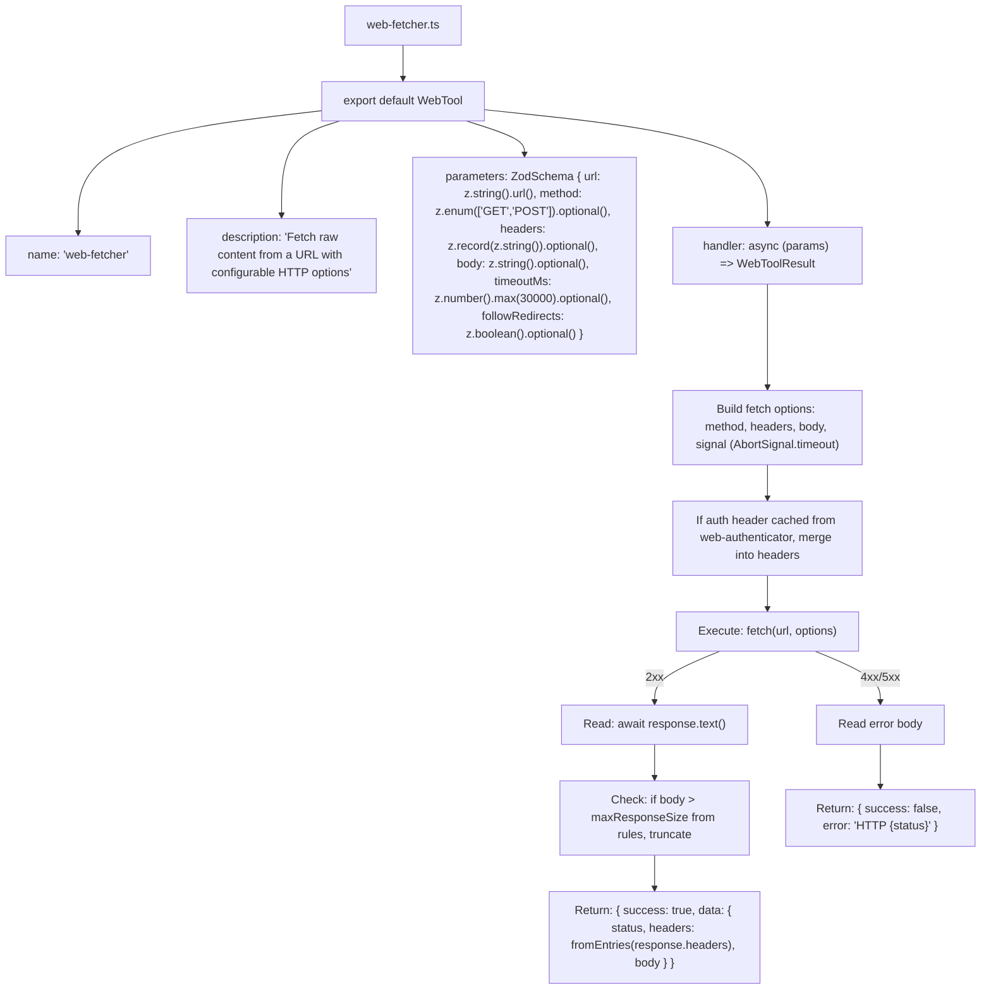
```mermaid
graph TB
    Fetcher["web-fetcher.ts"] --> Export["export default WebTool"]
    Export --> Name["name: 'web-fetcher'"]
    Export --> Desc["description: 'Fetch raw content from a URL with configurable HTTP options'"]
    Export --> Params["parameters: ZodSchema { url: z.string().url(), method: z.enum(['GET','POST']).optional(), headers: z.record(z.string()).optional(), body: z.string().optional(), timeoutMs: z.number().max(30000).optional(), followRedirects: z.boolean().optional() }"]
    Export --> Handler["handler: async (params) => WebToolResult"]
    Handler --> BuildOpts["Build fetch options: method, headers, body, signal (AbortSignal.timeout)"]
    BuildOpts --> CheckAuth["If auth header cached from web-authenticator, merge into headers"]
    CheckAuth --> Execute["Execute: fetch(url, options)"]
    Execute -->|"2xx"| ReadBody["Read: await response.text()"]
    ReadBody --> CheckSize["Check: if body > maxResponseSize from rules, truncate"]
    CheckSize --> ReturnOK["Return: { success: true, data: { status, headers: fromEntries(response.headers), body } }"]
    Execute -->|"4xx/5xx"| ReadErrorBody["Read error body"]
    ReadErrorBody --> ReturnError["Return: { success: false, error: 'HTTP {status}' }"]
```

Explanation: Core HTTP fetching tool. Supports GET and POST methods with custom headers and body. Automatically attaches cached authentication headers from web-authenticator. Uses AbortSignal.timeout for configurable timeouts (max 30 seconds). Follows redirects by default (configurable). Truncates response bodies exceeding the configured maximum size. Returns status code, response headers, and body.

---

11. web-form-submitter.ts

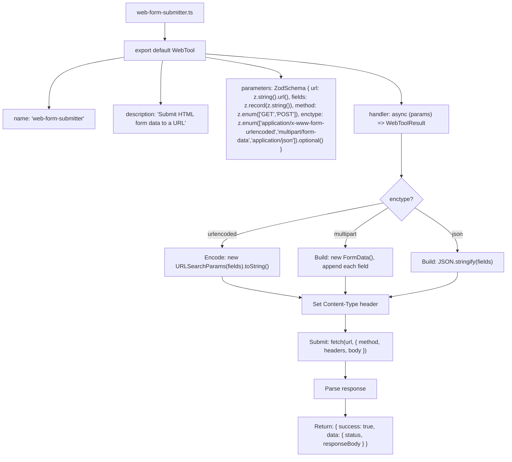
```mermaid
graph TB
    FormSubmit["web-form-submitter.ts"] --> Export["export default WebTool"]
    Export --> Name["name: 'web-form-submitter'"]
    Export --> Desc["description: 'Submit HTML form data to a URL'"]
    Export --> Params["parameters: ZodSchema { url: z.string().url(), fields: z.record(z.string()), method: z.enum(['GET','POST']), enctype: z.enum(['application/x-www-form-urlencoded','multipart/form-data','application/json']).optional() }"]
    Export --> Handler["handler: async (params) => WebToolResult"]
    Handler --> Encode{"enctype?"}
    Encode -->|"urlencoded"| URLEncode["Encode: new URLSearchParams(fields).toString()"]
    Encode -->|"multipart"| FormData["Build: new FormData(), append each field"]
    Encode -->|"json"| JSONEncode["Build: JSON.stringify(fields)"]
    URLEncode --> SetHeader["Set Content-Type header"]
    FormData --> SetHeader
    JSONEncode --> SetHeader
    SetHeader --> Submit["Submit: fetch(url, { method, headers, body })"]
    Submit --> Parse["Parse response"]
    Parse --> Return["Return: { success: true, data: { status, responseBody } }"]
```

Explanation: HTML form submission tool. Encodes form fields in the requested format (URL-encoded, multipart form data, or JSON). Sets the appropriate Content-Type header and submits via the specified HTTP method. Returns the server's response status and body.

---

12. web-harvester.ts

```mermaid
graph TB
    Harvester["web-harvester.ts"] --> Export["export default WebTool"]
    Export --> Name["name: 'web-harvester'"]
    Export --> Desc["description: 'Harvest specific data patterns (emails, phones, prices) from web pages'"]
    Export --> Params["parameters: ZodSchema { url: z.string().url(), patterns: z.array(z.enum(['email','phone','url','price','date','custom'])), customRegex: z.string().optional() }"]
    Export --> Handler["handler: async (params) => WebToolResult"]
    Handler --> Fetch["Fetch: web-fetcher(url) → HTML body"]
    Fetch --> Loop["For each pattern in patterns:"]
    Loop --> Email["email: /[a-zA-Z0-9._%+-]+@[a-zA-Z0-9.-]+\.[a-zA-Z]{2,}/g"]
    Loop --> Phone["phone: multiple international formats"]
    Loop --> URLRegex["url: /https?:\/\/[^\s<>\"']+/g"]
    Loop --> Price["price: /\$\d{1,3}(,\d{3})*(\.\d{2})?/g etc."]
    Loop --> Date["date: ISO 8601 + common formats"]
    Loop --> Custom["custom: user-provided regex"]
    Loop --> Collect["Collect all matches in a Set"]
    Collect --> Dedupe["Deduplicate: unique values only"]
    Dedupe --> Return["Return: { success: true, data: { patternResults: { email: string[], phone: string[], ... } } }"]
```

Explanation: Data pattern harvester. Scans webpage HTML for common data patterns using pre-defined regex patterns: email addresses, phone numbers (international formats), URLs, prices (multiple currency formats), dates (ISO 8601 and common formats), and custom regex patterns. Removes duplicates and returns organized results by pattern type.

---

13. web-headless-scraper.ts

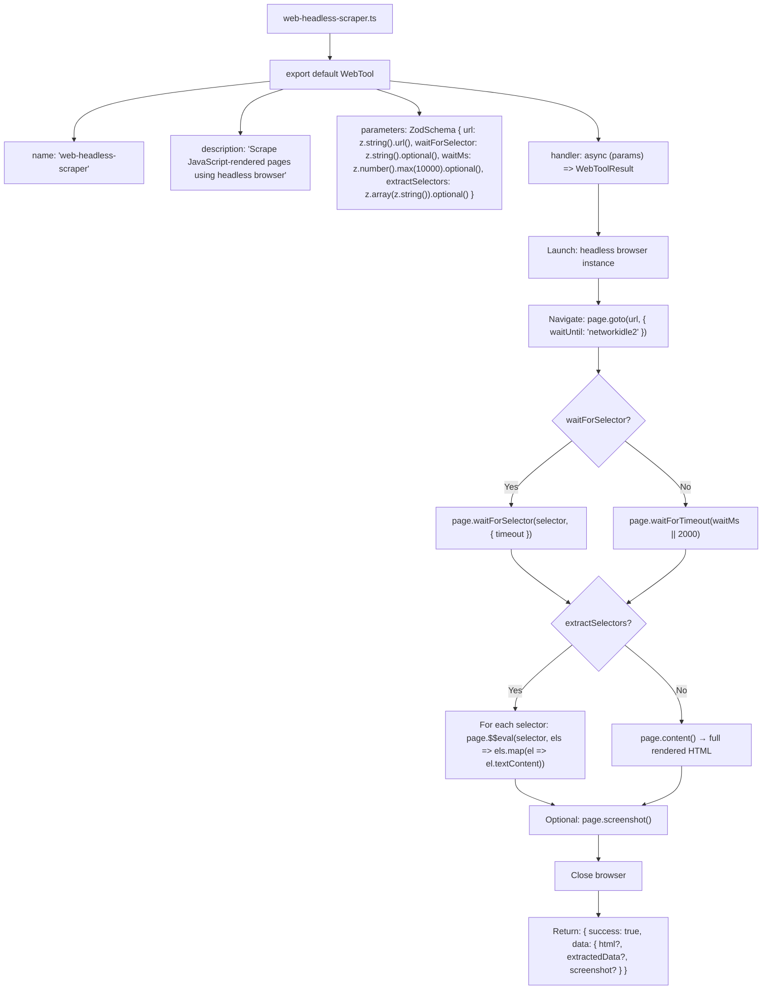
```mermaid
graph TB
    Headless["web-headless-scraper.ts"] --> Export["export default WebTool"]
    Export --> Name["name: 'web-headless-scraper'"]
    Export --> Desc["description: 'Scrape JavaScript-rendered pages using headless browser'"]
    Export --> Params["parameters: ZodSchema { url: z.string().url(), waitForSelector: z.string().optional(), waitMs: z.number().max(10000).optional(), extractSelectors: z.array(z.string()).optional() }"]
    Export --> Handler["handler: async (params) => WebToolResult"]
    Handler --> Launch["Launch: headless browser instance"]
    Launch --> Navigate["Navigate: page.goto(url, { waitUntil: 'networkidle2' })"]
    Navigate --> Wait{"waitForSelector?"}
    Wait -->|"Yes"| WaitSelector["page.waitForSelector(selector, { timeout })"]
    Wait -->|"No"| Sleep["page.waitForTimeout(waitMs || 2000)"]
    WaitSelector --> Extract
    Sleep --> Extract{"extractSelectors?"}
    Extract -->|"Yes"| ExtractBySelector["For each selector: page.$$eval(selector, els => els.map(el => el.textContent))"]
    Extract -->|"No"| FullHTML["page.content() → full rendered HTML"]
    ExtractBySelector --> Screenshot["Optional: page.screenshot()"]
    FullHTML --> Screenshot
    Screenshot --> Close["Close browser"]
    Close --> Return["Return: { success: true, data: { html?, extractedData?, screenshot? } }"]
```

Explanation: Headless scraper for JavaScript-rendered Single Page Applications. Launches a real browser, waits for the page to fully render (network idle), optionally waits for a specific CSS selector to appear, then extracts content either by specific selectors or as the full rendered HTML. Can capture a screenshot. Essential for scraping modern React/Angular/Vue websites.

---

14. web-link-extractor.ts

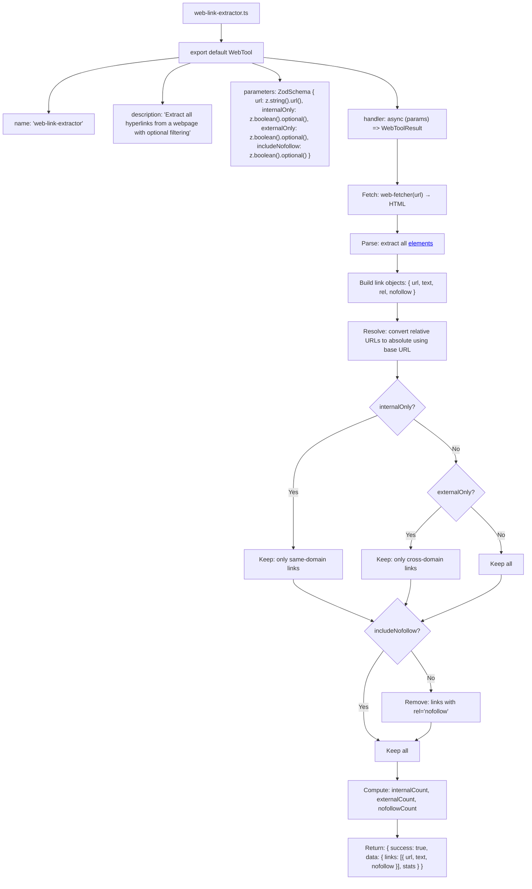
```mermaid
graph TB
    LinkExtractor["web-link-extractor.ts"] --> Export["export default WebTool"]
    Export --> Name["name: 'web-link-extractor'"]
    Export --> Desc["description: 'Extract all hyperlinks from a webpage with optional filtering'"]
    Export --> Params["parameters: ZodSchema { url: z.string().url(), internalOnly: z.boolean().optional(), externalOnly: z.boolean().optional(), includeNofollow: z.boolean().optional() }"]
    Export --> Handler["handler: async (params) => WebToolResult"]
    Handler --> Fetch["Fetch: web-fetcher(url) → HTML"]
    Fetch --> Parse["Parse: extract all <a href='...'> elements"]
    Parse --> BuildLinks["Build link objects: { url, text, rel, nofollow }"]
    BuildLinks --> Resolve["Resolve: convert relative URLs to absolute using base URL"]
    Resolve --> FilterInternal{"internalOnly?"}
    FilterInternal -->|"Yes"| KeepInternal["Keep: only same-domain links"]
    FilterInternal -->|"No"| FilterExternal{"externalOnly?"}
    FilterExternal -->|"Yes"| KeepExternal["Keep: only cross-domain links"]
    FilterExternal -->|"No"| AllLinks["Keep all"]
    KeepInternal --> FilterNofollow{"includeNofollow?"}
    KeepExternal --> FilterNofollow
    AllLinks --> FilterNofollow
    FilterNofollow -->|"No"| RemoveNofollow["Remove: links with rel='nofollow'"]
    FilterNofollow -->|"Yes"| Done["Keep all"]
    RemoveNofollow --> Done
    Done --> Stats["Compute: internalCount, externalCount, nofollowCount"]
    Stats --> Return["Return: { success: true, data: { links: [{ url, text, nofollow }], stats } }"]
```

Explanation: Hyperlink extractor. Parses all <a> tags from a webpage, resolves relative URLs to absolute, and provides flexible filtering: internal links only (same domain), external links only (cross-domain), include/exclude nofollow links. Returns link objects with text, URL, nofollow status, and aggregate statistics.

---

15. web-metadata-extractor.ts

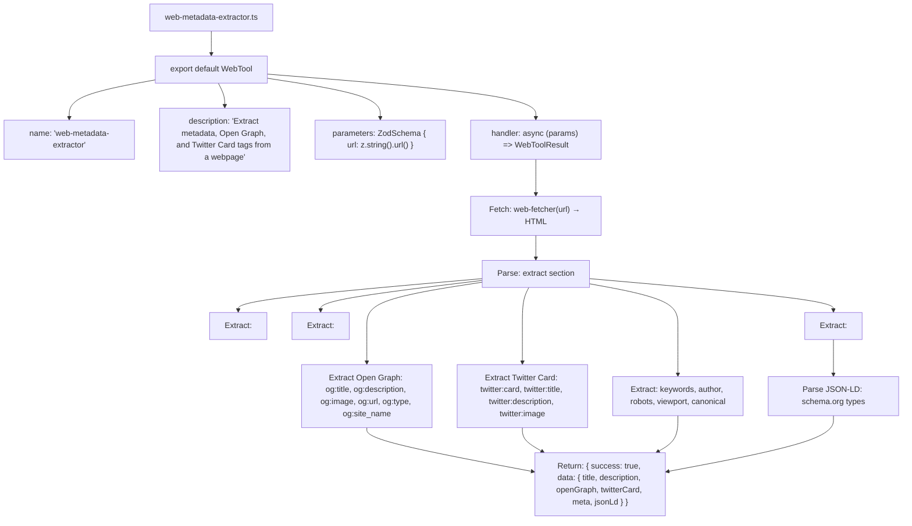
```mermaid
graph TB
    Metadata["web-metadata-extractor.ts"] --> Export["export default WebTool"]
    Export --> Name["name: 'web-metadata-extractor'"]
    Export --> Desc["description: 'Extract metadata, Open Graph, and Twitter Card tags from a webpage'"]
    Export --> Params["parameters: ZodSchema { url: z.string().url() }"]
    Export --> Handler["handler: async (params) => WebToolResult"]
    Handler --> Fetch["Fetch: web-fetcher(url) → HTML"]
    Fetch --> ParseHead["Parse: extract <head> section"]
    ParseHead --> TitleTag["Extract: <title> tag text"]
    ParseHead --> MetaDesc["Extract: <meta name='description' content='...'>"]
    ParseHead --> OGTags["Extract Open Graph: og:title, og:description, og:image, og:url, og:type, og:site_name"]
    ParseHead --> TwitterTags["Extract Twitter Card: twitter:card, twitter:title, twitter:description, twitter:image"]
    ParseHead --> OtherMeta["Extract: keywords, author, robots, viewport, canonical"]
    ParseHead --> JSONLD["Extract: <script type='application/ld+json'> structured data"]
    JSONLD --> ParseJSONLD["Parse JSON-LD: schema.org types"]
    OGTags --> Return
    TwitterTags --> Return
    OtherMeta --> Return
    ParseJSONLD --> Return["Return: { success: true, data: { title, description, openGraph, twitterCard, meta, jsonLd } }"]
```

Explanation: Metadata and structured data extractor. Pulls standard HTML meta tags (title, description, keywords, author), Open Graph tags (og:title, og:image, etc.), Twitter Card tags, canonical URL, and parses JSON-LD structured data (schema.org). Returns all metadata organized by category.

---

16. web-monitor.ts (first 16 files end — continued in next file)

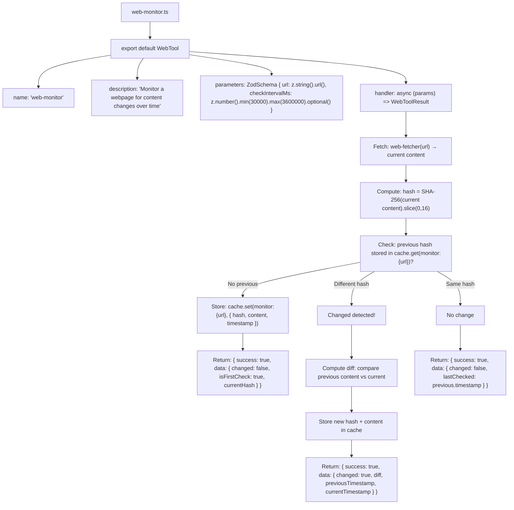
```mermaid
graph TB
    Monitor["web-monitor.ts"] --> Export["export default WebTool"]
    Export --> Name["name: 'web-monitor'"]
    Export --> Desc["description: 'Monitor a webpage for content changes over time'"]
    Export --> Params["parameters: ZodSchema { url: z.string().url(), checkIntervalMs: z.number().min(30000).max(3600000).optional() }"]
    Export --> Handler["handler: async (params) => WebToolResult"]
    Handler --> FetchCurrent["Fetch: web-fetcher(url) → current content"]
    FetchCurrent --> ComputeHash["Compute: hash = SHA-256(current content).slice(0,16)"]
    ComputeHash --> CheckPrevious["Check: previous hash stored in cache.get(monitor:{url})?"]
    CheckPrevious -->|"No previous"| StoreHash["Store: cache.set(monitor:{url}, { hash, content, timestamp })"]
    StoreHash --> ReturnFirst["Return: { success: true, data: { changed: false, isFirstCheck: true, currentHash } }"]
    CheckPrevious -->|"Different hash"| ContentChanged["Changed detected!"]
    ContentChanged --> ComputeDiff["Compute diff: compare previous content vs current"]
    ComputeDiff --> StoreNew["Store new hash + content in cache"]
    StoreNew --> ReturnChanged["Return: { success: true, data: { changed: true, diff, previousTimestamp, currentTimestamp } }"]
    CheckPrevious -->|"Same hash"| NoChange["No change"]
    NoChange --> ReturnNoChange["Return: { success: true, data: { changed: false, lastChecked: previous.timestamp } }"]
```

Explanation: Page change monitor. Fetches the URL, computes a SHA-256 hash of the content, and compares it to a previously stored hash in the tool cache. On change, computes and returns the diff. Stores the latest content and hash for future comparisons. Minimum check interval is 30 seconds.

---

End of flow-4.md Part 1. Continued in flow-5.md for remaining web tools (web-navigator through web-video-extractor) plus the web barrel file.