flow-5.md — Per-File Diagrams: Web Tools (Part 2) + Web Barrel

This file provides detailed diagrams and explanations for files 17–31 inside agents/web/, plus the web/index.ts barrel file.

---

17. web-navigator.ts

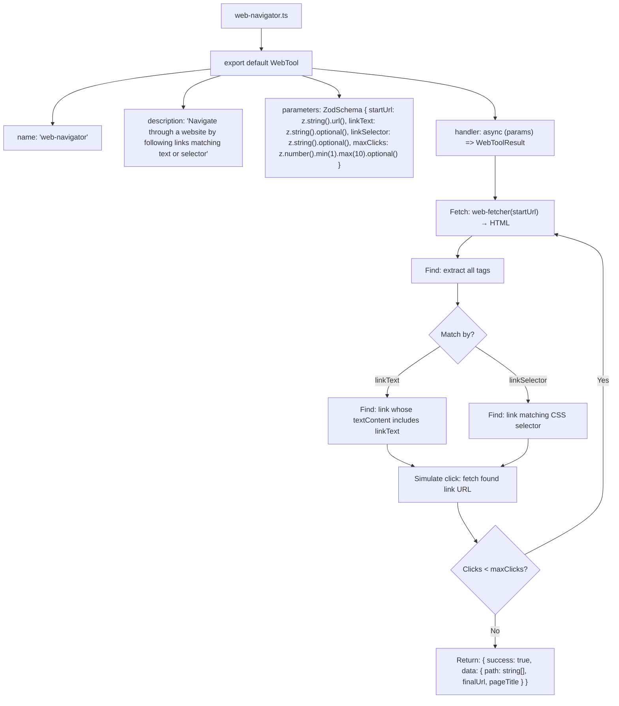
```mermaid
graph TB
    Navigator["web-navigator.ts"] --> Export["export default WebTool"]
    Export --> Name["name: 'web-navigator'"]
    Export --> Desc["description: 'Navigate through a website by following links matching text or selector'"]
    Export --> Params["parameters: ZodSchema { startUrl: z.string().url(), linkText: z.string().optional(), linkSelector: z.string().optional(), maxClicks: z.number().min(1).max(10).optional() }"]
    Export --> Handler["handler: async (params) => WebToolResult"]
    Handler --> FetchStart["Fetch: web-fetcher(startUrl) → HTML"]
    FetchStart --> FindLinks["Find: extract all <a> tags"]
    FindLinks --> Match{"Match by?"}
    Match -->|"linkText"| FindByText["Find: link whose textContent includes linkText"]
    Match -->|"linkSelector"| FindBySelector["Find: link matching CSS selector"]
    FindByText --> Click["Simulate click: fetch found link URL"]
    FindBySelector --> Click
    Click --> Repeat{"Clicks < maxClicks?"}
    Repeat -->|"Yes"| FetchStart
    Repeat -->|"No"| ReturnJourney["Return: { success: true, data: { path: string[], finalUrl, pageTitle } }"]
```

Explanation: Guided navigation tool. Starts at a URL, finds a link by its text content or CSS selector, follows it, and repeats up to maxClicks times. Records the full navigation path with URLs and page titles. Useful for automated browsing through multi-page flows.

---

18. web-paginator.ts

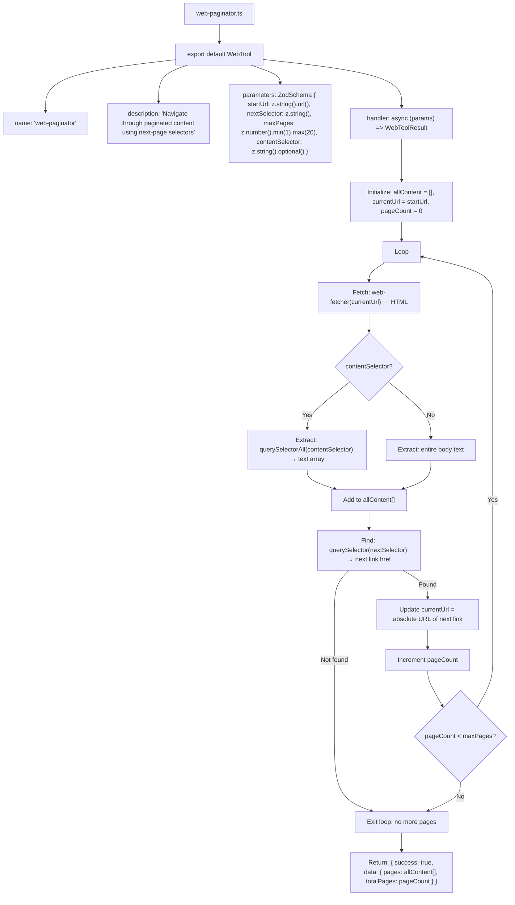
```mermaid
graph TB
    Paginator["web-paginator.ts"] --> Export["export default WebTool"]
    Export --> Name["name: 'web-paginator'"]
    Export --> Desc["description: 'Navigate through paginated content using next-page selectors'"]
    Export --> Params["parameters: ZodSchema { startUrl: z.string().url(), nextSelector: z.string(), maxPages: z.number().min(1).max(20), contentSelector: z.string().optional() }"]
    Export --> Handler["handler: async (params) => WebToolResult"]
    Handler --> Init["Initialize: allContent = [], currentUrl = startUrl, pageCount = 0"]
    Init --> Loop
    Loop --> Fetch["Fetch: web-fetcher(currentUrl) → HTML"]
    Fetch --> Extract{"contentSelector?"}
    Extract -->|"Yes"| ExtractBySelector["Extract: querySelectorAll(contentSelector) → text array"]
    Extract -->|"No"| ExtractAll["Extract: entire body text"]
    ExtractBySelector --> Accumulate["Add to allContent[]"]
    ExtractAll --> Accumulate
    Accumulate --> FindNext["Find: querySelector(nextSelector) → next link href"]
    FindNext -->|"Found"| UpdateUrl["Update currentUrl = absolute URL of next link"]
    FindNext -->|"Not found"| Done["Exit loop: no more pages"]
    UpdateUrl --> IncPage["Increment pageCount"]
    IncPage --> Check{"pageCount < maxPages?"}
    Check -->|"Yes"| Loop
    Check -->|"No"| Done
    Done --> Return["Return: { success: true, data: { pages: allContent[], totalPages: pageCount } }"]
```

Explanation: Pagination handler. Loops through paginated content by finding and following the "next page" link using a CSS selector. Extracts content from each page (optionally scoped by contentSelector). Stops when no more pages are found or maxPages is reached. Returns an array of page contents.

---

19. web-parser.ts

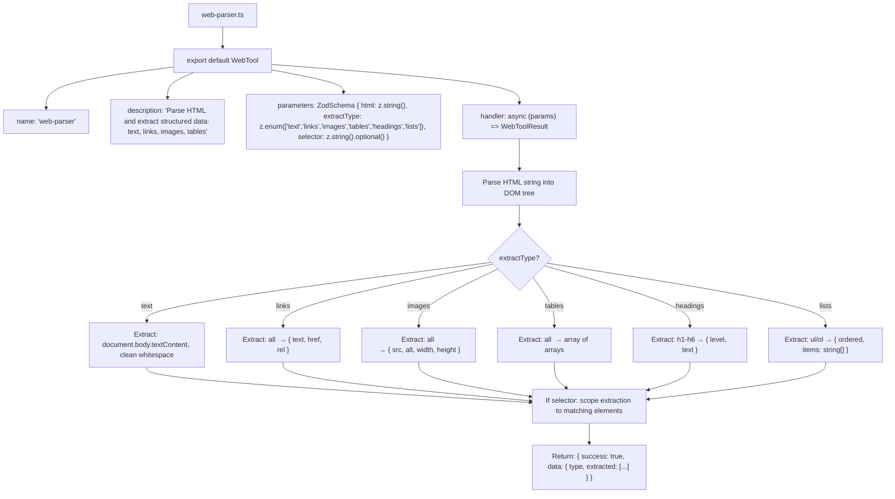
```mermaid
graph TB
    Parser["web-parser.ts"] --> Export["export default WebTool"]
    Export --> Name["name: 'web-parser'"]
    Export --> Desc["description: 'Parse HTML and extract structured data: text, links, images, tables'"]
    Export --> Params["parameters: ZodSchema { html: z.string(), extractType: z.enum(['text','links','images','tables','headings','lists']), selector: z.string().optional() }"]
    Export --> Handler["handler: async (params) => WebToolResult"]
    Handler --> Parse["Parse HTML string into DOM tree"]
    Parse --> Switch{"extractType?"}
    Switch -->|"text"| ExtractText["Extract: document.body.textContent, clean whitespace"]
    Switch -->|"links"| ExtractLinks["Extract: all <a> → { text, href, rel }"]
    Switch -->|"images"| ExtractImages["Extract: all <img> → { src, alt, width, height }"]
    Switch -->|"tables"| ExtractTables["Extract: all <table> → array of arrays"]
    Switch -->|"headings"| ExtractHeadings["Extract: h1-h6 → { level, text }"]
    Switch -->|"lists"| ExtractLists["Extract: ul/ol → { ordered, items: string[] }"]
    ExtractText --> Scope["If selector: scope extraction to matching elements"]
    ExtractLinks --> Scope
    ExtractImages --> Scope
    ExtractTables --> Scope
    ExtractHeadings --> Scope
    ExtractLists --> Scope
    Scope --> Return["Return: { success: true, data: { type, extracted: [...] } }"]
```

Explanation: HTML parser that extracts structured data from raw HTML. Supports extracting text content, hyperlinks, image sources, tables (as 2D arrays), heading hierarchies, and list items. Optional selector scopes extraction to specific DOM elements.

---

20. web-qrcode-reader.ts

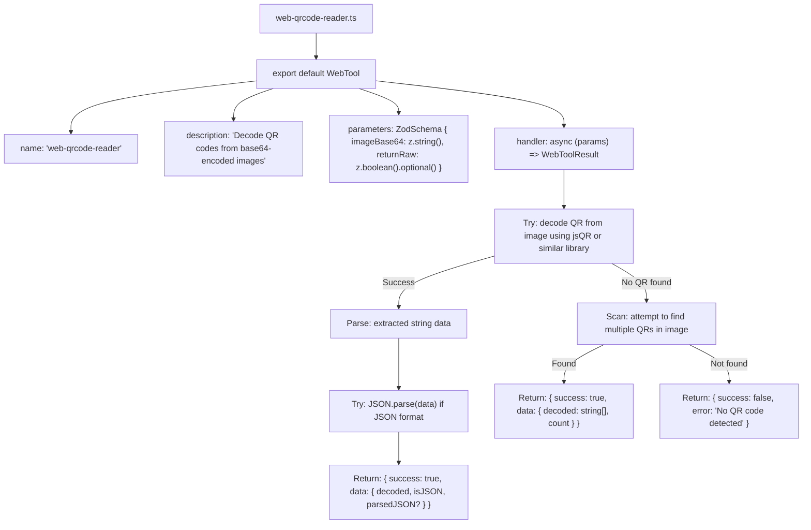
```mermaid
graph TB
    QR["web-qrcode-reader.ts"] --> Export["export default WebTool"]
    Export --> Name["name: 'web-qrcode-reader'"]
    Export --> Desc["description: 'Decode QR codes from base64-encoded images'"]
    Export --> Params["parameters: ZodSchema { imageBase64: z.string(), returnRaw: z.boolean().optional() }"]
    Export --> Handler["handler: async (params) => WebToolResult"]
    Handler --> DecodeAttempt["Try: decode QR from image using jsQR or similar library"]
    DecodeAttempt -->|"Success"| ParseData["Parse: extracted string data"]
    ParseData --> TryJSON["Try: JSON.parse(data) if JSON format"]
    TryJSON --> ReturnData["Return: { success: true, data: { decoded, isJSON, parsedJSON? } }"]
    DecodeAttempt -->|"No QR found"| MultiQR["Scan: attempt to find multiple QRs in image"]
    MultiQR -->|"Found"| ReturnMulti["Return: { success: true, data: { decoded: string[], count } }"]
    MultiQR -->|"Not found"| ReturnFail["Return: { success: false, error: 'No QR code detected' }"]
```

Explanation: QR code decoder. Takes a base64-encoded image, scans for QR codes using a decoding library, and extracts the embedded data. Supports multiple QR codes in a single image. If the decoded data is valid JSON, it is parsed and returned as an object.

---

21. web-reader.ts

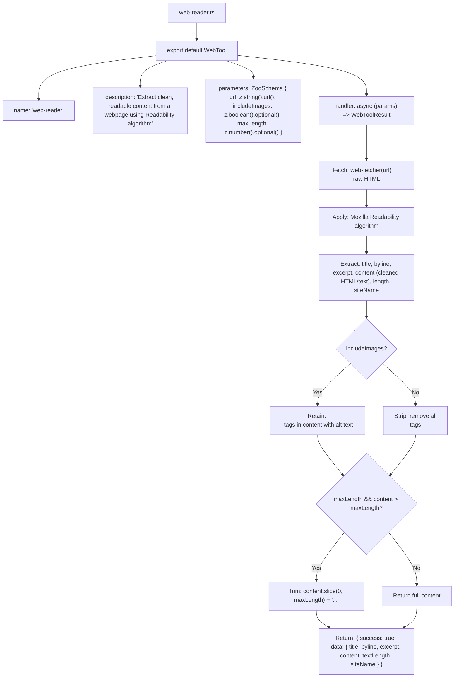
```mermaid
graph TB
    Reader["web-reader.ts"] --> Export["export default WebTool"]
    Export --> Name["name: 'web-reader'"]
    Export --> Desc["description: 'Extract clean, readable content from a webpage using Readability algorithm'"]
    Export --> Params["parameters: ZodSchema { url: z.string().url(), includeImages: z.boolean().optional(), maxLength: z.number().optional() }"]
    Export --> Handler["handler: async (params) => WebToolResult"]
    Handler --> Fetch["Fetch: web-fetcher(url) → raw HTML"]
    Fetch --> ApplyReadability["Apply: Mozilla Readability algorithm"]
    ApplyReadability --> Extract["Extract: title, byline, excerpt, content (cleaned HTML/text), length, siteName"]
    Extract --> ImgDecision{"includeImages?"}
    ImgDecision -->|"Yes"| KeepImgs["Retain: <img> tags in content with alt text"]
    ImgDecision -->|"No"| StripImgs["Strip: remove all <img> tags"]
    KeepImgs --> Truncate{"maxLength && content > maxLength?"}
    StripImgs --> Truncate
    Truncate -->|"Yes"| Trim["Trim: content.slice(0, maxLength) + '...'"]
    Truncate -->|"No"| Full["Return full content"]
    Trim --> Return["Return: { success: true, data: { title, byline, excerpt, content, textLength, siteName } }"]
    Full --> Return
```

Explanation: Readability-based content extractor. Strips navigation, ads, sidebars, and other clutter to return clean article text. Uses the Mozilla Readability algorithm. Returns the article title, author (byline), excerpt, cleaned HTML content, plain text length, and site name.

---

22. web-robots-txt.ts

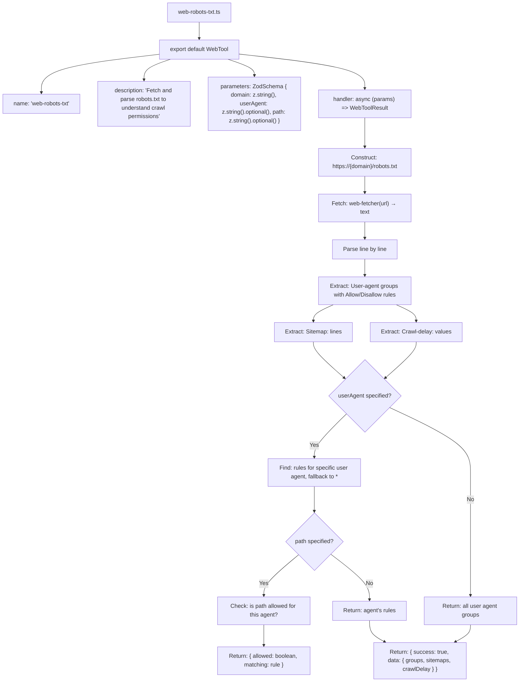
```mermaid
graph TB
    Robots["web-robots-txt.ts"] --> Export["export default WebTool"]
    Export --> Name["name: 'web-robots-txt'"]
    Export --> Desc["description: 'Fetch and parse robots.txt to understand crawl permissions'"]
    Export --> Params["parameters: ZodSchema { domain: z.string(), userAgent: z.string().optional(), path: z.string().optional() }"]
    Export --> Handler["handler: async (params) => WebToolResult"]
    Handler --> ConstructURL["Construct: https://{domain}/robots.txt"]
    ConstructURL --> Fetch["Fetch: web-fetcher(url) → text"]
    Fetch --> Parse["Parse line by line"]
    Parse --> ExtractGroups["Extract: User-agent groups with Allow/Disallow rules"]
    ExtractGroups --> ExtractSitemaps["Extract: Sitemap: lines"]
    ExtractGroups --> ExtractCrawlDelay["Extract: Crawl-delay: values"]
    ExtractSitemaps --> CheckSpecific{"userAgent specified?"}
    ExtractCrawlDelay --> CheckSpecific
    CheckSpecific -->|"Yes"| FindAgent["Find: rules for specific user agent, fallback to *"]
    CheckSpecific -->|"No"| AllAgents["Return: all user agent groups"]
    FindAgent --> CheckPath{"path specified?"}
    CheckPath -->|"Yes"| CheckAllowed["Check: is path allowed for this agent?"]
    CheckPath -->|"No"| ReturnAgent["Return: agent's rules"]
    CheckAllowed --> ReturnPath["Return: { allowed: boolean, matching: rule }"]
    ReturnAgent --> Return
    AllAgents --> Return["Return: { success: true, data: { groups, sitemaps, crawlDelay } }"]
```

Explanation: Robots.txt parser. Fetches and parses the robots exclusion standard file from a domain. Extracts allow/disallow rules per user agent, sitemap URLs, and crawl delay directives. Can check if a specific path is allowed for a given user agent.

---

23. web-scraping.ts

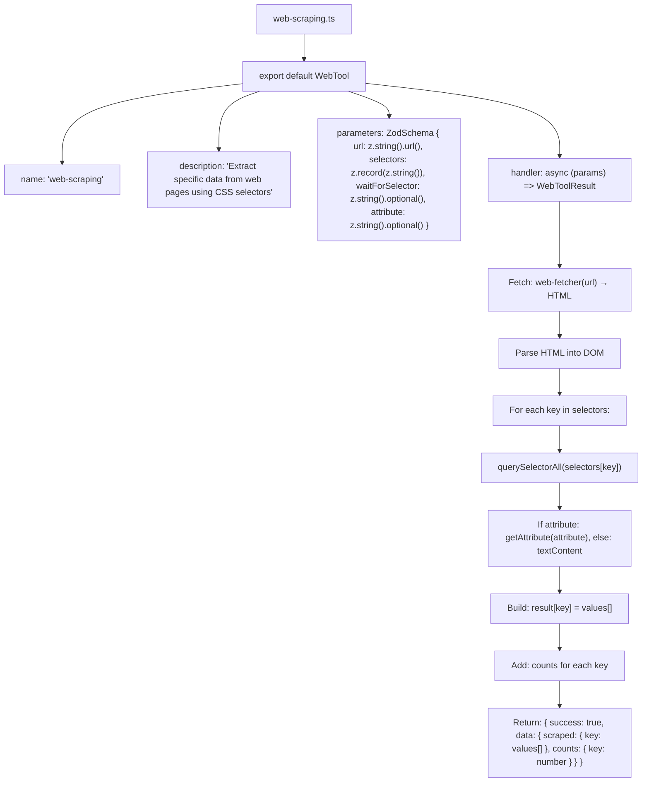
```mermaid
graph TB
    Scraping["web-scraping.ts"] --> Export["export default WebTool"]
    Export --> Name["name: 'web-scraping'"]
    Export --> Desc["description: 'Extract specific data from web pages using CSS selectors'"]
    Export --> Params["parameters: ZodSchema { url: z.string().url(), selectors: z.record(z.string()), waitForSelector: z.string().optional(), attribute: z.string().optional() }"]
    Export --> Handler["handler: async (params) => WebToolResult"]
    Handler --> Fetch["Fetch: web-fetcher(url) → HTML"]
    Fetch --> Parse["Parse HTML into DOM"]
    Parse --> Loop["For each key in selectors:"]
    Loop --> Query["querySelectorAll(selectors[key])"]
    Query --> ExtractVal["If attribute: getAttribute(attribute), else: textContent"]
    ExtractVal --> BuildResult["Build: result[key] = values[]"]
    BuildResult --> BuildStats["Add: counts for each key"]
    BuildStats --> Return["Return: { success: true, data: { scraped: { key: values[] }, counts: { key: number } } }"]
```

Explanation: CSS-selector-based web scraper. Takes a URL and a map of named CSS selectors, queries the DOM for each selector, and extracts either text content or a specified attribute. Returns an organized object with extracted values per selector and counts of elements found.

---

24. web-screenshot.ts

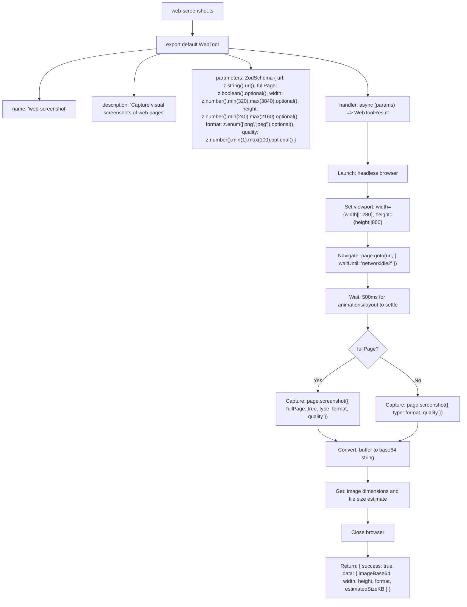
```mermaid
graph TB
    Screenshot["web-screenshot.ts"] --> Export["export default WebTool"]
    Export --> Name["name: 'web-screenshot'"]
    Export --> Desc["description: 'Capture visual screenshots of web pages'"]
    Export --> Params["parameters: ZodSchema { url: z.string().url(), fullPage: z.boolean().optional(), width: z.number().min(320).max(3840).optional(), height: z.number().min(240).max(2160).optional(), format: z.enum(['png','jpeg']).optional(), quality: z.number().min(1).max(100).optional() }"]
    Export --> Handler["handler: async (params) => WebToolResult"]
    Handler --> Launch["Launch: headless browser"]
    Launch --> SetViewport["Set viewport: width={width||1280}, height={height||800}"]
    SetViewport --> Navigate["Navigate: page.goto(url, { waitUntil: 'networkidle2' })"]
    Navigate --> WaitStable["Wait: 500ms for animations/layout to settle"]
    WaitStable --> Capture{"fullPage?"}
    Capture -->|"Yes"| FullPage["Capture: page.screenshot({ fullPage: true, type: format, quality })"]
    Capture -->|"No"| Viewport["Capture: page.screenshot({ type: format, quality })"]
    FullPage --> Base64["Convert: buffer to base64 string"]
    Viewport --> Base64
    Base64 --> GetSize["Get: image dimensions and file size estimate"]
    GetSize --> Close["Close browser"]
    Close --> Return["Return: { success: true, data: { imageBase64, width, height, format, estimatedSizeKB } }"]
```

Explanation: Webpage screenshot capture. Launches a headless browser, navigates to the URL, waits for rendering to complete, and captures either the viewport or the full scrolled page. Returns a base64-encoded image with dimensions and estimated file size. Supports PNG and JPEG formats with configurable quality.

---

25. web-search.ts

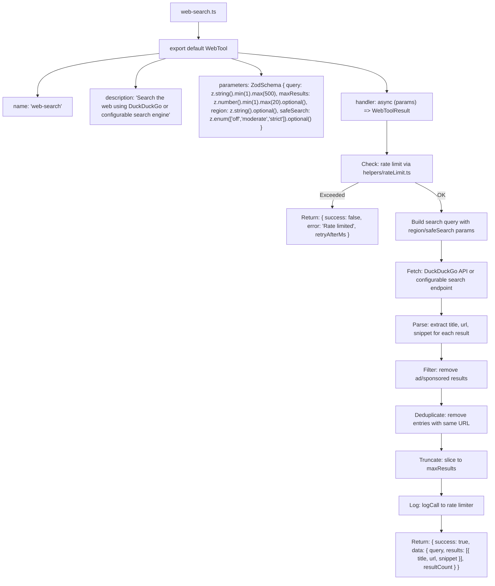
```mermaid
graph TB
    Search["web-search.ts"] --> Export["export default WebTool"]
    Export --> Name["name: 'web-search'"]
    Export --> Desc["description: 'Search the web using DuckDuckGo or configurable search engine'"]
    Export --> Params["parameters: ZodSchema { query: z.string().min(1).max(500), maxResults: z.number().min(1).max(20).optional(), region: z.string().optional(), safeSearch: z.enum(['off','moderate','strict']).optional() }"]
    Export --> Handler["handler: async (params) => WebToolResult"]
    Handler --> CheckRateLimit["Check: rate limit via helpers/rateLimit.ts"]
    CheckRateLimit -->|"Exceeded"| RateLimitError["Return: { success: false, error: 'Rate limited', retryAfterMs }"]
    CheckRateLimit -->|"OK"| BuildQuery["Build search query with region/safeSearch params"]
    BuildQuery --> FetchSearch["Fetch: DuckDuckGo API or configurable search endpoint"]
    FetchSearch --> ParseResults["Parse: extract title, url, snippet for each result"]
    ParseResults --> FilterAds["Filter: remove ad/sponsored results"]
    FilterAds --> Dedupe["Deduplicate: remove entries with same URL"]
    Dedupe --> Truncate["Truncate: slice to maxResults"]
    Truncate --> LogCall["Log: logCall to rate limiter"]
    LogCall --> Return["Return: { success: true, data: { query, results: [{ title, url, snippet }], resultCount } }"]
```

Explanation: Web search tool using DuckDuckGo (or configurable search engine). Enforces per-tool rate limits (10 calls/minute from rules/tools.ts). Supports region-specific results and SafeSearch levels. Filters out ads and sponsored content, removes duplicate URLs, and returns up to maxResults with title, URL, and snippet.

---

26. web-sitemap-parser.ts

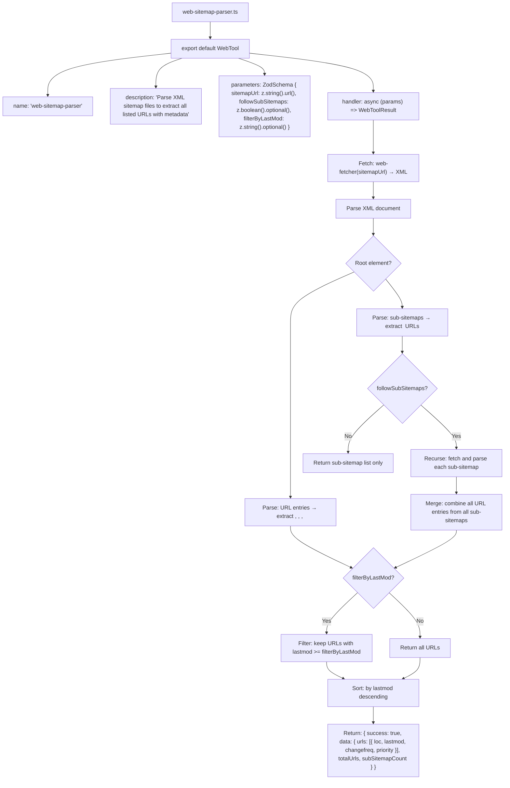
```mermaid
graph TB
    Sitemap["web-sitemap-parser.ts"] --> Export["export default WebTool"]
    Export --> Name["name: 'web-sitemap-parser'"]
    Export --> Desc["description: 'Parse XML sitemap files to extract all listed URLs with metadata'"]
    Export --> Params["parameters: ZodSchema { sitemapUrl: z.string().url(), followSubSitemaps: z.boolean().optional(), filterByLastMod: z.string().optional() }"]
    Export --> Handler["handler: async (params) => WebToolResult"]
    Handler --> Fetch["Fetch: web-fetcher(sitemapUrl) → XML"]
    Fetch --> ParseXML["Parse XML document"]
    ParseXML --> DetectType{"Root element?"}
    DetectType -->|"<sitemapindex>"| SitemapIndex["Parse: sub-sitemaps → extract <sitemap><loc> URLs"]
    DetectType -->|"<urlset>"| URLSet["Parse: URL entries → extract <url><loc>, <lastmod>, <changefreq>, <priority>"]
    SitemapIndex --> Follow{"followSubSitemaps?"}
    Follow -->|"Yes"| Recurse["Recurse: fetch and parse each sub-sitemap"]
    Follow -->|"No"| ReturnIndex["Return sub-sitemap list only"]
    Recurse --> Merge["Merge: combine all URL entries from all sub-sitemaps"]
    URLSet --> FilterDate{"filterByLastMod?"}
    Merge --> FilterDate
    FilterDate -->|"Yes"| FilterRecent["Filter: keep URLs with lastmod >= filterByLastMod"]
    FilterDate -->|"No"| AllURLs["Return all URLs"]
    FilterRecent --> Sort["Sort: by lastmod descending"]
    AllURLs --> Sort
    Sort --> Return["Return: { success: true, data: { urls: [{ loc, lastmod, changefreq, priority }], totalUrls, subSitemapCount } }"]
```

Explanation: XML sitemap parser. Fetches and parses sitemap.xml files, detecting whether it's a sitemap index (pointing to sub-sitemaps) or a URL set (listing pages). Can recursively follow sub-sitemaps. Extracts URL locations, last modification dates, change frequencies, and priorities. Supports filtering by last-modified date.

---

27. web-socket-listener.ts

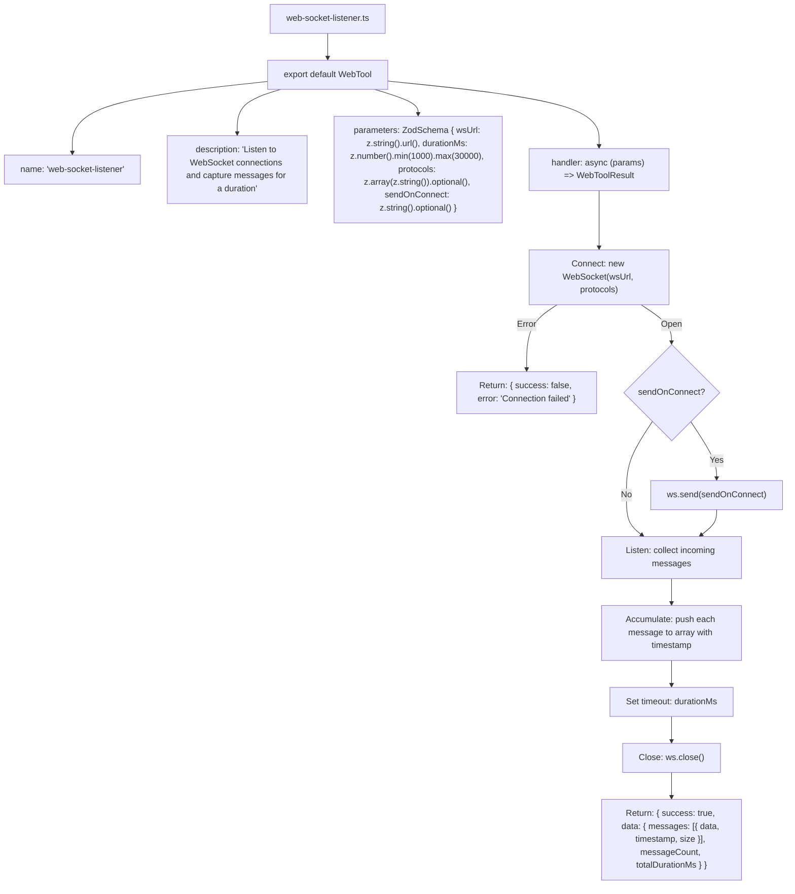
```mermaid
graph TB
    Socket["web-socket-listener.ts"] --> Export["export default WebTool"]
    Export --> Name["name: 'web-socket-listener'"]
    Export --> Desc["description: 'Listen to WebSocket connections and capture messages for a duration'"]
    Export --> Params["parameters: ZodSchema { wsUrl: z.string().url(), durationMs: z.number().min(1000).max(30000), protocols: z.array(z.string()).optional(), sendOnConnect: z.string().optional() }"]
    Export --> Handler["handler: async (params) => WebToolResult"]
    Handler --> Connect["Connect: new WebSocket(wsUrl, protocols)"]
    Connect -->|"Error"| ConnectErr["Return: { success: false, error: 'Connection failed' }"]
    Connect -->|"Open"| SendMsg{"sendOnConnect?"}
    SendMsg -->|"Yes"| Send["ws.send(sendOnConnect)"]
    SendMsg -->|"No"| Listen["Listen: collect incoming messages"]
    Send --> Listen
    Listen --> Accumulate["Accumulate: push each message to array with timestamp"]
    Accumulate --> Timer["Set timeout: durationMs"]
    Timer --> Close["Close: ws.close()"]
    Close --> Return["Return: { success: true, data: { messages: [{ data, timestamp, size }], messageCount, totalDurationMs } }"]
```

Explanation: WebSocket message capture tool. Connects to a WebSocket endpoint, optionally sends an initial message, and captures all incoming messages for a configurable duration (max 30 seconds). Returns each message with its timestamp, data, and size. Closes the connection when the duration expires.

---

28. web-spider.ts

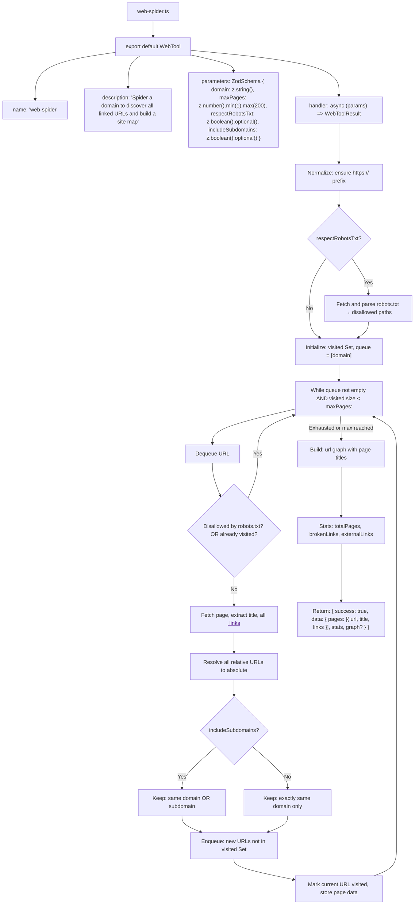
```mermaid
graph TB
    Spider["web-spider.ts"] --> Export["export default WebTool"]
    Export --> Name["name: 'web-spider'"]
    Export --> Desc["description: 'Spider a domain to discover all linked URLs and build a site map'"]
    Export --> Params["parameters: ZodSchema { domain: z.string(), maxPages: z.number().min(1).max(200), respectRobotsTxt: z.boolean().optional(), includeSubdomains: z.boolean().optional() }"]
    Export --> Handler["handler: async (params) => WebToolResult"]
    Handler --> NormalizeDomain["Normalize: ensure https:// prefix"]
    NormalizeDomain --> CheckRobots{"respectRobotsTxt?"}
    CheckRobots -->|"Yes"| FetchRobots["Fetch and parse robots.txt → disallowed paths"]
    CheckRobots -->|"No"| InitSpider["Initialize: visited Set, queue = [domain]"]
    FetchRobots --> InitSpider
    InitSpider --> SpideLoop["While queue not empty AND visited.size < maxPages:"]
    SpideLoop --> Dequeue["Dequeue URL"]
    Dequeue --> ShouldSkip{"Disallowed by robots.txt? OR already visited?"}
    ShouldSkip -->|"Yes"| SpideLoop
    ShouldSkip -->|"No"| Fetch["Fetch page, extract title, all <a href> links"]
    Fetch --> ResolveLinks["Resolve all relative URLs to absolute"]
    ResolveLinks --> FilterSubdomain{"includeSubdomains?"}
    FilterSubdomain -->|"Yes"| KeepSub["Keep: same domain OR subdomain"]
    FilterSubdomain -->|"No"| KeepDomain["Keep: exactly same domain only"]
    KeepSub --> EnqueueNew["Enqueue: new URLs not in visited Set"]
    KeepDomain --> EnqueueNew
    EnqueueNew --> MarkVisited["Mark current URL visited, store page data"]
    MarkVisited --> SpideLoop
    SpideLoop -->|"Exhausted or max reached"| BuildGraph["Build: url graph with page titles"]
    BuildGraph --> ComputeStats["Stats: totalPages, brokenLinks, externalLinks"]
    ComputeStats --> Return["Return: { success: true, data: { pages: [{ url, title, links }], stats, graph? } }"]
```

Explanation: Domain spider that systematically discovers URLs. Starts from the domain root, fetches each page, extracts all links, filters by domain/subdomain, and continues until all discoverable pages are found or maxPages is reached. Respects robots.txt disallow rules if configured. Returns page metadata and optional link graph.

---

29. web-summarizer.ts

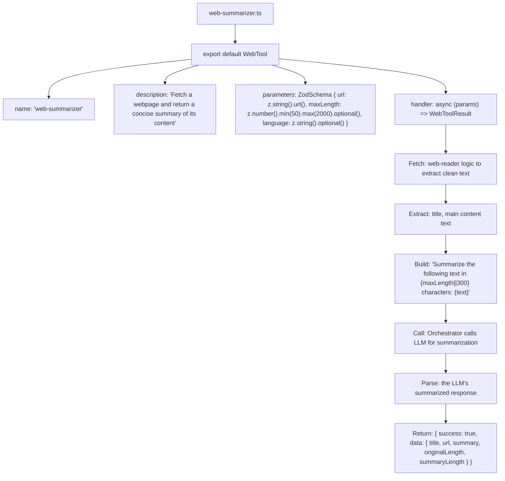
```mermaid
graph TB
    Summarizer["web-summarizer.ts"] --> Export["export default WebTool"]
    Export --> Name["name: 'web-summarizer'"]
    Export --> Desc["description: 'Fetch a webpage and return a concise summary of its content'"]
    Export --> Params["parameters: ZodSchema { url: z.string().url(), maxLength: z.number().min(50).max(2000).optional(), language: z.string().optional() }"]
    Export --> Handler["handler: async (params) => WebToolResult"]
    Handler --> FetchReadable["Fetch: web-reader logic to extract clean text"]
    FetchReadable --> ExtractKey["Extract: title, main content text"]
    ExtractKey --> BuildSummarizePrompt["Build: 'Summarize the following text in {maxLength||300} characters: {text}'"]
    BuildSummarizePrompt --> CallLLM["Call: Orchestrator calls LLM for summarization"]
    CallLLM --> ParseSummary["Parse: the LLM's summarized response"]
    ParseSummary --> Return["Return: { success: true, data: { title, url, summary, originalLength, summaryLength } }"]
```

Explanation: Webpage summarizer that combines extraction and LLM summarization. Uses the web-reader logic to extract clean article text, then calls the LLM (via the Orchestrator) to generate a concise summary. Returns the original length and summary length for comparison.

---

30. web-validator.ts

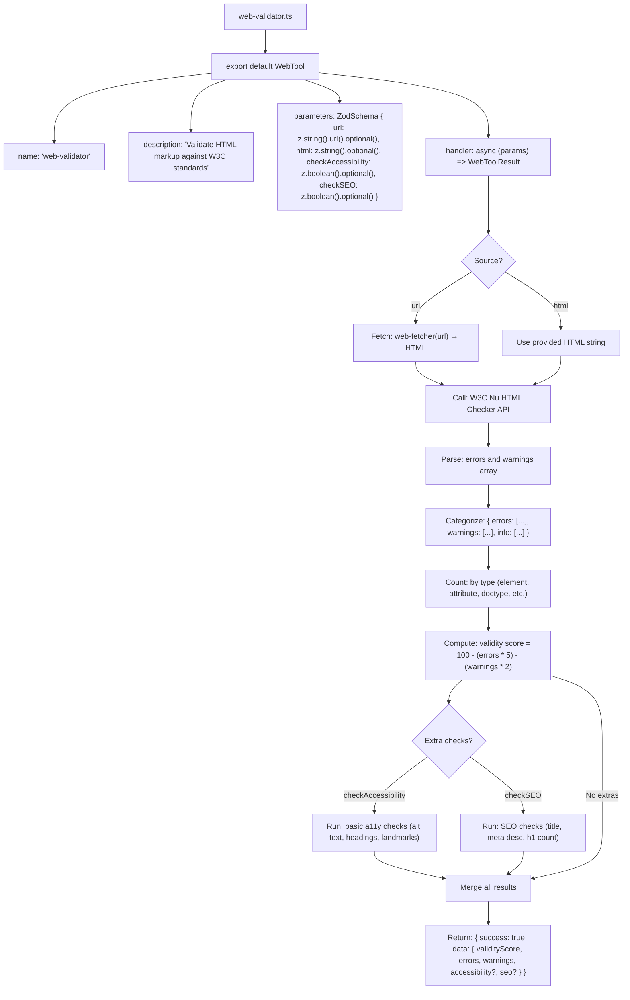
```mermaid
graph TB
    Validator["web-validator.ts"] --> Export["export default WebTool"]
    Export --> Name["name: 'web-validator'"]
    Export --> Desc["description: 'Validate HTML markup against W3C standards'"]
    Export --> Params["parameters: ZodSchema { url: z.string().url().optional(), html: z.string().optional(), checkAccessibility: z.boolean().optional(), checkSEO: z.boolean().optional() }"]
    Export --> Handler["handler: async (params) => WebToolResult"]
    Handler --> GetHTML{"Source?"}
    GetHTML -->|"url"| FetchURL["Fetch: web-fetcher(url) → HTML"]
    GetHTML -->|"html"| UseProvided["Use provided HTML string"]
    FetchURL --> CallValidator["Call: W3C Nu HTML Checker API"]
    UseProvided --> CallValidator
    CallValidator --> ParseErrors["Parse: errors and warnings array"]
    ParseErrors --> Categorize["Categorize: { errors: [...], warnings: [...], info: [...] }"]
    Categorize --> CountByType["Count: by type (element, attribute, doctype, etc.)"]
    CountByType --> ComputeScore["Compute: validity score = 100 - (errors * 5) - (warnings * 2)"]
    ComputeScore --> OptionalChecks{"Extra checks?"}
    OptionalChecks -->|"checkAccessibility"| A11yCheck["Run: basic a11y checks (alt text, headings, landmarks)"]
    OptionalChecks -->|"checkSEO"| SEOCheck["Run: SEO checks (title, meta desc, h1 count)"]
    A11yCheck --> MergeResults["Merge all results"]
    SEOCheck --> MergeResults
    ComputeScore -->|"No extras"| MergeResults
    MergeResults --> Return["Return: { success: true, data: { validityScore, errors, warnings, accessibility?, seo? } }"]
```

Explanation: HTML validator that checks markup against W3C standards. Can validate a URL or provided HTML string. Parses errors and warnings, categorizes them by type, and computes a validity score (100 = perfect). Optional add-ons for basic accessibility checks (alt text, heading structure, ARIA landmarks) and SEO checks (title tag, meta description, H1 count).

---

31. web-video-extractor.ts

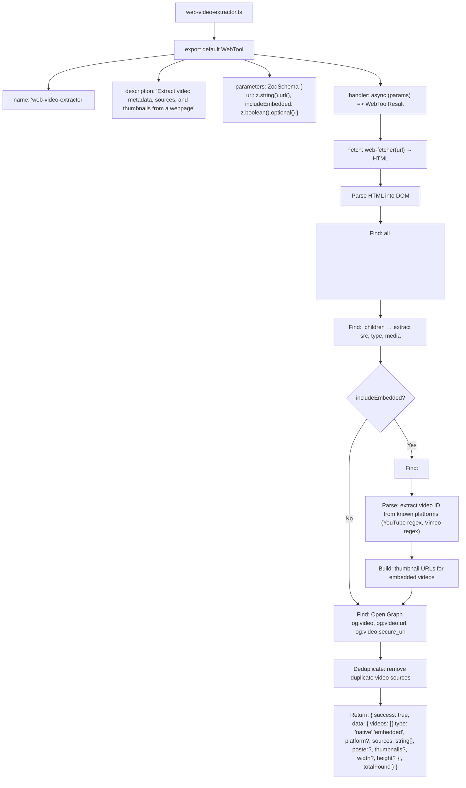
```mermaid
graph TB
    Video["web-video-extractor.ts"] --> Export["export default WebTool"]
    Export --> Name["name: 'web-video-extractor'"]
    Export --> Desc["description: 'Extract video metadata, sources, and thumbnails from a webpage'"]
    Export --> Params["parameters: ZodSchema { url: z.string().url(), includeEmbedded: z.boolean().optional() }"]
    Export --> Handler["handler: async (params) => WebToolResult"]
    Handler --> Fetch["Fetch: web-fetcher(url) → HTML"]
    Fetch --> Parse["Parse HTML into DOM"]
    Parse --> FindVideoTags["Find: all <video> tags → extract src, poster, width, height, controls"]
    FindVideoTags --> FindSourceTags["Find: <source> children → extract src, type, media"]
    FindSourceTags --> FindIframes{"includeEmbedded?"}
    FindIframes -->|"Yes"| FindIframe["Find: <iframe> tags → extract src (YouTube, Vimeo, etc.)"]
    FindIframes -->|"No"| FindOGVideo["Find: Open Graph og:video, og:video:url, og:video:secure_url"]
    FindIframe --> ParseEmbedded["Parse: extract video ID from known platforms (YouTube regex, Vimeo regex)"]
    ParseEmbedded --> BuildThumbnails["Build: thumbnail URLs for embedded videos"]
    BuildThumbnails --> FindOGVideo
    FindOGVideo --> DedupeSources["Deduplicate: remove duplicate video sources"]
    DedupeSources --> Return["Return: { success: true, data: { videos: [{ type: 'native'|'embedded', platform?, sources: string[], poster?, thumbnails?, width?, height? }], totalFound } }"]
```

Explanation: Video extractor that finds all video content on a webpage. Handles native <video> tags with <source> children, Open Graph video meta tags, and embedded videos from iframes (YouTube, Vimeo, etc.). For embedded videos, generates thumbnail URLs from the extracted video ID. Deduplicates sources before returning.

---

32. web/index.ts

```mermaid
graph TB
    Index["index.ts"] --> ReExport["export { webApiCaller, webAuthenticator, webBrowser, webCacheReader, webCrawling, webDiff, webDownloader, webFeedParser, webFetcher, webFormSubmitter, webHarvester, webHeadlessScraper, webLinkExtractor, webMetadataExtractor, webMonitor, webNavigator, webPaginator, webParser, webQrCodeReader, webReader, webRobotsTxt, webScraping, webScreenshot, webSearch, webSitemapParser, webSocketListener, webSpider, webSummarizer, webValidator, webVideoExtractor }"]
    ReExport --> Import1["import webApiCaller from './web-api-caller'"]
    ReExport --> Import2["import webAuthenticator from './web-authenticator'"]
    ReExport --> Import3["import webBrowser from './web-browser'"]
    ReExport --> Import4["import webCacheReader from './web-cache-reader'"]
    ReExport --> Import5["import webCrawling from './web-crawling'"]
    ReExport --> Import6["import webDiff from './web-diff'"]
    ReExport --> Import7["import webDownloader from './web-downloader'"]
    ReExport --> Import8["import webFeedParser from './web-feed-parser'"]
    ReExport --> Import9["import webFetcher from './web-fetcher'"]
    ReExport --> Import10["import webFormSubmitter from './web-form-submitter'"]
    ReExport --> Import11["import webHarvester from './web-harvester'"]
    ReExport --> Import12["import webHeadlessScraper from './web-headless-scraper'"]
    ReExport --> Import13["import webLinkExtractor from './web-link-extractor'"]
    ReExport --> Import14["import webMetadataExtractor from './web-metadata-extractor'"]
    ReExport --> Import15["import webMonitor from './web-monitor'"]
    ReExport --> Import16["import webNavigator from './web-navigator'"]
    ReExport --> Import17["import webPaginator from './web-paginator'"]
    ReExport --> Import18["import webParser from './web-parser'"]
    ReExport --> Import19["import webQrCodeReader from './web-qrcode-reader'"]
    ReExport --> Import20["import webReader from './web-reader'"]
    ReExport --> Import21["import webRobotsTxt from './web-robots-txt'"]
    ReExport --> Import22["import webScraping from './web-scraping'"]
    ReExport --> Import23["import webScreenshot from './web-screenshot'"]
    ReExport --> Import24["import webSearch from './web-search'"]
    ReExport --> Import25["import webSitemapParser from './web-sitemap-parser'"]
    ReExport --> Import26["import webSocketListener from './web-socket-listener'"]
    ReExport --> Import27["import webSpider from './web-spider'"]
    ReExport --> Import28["import webSummarizer from './web-summarizer'"]
    ReExport --> Import29["import webValidator from './web-validator'"]
    ReExport --> Import30["import webVideoExtractor from './web-video-extractor'"]
```

Explanation: Barrel file that aggregates all 31 web tool modules and re-exports them as named exports. The Orchestrator dynamically imports this file at startup via import.meta.glob and registers each tool in the global Web Tools Registry.

---

End of flow-5.md. This completes the per-file documentation for all web tools in agents/web/, totaling 31 tools plus the barrel file. Continued in flow-6.md (Helpers Part 1).