flow-6.md — Per-File Diagrams: Helpers

This file provides detailed diagrams and explanations for every file inside frontend/src/helpers/.

---

Helpers Overview

1. helpers/ Folder Structure (All 16 Files)

```mermaid
graph TB
    HelpersDir["frontend/src/helpers/"] --> H1["cache.ts"]
    HelpersDir --> H2["compression.ts"]
    HelpersDir --> H3["healthCheck.ts"]
    HelpersDir --> H4["injectionDetector.ts"]
    HelpersDir --> H5["ollama.ts"]
    HelpersDir --> H6["parse-choose-option-to-ui.ts"]
    HelpersDir --> H7["parse-diagram-to-ui.ts"]
    HelpersDir --> H8["parse-response-to-ui.ts"]
    HelpersDir --> H9["parse-selection-to-ui.ts"]
    HelpersDir --> H10["piiDetector.ts"]
    HelpersDir --> H11["rateLimit.ts"]
    HelpersDir --> H12["sanitizer.ts"]
    HelpersDir --> H13["storage.ts"]
    HelpersDir --> H14["thinking.ts"]
    HelpersDir --> H15["tokenizer.ts"]
    HelpersDir --> H16["toxicityAnalyzer.ts"]
```

Explanation: Sixteen pure utility modules consumed by the Orchestrator, tools, skills, and web tools. These helpers provide caching, compression, health checking, safety detection, Ollama API communication, response parsing, rate limiting, HTML sanitization, IndexedDB storage, thinking step management, and token counting.

---

2. cache.ts

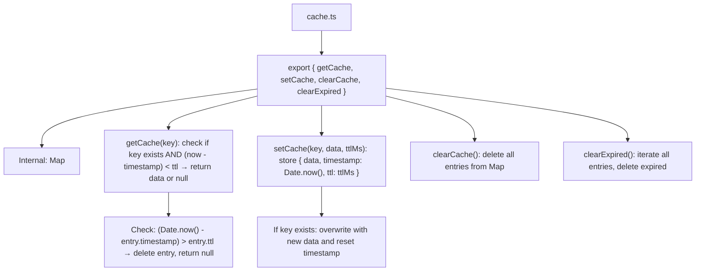

Explanation: In-memory TTL (Time-To-Live) cache using a JavaScript Map. Each entry stores data, a timestamp of when it was cached, and a TTL in milliseconds. getCache checks expiry before returning data. setCache overwrites existing keys. Used by tools (read-file, web-fetcher, etc.) to avoid redundant operations. Cache is cleared when conversations end or the page reloads.

---

3. compression.ts

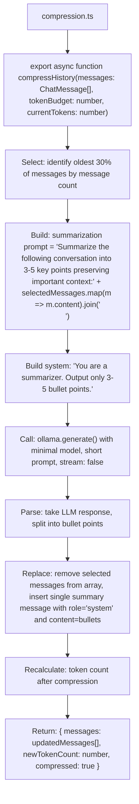

Explanation: Conversation history compression utility. Triggered when token usage exceeds 70% of the budget (from rules/context.ts). Selects the oldest 30% of messages, sends them to the LLM with a summarization prompt, receives bullet-point summary, and replaces the original messages with the condensed version. Returns the updated message array and new token count.

---

4. healthCheck.ts

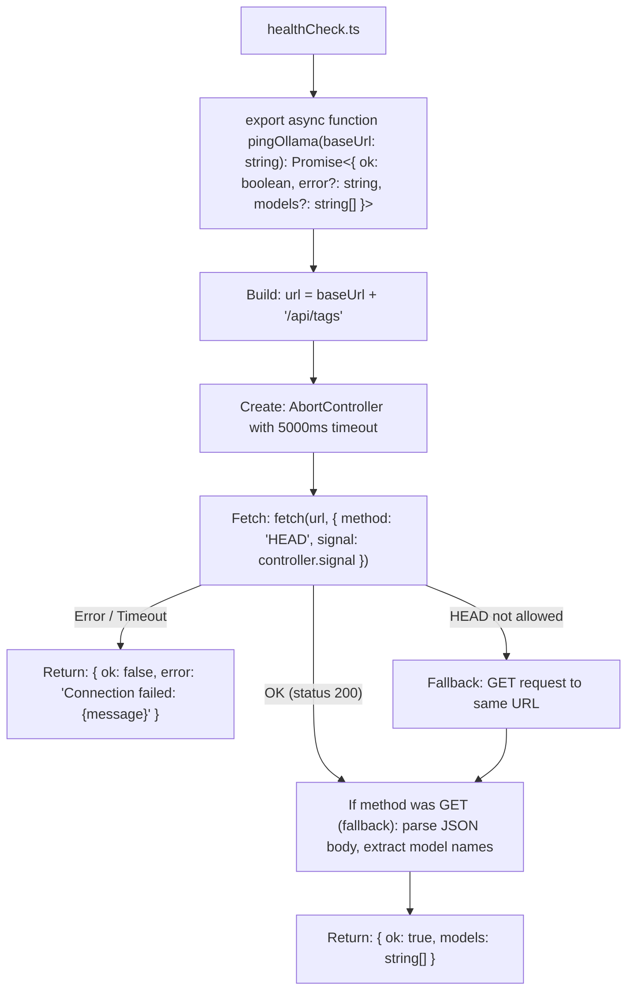

Explanation: Ollama server health check. Sends a HEAD request to Ollama's /api/tags endpoint with a 5-second timeout. If HEAD is not allowed, falls back to GET and parses the model list from the response body. Used by the Settings "Test Connection" button and as a pre-flight check before the first LLM call in a session.

---

5. injectionDetector.ts

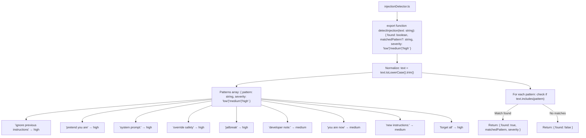

Explanation: Prompt injection detector using a keyword blacklist. Normalizes input to lowercase, then checks against an array of known injection patterns with assigned severity levels (high/medium/low). Returns early on the first match to minimize processing. Used in Gate 1 (input safety check) before any user input reaches the LLM.

---

6. ollama.ts

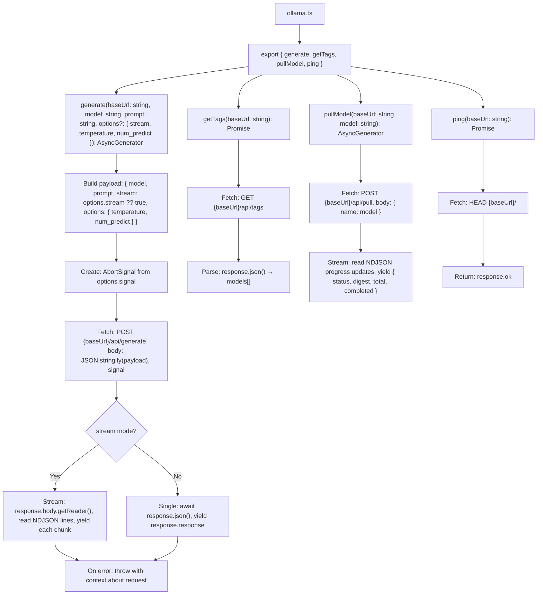

Explanation: Complete Ollama API client wrapper. generate is the core function: it builds the request payload (model, prompt, options like temperature and num_predict), sends a POST to Ollama's /api/generate endpoint, and returns an async generator that yields NDJSON chunks for streaming or the full response for non-streaming mode. getTags fetches available models. pullModel streams download progress for model pulling. ping does a lightweight HEAD request to check server availability. All functions read baseUrl from parameters (passed from Zustand settings store).

---

7. parse-choose-option-to-ui.ts

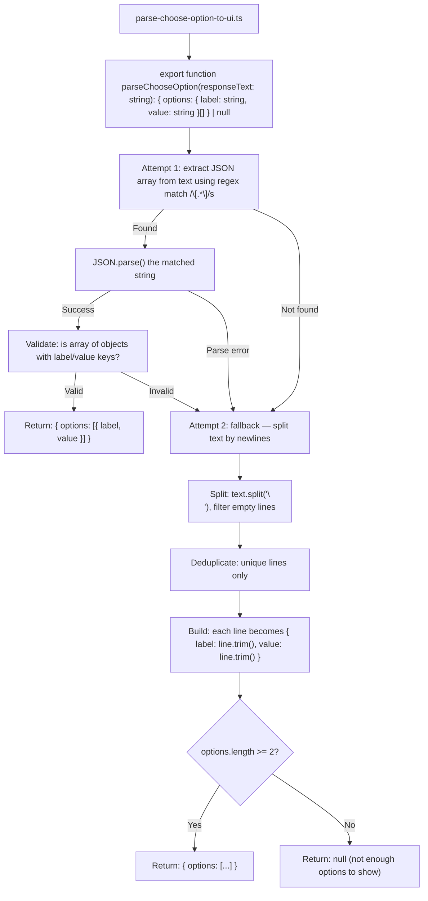

Explanation: Choice card parser for LLM responses. When the LLM returns structured options (e.g., for file selection, mode switching, or suggestions), this helper extracts them. First attempts to find and parse a JSON array with label/value objects. If JSON parsing fails, falls back to line-by-line parsing, treating each non-empty line as an option. Returns null if fewer than 2 options are found (not meaningful as choices). The parsed options are rendered as clickable ChoiceCards in the UI.

---

8. parse-diagram-to-ui.ts

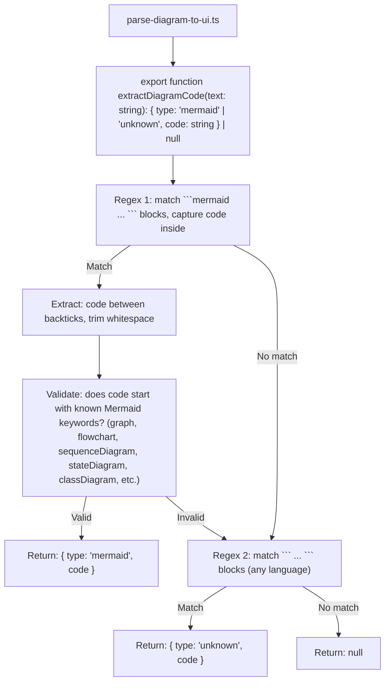

Explanation: Diagram code extractor. When the LLM generates Mermaid diagram code inside markdown code fences (mermaid ... ), this helper extracts and validates it. Checks that the extracted code begins with recognized Mermaid syntax keywords (graph, flowchart, sequenceDiagram, etc.). If no Mermaid block is found, attempts to extract any generic code block. Returns the diagram type and cleaned code, or null if no diagram is detected. The extracted code is passed to the Mermaid.js renderer in the UI.

---

9. parse-response-to-ui.ts

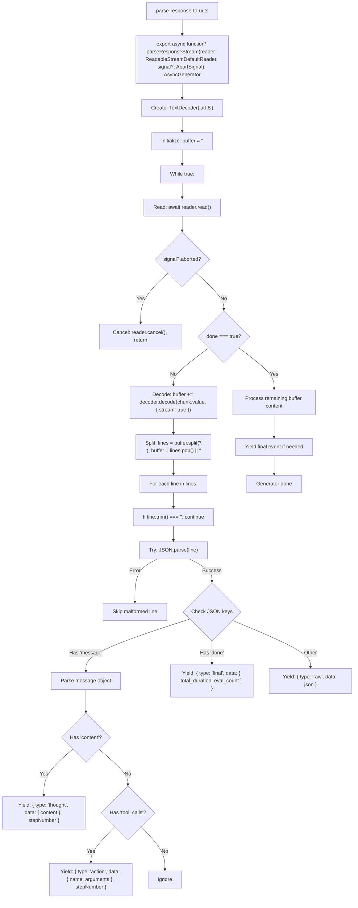

Explanation: The core NDJSON stream parser. Takes a ReadableStreamDefaultReader from a fetch response, decodes chunks as UTF-8, accumulates partial lines in a buffer, and yields structured ParsedEvent objects. Events include: thought (LLM's reasoning text), action (tool call with name and arguments), final (completion signal with token counts), and raw (unhandled JSON). Handles AbortSignal for cancellation. This parser is the bridge between Ollama's raw streaming response and the Zustand store updates that drive the UI.

---

10. parse-selection-to-ui.ts

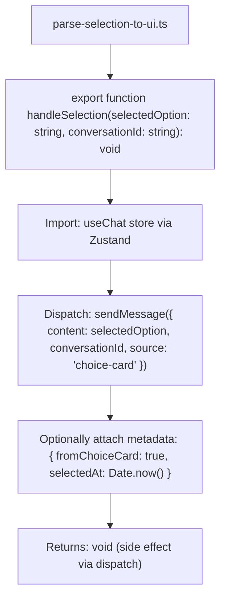

Explanation: Selection handler for choice cards. When a user clicks a choice card in the UI, this helper takes the selected option value and dispatches it as a new user message to the chat store. Adds metadata indicating the message originated from a choice card selection. This allows the conversation to continue seamlessly as if the user typed the option.

---

11. piiDetector.ts

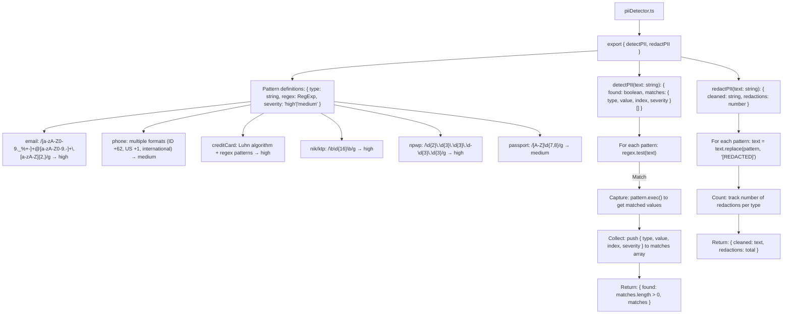

Explanation: PII (Personally Identifiable Information) detection and redaction. Uses regex patterns for common PII types: email addresses, phone numbers (Indonesian and international formats), credit card numbers (with Luhn algorithm validation), Indonesian NIK/KTP numbers (16-digit), NPWP tax numbers, and passport numbers. Each pattern has a severity level (high/medium). detectPII returns all matches with their types and positions. redactPII replaces all detected PII with [REDACTED] and returns the cleaned text with a count of redactions.

---

12. rateLimit.ts

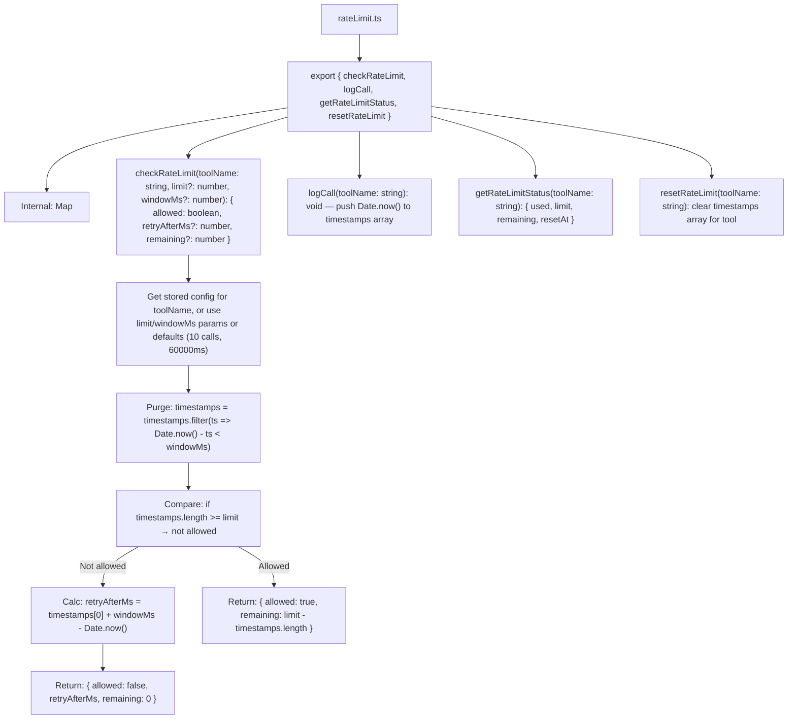

Explanation: Sliding-window rate limiter. Each tool (or web tool) has its own tracking entry in an internal Map. checkRateLimit purges timestamps older than the window (default 60 seconds), counts remaining timestamps, and determines if the call is allowed. If denied, calculates retryAfterMs based on when the oldest timestamp will expire. Used by web-search and other external tools to respect API rate limits. Configurable per-tool via rules/tools.ts.

---

13. sanitizer.ts

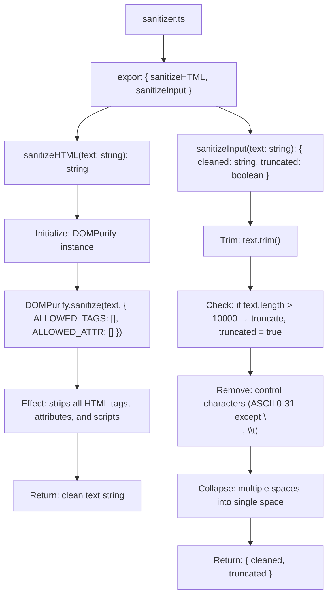

Explanation: Dual-function sanitizer for LLM output and user input. sanitizeHTML uses DOMPurify with ALLOWED_TAGS set to empty array, effectively stripping all HTML from LLM output before rendering in React (prevents XSS). sanitizeInput cleans user input: trims whitespace, enforces 10000-character maximum, removes control characters, and collapses multiple spaces. Used in Gate 1 (input safety) and Gate 3 (output safety).

---

14. storage.ts

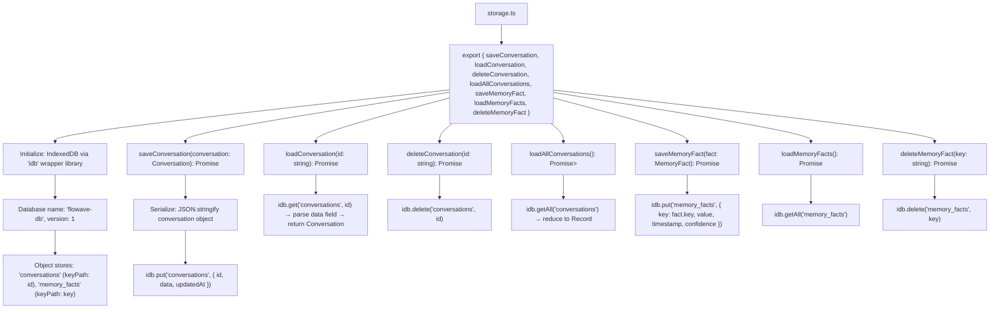

Explanation: IndexedDB storage wrapper using the idb library for simplified Promises-based API. Creates a database named flowave-db with two object stores: conversations (for chat history persistence) and memory_facts (for long-term AI memory). Provides CRUD operations for both stores. Conversations are serialized as JSON before storage. Memory facts are keyed by a unique key string (e.g., 'user_name', 'user_job'). This is the persistence layer for all offline, multi-session data.

---

15. thinking.ts

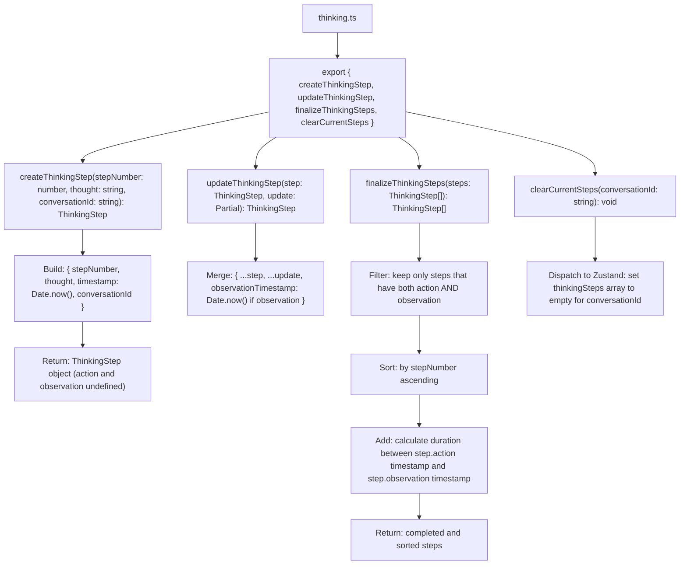

Explanation: Thinking step lifecycle manager. createThinkingStep creates a partial step when the LLM starts reasoning (thought only, no action/observation yet). updateThinkingStep merges new data (action call or observation result) into the existing step. finalizeThinkingSteps filters out incomplete steps (no observation), sorts by step number, and calculates duration between action and observation. clearCurrentSteps dispatches a store update to clear steps for a conversation. These functions are called by the Orchestrator during the ReAct loop.

---

16. tokenizer.ts

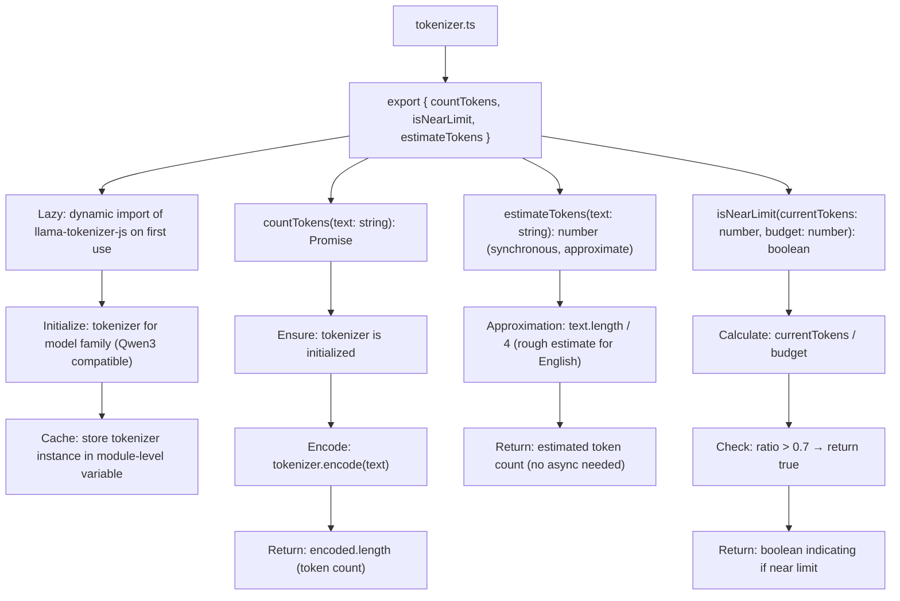

Explanation: Token counter for managing context window limits. Uses llama-tokenizer-js (lazy-loaded for performance) to accurately encode text and count tokens for Qwen3-compatible models. estimateTokens provides a fast, synchronous approximation (length/4) when exact counting isn't needed. isNearLimit checks if current token usage exceeds 70% of the budget (from rules/context.ts), triggering compression. Used by the Orchestrator to monitor context window usage.

---

17. toxicityAnalyzer.ts

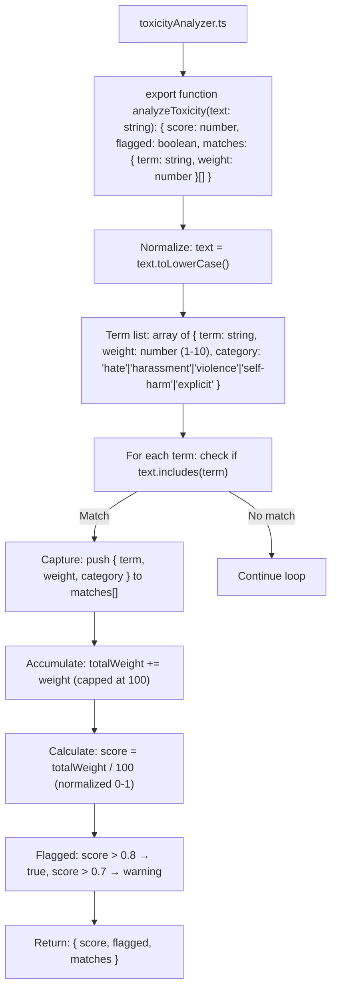

Explanation: Lightweight toxicity analyzer using a weighted keyword list. Terms are organized by category (hate, harassment, violence, self-harm, explicit content) with weights from 1 to 10. Matches are accumulated and normalized to a 0-1 score. Scores above 0.8 are considered toxic and blocked; scores above 0.7 generate warnings. Used in Gate 1 (input safety) and Gate 3 (output safety) from rules/safety.ts.

---

End of flow-6.md. This completes the per-file documentation for all 16 helper utilities. The helpers form the foundation that tools, skills, web tools, and the orchestrator depend on for caching, safety, communication, parsing, rate limiting, storage, thinking management, and token counting.