flow-7.md — Core Systems & UI Interactions

This file provides detailed diagrams and explanations for deployment, initialization, memory, prompting, types, concurrency, security, offline, settings, conversations, chat history, message actions, model integration.

---

1. Deployment & Communication (React TS + Ollama)

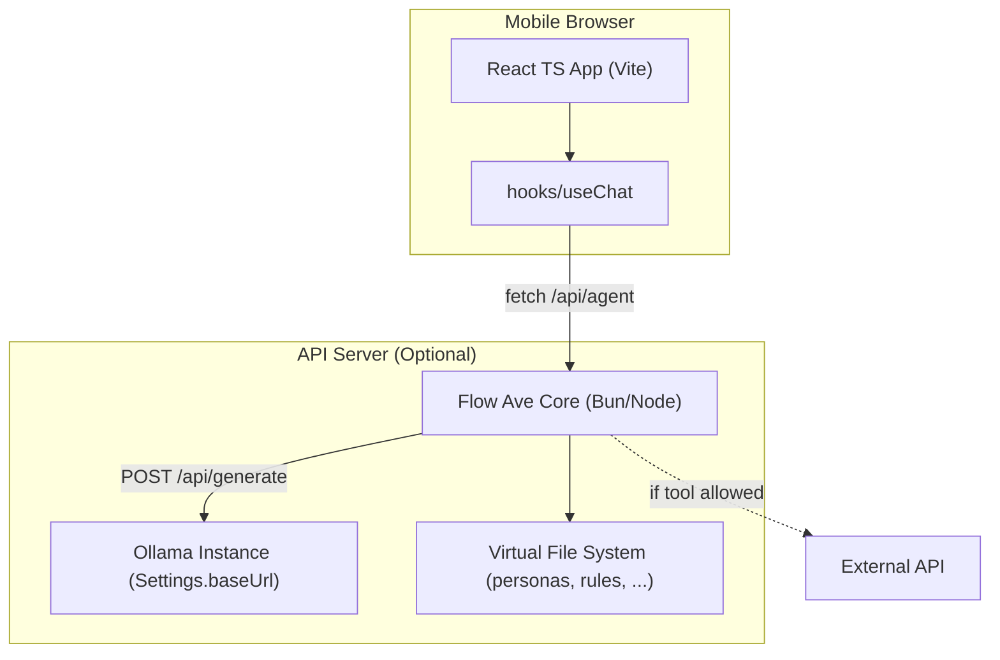

Explanation: The React frontend can talk directly to Ollama if CORS is enabled, or through a thin API server for production. All environment variables (OLLAMA_NUM_CTX=65536, FLASH_ATTENTION=1, KV_CACHE_TYPE=q4_0, OLLAMA_HOST=0.0.0.0, KEEP_ALIVE=-1, MAX_LOADED_MODELS=1, SCHED_SPREAD=1, MAX_QUEUE=512) are set in the server environment. External APIs like DuckDuckGo are only called if the corresponding tool's rate limit allows it. The backend proxy adds logging, CSP headers, and rate limiting.

---

2. App Initialization & Autoload Registry

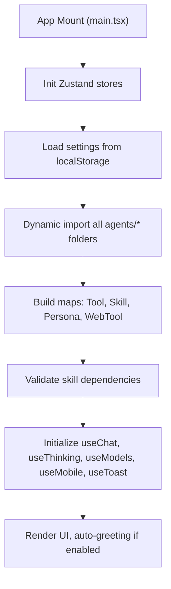

Explanation: Vite's import.meta.glob imports all modules from agents/personas/, agents/rules/, agents/tools/, agents/skills/, agents/web/, and agents/memory/. The Registry is a plain Map<string, Tool | Skill | WebTool>. Missing dependencies cause an error toast at startup. After hooks are initialized, if greeting.ts requires it, a greeting is generated in a new default conversation.

---

3. Optimized Agent Memory (Detailed Structure & Flow)

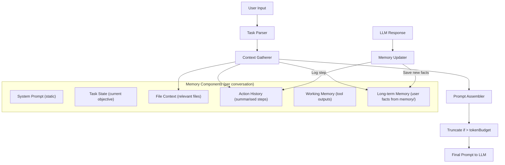

Explanation: Six memory components work together. LongTermMemory draws from the memory/ folder stored in IndexedDB. WorkingMemory holds ephemeral values cleared on task completion. The memory updater uses a separate small LLM call to extract structured facts from the assistant's answer. Token budget allocation: System Prompt 15% (~9800 tokens), File Context 35% (~22900), ActionHistory 25% (~16300), Output 25% (~16300).

---

4. Prompt Template Structure (with Model Adaptation)

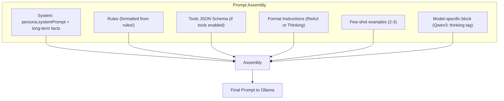

Explanation: The prompt is assembled from six blocks. System includes persona's systemPrompt and long-term memory facts. Tools block is only included in Expert mode when enableTools is true. For Qwen3-based models, an extra instruction encourages native reasoning tags (思考/回答). Few-shot examples demonstrate the ReAct format.

---

5. TypeScript Core Type Definitions

```mermaid
graph LR
    subgraph Types["src/types.ts"]
        Persona["Persona { name, systemPrompt, displayName, toneInstruction }"]
        Tool["Tool { name, description, parameters: ZodSchema, handler: (params) => Promise<ToolResult> }"]
        Skill["Skill { name, description, steps: string[] }"]
        WebTool["WebTool { name, description, parameters: ZodSchema, handler: (params) => Promise<WebToolResult> }"]
        RuleSet["RuleSet { global, mode, tools, safety, language, tone, greeting, thinking }"]
        ThinkingStep["ThinkingStep { stepNumber, thought, action?, actionInput?, observation?, timestamp, conversationId }"]
        ChatMessage["ChatMessage { id, role, content, timestamp, conversationId }"]
        Conversation["Conversation { id, title, personaId, mode, messages: ChatMessage[], thinkingSteps: ThinkingStep[], createdAt, updatedAt }"]
        Settings["Settings { ollamaBaseUrl, model, displayName, showProcessLog, showThinking, enableThinking, enableTools, webEnabled, memoryEnabled, theme }"]
        MemoryFact["MemoryFact { key, value, timestamp, confidence }"]
        RuleResult["RuleResult = { decision: 'Allow' | 'Modify' | 'Deny', reason?: string, modifiedData?: any }"]
        ToolResult["ToolResult = { success: boolean, data?: any, error?: string }"]
        WebToolResult["WebToolResult = { success: boolean, data?: any, error?: string }"]
        AgentState["AgentState = { conversations: Record<string, Conversation>, currentConversationId: string | null, settings: Settings, isStreaming: boolean, error: string | null }"]
    end
```

Explanation: Centralized types ensure consistency across all modules. Persona and Tool use ZodSchema for runtime validation. MemoryFact stores key-value pairs with confidence scores. AgentState defines the full Zustand store shape. All modules import from this single types file.

---

6. Concurrency & Abort Controller

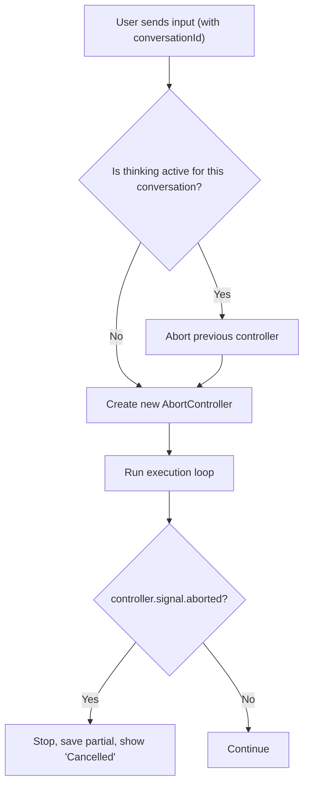

Explanation: Each conversation maintains its own AbortController in the Zustand store (Map<conversationId, AbortController>). When a new message is sent, any pending request for that conversation is aborted to prevent duplicate responses. The controller signal is passed to fetch calls and checked periodically during streaming.

---

7. Security Hardening (CSP & XSS Prevention)

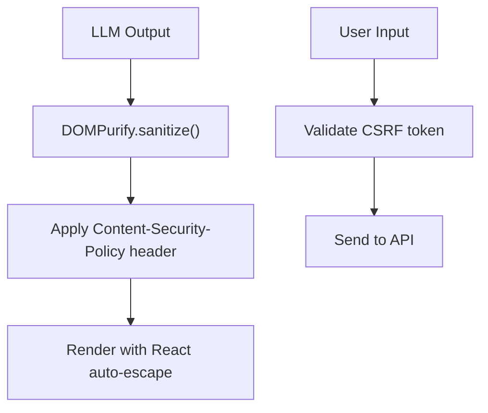

Explanation: All LLM output is purified via DOMPurify before rendering (prevents XSS). CSP headers set: default-src 'self'; script-src 'self'; connect-src 'self' ollamaBaseUrl. React's JSX auto-escapes all string interpolations as defense-in-depth. CSRF tokens are required for state-changing requests when the optional backend proxy is used.

---

8. Offline Detection & Queue (PWA)

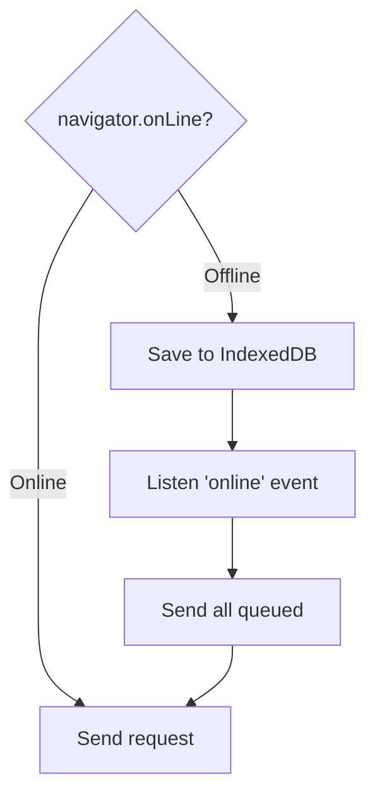

Explanation: The sw.js service worker intercepts fetch requests. When offline, user messages are stored in IndexedDB with a pending status. A toast notifies the user that the message is queued. Once the online event fires, all queued messages are sent in order, and the UI updates with the AI responses.

---

9. Service Worker & PWA Manifest

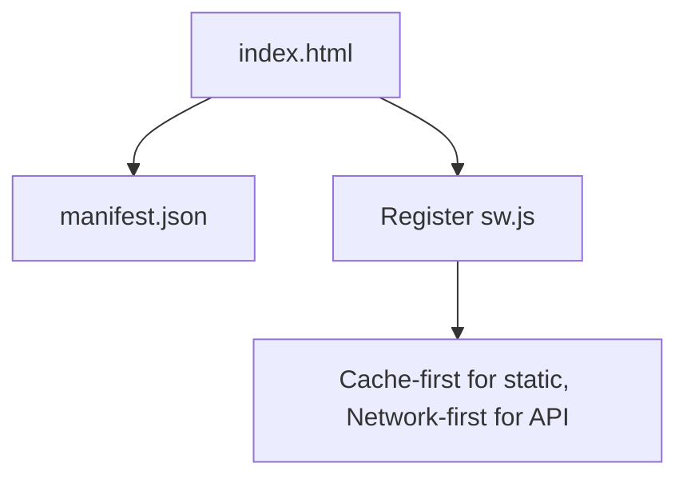

Explanation: The PWA manifest enables "Add to Home Screen" with app name, icons, theme color, and display mode "standalone". The service worker caches static assets (HTML, CSS, JS) using cache-first strategy. API calls use network-first with offline queue fallback.

---

10. Settings Flow: Load, Edit, Save, Test Connection

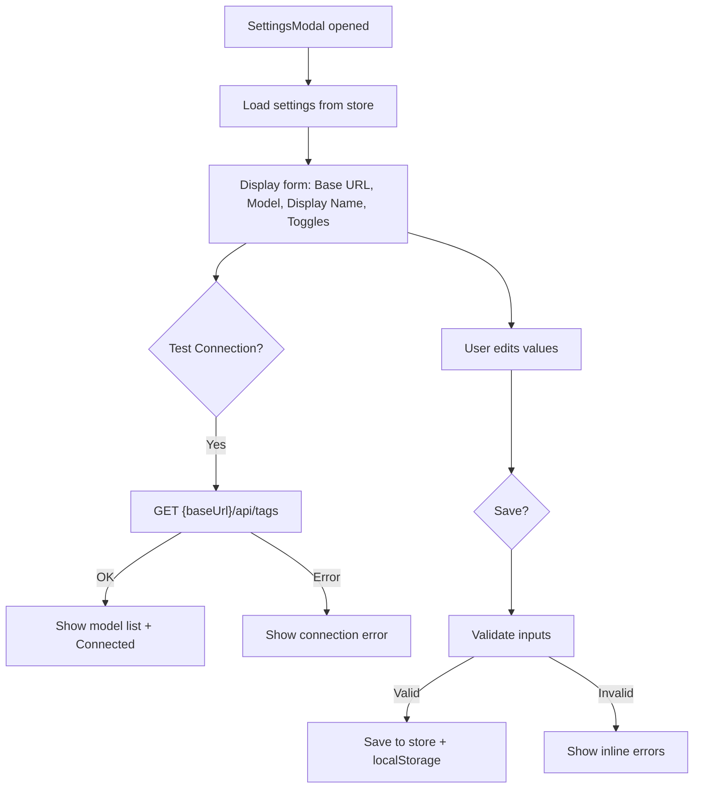

Explanation: The Settings modal uses useSettings hook to read/write the Zustand settings store. "Test Connection" sends a HEAD/GET request to Ollama's /api/tags endpoint. On success, it populates the model dropdown with available models. Validation ensures URL is valid HTTP/HTTPS format and model name is not empty. Settings persist to localStorage via Zustand's persist middleware.

---

11. Conversation Management: New, Switch, Delete

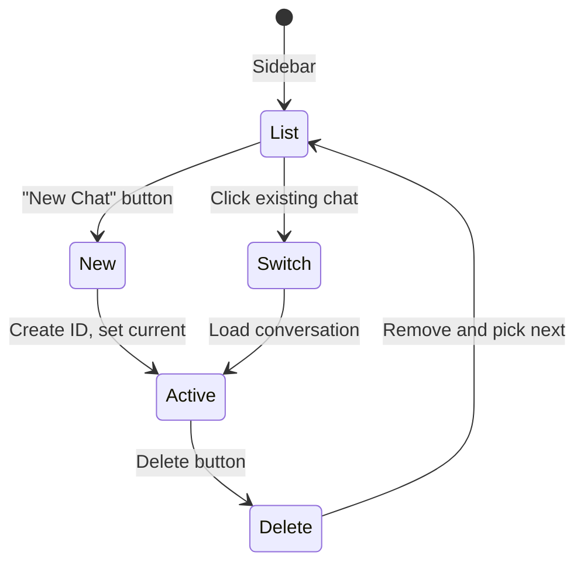

Explanation: All conversations are stored in store/chat.tsx as Record<string, Conversation>. The active conversation's ID (currentConversationId) determines which data is displayed. "New Chat" creates a UUID, sets title "New Chat", and optionally triggers the greeting rule. Switching chats only changes the active ID. Deleting removes from store and localStorage, then switches to the nearest remaining conversation.

---

12. Chat History: Storage & Retrieval

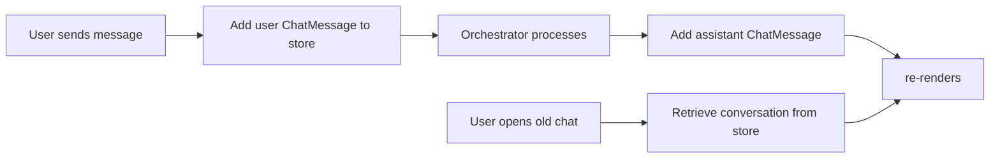

Explanation: Messages are rendered in MessageList.tsx via MessageBubble.tsx. Store updates trigger re-renders only for the active conversation via Zustand selectors. Old chats are never fetched from a server; they are loaded from localStorage on startup and stored in the Zustand store.

---

13. Settings Toggles: Show Process Log / Thinking

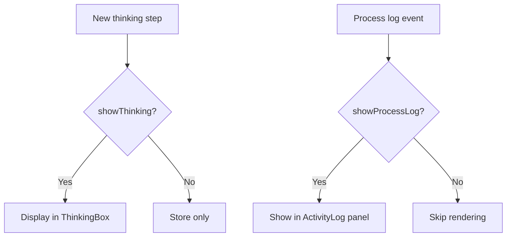

Explanation: Two Zustand selectors conditionally render ThinkingBox and ActivityLog components. Data is always recorded; toggles only affect visibility. Both settings default to true and are controlled from Settings > Capabilities panel.

---

14. Model Selection: Refresh List

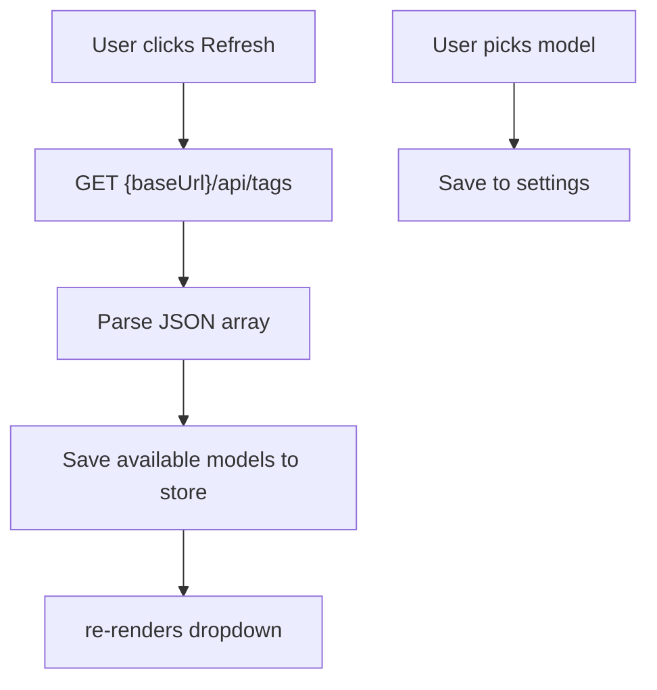

Explanation: The useModels hook fetches and stores the model list from Ollama's /api/tags. ModelSelector displays a searchable dropdown. Users can also type a custom model name and click "+" to add it to customModels. Selected model is saved to settings and localStorage.

---

15. Cancel / Stop Response

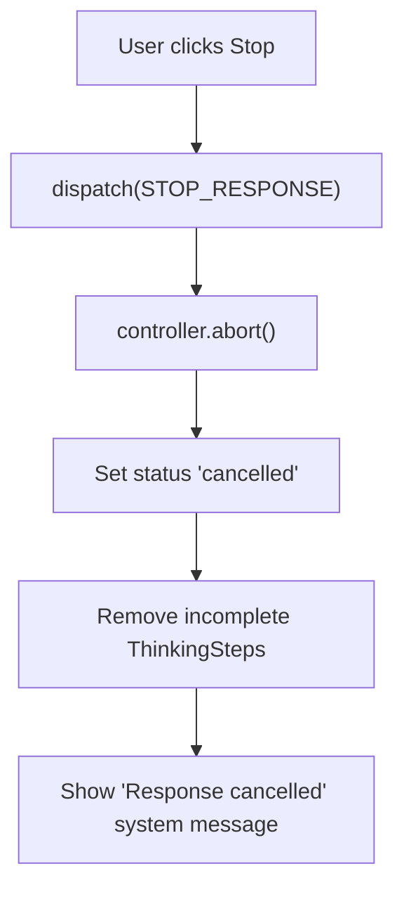

Explanation: The ChatInput component renders a Stop button (square icon) only when isStreaming is true. Clicking dispatches STOP_RESPONSE, which calls AbortController.abort(), marks the conversation as cancelled, removes incomplete thinking steps, and restores the Send button.

---

16. Copy Message

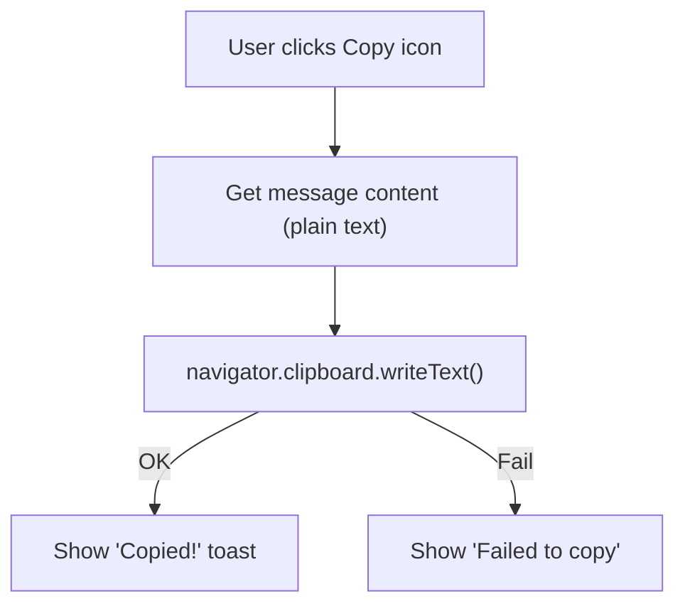

Explanation: Implemented in MessageBubble.tsx. Markdown is stripped before copying. Uses the modern async Clipboard API with a fallback to document.execCommand('copy') for older browsers.

---

17. Retry Message

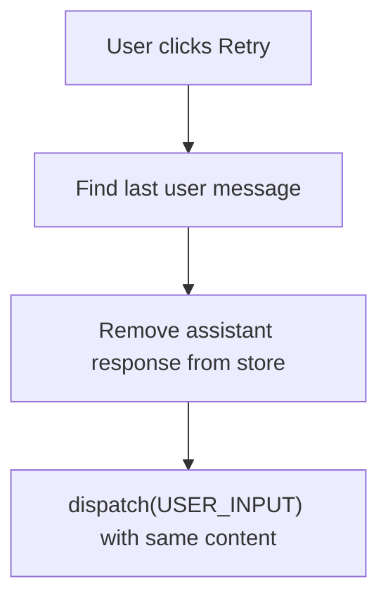

Explanation: Retry replaces the last assistant message with a fresh generation. The original user prompt is re-sent exactly as before. The Orchestrator processes it as a new input, and the LLM may generate a different response.

---

18. Edit & Resend Message

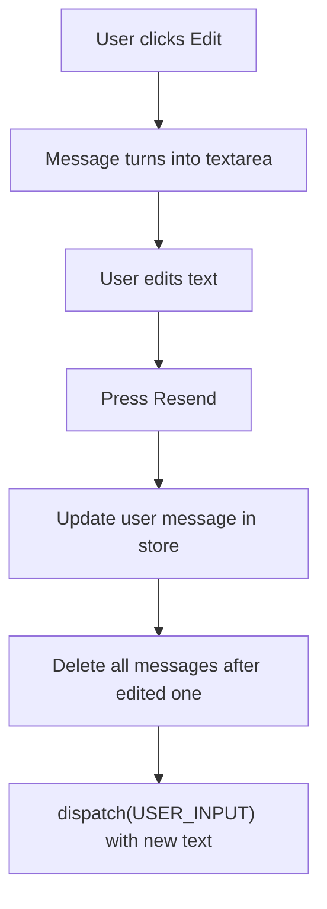

Explanation: Editing a user message turns it into an editable textarea. On resend, the user message is updated in the store, all subsequent messages are deleted (to maintain conversation consistency), and a new USER_INPUT is dispatched with the corrected text.

---

19. Qwen3 Thinking & Vision Integration

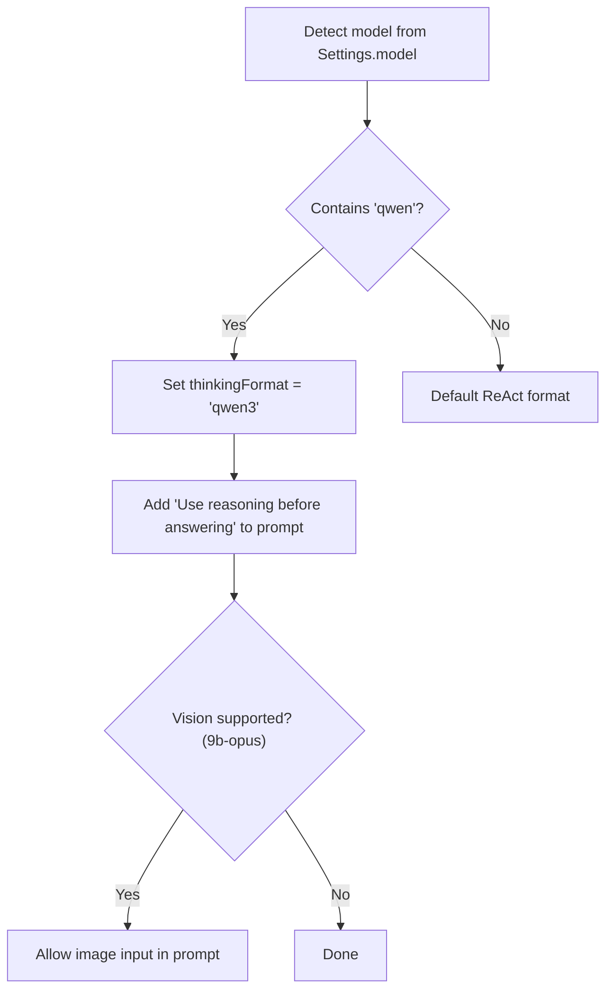

Explanation: Model-specific adaptations are injected into the prompt's ModelSpecific block. For Qwen3-based models (nexusriot/qwen3.5-opus-distil:9b), an instruction encourages native reasoning with 思考/回答 tags. Vision capability allows image uploads via QuestionForm.tsx, which base64-encodes images and includes them in the Ollama request's images field.

---

End of flow-7.md. Continued in flow-8.md (Utilities & Advanced Features).