flow-8.md — Advanced Features & Utilities

This file provides detailed diagrams and explanations for model loading, shutdown, voice/image input, token display, search, export, shortcuts, theme, notifications, customization, health check, token control, Skills.sh integration, and memory system.

---

1. Model Loading & Warm‑up

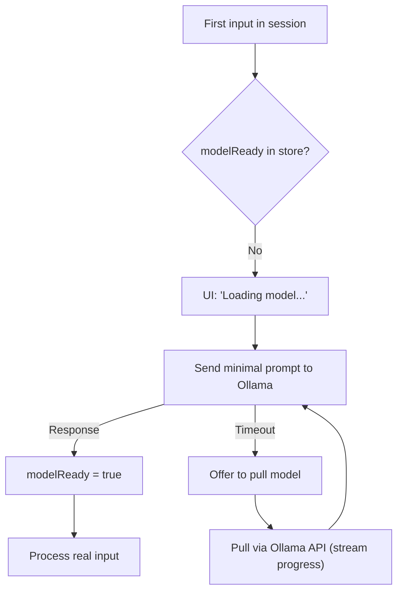

Explanation: Before the first real user message, a tiny warm‑up request ensures the model is loaded into GPU/RAM. If the model is missing, the UI suggests pulling it via Ollama's API, streaming download progress. Once loaded, the modelReady flag is set and subsequent requests skip warm‑up.

---

2. Graceful Shutdown & Cleanup

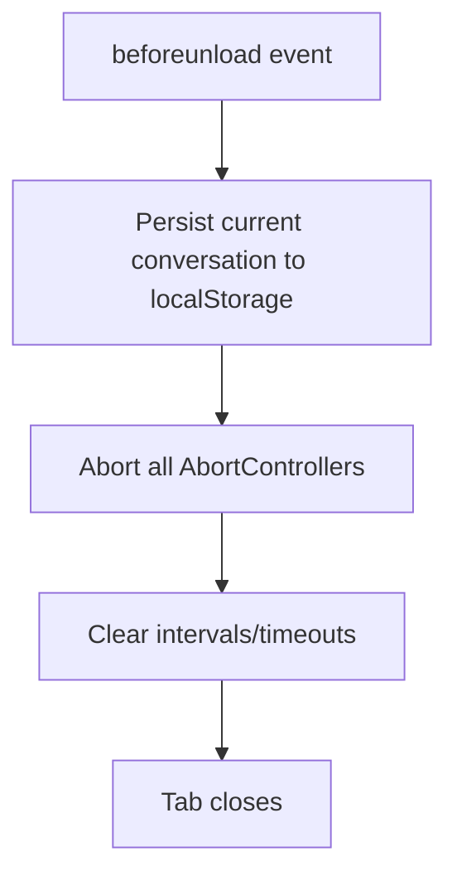

Explanation: The useChat hook registers a beforeunload listener that saves the current conversation state, aborts any pending requests (prevents dangling connections), and clears timers to prevent memory leaks. When the tab reopens, conversations are restored from localStorage.

---

3. Voice & Image Input

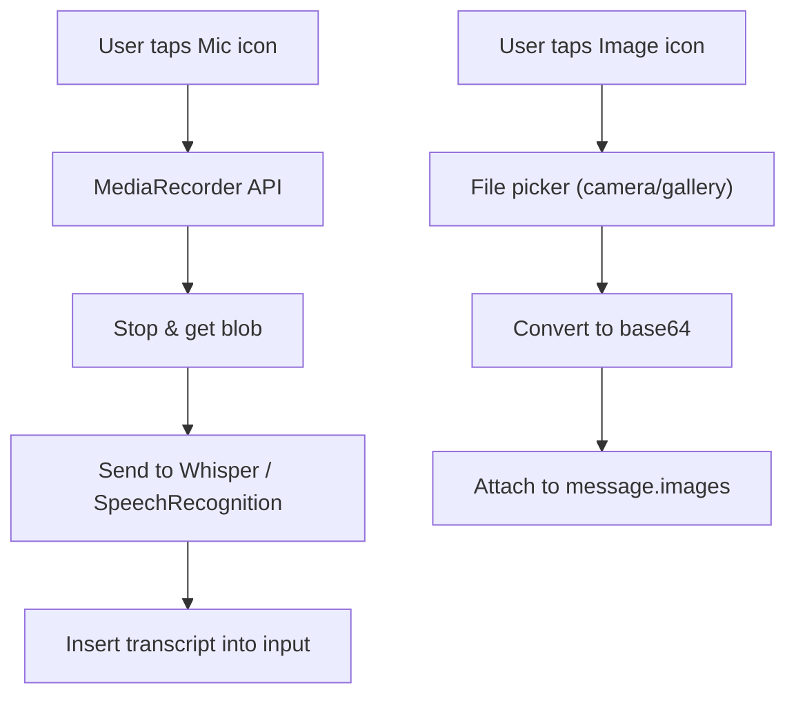

Explanation: Voice input uses the browser's MediaRecorder API and sends audio to a Speech‑to‑Text endpoint (Whisper or browser SpeechRecognition). Image input opens a file picker, converts the image to base64, and attaches it to the message for Ollama's multimodal endpoint (supported by Qwen3.5‑opus).

---

4. Token Usage Display

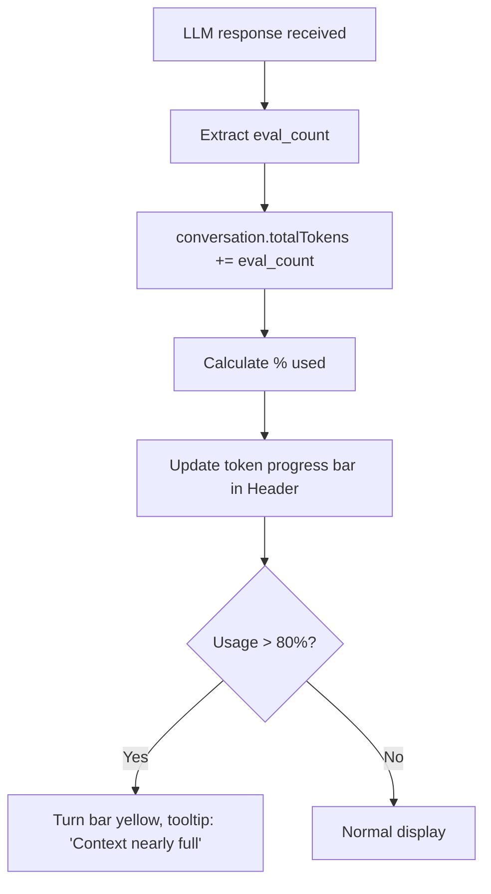

Explanation: After each LLM response, the eval_count from Ollama is used to update the conversation's total token usage. A progress bar in the Header component shows consumption relative to the 65536 budget. When usage exceeds 80%, it changes color to yellow with a warning tooltip about impending compression.

---

5. Search in Chat History

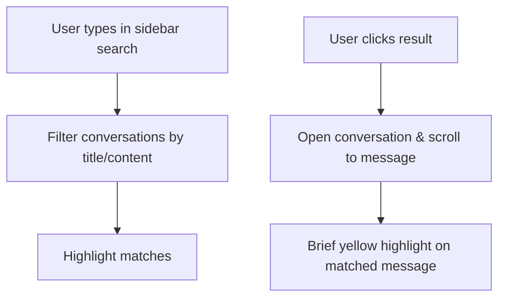

Explanation: The sidebar search performs case‑insensitive substring matching against conversation titles and message contents. Results are displayed instantly. Clicking a result opens the conversation and scrolls to the matching message with a brief highlight animation.

---

6. Export Conversation

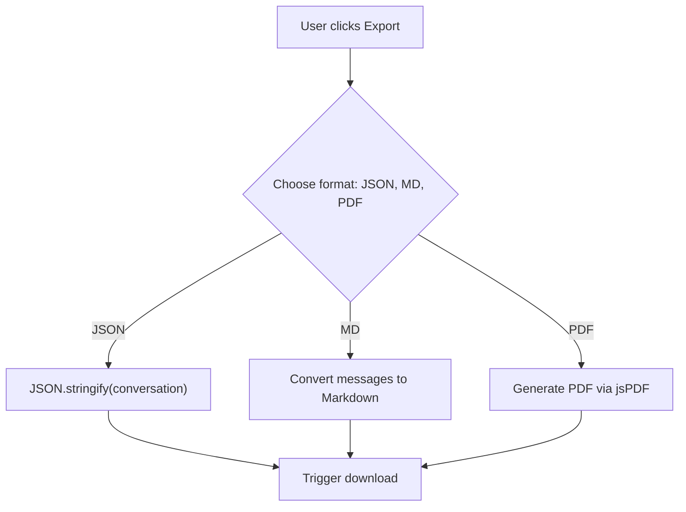

Explanation: Export is available from the conversation context menu. JSON preserves full structured data including thinking steps. Markdown converts messages to a readable text format with role labels. PDF generates a printable document via jspdf with a simple text layout.

---

7. Keyboard Shortcuts

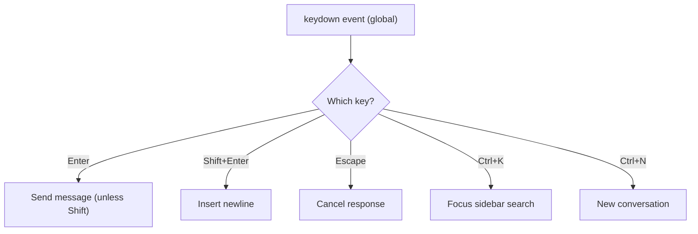

Explanation: A global useEffect in App.tsx listens for keyboard events. Shortcuts are displayed in a small tooltip for discoverability. Enter sends the message; Shift+Enter inserts a newline. Escape cancels an ongoing response. Ctrl+K focuses the search bar; Ctrl+N creates a new conversation.

---

8. Dark Mode / Theme Switch

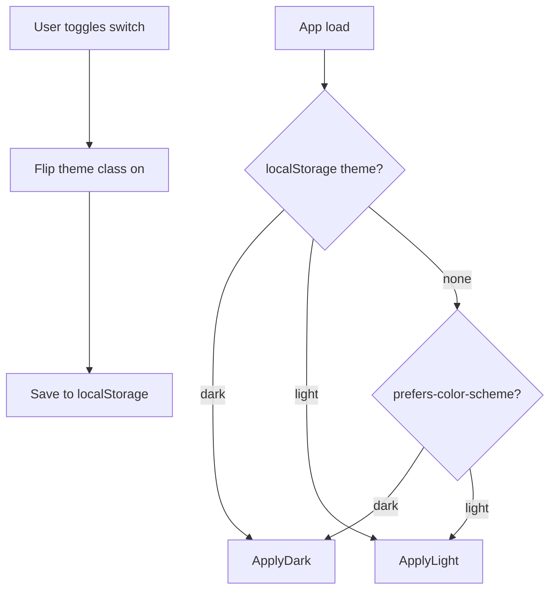

Explanation: Theme is set on first load based on localStorage or the system preference (prefers-color-scheme). A toggle switch in the UI allows manual override and persists the choice. Tailwind's darkMode: 'class' applies the theme by toggling a dark class on the root HTML element.

---

9. Notifications (Sound/Vibrate)

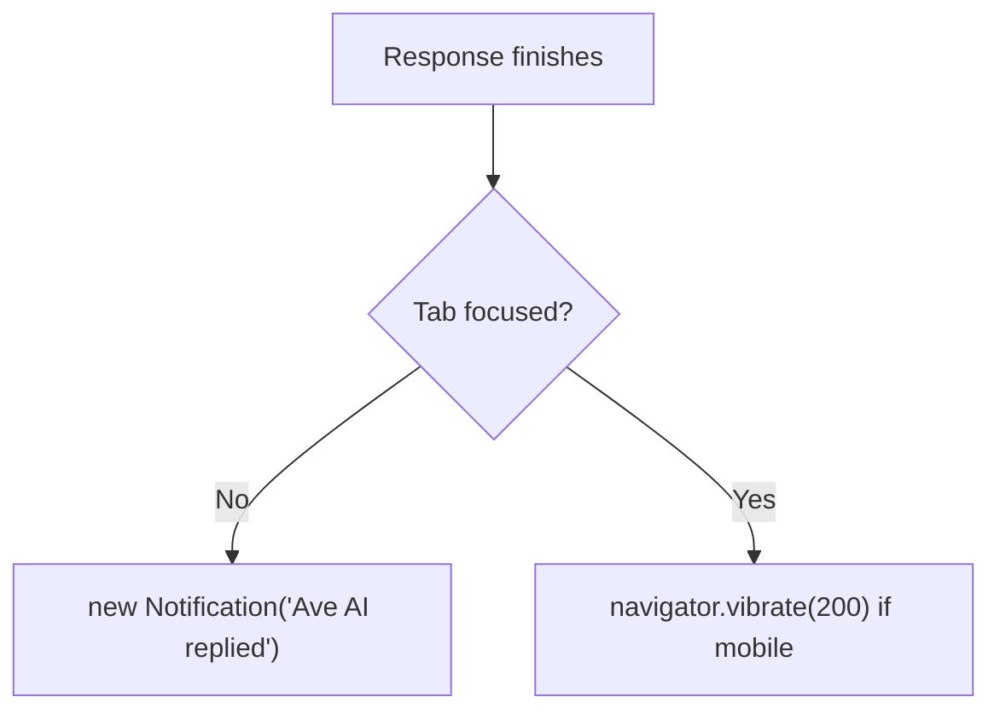

Explanation: When a response completes and the browser tab is not in focus, the Web Notification API fires an alert. On mobile, the Vibration API provides haptic feedback. Permission for notifications is requested on first use.

---

10. System Prompt Customization

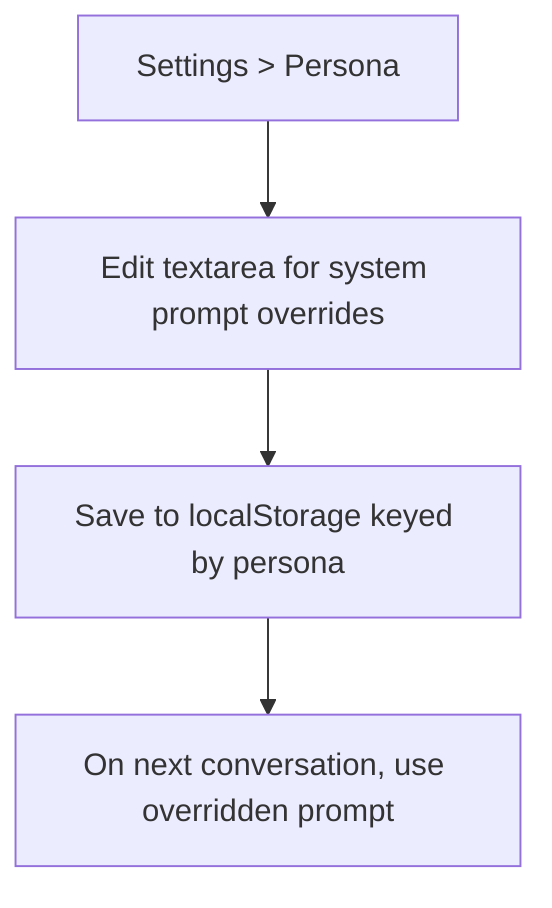

Explanation: Each persona's system prompt can be overridden by the user in the Settings > Personas panel. The custom prompt is stored in localStorage under personaOverride_{personaName}. The Orchestrator checks for an override before loading the default prompt, allowing fine‑tuning of AI behavior.

---

11. Ollama Health Check & Reconnect

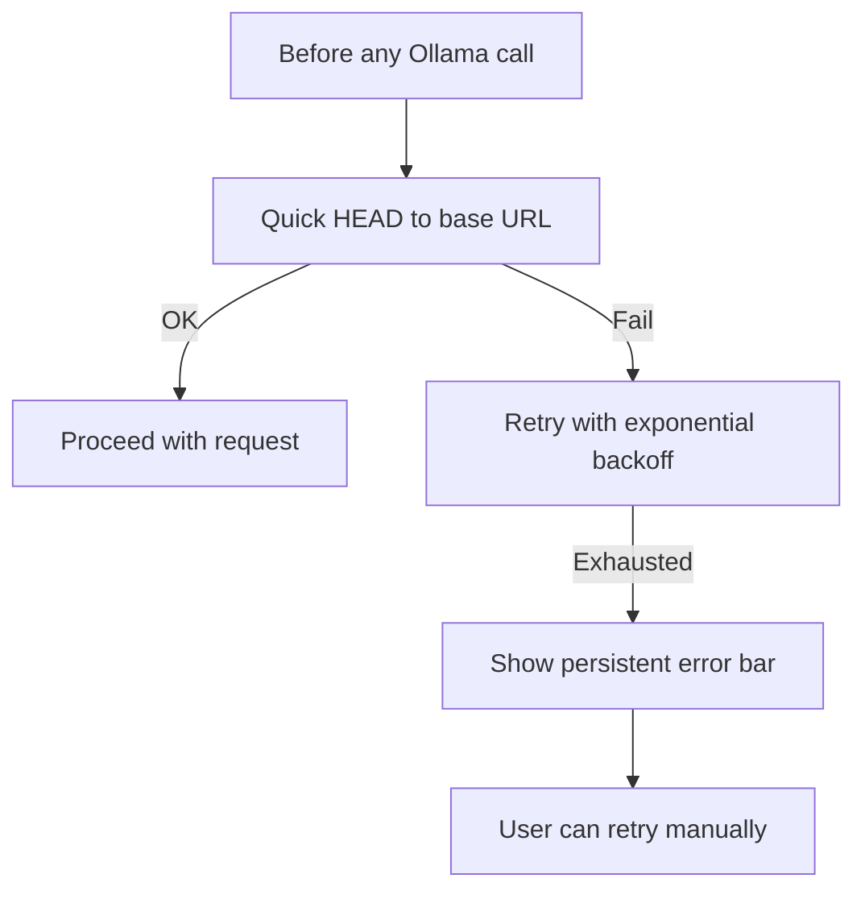

Explanation: Before each series of requests, a lightweight health check verifies the Ollama server is reachable. If it fails, exponential backoff retries are attempted. After exhaustion, the UI shows a persistent red banner with a "Retry" button. This prevents silent failures and informs the user to check their connection.

---

12. Max Output Token Control

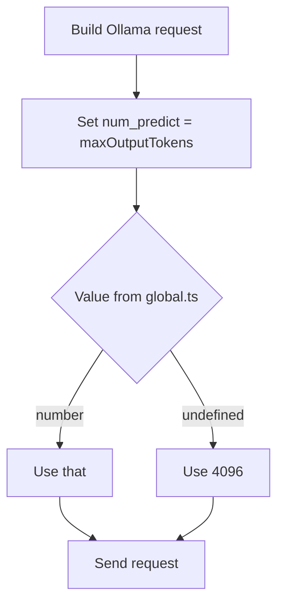

Explanation: The num_predict option caps the LLM's output length, preventing runaway generations that could slow UI rendering or exhaust the context window. The default is 4096 tokens, configurable via rules/global.ts.

---

13. Skills.sh Integration — Skill Discovery

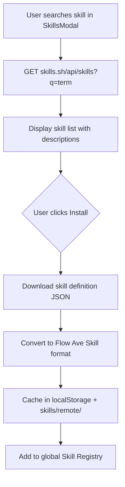

Explanation: The SkillsModal has a "Remote" tab that fetches skills from Skills.sh. Installed remote skills are cached locally for offline use. The conversion layer maps arbitrary skill JSON to the internal Skill interface. Remote skills pass through the same Rules Engine validation as local skills.

---

14. Skills.sh Integration — Hybrid Skill Registry

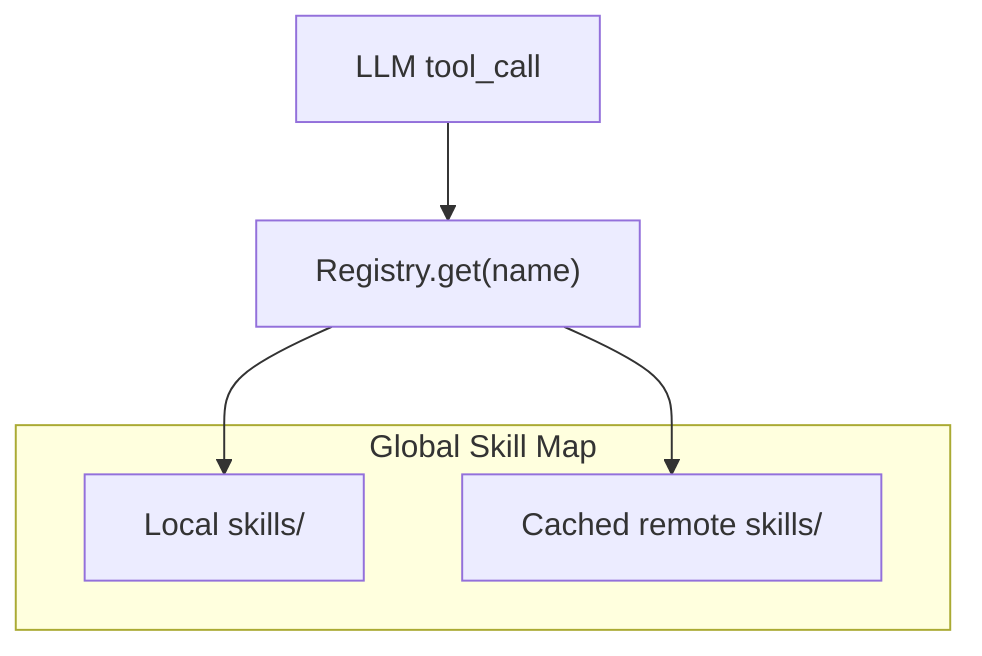

Explanation: The Registry is a unified Map containing both local and remote skills. Whether a skill originated locally or from Skills.sh, it is executed in the same sandbox with the same rules applied. LLM tool calls look up skills by name without needing to know the source.

---

15. Memory System — Folder Structure & Storage

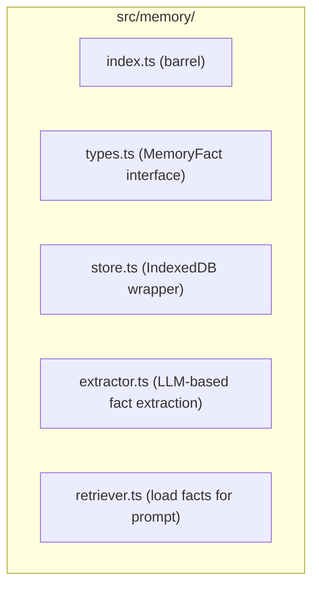

Explanation: The memory/ folder encapsulates all long‑term memory logic. store.ts provides CRUD operations on IndexedDB. extractor.ts sends a small LLM request to extract structured {key, value} facts from an assistant message. retriever.ts loads all facts and formats them for the system prompt.

---

16. Memory System — Fact Extraction Flow

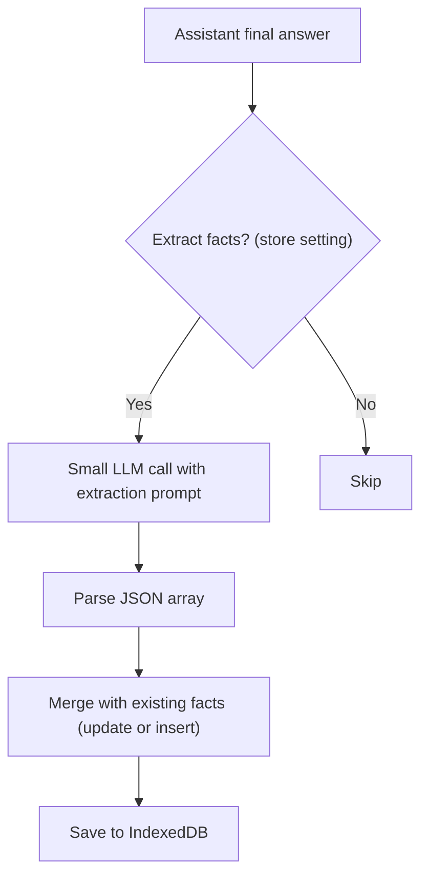

Explanation: Fact extraction can be toggled in Settings (memoryEnabled). It uses a tiny prompt like "Extract any user facts from this message as JSON {key, value}". Duplicate keys are updated with the latest value and timestamp.

---

17. Memory System — Prompt Injection

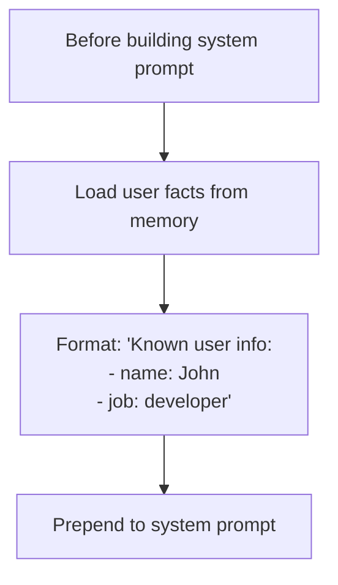

Explanation: Fact injection is performed by the Prompt Assembler. The Orchestrator calls memory/retriever.ts before every call to Ollama, loading all stored facts and prepending them to the system prompt as "Known user information: ..."

---

End of flow-8.md. Continued in flow-9.md (State, Hooks, Components, & API Integration).