flow-9.md — State, Hooks, Components & API Integration

This file provides detailed diagrams and explanations for Zustand stores, React hooks, component tree, key components, and API/library integration.

---

1. store/chat.tsx — Zustand Chat Store

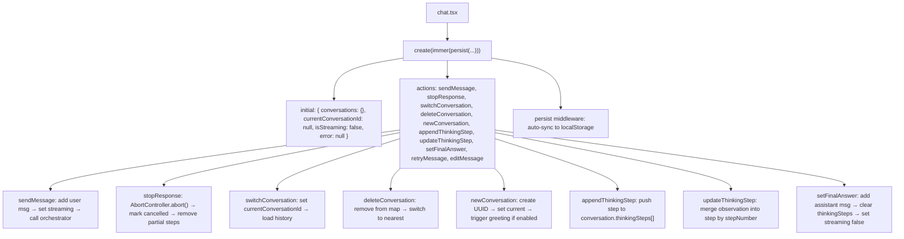

Explanation: The primary Zustand store manages all conversation state. Uses Immer middleware for immutable updates and persist middleware for automatic localStorage sync. conversations is a Record<string, Conversation> keyed by UUID. currentConversationId determines the active conversation. All actions are dispatched from useChat hook.

---

2. store/settings.tsx — Zustand Settings Store

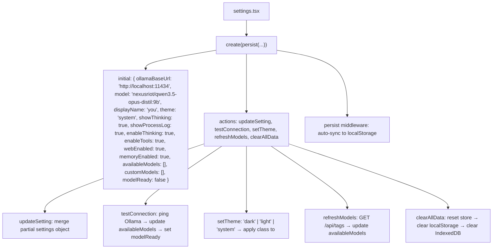

Explanation: The settings store holds all user preferences. persist middleware automatically syncs to localStorage on every change. modelReady tracks whether the selected model is loaded in Ollama's memory. testConnection pings the Ollama server and populates availableModels. clearAllData performs a full reset.

---

3. hooks/useChat.ts — Primary Chat Hook

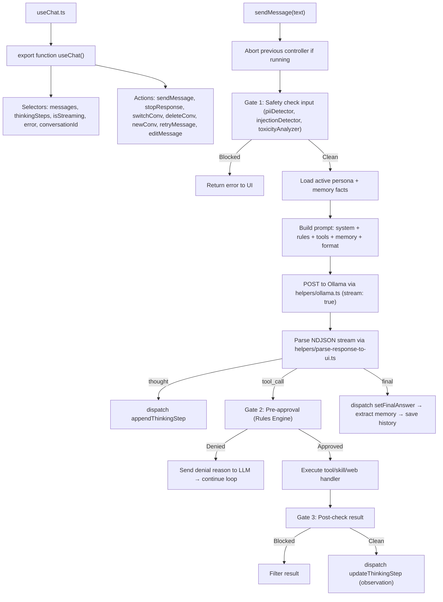

Explanation: The heart of the application. useChat wires user input through the full execution loop: safety validation, persona/memory loading, prompt building, Ollama streaming, response parsing, rule evaluation, tool execution, and store updates. Returns { messages, thinkingSteps, isStreaming, error, sendMessage, stopResponse, switchConv, deleteConv, newConv, retryMessage, editMessage }.

---

4. hooks/useThinking.ts — Thinking Step Selector

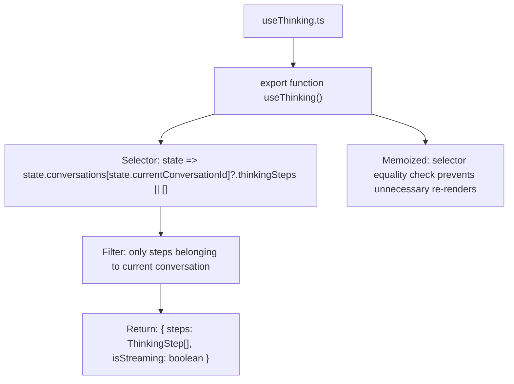

Explanation: A lightweight Zustand selector hook that filters the thinkingSteps array for the active conversation. Returns the steps array and the current streaming status. Used by the ThinkingBox component for real‑time rendering.

---

5. hooks/useModels.ts — Model Management Hook

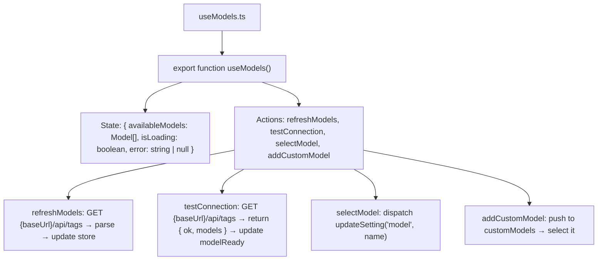

Explanation: Manages fetching and caching the available Ollama models list. testConnection also sets the modelReady flag in the settings store. addCustomModel allows users to type a model name not yet pulled.

---

6. hooks/use-mobile.tsx & hooks/use-toast.ts

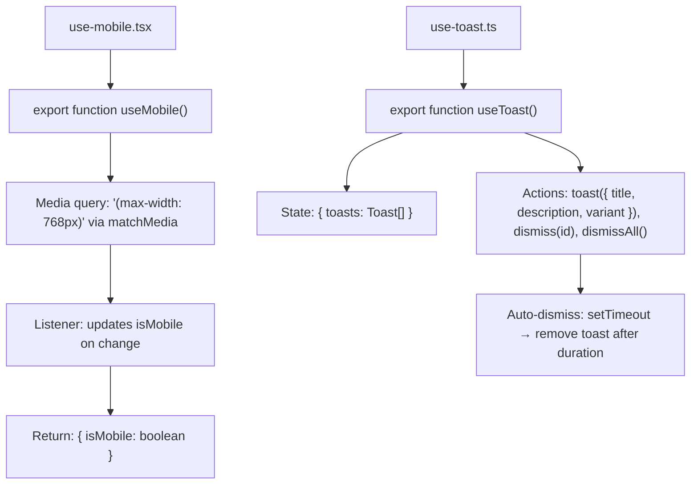

Explanation: useMobile detects screen width ≤ 768px for responsive UI (sidebar becomes drawer). useToast manages a queue of toast notifications with auto‑dismiss timers. Used by Copy, Save, and error feedback across the app.

---

7. Component Tree — Full Hierarchy

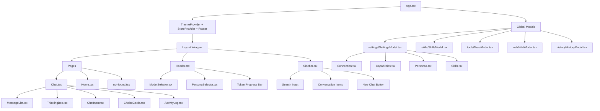

Explanation: The component tree is rooted at App.tsx. Global providers (theme, store, router) wrap the layout. The main Chat.tsx page composes MessageList, ThinkingBox, ChatInput, ChoiceCards, and ActivityLog. Five global modals are available from any view: Settings (with tabs for Connection, Capabilities, Personas, Skills), Skills, Tools, Web, and History.

---

8. ChatInput.tsx — Component Behavior

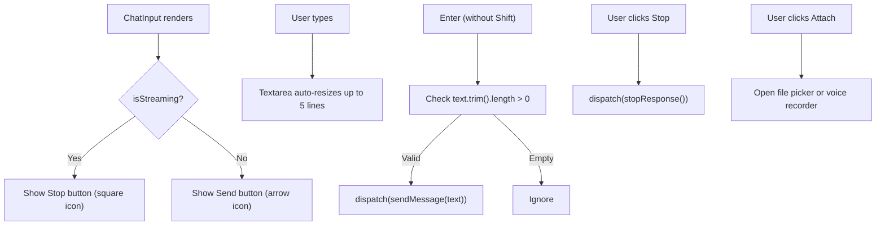

Explanation: The input area is a textarea that grows up to 5 lines. Enter sends the message; Shift+Enter inserts a newline. The Stop button is only visible during streaming. An attach button allows file/image uploads and voice recording.

---

9. MessageBubble.tsx — Rendering & Actions

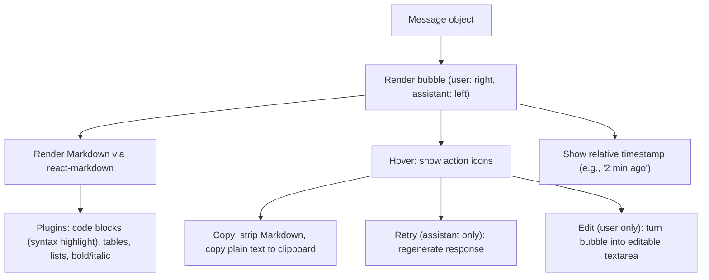

Explanation: Each message bubble renders Markdown content with syntax‑highlighted code blocks, tables, and formatting. Hover reveals action buttons: Copy (all messages), Retry (assistant messages to regenerate), and Edit (user messages to correct and resend). Timestamps use relative formatting.

---

10. ThinkingBox.tsx — Animation Internals

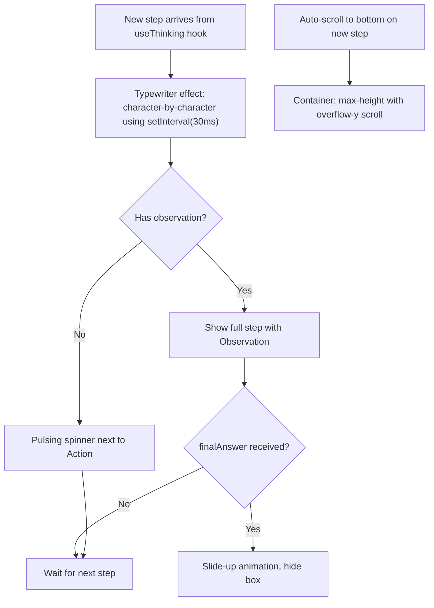

Explanation: The ThinkingBox uses a typewriter effect (character‑by‑character rendering at 30ms intervals) for the thought text. While awaiting an observation, a pulsing spinner is shown next to the action. Auto‑scroll ensures the latest step is always visible. When the final answer arrives, the box slides up and disappears.

---

11. Sidebar.tsx — Conversation List

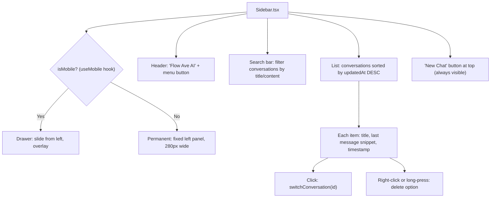

Explanation: The sidebar provides conversation management. On mobile, it becomes a swipeable drawer. Conversations are sorted by most recent activity. Each item shows title, last message preview, and relative timestamp. Right‑click or long‑press reveals a delete option. A persistent "New Chat" button is at the top.

---

12. SettingsModal.tsx — Structure

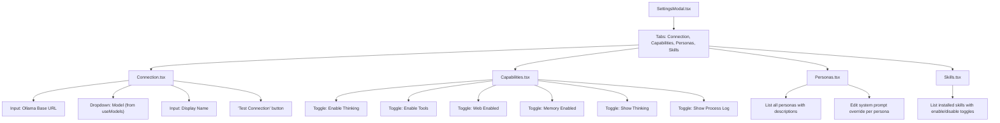

Explanation: The Settings modal uses a tabbed interface. Connection configures the Ollama server. Capabilities toggles features (thinking, tools, web, memory) and UI settings (show thinking, show log). Personas allows browsing and customizing system prompts. Skills lists installed skills with enable/disable toggles.

---

13. lib/api-client-react/ — Auto‑Generated Fetch Client

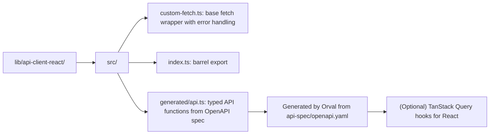

Explanation: An auto‑generated typed fetch client created by Orval from the OpenAPI specification. custom-fetch.ts provides a configured fetch instance with base URL, headers, and error handling. In the local‑only setup, this can be replaced by direct Ollama calls, but it's available for optional backend proxy usage.

---

14. backend/ — Optional API Server

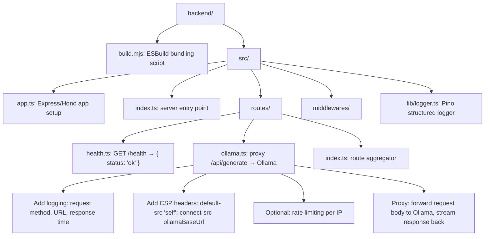

Explanation: An optional backend proxy server built with Express or Hono. It adds structured logging (Pino), Content‑Security‑Policy headers, and optional rate limiting. The /api/generate route proxies requests to Ollama, streaming responses back to the frontend. This is useful when direct browser‑to‑Ollama CORS is not feasible.

---

15. lib/db/ — Optional Database Schema

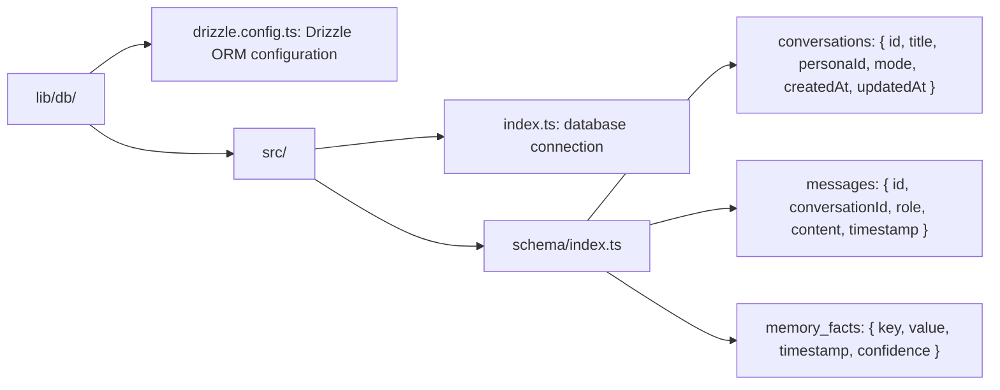

Explanation: A Drizzle ORM schema for optional server‑side persistence using PostgreSQL. Currently unused in the local‑only version (which uses IndexedDB via helpers/storage.ts), but available for future server‑based deployments. Tables mirror the client‑side data structures.

---

16. Zustand Store Shape — Complete AgentState

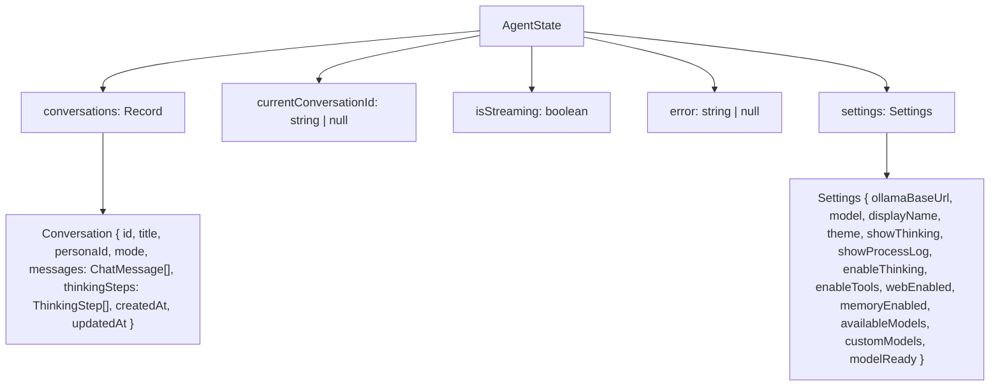

Explanation: The complete Zustand store shape combining both chat.tsx and settings.tsx. conversations is keyed by UUID. All state is automatically persisted to localStorage via Zustand's persist middleware.

---

17. useChat Hook — Full Internal Flow

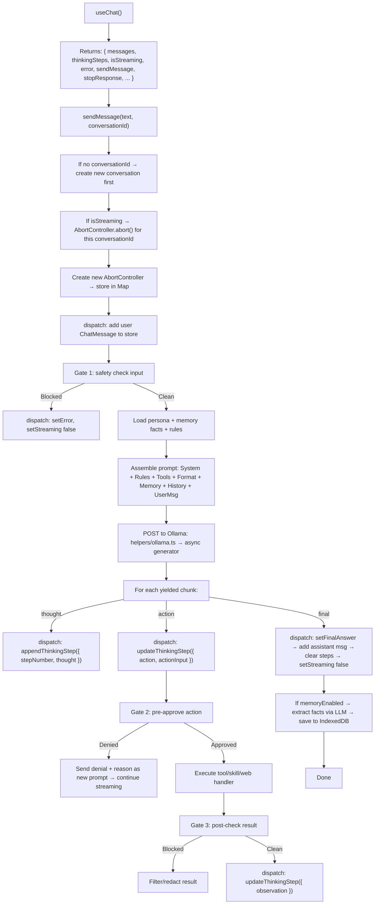

Explanation: The complete internal flow of useChat, showing every step from message dispatch through safety gates, context loading, prompt assembly, streaming, rule evaluation, tool execution, finalization, and memory extraction. AbortControllers are managed per conversation to prevent race conditions.

---

End of flow-9.md. Continued in flow-10.md (Testing, Build, Dependencies, Internationalization, Telemetry, Roadmap).